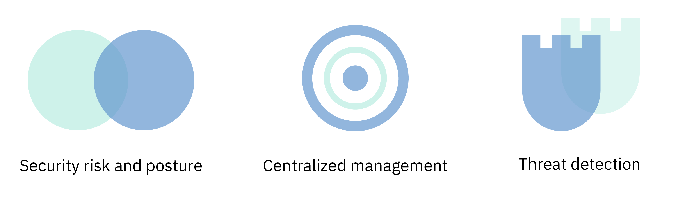

---

copyright:
  years: 2019
lastupdated: "2019-02-08"

---

{:new_window: target="_blank"}
{:shortdesc: .shortdesc}
{:screen: .screen}
{:pre: .pre}
{:table: .aria-labeledby="caption"}
{:codeblock: .codeblock}
{:tip: .tip}
{:note: .note}
{:important: .important}
{:deprecated: .deprecated}
{:download: .download}

# About {{site.data.keyword.security-advisor_short}}
{: #about}

{{site.data.keyword.security-advisor_long}} enables centralized security management through a unified dashboard that alerts security admins to issues and guides them to understand, prioritize, manage, and resolve security issues related to their cloud applications and workloads.
{: shortdesc}

## Benefits of using the service
{: #about-benefits}

<dl>
  <dt>Security risk and posture</dt>
    <dd>Application security remains important with constant news articles announcing a new data breach or hack. Security risks will always be a part of development and although attacks can be difficult to predict, one way to prevent them is by closely monitoring your cloud deployments. For example, the risks can be related to vulnerabilities in your container images that are in use, expiring certificates that can cause outage of your cloud service or application or suspicious clients or servers with a known bad reputation interacting with your clusters.</dd>
  <dt>Centralized security management</dt>
    <dd>You can see a consolidated view of all of your {{site.data.keyword.cloud_notm}} security services and integrated partner services. You can select and subscribe to different services from the {{site.data.keyword.cloud_notm}} catalog.</dd>
  <dt>Threat detection</dt>
    <dd>{{site.data.keyword.security-advisor_short}} leverages the information that is gathered by IBM X-Force, other {{site.data.keyword.cloud_notm}} services, and partner solutions to detect risks and threats before they become a security issue. The service also provides analytics on top of vulnerability data and network activity data.</dd>
</dl>

## How it works
{: #how-it-works}

To make maintaining security at a large scale, {{site.data.keyword.security-advisor_short}} is designed as a micro-service on {{site.data.keyword.cloud_notm}}. The core micro-service that is provided is the findings API which implements the mechanism for {{site.data.keyword.cloud_notm}} and partner services to send security findings to your service dashboard.
{: shortdesc}

The service receives findings from:
* Pre-integrated {{site.data.keyword.cloud_notm}} services like Certificate Manager and Vulnerability Advisor
* Network Insights
* Activity Insights
* Partners like NeuVector and Twistlock
* Custom integrations with your other security tools

Check out the following image to see the way that {{site.data.keyword.security-advisor_short}} components fit together.

{{site.data.keyword.security-advisor_short}} is most helpful for security administrators. That role can take many names. Check out the following table for some example users:

<table>
  <tr>
    <th colspan=2> Security administrators</th>
  </tr>
  <tr>
    <td>CIO</td>
    <td>A CIO or an Enterprise architecture team defines security and compliance policies at a high level for the entire company.</td>
  </tr>
  <tr>
    <td>CISO</td>
    <td>A CISO decides how to implement the policies that are set by the CIO for the systems that are under their control. This could include middleware, servers, or architecture that is deployed. This person would define the security governance and security policies for the organization. They would monitor security risk and define controls to meet compliance standards such as ISO, or GDPR. This person also decides the tools that their teams use.</td>
  </tr>
  <tr>
    <td>Security focal</td>
    <td>This person supports the CISO and executes the needed security checks and investigates any potential risks or issues. </td>
  </tr>
</table>

The described roles might be performed by a single person or multiple people depending on the size of your company. However, the offering was created to address the day-to-day requirements of a CISO or Security focal.

### The Findings API
{: #api}

Out of the box, the service comes with pre-integrated findings that are flagged by the API.
{: shortdesc}

The {{site.data.keyword.security-advisor_short}} findings API follows <a href="http://grafeas.ng.bluemix.net/ui/" target="_blank">Grafeas </a> artifact metadata API specification to store, query, and retrieve critical metadata. The findings are reported by security services and tools.

{{site.data.keyword.security-advisor_short}} is enabled by default for all {{site.data.keyword.cloud_notm}} accounts. As such, you do not need to provision any instance of the service. An instance of {{site.data.keyword.security-advisor_short}} is automatically created on either the initial access of the dashboard or when an initial finding is reported. The service allows 18,000 findings, approximately 200 per day, for each account, in a 90 day period. At the end of the 90 days, the finds are purged. Finding limits are monitored and should the account reach the limit before 90 days, the total findings are reduced to 50% in a FIFO (First in, First Out) model. When the service receives an account delete notification all of the findings related to that account are  purged. You can retrieve all of the findings for your account by using the API and store them yourself for any future use or audit purpose.

## Key concepts
{: #concepts}

Learn about different concepts that you might use while working with {{site.data.keyword.security-advisor_short}}.
{: shortdesc}

<dl>
  <dt>Finding</dt>
    <dd>A finding is a priority security issue that is created when raw events are processed. Findings are made up of the key pieces of information that are needed to identify the who, what, when, and where of the issue. As a security admin, you can use {{site.data.keyword.security-advisor_short}} findings to prioritize and react to detected situations.  Findings are few and small in size but contain important insight that requires immediate attention. For example, your server is infected with malware or a certificate is about to expire.</dd>
  <dt>Key Risk Indicator (KRI)</dt>
    <dd>The Key Risk Indicator (KRI) is a measure used to indicate the risk of the findings to the security focal. KRIs provide an early signal of increasing risk exposures in various areas of enterprise cloud resources to the security focal. A KRI is triggered when a finding's value is out of bounds from the range of acceptable performance for specific security controls on services and workloads.</dd>
  <dt>Note</dt>
    <dd>A particular type of finding is defined as a note. Grafeas divides the metadata information into notes and occurrences. Notes are high-level descriptions of particular types of metadata. You can create different notes for each type of finding submitted by different providers.</dd>
  <dt>Occurrence</dt>
    <dd>An occurrence describes provider-specific details of a note. The occurrence contains the vulnerability details, remediation steps, and other general information.</dd>
  <dt>Card</dt>
    <dd>Metadata that is used to visualize the findings in the service dashboard is defined by note kind - <code>CARD</code>. {{site.data.keyword.security-advisor_short}} supports three types of KRI elements for a <code>CARD</code>: <ul><li>Numeric</li><li>Breakdown</li><li>Timeseries</li></ul></dd>
  <dt>Provider</dt>
    <dd>A provider is the tool or service that defines the type of finding (note) and then sends an occurrence of the finding to the service.</dd>
  <dt>Service CRN</dt>
    <dd>The Service CRN identifies the {{site.data.keyword.Bluemix_notm}} service that is involved in the finding. For instance, in a certificate expiry finding, the service instance ID or CRN of the Certificate Manager service instance reporting the findings will be included.</dd>
  <dt>Resource CRN</dt>
    <dd>The resource CRN identifies the specific resource that is involved in the finding. When Network Analytics reports a finding, the Kubernetes cluster CRN is be included to identify the cluster or resource affected.</dd>
</dl>

## High-availability and disaster recovery
{: #ha-dr}

{{site.data.keyword.security-advisor_short}} is a highly available, multi-region service.
{: shortdesc}

{{site.data.keyword.security-advisor_short}} is currently supported in both the Dallas and London regions. In each supported region, the service runs in several <a href="https://www.ibm.com/blogs/bluemix/2018/06/improving-app-availability-multizone-clusters/" target="_blank">availability zones </a>. {{site.data.keyword.security-advisor_short}} has regional disaster recovery in place. The service maintains a back up database that can be quickly restored within three hours. All of the service data, with the exception of the previous 24 hours, is provided.
