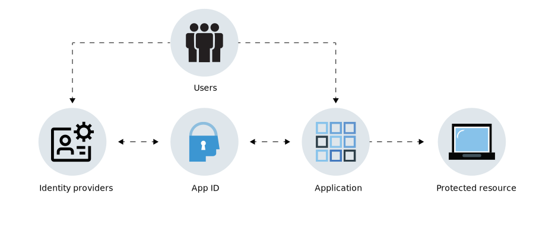

---

copyright:
  years: 2017, 2025
lastupdated: "2025-08-14"

keywords: authentication, authorization, identity, app security, cloud directory, user data, identity provider, oauth, protocols, oauth, oidc, disaster recovery, dr, compliance, high availability, ha, secure, HA, DR

subcollection: appid

---

{:codeblock: .codeblock}
{:screen: .screen}
{:download: .download}
{:external: target="_blank" .external}
{:faq: data-hd-content-type='faq'}
{:gif: data-image-type='gif'}
{:important: .important}
{:note: .note}
{:pre: .pre}
{:tip: .tip}
{:preview: .preview}
{:deprecated: .deprecated}
{:beta: .beta}
{:term: .term}
{:shortdesc: .shortdesc}
{:script: data-hd-video='script'}
{:support: data-reuse='support'}
{:table: .aria-labeledby="caption"}
{:troubleshoot: data-hd-content-type='troubleshoot'}
{:help: data-hd-content-type='help'}
{:tsCauses: .tsCauses}
{:tsResolve: .tsResolve}
{:tsSymptoms: .tsSymptoms}
{:java: .ph data-hd-programlang='java'}
{:javascript: .ph data-hd-programlang='javascript'}
{:swift: .ph data-hd-programlang='swift'}
{:curl: .ph data-hd-programlang='curl'}
{:video: .video}
{:step: data-tutorial-type='step'}
{:tutorial: data-hd-content-type='tutorial'}
{:ui: .ph data-hd-interface='ui'}
{:cli: .ph data-hd-interface='cli'}
{:api: .ph data-hd-interface='api'}
{:terraform: .ph data-hd-interface='terraform'}
{:release-note: data-hd-content-type='release-note'}

# About {{site.data.keyword.appid_short_notm}}
{: #about}

Isn't is awesome when the barista at your local coffee shop remembers your name and usual order? When you're building an application, you might want include that kind of tailored experience to make your users feel special or save them time. But, no matter how tailored your experience, the success of your app depends on your ability to build trust with your users - which comes down to securing their data and protecting the systems that your app accesses. Knowing who is using your app is a key part and it starts with adding sign in functionality. But, as a lot of developers know, adding authentication and authorization to your app is both risky and complex. With {{site.data.keyword.appid_full}} you can easily add authentication to your applications and host user data in the cloud that can be used to tailor your user experiences.
{: shortdesc}

With {{site.data.keyword.appid_short_notm}} configured for your application, your users can sign in directly from your app by using an email or password. Or you can allow the use of social media accounts so that they can use credentials that they are already familiar with. After your users authenticate, you can authorize access to the backend resources that your app uses to tailor their experience. In {{site.data.keyword.appid_short_notm}}, you can store information about your users and let your developers use this information as they build their apps. 

## Reasons to use the service
{: #about-reasons}

{{site.data.keyword.appid_short_notm}} helps developers to easily add authentication to their web and mobile apps with few lines of code, and secure their Cloud-native applications and services on {{site.data.keyword.cloud_notm}}. By requiring users to sign in to your app, you can store user data such as app preferences, or information from public social profiles, and then leverage that data to customize each user's experience within the app. {{site.data.keyword.appid_short_notm}} provides a log-in framework for you, but you can also bring your own branded screens to use with Cloud Directory.
{: shortdesc}

| Scenario | Solution |
|-----|----|
| You need to add [authorization and authentication](/docs/appid?topic=appid-key-concepts) to your mobile and web apps but don't have a background in security. | {{site.data.keyword.appid_short_notm}} makes it easy to add an authentication step to your apps. You can add email or user name, social, or enterprise sign-in to your apps with APIs, SDKs, prebuilt UIs, or your own branded UIs. |
| You want to limit access to your apps and back-end resources. | You can secure your apps, back-end resources, and APIs easily by using the standards-based authentication provided by {{site.data.keyword.appid_short_notm}}. |
| You want to build personalized app experiences for your users. | With {{site.data.keyword.appid_short_notm}}, you can [store user data](/docs/appid?topic=appid-profiles) such as app preferences or information from their public social profiles, and then use that data to customize each experience of your app. |
| You want to manage users in a scalable way. | With {{site.data.keyword.appid_short_notm}} you can create a [Cloud Directory](/docs/appid?topic=appid-cloud-directory), which makes it possible for you to add user sign-up and sign-in to your apps. Cloud Directory provides you with the framework to maintain a user registry that can scale with your user base. With the pre-built functionality for self-service, such as email verification and password resets, you can be sure that your app is authenticating users securely. |
{: caption="Reasons to use the {{site.data.keyword.appid_short_notm}} service" caption-side="top"}

## How it works
{: #about-how-it-works}

With {{site.data.keyword.appid_short_notm}}, you can add a level of security to your apps by requiring users to sign in. You can also use the server SDK or APIs to protect your back-end resources.
{: shortdesc}

{: caption="How {{site.data.keyword.appid_short_notm}} works" caption-side="bottom"}

Application
:   **Server SDK**: You can protect your back-end resources that are hosted on {{site.data.keyword.cloud_notm}} and your web apps by using the server SDK. It extracts the access token from a request and validates it with {{site.data.keyword.appid_short_notm}}.
    **Client SDK**: You can protect your mobile apps with the Android or iOS client SDK. The client SDK communicates with your cloud resources to start the authentication process when it detects an authorization challenge.

{{site.data.keyword.cloud_notm}}
:   **{{site.data.keyword.appid_short_notm}}**: After successful authentication, {{site.data.keyword.appid_short_notm}} returns access and identity tokens to your app.
    **Cloud Directory**: Users can sign up for your service with their email and a password. You can then manage your users in a list view through the console. With Cloud Directory, {{site.data.keyword.appid_short_notm}} functions as your identity provider.

External (third party)
:   **Social and enterprise identity providers**: {{site.data.keyword.appid_short_notm}} supports Facebook, Google+, and  SAML 2.0 Federation as identity provider options. The service arranges a redirect to the identity provider and verifies the returned authentication tokens. If the tokens are valid, the service grants access to your app.

## Integrations
{: #about-integrations}

You can use {{site.data.keyword.appid_short_notm}} with other {{site.data.keyword.cloud_notm}} offerings.
{: shortdesc}

{{site.data.keyword.containershort_notm}}
:   By configuring Ingress in a standard cluster you can secure your apps at the cluster level. Check out the [{{site.data.keyword.appid_short_notm}} authentication Ingress annotation](/docs/containers?topic=containers-comm-ingress-annotations#app-id-authentication) to get started.

{{site.data.keyword.apiconnect_short}}
:   When you create your APIs with [API Connect](/docs/apiconnect?topic=apiconnect-getting-started) you can secure your applications at the gateway rather than in your app code.

## Standards and certifications
{: #about-standards}

{{site.data.keyword.appid_short_notm}} has successfully completed several certifications, audits, and standards.
{: shortdesc}

{{site.data.keyword.appid_short_notm}} is based on a set of well-known, industry standard protocols and specifications that are frequently found in both enterprise and consumer facing applications, the OAuth 2.0 Authorization Framework and Open ID Connect. OAuth 2.0 is used to obtain and verify authorization for accessing protected resources. Open ID Connect then adds a layer of authentication and identity protection to your application.

See section 5.4 of the {{site.data.keyword.appid_short_notm}} software product compatibility report to review a complete list of [certifications](https://www.ibm.com/software/reports/compatibility/clarity-reports/report/html/softwareReqsForProduct?deliverableId=BF31C8008D7C11E59F9AD7336D7D0FFB){: external}. In addition to the certifications, {{site.data.keyword.appid_short_notm}} is also compliant in the following specifications: OAuth 2.0, OpenID Connect, JSON Web Token (JWT), JSON Web Signature (JWS), System for Cross-domain Identity Management (SCIM).
