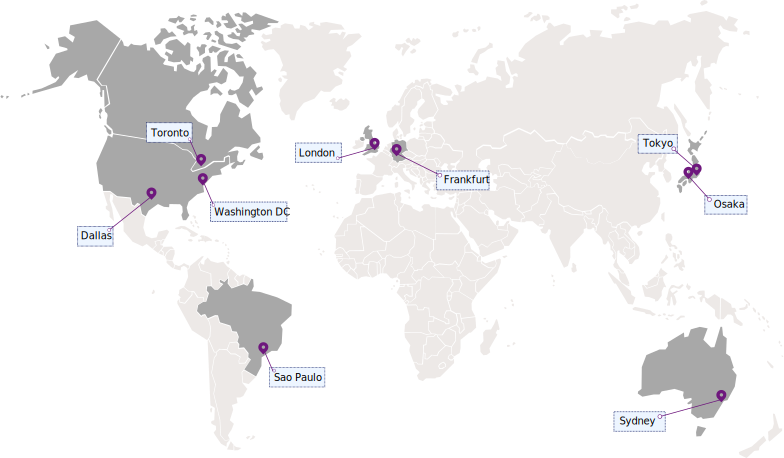

---

copyright:
  years: 2017, 2022
lastupdated: "2022-02-03"

keywords: management api, service management, service instance, devops automation, customize, permissions, iam, account owners, identity, app security, access tokens, video tutorial

subcollection: appid

---

{:codeblock: .codeblock}
{:screen: .screen}
{:download: .download}
{:external: target="_blank" .external}
{:faq: data-hd-content-type='faq'}
{:gif: data-image-type='gif'}
{:important: .important}
{:note: .note}
{:pre: .pre}
{:tip: .tip}
{:preview: .preview}
{:deprecated: .deprecated}
{:beta: .beta}
{:term: .term}
{:shortdesc: .shortdesc}
{:script: data-hd-video='script'}
{:support: data-reuse='support'}
{:table: .aria-labeledby="caption"}
{:troubleshoot: data-hd-content-type='troubleshoot'}
{:help: data-hd-content-type='help'}
{:tsCauses: .tsCauses}
{:tsResolve: .tsResolve}
{:tsSymptoms: .tsSymptoms}
{:java: .ph data-hd-programlang='java'}
{:javascript: .ph data-hd-programlang='javascript'}
{:swift: .ph data-hd-programlang='swift'}
{:curl: .ph data-hd-programlang='curl'}
{:video: .video}
{:step: data-tutorial-type='step'}
{:tutorial: data-hd-content-type='tutorial'}
{:ui: .ph data-hd-interface='ui'}
{:cli: .ph data-hd-interface='cli'}
{:api: .ph data-hd-interface='api'}
{:release-note: data-hd-content-type='release-note'}

# Regions and endpoints
{: #regions-endpoints}

You can use the {{site.data.keyword.appid_full}} APIs for DevOps automation, customization, and management of your service instances. To understand availability of the service, you can review the following connectivity options.
{: shortdesc}


## Available regions
{: #available-regions}

{{site.data.keyword.appid_short_notm}} is available in the following regions:

{: caption="Figure 1. {{site.data.keyword.appid_short_notm}} availability" caption-side="bottom"}


## Service endpoints
{: #service-endpoints}

If you're managing your service instances of {{site.data.keyword.appid_short_notm}} programmatically, see the following table to determine which API endpoints to use when you connect to the APIs.

| Region | Endpoint  |
|--------|-----------|
| Dallas | `us-south`|
| Frankfurt | `eu-de` |
| London | `eu-gb` |
| Osaka | `jp-osa` |
| Sao Paulo | `br-sao` |
| Sydney | `au-syd` |
| Tokyo | `jp-tok` |
| Toronto | `ca-tor` |
| Washington | `us-east` |
{: caption="Table 1. Lists public endpoints for interacting with {{site.data.keyword.appid_short_notm}} APIs" caption-side="top"}


## Formatting your API call
{: #format-call}

Calls to the management API endpoint take the following structure:

```sh
https://{region-endpoint}.appid.cloud.ibm.com/management
```
{: codeblock}

| API | Endpoint  |
|--------|-----------|
| Authorization | `https://{region}.appid.cloud.ibm.com/oauth/v4`|
| Management | `https://{region}.appid.cloud.ibm.com/management/v4`|
| Profiles | `https://{region}.appid.cloud.ibm.com/api/v1` |
{: caption="Table 2. Formatting for the available APIs" caption-side="top"}


## Need help?
{: #api-try}

If you run in to trouble while working with the APIs, try watching this tutorial video.

{: video output="iframe" data-script="none" id="youtubeplayer" frameborder="0" webkitallowfullscreen mozallowfullscreen allowfullscreen}

