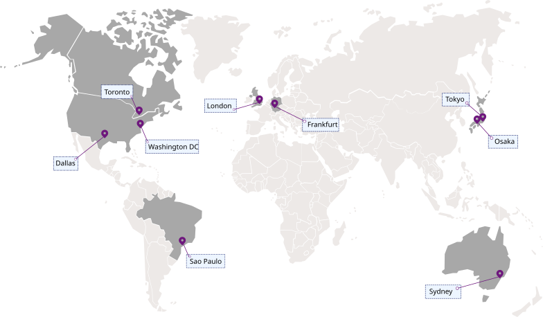

---

copyright:
  years: 2017, 2026
lastupdated: "2026-03-04"

keywords: management api, service management, service instance, devops automation, customize, permissions, iam, account owners, identity, app security, access tokens, video tutorial

subcollection: appid

---

{{site.data.keyword.attribute-definition-list}}

# Regions and endpoints
{: #regions-endpoints}

You can use the {{site.data.keyword.appid_full}} APIs for DevOps automation, customization, and management of your service instances. To understand availability of the service, you can review the following connectivity options.
{: shortdesc}


## Available regions
{: #available-regions}

{{site.data.keyword.appid_short_notm}} is available in the following regions:

{: caption="{{site.data.keyword.appid_short_notm}} availability" caption-side="bottom"}

This image is an artistic representation and does not reflect actual political or geographic boundaries.
{: note}


## Service endpoints
{: #service-endpoints}

If you're managing your service instances of {{site.data.keyword.appid_short_notm}} programmatically, see the following table to determine which API endpoints to use when you connect to the APIs.

| Region | Endpoint  |
|--------|-----------|
| Dallas | `us-south`|
| Frankfurt | `eu-de` |
| London | `eu-gb` |
| Osaka | `jp-osa` |
| Sao Paulo | `br-sao` |
| Sydney | `au-syd` |
| Tokyo | `jp-tok` |
| Toronto | `ca-tor` |
| Washington | `us-east` |
{: caption="Lists public endpoints for interacting with {{site.data.keyword.appid_short_notm}} APIs" caption-side="top"}


## Formatting your API call
{: #format-call}

Calls to the management API endpoint take the following structure:

```sh
https://<regionEndpoint>.appid.cloud.ibm.com/management
```
{: codeblock}

| API | Endpoint  |
|--------|-----------|
| Authorization | `https://<region>.appid.cloud.ibm.com/oauth/v4`|
| Management | `https://<region>.appid.cloud.ibm.com/management/v4`|
| Profiles | `https://<region>.appid.cloud.ibm.com/api/v1` |
{: caption="Formatting for the available APIs" caption-side="top"}
