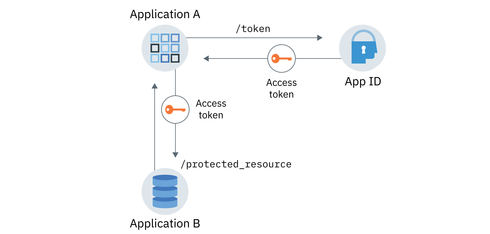

---

copyright:
  years: 2017, 2023
lastupdated: "2023-03-02"

keywords: app to app, protected resource, client secret, application identity, authorization, server, authentication, access tokens, app security

subcollection: appid

---

{:codeblock: .codeblock}
{:screen: .screen}
{:download: .download}
{:external: target="_blank" .external}
{:faq: data-hd-content-type='faq'}
{:gif: data-image-type='gif'}
{:important: .important}
{:note: .note}
{:pre: .pre}
{:tip: .tip}
{:preview: .preview}
{:deprecated: .deprecated}
{:beta: .beta}
{:term: .term}
{:shortdesc: .shortdesc}
{:script: data-hd-video='script'}
{:support: data-reuse='support'}
{:table: .aria-labeledby="caption"}
{:troubleshoot: data-hd-content-type='troubleshoot'}
{:help: data-hd-content-type='help'}
{:tsCauses: .tsCauses}
{:tsResolve: .tsResolve}
{:tsSymptoms: .tsSymptoms}
{:java: .ph data-hd-programlang='java'}
{:javascript: .ph data-hd-programlang='javascript'}
{:swift: .ph data-hd-programlang='swift'}
{:curl: .ph data-hd-programlang='curl'}
{:video: .video}
{:step: data-tutorial-type='step'}
{:tutorial: data-hd-content-type='tutorial'}
{:ui: .ph data-hd-interface='ui'}
{:cli: .ph data-hd-interface='cli'}
{:api: .ph data-hd-interface='api'}
{:release-note: data-hd-content-type='release-note'}


# Application identity and authorization
{: #app}

With {{site.data.keyword.appid_full}}, you can secure applications using the application identity and authorization flow by leveraging OAuth2.0 capabilities.
{: shortdesc}

## Understanding the communication flow
{: #app-understanding}

There are several reasons that you might want one application to communicate with another service or app without any user intervention. For example, a non-interactive app that needs to access another application to perform its work. This could include processes, CLIs, daemons, or an IoT device that monitors and reports environment variables to an upstream server. The specific use case is unique to each application, but the most important thing to remember is that the requests are exchanged on behalf of the app, not on an end user, and it is the app that is authenticated and authorized.


### How does the flow work?
{: #app-flow-how}

{{site.data.keyword.appid_short_notm}} leverages the OAuth 2.0 client credentials flow to protect communication. After an app registers with {{site.data.keyword.appid_short_notm}}, the app obtains a client ID and secret. With this information, the app can request an access token from {{site.data.keyword.appid_short_notm}} and be authorized to access a protected resource or API. In the application identity and authorization flow, the application is granted only an access token. It does not obtain an identity token or a refresh token. For more information about tokens, see [Understanding tokens](/docs/appid?topic=appid-tokens).

This workflow is meant to be used only with trusted applications where there is no risk of the secret being misused or leaked. The application always holds the client secret. It will not work for mobile apps.
{: tip}

### What does the flow look like?
{: #app-flow-what}

In the following image, you can see the direction of communication between the service and your application.

{: caption="Figure 1. Application identity and authorization flow" caption-side="bottom"}

1. You register the application that needs to authenticate to access a protected resource with {{site.data.keyword.appid_short_notm}}. 
2. Application A registers with {{site.data.keyword.appid_short_notm}} to obtain a client ID and secret.
3. Application A makes a request to the {{site.data.keyword.appid_short_notm}} authorization server `/token` endpoint by sending the credentials retrieved in the previous step.
4. {{site.data.keyword.appid_short_notm}} validates the request, authenticates the app, and returns a response to Application A that contains an access token.
5. Application A is now able to use the valid access token to send requests to protected resources such as Application B.

The client secret that is used to authenticate the client is highly sensitive and must be kept confidential. Because the application uses the client secret in-app, this workflow must be used with trusted applications only. Using a trusted application ensures that the client secret is not leaked or misused.
{: important}

## Registering your app
{: #app-register}

### With the GUI
{: #app-register-gui}

1. In the **Application** tab of the {{site.data.keyword.appid_short_notm}} dashboard, click **Add Application**.
2. Add your application name and click **Save** to return to a list of your registered apps. The name of your application cannot exceed 50 characters.
3. From the list of registered apps, select the application that you added in the previous step. The row expands to show your credentials.

### With the API
{: #app-register-api}

1. Make a POST request to the [`/management/v4/<tenantID>/applications` endpoint](https://us-south.appid.cloud.ibm.com/swagger-ui/#/Management%20API%20-%20Applications/mgmt.registerApplication){: external}.

   ```sh
   curl -X POST \  https://<region>.appid.cloud.ibm.com/management/v4/<tenantID>/applications/ \
   -H 'Content-Type: application/json' \
   -H 'Authorization: Bearer <IAMToken>' \
   -d '{"name": "<applicationName>"}'
   ```
   {: codeblock}

   Example response:

   ```json
   {
   "clientId": "c90830bf-11b0-4b44-bffe-9773f8703bad",
   "tenantId": "b42f7429-fc24-48fa-b4f9-616bcc31cfd5",
   "secret": "YWQyNjdkZjMtMGRhZC00ZWRkLThiOTQtN2E3ODEyZjhkOWQz",
   "name": "testing",
   "oAuthServerUrl": "https://us-south.appid.cloud.ibm.com/oauth/v4/b42f7429-fc24-48fa-b4f9-616bcb31cfd5",
   "profilesUrl": "https://us-south.appid.cloud.ibm.com",
   "discoveryEndpoint": "https://us-south.appid.cloud.ibm.com/oauth/v4/b42f7429-fc24-48fa-b4f9-616bcb31cfd5/.well-known/openid-configuration"
   }
   ```
   {: screen}

## Obtaining an access token
{: #obtain-token}

After your app is registered with {{site.data.keyword.appid_short_notm}} and you have obtained your credentials, you can make a request to the {{site.data.keyword.appid_short_notm}} authorization server to get an Access Token.

1. Make an HTTP POST request to the [`/token` endpoint](https://us-south.appid.cloud.ibm.com/swagger-ui/#/Authorization%20Server%20-%20Authorization%20Server%20V4/oauth-server.token){: external}. The authorization for the request is `Basic auth` with the client ID and secret being used as the username and password which are base64 encoded.

   ```sh
   curl -X POST http://localhost:6002/oauth/v4/39a37f57-a227-4bfe-a044-93b6e6060b61/token \
      -H 'Authorization: Basic base64Encoded{clientId:secret}' \
      -H 'Content-Type: application/x-www-form-urlencoded' \
      -d grant_type=client_credentials
   ```
   {: codeblock}

   Example response:
   ```json
   {
   "access_token": "eyJhbGciOiJS...F9A",
   "expires_in": "3600",
   "token_type": "Bearer"
   }
   ```
   {: codeblock}


