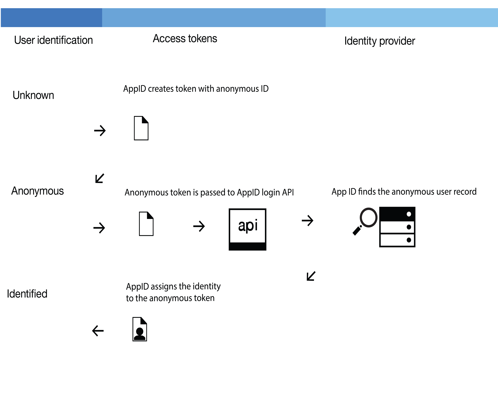

---

copyright:
  years: 2017
lastupdated: "2017-11-29"

---
{:new_window: target="_blank"}
{:shortdesc: .shortdesc}
{:screen: .screen}
{:codeblock: .codeblock}


# Authorization and authentication
{: authorization}

Authorization is the process by which you grant access to your apps. The {{site.data.keyword.appid_short}} service uses tokens, filters, and a header to authenticate users.
{: shortdesc}


## OAuth identity
{: #oauth}

When the service calls the OAuth login API, {{site.data.keyword.appid_short_notm}} uses OAuth 2.0 and OIDC protocols to authorize and authenticate the caller with a selected identity provider. After authentication, the identity is associated with an {{site.data.keyword.appid_short_notm}} user record. {{site.data.keyword.appid_short_notm}} returns an access token that can be used to access user's attributes, and an identity token that is holding the identity information provided by the identity provider. The same user record and its attributes can be accessed again from any client that authenticates with this same identity.

## Access and identity tokens

{{site.data.keyword.appid_short}} uses two types of tokens: access and identity.
{:shortdesc}

**Note**: The tokens are formatted as <a href="https://jwt.io/introduction/" target="_blank">JSON Web Tokens </a>.

### Access token
{: #access-tokens}

Access tokens enable communication with with [back-end resources](/docs/services/appid/protecting-resources.html) that are protected by authorization filters that are set by App ID. The token conforms to JavaScript Object Signing and Encryption (JOSE) specifications.

Example token:

```
Header: {
    "typ": "JOSE",
    "alg": "RS256",
}
Payload: {
    "iss": "appid-oauth.ng.bluemix.net",
    "exp": "1495562664",
    "aud": "a3b87400-f03b-4956-844e-a52103ef26ba",
    "amr": ["facebook"],
    "sub": "de6a17d2-693d-4a43-8ea2-2140afd56a22",
    "iat": "1495559064",
    "tenant": "9781974b-6a1c-46c3-aebf-32b7e9bbbaee",
    "scope": "appid_default appid_readprofile appid_readuserattr appid_writeuserattr",
}
```
{:screen}

<table>
<caption> Table 1. Access token components explained </caption>
  <tr>
    <th> Component </th>
    <th> Description </th>
  </tr>
  <tr>
    <td> <i> typ </i> </td>
    <td> The header type, specified as "JOSE". </td>
  </tr>
  <tr>
    <td> <i> alg </i> </td>
    <td> The algorithm used, specified as "RS256". </td>
  </tr>
  <tr>
    <td> <i> iss </i> </td>
    <td> The {{site.data.keyword.appid_short}} server that issued the token; specified as a string or URL. </td>
  </tr>
  <tr>
    <td> <i> sub </i> </td>
    <td> The ID of the user who the token is issued to. </td>
  </tr>
  <tr>
    <td> <i> aud </i> </td>
    <td> The client ID the token is intended for. </td>
  </tr>
  <tr>
    <td> <i> exp </i> </td>
    <td> The time at which the timestamp expires, specified in epoch time. </td>
  </tr>
  <tr>
    <td> <i> iat </i> </td>
    <td> The time at which the timestamp is issued, specified in epoch time. </td>
  </tr>
  <tr>
    <td> <i> tenant </i> </td>
    <td> The tenant ID for which the token is issued. </td>
  </tr>
  <tr>
    <td> <i> amr </i> </td>
    <td> The identity provider used for authentication. This variable can be <i>appid_facebook</i>,  <i>appid_google</i> or <i>cloud_direcory</i>. </td>
  </tr>
  <tr>
    <td> <i> scope </i> </td>
    <td> The scope the token is issued for. </td>
  </tr>
</table>


### Identity tokens
{: #identity-tokens}

An identity token contains information about the user. It can give you information about their name, email, gender, and location. A token can also return a URL to an image of the user.

Example token:

```
Header: {
    "typ": "JOSE",
    "alg": "RS256",
}
Payload: {
    "iss": "appid-oauth.ng.bluemix.net",
    "aud": "a3b87400-f03b-4956-844e-a52103ef26ba",
    "exp: "1495562664",
    "tenant": "9781974b-6a1c-46c3-aebf-32b7e9bbbaee",
    "iat": "1495559064",
    "name": "John Smith",
    "email": "js@mail.com",
    "gender", "male",
    "locale": "en",
    "picture": "https://url.to.photo",
    "sub": "de6a17d2-693d-4a43-8ea2-2140afd56a22",
    "identities": [
        "provider": "facebook"
        "id": "377440159275659"
    ],
    "amr": ["facebook"],
    "oauth_client":{
      "name": "BluemixApp",
      "type": "serverapp",
      "software_id": "cb638f8f-e24b-41d3-b770-23be158dd8e6.2b94e6bb-bac4-4455-8712-a43fa804d5cc.a3b87400-f03b-4956-844e-a52103ef26ba",
      "software_version": "1.0.0",
    }
}
```
{:screen}


<table>
<caption> Table 2. Identity token components explained </caption>
  <tr>
    <th> Component </th>
    <th> Description </th>
  </tr>
  <tr>
    <td> <i> name </i> </td>
    <td> The user's full name as reported by the identity provider. This must be returned. </td>
  </tr>
  <tr>
    <td> <i> email </i> </td>
    <td> The user's email as reported by the identity provider. Returned only when available. </td>
  </tr>
  <tr>
    <td> <i> gender </i> </td>
    <td> The user's gender as reported by the identity provider, when available. </td>
  </tr>
  <tr>
    <td> <i> locale </i> </td>
    <td> The user's locale as reported by the identity provider. </td>
  </tr>
  <tr>
    <td> <i> picture </i> </td>
    <td> The URL to a user's picture, if available. </td>
  </tr>
  <tr>
    <td> <i> identities: </br> <ul><li> provider <li> id </ul></i></td>
    <td> </br><ul><li> The identity provider used for authentication. This variable can be either <code>appid_facebook</code>, <code>appid_google</code> or <code>cloud_directory</code>, and must be returned. <li> A unique user ID as reported by an identity provider. <li> A JSON object that must be returned by the identity provider. </ul></i></td>
  </tr>
  <tr>
    <td> <i> oauth_client: </br> <ul><li> type <li> name <li> software_id <li> software_version<li> device_id <li>device_model<li>device_os<li>device_os_version </ul></i> </td>
    <td> </br><ul><li> The type of application determined during client registration. The variable can be <i>serverapp</i> or <i>mobileapp</i>. <li> The client name as reported during client registration. <li> The software ID as reported during client registration. <li> The version of software used during client registration. <li> The mobile client device id. <li> The mobile client device model. <li> The mobile client device os. <li> The mobile client device os version.</ul></td>
  </tr>
</table>

## Headers
{: #auth-header}

An authorization header is the combination of tokens returned. For {{site.data.keyword.appid_short}}, the authorization header consists of three different tokens that are separated by white space: Bearer, Access, and Identity. Bearer and access tokens are required to grant access to your apps. An identity token is optional and is mainly used to store information about those using your app.

Example header structure:

```
Authorization=Bearer {access_token} [{id_token}]
```
{: screen}


## Filters
{: #auth-filter}

The {{site.data.keyword.appid_short}} server SDK provides strategies for protecting two types of resources: APIs and web applications.
{:shortdesc}

The API protection strategy returns an HTTP 401 response with a list of scopes to obtain authorization for an unauthenticated client. The web application protection strategy returns an HTTP 302 redirect. The redirect sends an unauthenticated client to the login page that is hosted by the {{site.data.keyword.appid_short_notm}} service, or directly to an identity provider login page, depending on your configuration.


### API strategy
{: #api}

The API strategy expects requests to contain an authorization header with a valid access token. The response can also include an identity token, but it is not required; see [Access and identity tokens](/docs/services/appid/access-identity.html).

If a token is invalid or expired, the API strategy returns an HTTP 401 error that contains the following information: Www-Authenticate=Bearer scope="{scope}" error="{error}". The `error` component is optional.

If the request returns a valid token, control is passed to the next middleware and the `appIdAuthorizationContext` property is injected into the request object. This property contains original access and identity tokens, and decoded payload information as plain JSON objects.


### Web app strategy
{: #web}

When the web app strategy class detects unauthenticated attempts to access a protected resource, it automatically redirects a user's browser to the authentication page. After successful authentication, the user is returned to the web application's callback URL. The service uses the web app strategy class to obtain access and identity tokens. After obtaining these tokens, the web app strategy class stores them in an HTTP session under `WebAppStrategy.AUTH_CONTEXT`. It is up to the user to decide whether to store access and identity tokens in the application database.


## Progressive authentication
{: #oauth}

{{site.data.keyword.appid_short_notm}} uses OAuth 2.0 and OIDC protocols to authorize and authenticate a user. After authentication, their identity is associated with a user record. The service returns an access token that can be used to access the user's attributes and an identity token that contains the information about the user that was provided by the identity provider. The record and its attributes can be accessed again from any client that authenticates with the same identity.

Now, you might ask, "what if I want sign in to be optional?" {{site.data.keyword.appid_short_notm}} uses what is known as progressive authentication to create profiles on users, even when they're anonymous.

<a href="../api/content/services/appid/images/authenticationtrail.png" ></a>


When a user chooses to remain anonymous, {{site.data.keyword.appid_short_notm}} creates an ad hoc user record and calls the OAuth login API which returns anonymous access and identity tokens. By using those tokens, the app can create, read, update, and delete the attributes that are stored in the user record. As an example, a user could immediately start adding items to a shopping cart without having to log in to the application.


When a user chooses to log in to an app, they become an identified user. Information about the user is obtained from the identity provider that they choose to log in with. They receive access and identity tokens that contain information about the user. An anonymous user can choose to become an identified user.

But how does that work?

The anonymous access token is passed to the login API. The service authenticates the call with an identity provider. The service uses the access token to find the anonymous record and attaches the identity to it. The new access identity tokens contain the public information that shared by the identity provider. After a user is identified, their anonymous tokens become invalid. However, a user is still able to access their attributes because they are accessible with the new token.

**Note**: An identity can only be assigned to an anonymous record if it has not already been assigned to another user. If the identity if already associated with another app id user, the tokens contain information of that user record and provide access to their attributes. The previous anonymous users attributes are not accessible through the new token. Until the token expires, the information can still be accessed through the anonymous access token. During development, you can choose how to merge the anonymous attributes to the known user.
