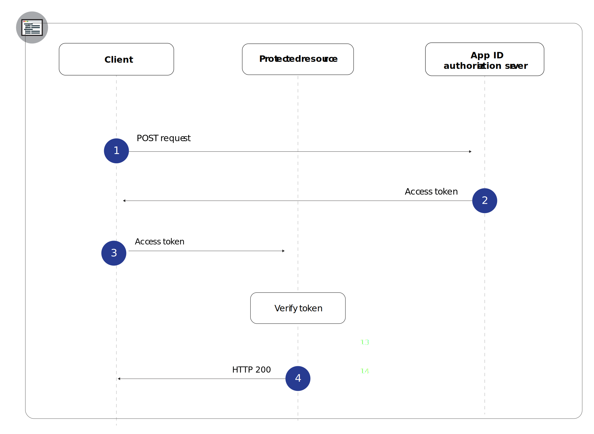

---

copyright:
  years: 2017, 2023
lastupdated: "2023-03-02"

keywords: protected resource, backend apps, identity, tokens, identity provider, authentication, authorization, app security, oauth, 

subcollection: appid

---

{:codeblock: .codeblock}
{:screen: .screen}
{:download: .download}
{:external: target="_blank" .external}
{:faq: data-hd-content-type='faq'}
{:gif: data-image-type='gif'}
{:important: .important}
{:note: .note}
{:pre: .pre}
{:tip: .tip}
{:preview: .preview}
{:deprecated: .deprecated}
{:beta: .beta}
{:term: .term}
{:shortdesc: .shortdesc}
{:script: data-hd-video='script'}
{:support: data-reuse='support'}
{:table: .aria-labeledby="caption"}
{:troubleshoot: data-hd-content-type='troubleshoot'}
{:help: data-hd-content-type='help'}
{:tsCauses: .tsCauses}
{:tsResolve: .tsResolve}
{:tsSymptoms: .tsSymptoms}
{:java: .ph data-hd-programlang='java'}
{:javascript: .ph data-hd-programlang='javascript'}
{:swift: .ph data-hd-programlang='swift'}
{:curl: .ph data-hd-programlang='curl'}
{:video: .video}
{:step: data-tutorial-type='step'}
{:tutorial: data-hd-content-type='tutorial'}
{:ui: .ph data-hd-interface='ui'}
{:cli: .ph data-hd-interface='cli'}
{:api: .ph data-hd-interface='api'}
{:release-note: data-hd-content-type='release-note'}

# Backend apps
{: #backend}

You can use the {{site.data.keyword.appid_full}} APIs to protect your backend application endpoints and APIs.
{: shortdesc}


## Understanding the flow
{: #backend-understanding}

Part of developing backend apps is verifying that your APIs are protected from unauthorized access. The {{site.data.keyword.appid_short_notm}} SDKs help you protect your API endpoints and ensure the security of your app.


### What is the flow's technical basis?
{: #backend-technical-flow}

{{site.data.keyword.appid_short_notm}} implements the [OAuth 2.0](https://datatracker.ietf.org/doc/html/rfc6749){: external} and the OIDC spec, which uses bearer tokens for authentication and authorization. These tokens are formatted as [JSON Web Tokens](https://datatracker.ietf.org/doc/html/rfc7519){: external}, which are digitally signed and contain claims that describe the subject that is being authenticated and the identity provider. The APIs of your application are protected by access and identity tokens. Clients that need access to your APIs can authenticate with the identity provider through {{site.data.keyword.appid_short_notm}} in exchange for these tokens. The claims in the tokens must be validated to grant access to the protected APIs.

For more information about how tokens are used in {{site.data.keyword.appid_short_notm}}, see [Understanding tokens](/docs/appid?topic=appid-tokens).
{: tip}


### What does the flow look like?
{: #backend-flow}

{: caption="Figure 1. Backend application flow" caption-side="bottom"}

1. A client makes a POST request to the {{site.data.keyword.appid_short_notm}} authorization server to obtain an access token. A POST request generally takes the following form:

   ```sh
   POST /oauth/v4/<tenantID>/token HTTP/1.1
   Content_type: application/x-www-form-urlencoded
   Authorization header = "Basic" + base64encode(<clientID>:<secret>)
   FormData = <grantType>
   ```
   {: screen}

2. If the client meets the qualifications, the authorization server returns an access token.

3. The client sends a request to the protected resource. Requests can be sent in multiple ways, depending on which HTTP client library you're using but a request generally takes the following form:

   ```sh
   curl -H 'Authorization: Bearer <accessToken>' 
   <https://my-protected-resource.com>
   ```
   {: screen}

4. The protected resource or API validates the token. If the token is valid, access to the resource is granted for the client. If the token cannot be validated, access is denied.

## Protecting resources 
{: #backend-secure}

To secure your backend apps and protected resources, you need to validate a token. When a client sends a request to your resource, you can verify that the token meets the defined specifications. The token might include identifying information, scope, or any other configuration that you have in place. You can validate {{site.data.keyword.appid_short_notm}} access and identity tokens in several ways. For help, check out [Validating tokens](/docs/appid?topic=appid-token-validation).


## Next steps
{: #backend-next}

With {{site.data.keyword.appid_short_notm}} installed in your application, you're almost ready to start authenticating users! Try doing one of the following activities next:

* Configure your [identity providers](/docs/appid?topic=appid-social)
* Customize and configure [the Login Widget](/docs/appid?topic=appid-login-widget)


