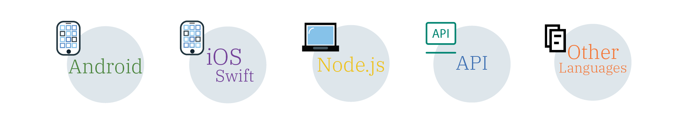

---

copyright:
  years: 2017, 2018
lastupdated: "2018-06-20"

---

{:new_window: target="_blank"}
{:shortdesc: .shortdesc}
{:screen: .screen}
{:codeblock: .codeblock}
{:pre: .pre}
{:tip: .tip}

# Configuring cloud directory
{: #cd}

Users can sign up and sign in to your mobile and web apps by using an email and a password. A cloud directory is a user registry that is maintained in the cloud. When a user signs up for your app with an email and a password, they're added to your directory of users. With this feature, users have the freedom to manage their own account within your app.
{: shortdesc}

 

## Managing directory settings
{: #cd-settings}

You can configure the notifications and level of user control for your app. Setting up your cloud directory can be done quickly, as shown in the following image. These settings can be updated at any time from the service dashboard.
{: shortdesc}

1. Be sure that cloud directory is turned on as an identity provider and set **Allow users to sign up and reset their password** to **On**. If set to **Off**, you can still add users through the console for development purposes.
2. Configure your sender details. Specify the email address from which your messages appear to be from, the sender, and to whom your users can reply.
  When you configure your action URL, be sure that you give enough time for a user to click the link. A user must verify their email to have certain options, such as the ability to request a reset of their password.
  {: tip}
3. Determine the types of emails a user receives and the sender information.
4. With the templates provided, customize your messages with your brand or personalized messages. For more information, see [Managing messages](/docs/services/appid/cloud-directory.html#cd-messages).
5. See who's signed-up for your app in the **Users** tab of the GUI.

 

## Managing messages
{: #cd-messages}

A template is an example of an email message that you might send to your users. You can customize the template by updating the content and layout of the message. You can set these messages to **On** or **Off** in the directory settings tab.
{: shortdesc}

1. Select a **Message type**.
2. Customize your message by changing the content and design of the message. You can use parameters to personalize your messages. Don't forget to save your changes!

You can write your messages in any language!
{: tip}

### Types of messages

You can send several types of messages to your users. You can choose to send the example message that it programmed into the UI or you can customize the content for a more personal app experience.

<dl>
  <dt>Welcome</dt>
    <dd>
After they've registered, you can welcome a user to your application via email. To welcome and retain your users, make your message as engaging as possible.

    <table>
      <thead>
        <th colspan=2> All message parameters </th>
      </thead>
      <tbody>
        <tr>
          <td> %{display.logo} </td>
          <td> Displays the image that you configured for your login widget. </td>
        </tr>
        <tr>
          <td> %{user.displayName} </td>
          <td> Displays the screen name a user chose to use when interacting with the app. </td>
        </tr>
        <tr>
          <td> %{user.email} </td>
          <td> Displays the user's registered email address. </td>
        </tr>
        <tr>
          <td> %{user.firstName} </td>
          <td> Displays the user's specified given name. </td>
        </tr>
        <tr>
          <td> %{user.formattedName} </td>
          <td> Displays the user's full name. </td>
        </tr>
        <tr>
          <td> %{user.lastName} </td>
          <td> Displays the user's specified surname. </td>
        </tr>
      </tbody>
    </table>
    
**Note**: If a user does not supply the information pulled by the parameter, it appears blank.
</dd>
  <dt>Forgot password</dt>
    <dd>
A user can ask to have their password reset if they forget it or need to update it for any reason. You can customize the email response to their request. When a user requests a change, their password remains unchanged until they click the link in this email.

    <table>
      <thead>
        <th colspan=2> Password change parameters </th>
      </thead>
      <tbody>
        <tr>
          <td> %{linkExpiration.hours} </td>
          <td> Displays the number of hours the link is valid. </td>
        </tr>
        <tr>
          <td> %{linkExpiration.minutes} </td>
          <td> Displays the number of minutes the link is valid. </td>
        </tr>
        <tr>
          <td> %{resetPassword.code} </td>
          <td> Displays a one-time passcode as part of the URL. This means that each person would have a different code. Example: <code>https://appid-wfm.bluemix.net/verify/6574839563478</code> </td>
        </tr>
        <tr>
          <td> %{resetPassword.link} </td>
          <td> Displays the link that a user clicks to reset their password. </td>
        </tr>
       </tbody>
    </table>
    </dd>
  <dt>Verification</dt>
    <dd>
You can request that a user verifies their account via email. By requesting a verification, you limit the number of fake accounts that can sign up for your app. You can restrict access to your app until a user has verified their email, or use it as a way to manage which users you create profiles for.

    <table>
      <thead>
        <th colspan=2> Verification message parameters </th>
      </thead>
      <tbody>
        <tr>
          <td> %{linkExpiration.hours} </td>
          <td> Displays the number of hours the link is valid. </td>
        </tr>
        <tr>
          <td> %{linkExpiration.minutes} </td>
          <td> Displays the number of minutes the link is valid. </td>
        </tr>
        <tr>
          <td> %{verify.code} </td>
          <td> Displays a one-time verification URL. </td>
        </tr>
        <tr>
          <td> %{verify.link} </td>
          <td> Displays the action URL that you specified in settings. </td>
        </tr>
      </tbody>
    </table>
    </dd>
  <dt>Password change</dt>
    <dd>
You can let a user know when their password has been updated. This is helpful if they did not request that their password be changed. They can take the proper steps to re-secure their account.

    <table>
      <thead>
        <th colspan=2> Password change parameters </th>
      </thead>
      <tbody>
        <tr>
          <td> %{passwordChangeInfo.time} </td>
          <td> Displays the time at which a new password went into effect. </td>
        </tr>
        <tr>
          <td> %{passwordChangeInfo.ipAddress} </td>
          <td> Displays the IP address from which the password change was requested. </td>
        </tr>
      </tbody>
    </table>
    </dd>
</dl>
 
**NOTE**: {{site.data.keyword.appid_short_notm}} uses <a href="https://www.sendgrid.com" target="_blank">SendGrid </a> as a mail delivery service. All emails are sent with a single SendGrid account.

 

## Managing password strength

You can set the requirements for the passwords that can be used with Cloud Directory.
{: shortdesc}

A strong password makes it difficult, or even improbable for someone to guess the password through in either a manual or automated way. Password strength is set as a regex string.

Some common password strength examples:

- Must be at least 8 characters. Example regex: `^.{8,}$`
- Must contain 1 number, 1 lower case letter, and 1 capital letter. Example regex: `^(?:(?=.*\\d)(?=.*[a-z])(?=.*[A-Z]).*)$`
- Must contain only English letters and numbers. Example regex: `^[A-Za-z0-9]*$`
- Must be at least 1 unique character. Example regex: `^(\w)\w*?(?!\1)\w+$`

To set the requirements, you must use <a href="https://appid-management.ng.bluemix.net/swagger-ui/#!/Config/set_cloud_directory_password_regex" target="_blank">the API </a>.

 

## Next steps
Now that you've configured cloud directory, you're ready to add the code for the login widget into your app code. Click an SDK language icon in the following image to see what you need to do.
{: shortdesc}

<map name="options-map" id="options-map">
<area href="login-widget.html#branded-ui-android" alt="Managing the sign in experience with the Android SDK" shape="rect" coords="187, 6, 305, 120" />
<area href="login-widget.html#branded-ui-ios-swift" alt="Managing the sign in experience with the iOS Swift SDK." shape="rect" coords="333, 6, 448, 125" />
<area href="login-widget.html#branded-ui-nodejs" alt="Managing the sign in experience with the Node.js SDK." shape="rect" coords="472, 7, 590, 121" />
</map>
