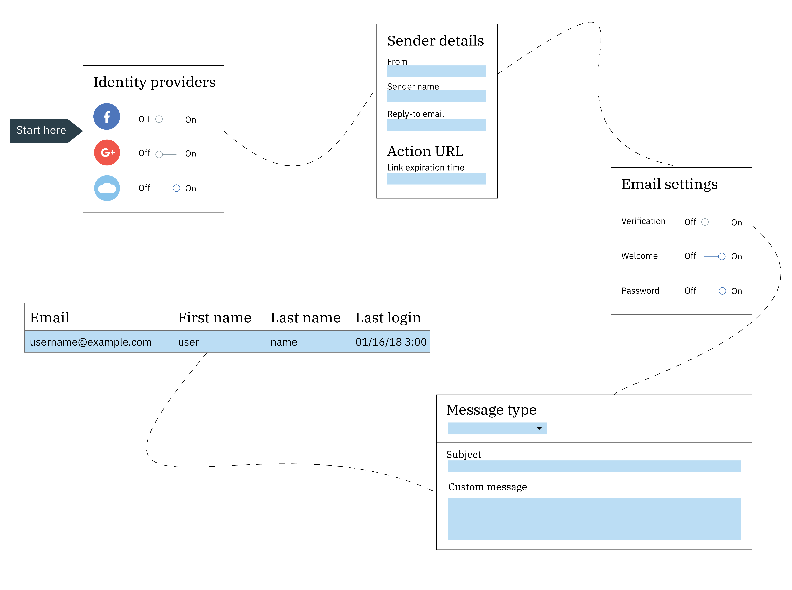

---

copyright:
  years: 2017, 2018
lastupdated: "2018-10-17"

---

{:new_window: target="_blank"}
{:shortdesc: .shortdesc}
{:screen: .screen}
{:codeblock: .codeblock}
{:pre: .pre}
{:tip: .tip}

# Cloud Directory
{: #cd}

With {{site.data.keyword.appid_full}}, users can sign up and sign in to your mobile and web apps by using an email or username and a password. A cloud directory is a user registry that is maintained in the cloud. When a user signs up for your app, they're added to your directory of users. With this feature, users have the freedom to manage their own account within your app.
{: shortdesc}

 

## Managing directory settings
{: #cd-settings}

You can configure the notifications and level of user control for your app. Setting up cloud directory can be done quickly, as shown in the following image. These settings can be updated at any time from the service dashboard.
{: shortdesc}

Figure. The configuration journey for Cloud Directory

1. In the **Manage** tab of the {{site.data.keyword.appid_short_notm}} dashboard, be sure that Cloud Directory is set to **On**.

2. Configure your general settings.
  1. Decide whether you want your users to create a username or use their email when they sign in. Both options require a password. After users have been added to your directory, you can no longer toggle between the options.
  2. Click **Edit** in the password criteria row to specify any requirements that you want to put in place. Password criteria is given as regex. For help determining strength or to see common examples see, [Managing password strength](#strength). Click **Save** to put your requirements into action.
  3. Set **Allow users to sign up to your app** to **Yes**. You can still add users through the console if it's set to **No**. However, you should add users through the console only for development purposes.
  4. Set **Allow users to manage their account from your app** to **Yes** if you want your users to be able to reset their password, change their password, or reset their details. If you want to limit your users self-service, set the value to **No**.
  5. Click **Edit** in the **Sender details** row to update your email settings. The email settings apply for all of the communication that is sent through {{site.data.keyword.appid_short_notm}}. Specify the email address that should send the email, their name, and leave a separate email for users to send a response.
  6. Click **Save**.

3. Configure your verification email settings.
  1. To have your users verify their email address set **Email verification** to **On**. When a user signs up for your application, they receive an email that asks them to confirm that they've signed up for the app.
  2. If you've decided that you want your users to verify their email, your next decision is whether you want to allow users into your application prior to them verifying their email address. Depending on your preference, set **Allow users to sign in to your app without first verifying their email address** to **Yes** or **No**.
  3. Customize the content and design the appearance of your message. There is a template for the message, but you can update the text with your own message. You can use a [language](/docs/services/appid/cloud-directory.html#languages) other than English, but you are responsible for the translation of the text. To choose another language, use the <a href="https://appid-management.ng.bluemix.net/swagger-ui/#!/Config/updateLocalization" target="_blank">language management APIs </a>.
  4. Give the verification URL an expiration time limit, specified as minutes.  When this time is set here, it also affects the length of time that your reset password link is valid for.
  5. Enter your own verification page URL if you have a specific page that you want your users to see when they click the link. If you leave the **Custom verification page URL** field blank, a default verification page is provided by {{site.data.keyword.appid_short_notm}}.
  6. Click **Save**.

4. Configure your welcome email settings.
  1. To welcome users through email when they sign up for your app, set **Welcome email** to **On**.
  2. Customize the content and design the appearance of your message. There is an example message that you can use, but you can update the text with your own message. You can use a [language](#languages) other than English, but you are responsible for the translation of the text. To choose another language, use the <a href="https://appid-management.ng.bluemix.net/swagger-ui/#!/Config/updateLocalization" target="_blank">language management APIs </a>.
  3. Click **Save**.

5. Configure your password reset settings.
  1. To allow users to request a reset of their password, set **Forgot password email** to **On**. **Note**: A user must have validated their email prior to reseting their password. This means that you must require email verification to allow password resets.
  2. Customize the content and design the appearance of your message. There is an example message that you can use, but you can update the text with your own message. You can use a [language](#languages) other than English, but you are responsible for the translation of the text. To choose another language, use the <a href="https://appid-management.ng.bluemix.net/swagger-ui/#!/Config/updateLocalization" target="_blank">language management APIs </a>.
  3. Give the reset password URL an expiration time limit, specified as minutes. When this time is set here, it also affects the length of time that your email verification link is valid for.
  4. Enter your own password reset URL if you have a specific page that you want your users to see when they click the link. If you leave the **Reset password page URL** field blank, a default reset password page is provided by {{site.data.keyword.appid_short_notm}}.
  5. Click **Save**.

6. Configure your change password settings.
  1. To notify users about any changes made to their password, set **Password changed email** to **On**.
  2. Customize the content and design the appearance of your message. There is an example message that you can use, but you can update the text with your own message. You can use a [language](#languages) other than English, but you are responsible for the translation of the text. To choose another language, use the <a href="https://appid-management.ng.bluemix.net/swagger-ui/#!/Config/updateLocalization" target="_blank">language management APIs </a>.
  3. Click **Save**.

7. In the **Users** tab you can see who has signed-up for your app. Note: A single user can attempt to sign in up to 5 times in 60 seconds. If a sixth attempt is made, an error is displayed.

 
 

## Types of messages
{: #types}

You can send several types of messages to your users. You can choose to send the example message that is provided by the service or you can customize the content for a more personal app experience. {{site.data.keyword.appid_short_notm}} uses <a href="https://www.sendgrid.com" target="_blank">SendGrid </a> as a mail delivery service. All emails are sent with a single SendGrid account.

If a user does not supply the information pulled by the parameter, it appears blank.
{: tip}

<dl>
  <dt>Welcome</dt>
    <dd>
After they've registered, you can welcome a user to your application via email. To welcome and retain your users, make your message as engaging as possible.

    <table>
      <thead>
        <th colspan=2> All message parameters </th>
      </thead>
      <tbody>
        <tr>
          <td><code>%{display.logo}</code></td>
          <td> Displays the image that you configured for your login widget. </td>
        </tr>
        <tr>
          <td><code>%{user.displayName}</code></td>
          <td> Displays the screen name a user chose to use when interacting with the app. </td>
        </tr>
        <tr>
          <td><code>%{user.email}</code></td>
          <td> Displays the user's registered email address. </td>
        </tr>
        <tr>
          <td><code>%{user.username}</code></td>
          <td> Displays the user's specified username when the authentication method is set to username and password. </td>
        </tr>
        <tr>
          <td><code>%{user.firstName}</code></td>
          <td> Displays the user's specified given name. </td>
        </tr>
        <tr>
          <td><code>%{user.formattedName}</code></td>
          <td> Displays the user's full name. </td>
        </tr>
        <tr>
          <td><code>%{user.lastName}</code></td>
          <td> Displays the user's specified surname. </td>
        </tr>
      </tbody>
    </table></dd>
  <dt>Forgot password</dt>
    <dd>
A user can ask to have their password reset if they forget it or need to update it for any reason. You can customize the email response to their request. When a user requests a change, their password remains unchanged until they click the link in this email.

    <table>
      <tr>
        <th colspan=2> Forgot password parameters </th>
      </tr>
      <tr>
        <td><code>%{linkExpiration.hours}</code></td>
        <td> Displays the number of hours that the link is valid.</td>
      </tr>
      <tr>
        <td><code>%{linkExpiration.minutes}</code></td>
        <td>Displays the number of minutes that the link is valid.</td>
      </tr>
      <tr>
        <td><code>%{resetPassword.code}</code></td>
        <td> Displays a one-time passcode as part of the URL. This means that each person would have a different code. Example: <code>https://appid-wfm.bluemix.net/verify/6574839563478</code> </td>
      </tr>
      <tr>
        <td><code>%{resetPassword.link}</code></td>
        <td> Displays the link that a user clicks to reset their password. </td>
      </tr>
     </tbody>
  </table></dd>
  <dt>Verification</dt>
    <dd>
You can request that a user verifies their account via email. By requesting a verification, you limit the number of fake accounts that can sign up for your app. You can restrict access to your app until a user has verified their email, or use it as a way to manage which users you create profiles for.

    <table>
      <thead>
        <th colspan=2> Verification message parameters </th>
      </thead>
      <tbody>
        <tr>
          <td><code>%{linkExpiration.hours}</code></td>
          <td> Displays the number of hours the link is valid. </td>
        </tr>
        <tr>
          <td><code>%{linkExpiration.minutes}</code></td>
          <td> Displays the number of minutes the link is valid. </td>
        </tr>
        <tr>
          <td><code>%{verify.code}</code></td>
          <td> Displays a one-time verification URL. </td>
        </tr>
        <tr>
          <td><code>%{verify.link}</code></td>
          <td> Displays the action URL that you specified in settings. </td>
        </tr>
      </tbody>
    </table></dd>
  <dt>Password change</dt>
    <dd>
You can let a user know when their password has been updated. This is helpful if they did not request that their password be changed. They can take the proper steps to re-secure their account.

    <table>
      <thead>
        <th colspan=2> Password change parameters</th>
      </thead>
      <tbody>
        <tr>
          <td><code>%{passwordChangeInfo.time}</code></td>
          <td> Displays the time at which a new password went into effect. </td>
        </tr>
        <tr>
          <td><code>%{passwordChangeInfo.ipAddress}</code></td>
          <td> Displays the IP address from which the password change was requested. </td>
        </tr>
      </tbody>
    </table></dd></dl>

 
 

## Managing password strength
{: #strength}

You can set the requirements for the passwords that can be used with Cloud Directory.
{: shortdesc}

A strong password makes it difficult, or even improbable for someone to guess the password in either a manual or automated way. Password strength is set as a regex string.

Some common password strength examples:

- Must be at least 8 characters. Example regex: `^.{8,}$`
- Must contain 1 number, 1 lower case letter, and 1 capital letter. Example regex: `^(?:(?=.*\\d)(?=.*[a-z])(?=.*[A-Z]).*)$`
- Must contain only English letters and numbers. Example regex: `^[A-Za-z0-9]*$`
- Must be at least 1 unique character. Example regex: `^(\w)\w*?(?!\1)\w+$`

You must use <a href="https://appid-management.ng.bluemix.net/swagger-ui/#!/Config/set_cloud_directory_password_regex" target="_blank">the management APIs </a> to set the requirements.

 

## Supported languages
{: #languages}

You can use <a href="https://appid-management.ng.bluemix.net/swagger-ui/#!/Config/updateLocalization" target="_blank">the language management APIs </a> to set the language in which your user communication can be written. However, only English is available out of the box. You are responsible for the translation of the messages. After you set the configuration with the API, the GUI updates so that you are able to change the template text.
{: shortdesc}

<table>
  <col width="20%">
  <col width="25%">
  <col width="35%">
  <tr>
    <th>Code</th>
    <th>Language</th>
    <th>region</th>
  </tr>
  <tr>
    <td><code>af-ZA</code></td>
    <td>Afrikaans</td>
    <td>South Africa</td>
  </tr>
  <tr>
    <td><code>sq-AL</code></td>
    <td>Albanian</td>
    <td>Albania</td>
  </tr>
  <tr>
    <td><code>am-ET</code></td>
    <td>Amharic</td>
    <td>Ethiopia</td>
  </tr>
  <tr>
    <td><code>ar-DZ</code></td>
    <td>Arabic</td>
    <td>Algeria</td>
  </tr>
  <tr>
    <td><code>ar-BH</code></td>
    <td>Arabic</td>
    <td>Bahrain</td>
  </tr>
  <tr>
    <td><code>ar-EG</code></td>
    <td>Arabic</td>
    <td>Egypt</td>
  </tr>
  <tr>
    <td><code>ar-IQ</code></td>
    <td>Arabic</td>
    <td>Iraq</td>
  </tr>
  <tr>
    <td><code>ar-JO</code></td>
    <td>Arabic</td>
    <td>Jordan</td>
  </tr>
  <tr>
    <td><code>ar-KW</code></td>
    <td>Arabic</td>
    <td>Kuwait</td>
  </tr>
  <tr>
    <td><code>ar-LB</code></td>
    <td>Arabic</td>
    <td>Lebanon</td>
  </tr>
  <tr>
    <td><code>ar-LY</code></td>
    <td>Arabic</td>
    <td>Libya</td>
  </tr>
  <tr>
    <td><code>ar-MR</code></td>
    <td>Arabic</td>
    <td>Mauritania</td>
  </tr>
  <tr>
    <td><code>ar-MA</code></td>
    <td>Arabic</td>
    <td>Morroco</td>
  </tr>
  <tr>
    <td><code>ar-OM</code></td>
    <td>Arabic</td>
    <td>Oman</td>
  </tr>
  <tr>
    <td><code>ar-QA</code></td>
    <td>Arabic</td>
    <td>Qatar</td>
  </tr>
  <tr>
    <td><code>ar-SA</code></td>
    <td>Arabic</td>
    <td>Saudi Arabia</td>
  </tr>
  <tr>
    <td><code>ar-SY</code></td>
    <td>Arabic</td>
    <td>Syria</td>
  </tr>
  <tr>
    <td><code>ar-YE</code></td>
    <td>Arabic</td>
    <td>Tunisia</td>
  </tr>
  <tr>
    <td><code>ar-AE</code></td>
    <td>Arabic</td>
    <td>United Arab Emirates</td>
  </tr>
  <tr>
    <td><code>ar-YE</code></td>
    <td>Arabic</td>
    <td>Yemen</td>
  </tr>
  <tr>
    <td><code>hy-AM</code></td>
    <td>Armenian</td>
    <td>Armenia</td>
  </tr>
  <tr>
    <td><code>as-IN</code></td>
    <td>Assamese</td>
    <td>India</td>
  </tr>
  <tr>
    <td><code>az-AZ</code></td>
    <td>Azerbaijani</td>
    <td>Azerbaijan</td>
  </tr>
  <tr>
    <td><code>eu-ES</code></td>
    <td>Basque</td>
    <td>Spain</td>
  </tr>
  <tr>
    <td><code>be-BY</code></td>
    <td>Belarusian</td>
    <td>Belarus</td>
  </tr>
  <tr>
    <td><code>bn-BD</code></td>
    <td>Bengali</td>
    <td>Bangladesh</td>
  </tr>
  <tr>
    <td><code>be-BY</code></td>
    <td>Belarusian</td>
    <td>Belarus</td>
  </tr>
  <tr>
    <td><code>bn-BD</code></td>
    <td>Bengali</td>
    <td>Bangladesh</td>
  </tr>
  <tr>
    <td><code>bn-IN</code></td>
    <td>Bengali</td>
    <td>India</td>
  </tr>
  <tr>
    <td><code>bs-Latn-BA</code></td>
    <td>Bosnian</td>
    <td>Bosnia</td>
  </tr>
  <tr>
    <td><code>bg-BG</code></td>
    <td>Bulgarian</td>
    <td>Bulgaria</td>
  </tr>
  <tr>
    <td><code>my-MM</code></td>
    <td>Burmese</td>
    <td>Myanmar</td>
  </tr>
  <tr>
    <td><code>ca-ES</code></td>
    <td>Catalan</td>
    <td>Spain</td>
  </tr>
  <tr>
    <td><code>zh-Hans-CN</code></td>
    <td>Chinese-simplified</td>
    <td>China</td>
  </tr>
  <tr>
    <td><code>zh-Hans-SG</code></td>
    <td>Chinese-simplified</td>
    <td>Singapore</td>
  </tr>
  <tr>
    <td><code>zh-Hant-HK</code></td>
    <td>Chinese-traditional</td>
    <td>Hong Kong S.A.R. of China</td>
  </tr>
  <tr>
    <td><code>zh-Hant-MO</code></td>
    <td>Chinese-traditional</td>
    <td>Macao</td>
  </tr>
  <tr>
    <td><code>zh-Hant-TW</code></td>
    <td>Chinese-traditional</td>
    <td>Taiwan</td>
  </tr>
  <tr>
    <td><code>hr-HR</code></td>
    <td>Croatian</td>
    <td>Croatia</td>
  </tr>
  <tr>
    <td><code>cs-CZ</code></td>
    <td>Czech</td>
    <td>Czech Republic</td>
  </tr>
  <tr>
    <td><code>da-DK</code></td>
    <td>Danish</td>
    <td>Denmark</td>
  </tr>
  <tr>
    <td><code>nl-BE</code></td>
    <td>Dutch</td>
    <td>Belgium</td>
  </tr>
  <tr>
    <td><code>nl-NL</code></td>
    <td>Dutch</td>
    <td>The Netherlands</td>
  </tr>
  <tr>
    <td><code>en-AU</code></td>
    <td>English</td>
    <td>Australia</td>
  </tr>
  <tr>
    <td><code>eu-BE</code></td>
    <td>English</td>
    <td>Belgium</td>
  </tr>
  <tr>
    <td><code>en-CM</code></td>
    <td>English</td>
    <td>Cameroon</td>
  </tr>
  <tr>
    <td><code>eu-CA</code></td>
    <td>English</td>
    <td>Canada</td>
  </tr>
  <tr>
    <td><code>en-GH</code></td>
    <td>English</td>
    <td>Ghana</td>
  </tr>
  <tr>
    <td><code>eu-HK</code></td>
    <td>English</td>
    <td>Hong Kong S.A.R. of China</td>
  </tr>
  <tr>
    <td><code>en-IN</code></td>
    <td>English</td>
    <td>India</td>
  </tr>
  <tr>
    <td><code>en-IE</code></td>
    <td>English</td>
    <td>Ireland</td>
  </tr>
  <tr>
    <td><code>en-KE</code></td>
    <td>English</td>
    <td>Kenya</td>
  </tr>
  <tr>
    <td><code>en-MU</code></td>
    <td>English</td>
    <td>Mauritius</td>
  </tr>
  <tr>
    <td><code>en-NZ</code></td>
    <td>English</td>
    <td>New Zealand</td>
  </tr>
  <tr>
    <td><code>en-NG</code></td>
    <td>English</td>
    <td>Nigeria</td>
  </tr>
  <tr>
    <td><code>en-PH</code></td>
    <td>English</td>
    <td>Philippines</td>
  </tr>
  <tr>
    <td><code>en-SG</code></td>
    <td>English</td>
    <td>Singapore</td>
  </tr>
  <tr>
    <td><code>en-ZA</code></td>
    <td>English</td>
    <td>South Africa</td>
  </tr>
  <tr>
    <td><code>en-TZ</code></td>
    <td>English</td>
    <td>Tanzania</td>
  </tr>
  <tr>
    <td><code>en-GB</code></td>
    <td>English</td>
    <td>United Kingdom</td>
  </tr>
  <tr>
    <td><code>en-US</code></td>
    <td>English</td>
    <td>United States</td>
  </tr>
  <tr>
    <td><code>en-ZM</code></td>
    <td>English</td>
    <td>Zambia</td>
  </tr>
  <tr>
    <td><code>en</code></td>
    <td>English</td>
    <td> </td>
  </tr>
  <tr>
    <td><code>et-EE</code></td>
    <td>Estonian</td>
    <td>Estonia</td>
  </tr>
  <tr>
    <td><code>fil-PH</code></td>
    <td>Filipino</td>
    <td>Philippines</td>
  </tr>
  <tr>
    <td><code>fi-FI</code></td>
    <td>Finnish</td>
    <td>Finland</td>
  </tr>
  <tr>
    <td><code>fr-DZ</code></td>
    <td>French</td>
    <td>Algeria</td>
  </tr>
  <tr>
    <td><code>fr-CM</code></td>
    <td>French</td>
    <td>Cameroon</td>
  </tr>
  <tr>
    <td><code>fr-CD</code></td>
    <td>French</td>
    <td>Democratic Republic of the Congo</td>
  </tr>
  <tr>
    <td><code>fr-BE</code></td>
    <td>French</td>
    <td>Belgium</td>
  </tr>
  <tr>
    <td><code>fr-CA</code></td>
    <td>French</td>
    <td>Canada</td>
  </tr>
  <tr>
    <td><code>fr-FR</code></td>
    <td>French</td>
    <td>France</td>
  </tr>
  <tr>
    <td><code>fr-CI</code></td>
    <td>French</td>
    <td>Ivory Coast (Côte d’Ivoire)</td>
  </tr>
  <tr>
    <td><code>fr-LU</code></td>
    <td>French</td>
    <td>Luxembourg</td>
  </tr>
  <tr>
    <td><code>fr-MR</code></td>
    <td>French</td>
    <td>Mauritania</td>
  </tr>
  <tr>
    <td><code>fr-MU</code></td>
    <td>French</td>
    <td>Mauritius</td>
  </tr>
  <tr>
    <td><code>fr-MA</code></td>
    <td>French</td>
    <td>Morocco</td>
  </tr>
  <tr>
    <td><code>fr-SN</code></td>
    <td>French</td>
    <td>Senegal</td>
  </tr>
  <tr>
    <td><code>fr-CH</code></td>
    <td>French</td>
    <td>Switzerland</td>
  </tr>
  <tr>
    <td><code>fr-TN</code></td>
    <td>French</td>
    <td>Tunisia</td>
  </tr>
  <tr>
    <td><code>gl-ES</code></td>
    <td>Galician</td>
    <td>Spain</td>
  </tr>
  <tr>
    <td><code>lg-UG</code></td>
    <td>Ganda</td>
    <td>Uganda</td>
  </tr>
  <tr>
    <td><code>ka-GE</code></td>
    <td>Georgian</td>
    <td>Georgia</td>
  </tr>
  <tr>
    <td><code>de-AT</code></td>
    <td>German</td>
    <td>Austria</td>
  </tr>
  <tr>
    <td><code>de-DE</code></td>
    <td>German</td>
    <td>Germany</td>
  </tr>
  <tr>
    <td><code>de-LU</code></td>
    <td>German</td>
    <td>Luxembourg</td>
  </tr>
  <tr>
    <td><code>de-CH</code></td>
    <td>German</td>
    <td>Switzerland</td>
  </tr>
  <tr>
    <td><code>el-GR</code></td>
    <td>Greek</td>
    <td>Greece</td>
  </tr>
  <tr>
    <td><code>gu-IN</code></td>
    <td>Gujarati</td>
    <td>India</td>
  </tr>
  <tr>
    <td><code>ha-NG</code></td>
    <td>Hausa</td>
    <td>Nigeria</td>
  </tr>
  <tr>
    <td><code>he-IL</code></td>
    <td>Hebrew</td>
    <td>Israel</td>
  </tr>
  <tr>
    <td><code>hi-IN</code></td>
    <td>Hindi</td>
    <td>India</td>
  </tr>
  <tr>
    <td><code>hu-HU</code></td>
    <td>Hungarian</td>
    <td>Hungary</td>
  </tr>
  <tr>
    <td><code>is-IS</code></td>
    <td>Icelandic</td>
    <td>Iceland</td>
  </tr>
  <tr>
    <td><code>ig-NG</code></td>
    <td>Igbo</td>
    <td>Nigeria</td>
  </tr>
  <tr>
    <td><code>id-ID</code></td>
    <td>Indonesian</td>
    <td>Indonesia</td>
  </tr>
  <tr>
    <td><code>it-IT</code></td>
    <td>Italian</td>
    <td>Italy</td>
  </tr>
  <tr>
    <td><code>it-CH</code></td>
    <td>Italian</td>
    <td>Switzerland</td>
  </tr>
  <tr>
    <td><code>ja-JP</code></td>
    <td>Japanese</td>
    <td>Japan</td>
  </tr>
  <tr>
    <td><code>kn-IN</code></td>
    <td>Kannada</td>
    <td>India</td>
  </tr>
  <tr>
    <td><code>kk-KZ</code></td>
    <td>Kazakh</td>
    <td>Kazakhstan</td>
  </tr>
  <tr>
    <td><code>km-KH</code></td>
    <td>Khmer</td>
    <td>Cambodia</td>
  </tr>
  <tr>
    <td><code>rw-RW</code></td>
    <td>Kinyarwanda</td>
    <td>Rwanda</td>
  </tr>
  <tr>
    <td><code>kok-IN</code></td>
    <td>Konkani</td>
    <td>India</td>
  </tr>
  <tr>
    <td><code>ko-KR</code></td>
    <td>Korean</td>
    <td>South Korea</td>
  </tr>
  <tr>
    <td><code>lo-LA</code></td>
    <td>Lithuanian</td>
    <td>Lithuania</td>
  </tr>
  <tr>
    <td><code>lv-LV</code></td>
    <td>Latvian</td>
    <td>Latvia</td>
  </tr>
  <tr>
    <td><code>lt-LT</code></td>
    <td>Khmer</td>
    <td>Cambodia</td>
  </tr>
  <tr>
    <td><code>mk-MK</code></td>
    <td>Macedonian</td>
    <td>Macedonia</td>
  </tr>
  <tr>
    <td><code>ms-Latn-MY</code></td>
    <td>Malay-Latin</td>
    <td>Malaysia</td>
  </tr>
  <tr>
    <td><code>ml-IN</code></td>
    <td>Malayalam</td>
    <td>India</td>
  </tr>
  <tr>
    <td><code>mt-MT</code></td>
    <td>Maltese</td>
    <td>Malta</td>
  </tr>
  <tr>
    <td><code>mr-IN</code></td>
    <td>Marathi</td>
    <td>India</td>
  </tr>
  <tr>
    <td><code>mn-Cyrl-MN</code></td>
    <td>Mongolian-Cyrillic</td>
    <td>Mongolia</td>
  </tr>
  <tr>
    <td><code>ne-IN</code></td>
    <td>Nepali</td>
    <td>India</td>
  </tr>
  <tr>
    <td><code>ne-NP</code></td>
    <td>Nepali</td>
    <td>Nepal</td>
  </tr>
  <tr>
    <td><code>nb-NO</code></td>
    <td>Norwegian Bokmål</td>
    <td>Norway</td>
  </tr>
  <tr>
    <td><code>nn-NO</code></td>
    <td>Norwegian Nynorsk</td>
    <td>Norway</td>
  </tr>
  <tr>
    <td><code>or-IN</code></td>
    <td>Oriya (Odia)</td>
    <td>India</td>
  </tr>
  <tr>
    <td><code>om-ET</code></td>
    <td>Oromo</td>
    <td>Ethiopia</td>
  </tr>
  <tr>
    <td><code>pl-PL</code></td>
    <td>Polish</td>
    <td>Poland</td>
  </tr>
  <tr>
    <td><code>pt-AO</code></td>
    <td>Portuguese</td>
    <td>Angola</td>
  </tr>
  <tr>
    <td><code>pt-BR</code></td>
    <td>Portuguese</td>
    <td>Brazil</td>
  </tr>
  <tr>
    <td><code>pt-MO</code></td>
    <td>Portuguese</td>
    <td>Macao</td>
  </tr>
  <tr>
    <td><code>pt-MZ</code></td>
    <td>Portuguese</td>
    <td>Mozambique</td>
  </tr>
  <tr>
    <td><code>pt-PT</code></td>
    <td>Portuguese</td>
    <td>Portugal</td>
  </tr>
  <tr>
    <td><code>pa-IN</code></td>
    <td>Punjabi</td>
    <td>India</td>
  </tr>
  <tr>
    <td><code>ro-RO</code></td>
    <td>Romanian</td>
    <td>Romania</td>
  </tr>
  <tr>
    <td><code>ru-RU</code></td>
    <td>Russian</td>
    <td>Russia</td>
  </tr>
  <tr>
    <td><code>sr-Cyrl-RS</code></td>
    <td>Serbian-Cyrillic</td>
    <td>Serbia</td>
  </tr>
  <tr>
    <td><code>sr-Latn-ME</code></td>
    <td>Serbian-Latin</td>
    <td>Montenegro</td>
  </tr>
  <tr>
    <td><code>sr-Latn-RS</code></td>
    <td>Serbian-Latin</td>
    <td>Serbia</td>
  </tr>
  <tr>
    <td><code>si-LK</code></td>
    <td>Sinhala</td>
    <td>Sri Lanka</td>
  </tr>
  <tr>
    <td><code>sk-SK</code></td>
    <td>Slovak</td>
    <td>Slovakia</td>
  </tr>
  <tr>
    <td><code>sl-SI</code></td>
    <td>Slovenian</td>
    <td>Slovenia</td>
  </tr>
  <tr>
    <td><code>es-AR</code></td>
    <td>Spanish</td>
    <td>Argentina</td>
  </tr>
  <tr>
    <td><code>es-BO</code></td>
    <td>Spanish</td>
    <td>Bolivia</td>
  </tr>
  <tr>
    <td><code>es-CL</code></td>
    <td>Spanish</td>
    <td>Chile</td>
  </tr>
  <tr>
    <td><code>es-CO</code></td>
    <td>Spanish</td>
    <td>Colombia</td>
  </tr>
  <tr>
    <td><code>es-CR</code></td>
    <td>Spanish</td>
    <td>Costa Rica</td>
  </tr>
  <tr>
    <td><code>es-DO</code></td>
    <td>Spanish</td>
    <td>Dominican Republic</td>
  </tr>
  <tr>
    <td><code>es-EC</code></td>
    <td>Spanish</td>
    <td>Ecuador</td>
  </tr>
  <tr>
    <td><code>es-SV</code></td>
    <td>Spanish</td>
    <td>El Salvador</td>
  </tr>
  <tr>
    <td><code>es-GT</code></td>
    <td>Spanish</td>
    <td>Guatemala</td>
  </tr>
  <tr>
    <td><code>es-HN</code></td>
    <td>Spanish</td>
    <td>Honduras</td>
  </tr>
  <tr>
    <td><code>es-MX</code></td>
    <td>Spanish</td>
    <td>Mexico</td>
  </tr>
  <tr>
    <td><code>es-NI</code></td>
    <td>Spanish</td>
    <td>Nicaragua</td>
  </tr>
  <tr>
    <td><code>es-PA</code></td>
    <td>Spanish</td>
    <td>Panama</td>
  </tr>
  <tr>
    <td><code>es-PY</code></td>
    <td>Spanish</td>
    <td>Paraguay</td>
  </tr>
  <tr>
    <td><code>es-PE</code></td>
    <td>Spanish</td>
    <td>Peru</td>
  </tr>
  <tr>
    <td><code>es-PR</code></td>
    <td>Spanish</td>
    <td>Puerto Rico</td>
  </tr>
  <tr>
    <td><code>es-ES</code></td>
    <td>Spanish</td>
    <td>Spain</td>
  </tr>
  <tr>
    <td><code>es-US</code></td>
    <td>Spanish</td>
    <td>United States</td>
  </tr>
  <tr>
    <td><code>es-UY</code></td>
    <td>Spanish</td>
    <td>Uruguay</td>
  </tr>
  <tr>
    <td><code>es-VE</code></td>
    <td>Spanish</td>
    <td>Venezuela</td>
  </tr>
  <tr>
    <td><code>sw-KE</code></td>
    <td>Swahili</td>
    <td>Kenya</td>
  </tr>
  <tr>
    <td><code>sw-TZ</code></td>
    <td>Swahili</td>
    <td>Tanzania</td>
  </tr>
  <tr>
    <td><code>sv-SE</code></td>
    <td>Swedish</td>
    <td>Sweden</td>
  </tr>
  <tr>
    <td><code>ta-IN</code></td>
    <td>Tamil</td>
    <td>India</td>
  </tr>
  <tr>
    <td><code>te-IN</code></td>
    <td>Telugu</td>
    <td>India</td>
  </tr>
  <tr>
    <td><code>th-TH</code></td>
    <td>Thai</td>
    <td>Thailand</td>
  </tr>
  <tr>
    <td><code>tr-TR</code></td>
    <td>Turkish</td>
    <td>Turkey</td>
  </tr>
  <tr>
    <td><code>uk-UA</code></td>
    <td>Ukrainian</td>
    <td>Ukraine</td>
  </tr>
  <tr>
    <td><code>ur-IN</code></td>
    <td>Urdu</td>
    <td>India</td>
  </tr>
  <tr>
    <td><code>ur-PK</code></td>
    <td>Urdu</td>
    <td>Pakistan</td>
  </tr>
  <tr>
    <td><code>uz-Cyrl-UZ</code></td>
    <td>Uzbek-Cyrillic</td>
    <td>Uzbekistan</td>
  </tr>
  <tr>
    <td><code>uz-Latn-UZ</code></td>
    <td>Uzbek-Latin</td>
    <td>Uzbekistan</td>
  </tr>
  <tr>
    <td><code>vi-VN</code></td>
    <td>Vietnamese</td>
    <td>Vietnam</td>
  </tr>
  <tr>
    <td><code>cy-GB</code></td>
    <td>Welsh</td>
    <td>United Kingdom</td>
  </tr>
  <tr>
    <td><code>yo-NG</code></td>
    <td>Yoruba</td>
    <td>Nigeria</td>
  </tr>
  <tr>
    <td><code>zu-ZA</code></td>
    <td>Zulu</td>
    <td>South Africa</td>
  </tr>
</table>
