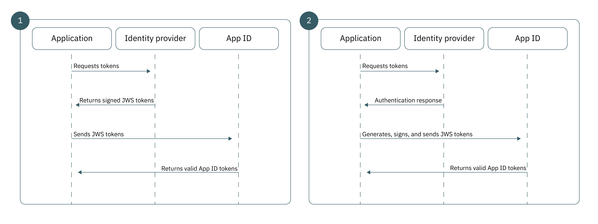

---

copyright:
  years: 2017, 2020
lastupdated: "2020-09-21"

keywords: custom identity provider, authorization, bring your own idp, proprietary idp, legacy idp, oauth, oidc, authentication, oatuh, app security

subcollection: appid

---

{:codeblock: .codeblock}
{:screen: .screen}
{:download: .download}
{:external: target="_blank" .external}
{:faq: data-hd-content-type='faq'}
{:gif: data-image-type='gif'}
{:important: .important}
{:note: .note}
{:pre: .pre}
{:tip: .tip}
{:preview: .preview}
{:deprecated: .deprecated}
{:shortdesc: .shortdesc}
{:script: data-hd-video='script'}
{:support: data-reuse='support'}
{:table: .aria-labeledby="caption"}
{:troubleshoot: data-hd-content-type='troubleshoot'}
{:help: data-hd-content-type='help'}
{:tsCauses: .tsCauses}
{:tsResolve: .tsResolve}
{:tsSymptoms: .tsSymptoms}
{:java: .ph data-hd-programlang='java'}
{:javascript: .ph data-hd-programlang='javascript'}
{:swift: .ph data-hd-programlang='swift'}
{:curl: .ph data-hd-programlang='curl'}
{:video: .video}
{:step: data-tutorial-type='step'}
{:tutorial: data-hd-content-type='tutorial'}


# Custom identity
{: #custom-auth}

You can use your own custom identity provider when you are authenticating. Your identity provider can conform to any authentication mechanism alternate to those supported by {{site.data.keyword.appid_full}}, including proprietary or legacy.
{: shortdesc}

## Overview
{: #custom-auth-overview}

By bringing your own identity provider, you can create a custom authentication flow that uses your own protocols. You have more control, such as information that you want to share or information that is stored.
{: shortdesc}

Be sure to [configure your custom provider](/docs/appid?topic=appid-custom-identity) before you add it to your application.
{: tip}

### When would I want to use this flow?
{: #custom-auth-when}

When {{site.data.keyword.appid_short_notm}} does not provide direct support for a particular identity provider, you can use the custom identity flow to bridge the authentication protocol to {{site.data.keyword.appid_short_notm}}'s existing authentication flow. For example, you want to use GitHub or LinkedIn to allow your users to sign in. You can use the identity provider's existing SDK to facilitate user authentication information before packaging and exchanging it with {{site.data.keyword.appid_short_notm}}.

There are many scenarios where a different authentication flow is necessary:

* Proprietary, in-house identity providers 
* Third-party identity providers 
* Complicated authentication flows, which can include proprietary multi-factor mechanisms 

Occasionally, a legacy provider might use their own custom authentication protocol. Because the custom identity flow completely decouples authentication from authorization, you can adopt any authentication mechanism of your choice and then provide the resulting authentication information to {{site.data.keyword.appid_short_notm}}. All without exposing user credentials.

</br>

### Technically, how does this flow work?
{: #custom-auth-tech}

The custom identity workflow is built on the JWT-Bearer extension grant type that is defined in Assertion Framework for OAuth 2.0 Authorization Grants [[RFC7521]](https://tools.ietf.org/html/rfc7523#section-2.1). In order to exchange user information for {{site.data.keyword.appid_short_notm}} tokens, your authentication architecture creates a trust relationship with {{site.data.keyword.appid_short_notm}} by using an asymmetric RSA key pair. Once trust is established, you can use the JWT-Bearer grant type to exchange verified user information within a signed JWT for {{site.data.keyword.appid_short_notm}} tokens.

### What does the flow look like?
{: #custom-auth-flow}

As with all authentication flows, custom identity requires that the application is able to establish a degree of trust with {{site.data.keyword.appid_short_notm}} to ensure the integrity of identity provider user information. Custom identity employs an asymmetric RSA public and private key pair to establish its trust relationship. Depending on your architectural requirements, custom identity supports two trust models that differ only in the storage location and usage of the private key.

{: caption="Figure 1. The request flows for custom authentication" caption-side="bottom"}

<dl>
  <dt>1. Identity provider signed</dt>
    <dd>Just as with traditional OAuth 2.0 flows, the most secure trust model creates a relationship between your identity provider and authorization server; in this case {{site.data.keyword.appid_short_notm}}) directly. Under this model, your identity provider is responsible for storing the private key and signing JWT assertions. When passed to {{site.data.keyword.appid_short_notm}}, these assertions are validated with the matching public key, which ensures that the user information from your identity provider was not maliciously altered during transport.</dd>
  <dt>2. Application signed</dt>
    <dd>Alternatively, you can base your trust model on the relationship between your app and {{site.data.keyword.appid_short_notm}}. In this workflow, your private key is stored in your server-side application. After a successful authentication, your app is responsible for converting the identity providers response into a JWT and signing it with its private key before the app sends the token to {{site.data.keyword.appid_short_notm}}. Since this identity provider has no relationship with {{site.data.keyword.appid_short_notm}}, this architecture creates a weaker trust model. Although {{site.data.keyword.appid_short_notm}} can trust the information that is sent by the server-side application, it cannot be certain the data was the original sent by the identity provider.</dd>
</dl>


## Generating a JSON web token
{: #generating-jwts}

You can convert your verified user data to a custom identity JWT by generating a [JSON web token](https://tools.ietf.org/html/rfc7515){: external}. The token must be signed with the private key that matches your preconfigured public key. For a list of token signing libraries, check out [https://jwt.io/](https://jwt.io/){: external}.
{: shortdesc}


### Example JWT format
{: #jwts-example}

Token header:
  ```json
  {
  "alg": "RS256",
  "typ": "JOSE"
  }
  ```
  {: screen}

Token payload:
  ```json
  {
    // Required
    "iss": "String", // Should reference your identity provider
    "aud": "String", // Must be the OAuth server URL name
    "exp": "Int",    // Should be a value with a short lifespan
    "sub": "String", // Must be the unique user ID provided by your identity provider

    // Normalized claims (optional)
    "name": "String",
    "email": "String",
    "locale": "String",
    "picture": "String",
    "gender": "String"

    // Custom Scopes to add to access token (optional)
    scope="custom_scope1 custom_scope2"

    // Other custom claims (optional)
    role="admin"
  }
  ```
  {: screen}

  <table>
    <caption>Table 1. JWS fields</caption>
    <tr>
      <th>Field</th>
      <th>Description</th>
    </tr>
    <tr>
      <td><code>iss</code></td>
      <td>Should contain a reference to your identity provider.</td>
    </tr>
    <tr>
      <td><code>aud</code></td>
      <td>The OAuth server URL. Format: `https://{region}.appid.cloud.ibm.com/oauth/v4/{tenantId}`.</td>
    </tr>
    <tr>
      <td><code>exp</code></td>
      <td>The length of time that the token is valid. For security reasons, it should have a short life span and be specific.</td>
    </tr>
    <tr>
      <td><code>sub</code></td>
      <td>The unique user ID that is provided by the identity provider.</td>
    </tr>
    <tr>
      <td>Normalized claims</td>
      <td>All [normalized claims](/docs/appid?topic=appid-tokens) are provided in the identity token that is returned in response to this request. More custom claims can be found by using the [`/userinfo` endpoint](/docs/appid?topic=appid-profiles).</td>
    </tr>
    <tr>
      <td>Scope</td>
      <td>By default, all {{site.data.keyword.appid_short_notm}} tokens contain a group of preset scopes. You can request extra scopes by doing one of the following:<ul><li> Specify the scope in the scope field of your JWS token.</li> <li>Specify the scope through the url-form scopes parameter of the `/token` request.</li></ul></td>
    </tr>
  </table>

## Retrieving {{site.data.keyword.appid_short_notm}} tokens
{: #exchanging-jwts}

To create the bridge between your custom provider and {{site.data.keyword.appid_short_notm}}, you need to have {{site.data.keyword.appid_short_notm}} tokens. To obtain service tokens, exchange your verified user information by using the [`/token` endpoint](https://us-south.appid.cloud.ibm.com/swagger-ui/#/Authorization_Server_V4/token){: external}.
{: shortdesc}

  ```
  Post /token
  Content-Type: application/x-www-from-urlencoded
  grant_type=urn:ietf:params:oauth:grant-type:jwt-bearer
  assertion=<payload>
  scope="<space separated scope array>"
  ```
  {: codeblock}

  <table>
    <caption>Table 2. Required request variables</caption>
    <tr>
      <th>Variable</th>
      <th>Description</th>
    </tr>
    <tr>
      <td>Content-type</td>
      <td><code>applications/x-www-from-urlencoded</code></td>
    </tr>
    <tr>
      <td>grant_type</td>
      <td><code>urn:ietf:params:oauth:grant-type:jwt-bearer</code></td>
    </tr>
    <tr>
      <td>assertion</td>
      <td>A JWS payload string.</td>
    </tr>
    <tr>
      <td>scope</td>
      <td>A white space separated list of your custom scopes.</td>
    </tr>
  </table>
