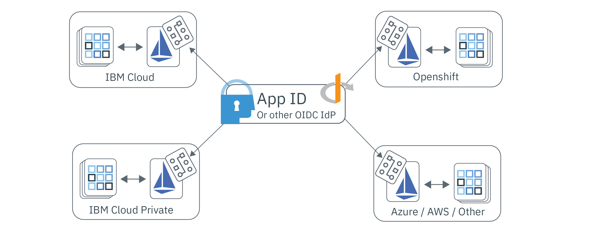

---

copyright:
  years: 2017, 2020
lastupdated: "2020-09-21"

keywords: adapter, access management, identity token, helm chart, backend apps, kube, any kube, icp, openshift, iks, service mesh, access, app identity, kube secret, tokens, authenticated, app endpoints, authorization, multicloud, no code change, no redeploy, authorization policies, multiple providers

subcollection: appid

---

{:codeblock: .codeblock}
{:screen: .screen}
{:download: .download}
{:external: target="_blank" .external}
{:faq: data-hd-content-type='faq'}
{:gif: data-image-type='gif'}
{:important: .important}
{:note: .note}
{:pre: .pre}
{:tip: .tip}
{:preview: .preview}
{:deprecated: .deprecated}
{:shortdesc: .shortdesc}
{:script: data-hd-video='script'}
{:support: data-reuse='support'}
{:table: .aria-labeledby="caption"}
{:troubleshoot: data-hd-content-type='troubleshoot'}
{:help: data-hd-content-type='help'}
{:tsCauses: .tsCauses}
{:tsResolve: .tsResolve}
{:tsSymptoms: .tsSymptoms}
{:java: .ph data-hd-programlang='java'}
{:javascript: .ph data-hd-programlang='javascript'}
{:swift: .ph data-hd-programlang='swift'}
{:curl: .ph data-hd-programlang='curl'}
{:video: .video}
{:step: data-tutorial-type='step'}


# Multicloud apps with Istio
{: #istio-adapter}

By using the App Identity and Access adapter, you can centralize all of your identity management in a single place. Because enterprises use clouds from multiple providers or a combination of on and off-premise solutions, heterogeneous deployment models can help you to preserve existing infrastructure and avoid vendor lock-in. The adapter can be configured to work with any OIDC-compliant identity provider, such as {{site.data.keyword.appid_short_notm}}, which enables it to control authentication and authorization policies in all environments including front end and backend applications. And, **it does it all without any change to your code or the need to redeploy your application**.
{: shortdesc}

What can the App Identity and Access adapter do for you? Check out the following video to learn more.

{: video output="iframe" data-script="none" id="youtubeplayer" frameborder="0" webkitallowfullscreen mozallowfullscreen allowfullscreen}


## Multicloud architecture
{: #istio-multicloud}

A multicloud computing environment combines multiple cloud and/ or private computing environments into a single network architecture. By distributing workloads across multiple environments, you might find improved resiliency, flexibility, and greater cost-effificiency. To achieve the benefits, it's common to use a container-based application with an orchestration layer, such as Kubernetes.

{: caption="Figure 1. Multicloud deployment - achieved with the App Identity and Access adapter" caption-side="bottom"}


## Understanding Istio and the adapter
{: #istio-architecure}

[Istio](https://istio.io) is an open source service mesh that layers transparently onto existing distributed applications that can integrate with Kubernetes. To reduce the complexity of deployments Istio provides behavioral insights and operational control over the service mesh as a whole. When {{site.data.keyword.appid_short_notm}} is combined with Istio, it becomes a scalable, integrated identity solution for multicloud architectures that does not require any custom application code changes. For more information, check out [What is Istio](https://www.ibm.com/cloud/learn/istio){: external}.

Istio uses an Envoy proxy sidecar to mediate all inbound and outbound traffic for all services in the service mesh. By using the proxy, Istio extracts information about traffic, also known as telemetry, that is sent to the Istio component called Mixer to enforce policy decisions. The App Identity and Access adapter extends the Mixer functionality by analyzing the telemetry (attributes) against custom policies to control identity and access management into and across the service mesh. The access management policies are linked to particular Kubernetes services and can be finely tuned to specific service endpoints. For more information about policies and telemetry, see the [Istio documentation](https://istio.io/latest/docs/concepts/observability/){: external}. 

Due to an Istio limitation, the App Identity and Access adapter currently stores user session information internally and does *not* persist the information across replicas or over failover configurations. When you use the adapter, limit your workloads to a single replica until the limitation is addressed.
{: note}

### Protecting front-end apps
{: #istio-frontend}

If you're using a browser-based application, you can use the [Open ID Connect (OIDC)](https://openid.net/specs/openid-connect-core-1_0.html){: external} / OAuth 2.0 `authorization_grant` flow to authenticate your users. When an unauthenticated user is detected, they are automatically redirected to the authentication page. When the authentication completes, the browser is redirected to an implicit `/oidc/callback` endpoint where the adapter intercepts the request. At this point, the adapter obtains tokens from the identity provider and then redirects the user back to their originally requested URL.

To view the user session information, including the session tokens, you can look in the `Authorization` header.

```
Authorization: Bearer <access_token> <id_token>
```
{: screen}

You can also log out authenticated users. When an authenticated user accesses any protected endpoint with `oidc/logout` appended as shown in the following example, they are logged out.

```
https://myhost/path/oidc/logout
```
{: screen}

If needed, a refresh token can be used to automatically acquire new access and identity tokens without your user's needing to reauthenticate. If the configured identity provider returns a refresh token, it's persisted in the session and used to retrieve new tokens when the identity token expires.


### Protecting backend apps
{: #istio-backend}

The adapter can be used in collaboration with the OAuth 2.0 [JWT Bearer flow](https://tools.ietf.org/html/rfc6750){: external} to protect service APIs by validating JWT Bearer tokens. The Bearer authorization flow expects a request to contain an Authorization header with a valid access token and an optional identity token. The expected header structure is `Authorization=Bearer {access_token} [{id_token}]`. Unauthenticated clients are returned an HTTP 401 response status with a list of the scopes that are needed to obtain authorization. If the tokens are invalid or expired, the API strategy returns an HTTP 401 response with an optional error component that says `Www-Authenticate=Bearer scope="{scope}" error="{error}"`.


For more information about tokens and how they're used, see [understanding tokens](/docs/appid?topic=appid-tokens).


## Before you begin
{: #istio-before}

Before you get started, be sure that you have installed the following prerequisites.

- A paid [Kubernetes Cluster](https://kubernetes.io/){: external}
- [Helm](https://helm.sh/){: external}
- [Istio v1.1+](https://istio.io/latest/docs/setup/install/){: external}

  Currently, [IBM Cloud Kubernetes Service Managed Istio](/docs/containers?topic=containers-istio) does not support policy enforcement. To use the adapter you must use manually installed Istio.
  {: note}


## Installing the adapter
{: #istio-install-adapter}

To install the chart, initialize Helm in your cluster, define the options that you want to use, and then run the installation command.

1. If you're working with IBM Cloud Kubernetes Service, be sure to log in and set the context for your cluster.

2. Verify that you have [Istio policy enforcement enabled](https://istio.io/latest/docs/tasks/policy-enforcement/enabling-policy/){: external}. If not, turn it on. 

3. Add the repository.

  ```bash
  helm repo add appidentityandaccessadapter https://raw.githubusercontent.com/ibm-cloud-security/app-identity-and-access-adapter/master/helm/appidentityandaccessadapter
  ```
  {: codeblock}

4. Install the chart.

  ```bash
  helm install --name appidentityandaccessadapter appidentityandaccessadapter/appidentityandaccessadapter
  ```
  {: codeblock}

  You can specify an image tag during installation by setting the `image.tag` flag. For example `--set image.tag=0.5.0`. You can also install the chart locally. To do so, clone the repo by running `git clone git@github.com:ibm-cloud-security/app-identity-and-access-adapter.git` before you run the installation command.
  {: tip}

## Applying an authorization and authentication policy
{: #istio-apply-policy}

An authentication or authorization policy is a set of conditions that must be met before a request can access a resource access. By defining an identity provider's service configuration and a policy that outlines when a particular flow should be used, you can control access to any resource in your service mesh. To see example CRDs, check out the [samples directory](https://github.com/ibm-cloud-security/app-identity-and-access-adapter/tree/master/samples/crds){: external}.

To create a policy:

1. Define a configuration.
2. Register the endpoint.

### Defining a configuration
{: #istio-apply-define}

Depending on whether you're protecting front end or backend applications, create a policy configuration with one of the following options.

* For front-end applications: Browser-based applications that require user authentication can be configured to use the OIDC / OAuth 2.0 authentication flow. To define an `OidcConfig` CRD containing the client used to facilitate the authentication flow with the Identity provider, use the following example as a guide.

  ```yaml
  apiVersion: "security.cloud.ibm.com/v1"
  kind: OidcConfig
  metadata:
      name:      oidc-provider-config
      namespace: sample-namespace
  spec:
      discoveryUrl: https://us-south.appid.cloud.ibm.com/oauth/v4/<tenant_ID>/.well-known/openid-configuration
      clientId:     <client-ID>
      clientSecret: <randomlyGeneratedClientSecret>
      clientSecretRef:
          name: <name-of-my-kube-secret>
          key: <key-in-my-kube-secret>
  ```
  {: screen}

  <table>
    <caption>Table 1. YAML configuration file components explained</caption>
    <tr>
      <th>Field</th>
      <th style="text-align:center">Type</th>
      <th style="text-align:center">Required</th>
      <th style="text-align:center">Description</th>
    </tr>
    <tr>
      <td><code>discoveryUrl</code></td>
      <td style="text-align:center">string</td>
      <td style="text-align:center">Yes</td>
      <td style="text-align:center">A well-known endpoint that provides a JSON document of OIDC/OAuth 2.0 configuration information.</td>
    </tr>
    <tr>
      <td><code>clientId</code></td>
      <td style="text-align:center">string</td>
      <td style="text-align:center">Yes</td>
      <td style="text-align:center">An identifier for the client that is used for authentication.</td>
    </tr>
    <tr>
      <td><code>clientSecret</code></td>
      <td style="text-align:center">string</td>
      <td style="text-align:center">*No</td>
      <td style="text-align:center">A plain text secret that is used to authenticate the client. If not provided, a <code>clientSecretRef</code> must exist.</td>
    </tr>
    <tr>
      <td><code>clientSecretRef</code></td>
      <td style="text-align:center">object</td>
      <td style="text-align:center">No</td>
      <td style="text-align:center">A reference secret that is used to authenticate the client. The reference can be used in place of the <code>clientSecret</code>.</td>
    </tr>
    <tr>
      <td><code>clientSecretRef.name</code></td>
      <td style="text-align:center">string</td>
      <td style="text-align:center">Yes</td>
      <td style="text-align:center">The name of the Kubernetes Secret that contains the <code>clientSecret</code>.</td>
    </tr>
    <tr>
      <td><code>clientSecretRef.key</code></td>
      <td style="text-align:center">string</td>
      <td style="text-align:center">Yes</td>
      <td style="text-align:center">The field within the Kubernetes Secret that holds the <code>clientSecret</code>.</td>
    </tr>
  </table>

* For backend applications: The OAuth 2.0 Bearer token spec defines a pattern for protecting APIs by using [JSON Web Tokens (JWTs)](https://tools.ietf.org/html/rfc7519.html){: external}. By using the following configuration as an example, define a `JwtConfig` CRD that contains the public key resource, which is used to validate token signatures.

    ```yaml
    apiVersion: "security.cloud.ibm.com/v1"
    kind: JwtConfig
    metadata:
      name:      jwt-config
      namespace: sample-app
    spec:
        jwksUrl: https://us-south.appid.cloud.ibm.com/oauth/v4/<tenant-ID>/publickeys
    ```
    {: screen}

### Registering application endpoints
{: #istio-register-endpoints}

Register application endpoints within a `Policy` CRD to validate incoming requests and enforce authentication rules. Each `Policy` applies exclusively to the Kubernetes namespace in which the object lives and can specify the services, paths, and methods that you want to protect.

```yaml
apiVersion: "security.cloud.ibm.com/v1"
kind: Policy
metadata:
  name:      samplepolicy
  namespace: sample-app
spec:
  targets:
    -
      serviceName: <svc-sample-app>
      paths:
        - exact: /web/home
          method: ALL
          policies:
            - policyType: oidc
              config: <oidc-provider-config>
              rules:
                - claim: scope
                  match: ALL
                  source: access_token
                  values:
                    - appid_default
                    - openid
                - claim: amr
                  match: ANY
                  source: id_token
                  values:
                    - cloud_directory
                    - google

        - exact: /web/user
          method: GET
          policies:
            - policyType: oidc
              config: <oidc-provider-config>
              redirectUri: https://github.com/ibm-cloud-security/app-identity-and-access-adapter
        - prefix: /
          method: ALL
          policies:
            -
              policyType: jwt
              config: <jwt-config>
```
{: screen}


| Service Object | Type | Required | Description   |
|:----------------:|:----:|:--------:| :-----------: |
| `serviceName` | `string` | Yes | The name of Kubernetes service in the Policy namespace that you want to protect. |
| `paths` | `array[Path Object]` | Yes | A list of path objects that define the endpoints that you want to protect. If not specified, all paths are protected. |
{: class="simple-tab-table"}
{: caption="Table 2. Understanding the service object components" caption-side="top"}
{: #service-object}
{: tab-title="Service object"}
{: tab-group="objects"}

| Path Object    | Type | Required | Description   |
|:----------------:|:----:|:--------:|:-----------:|
| `exact or prefix` | `string` | Yes | The path that you want to apply the policies on. Options include `exact` and `prefix`. `exact` matches the provided endpoints exactly with the last `/` trimmed. `prefix` matches the endpoints that begin with the route prefix that you provide. |
| `method` | `enum` | No | The HTTP method protected. Valid options ALL, GET, PUT, POST, DELETE, PATCH - Defaults to ALL:  |
| `policies` | `array[Policy]` | No | The OIDC/JWT policies that you want to apply.  |
{: class="simple-tab-table"}
{: caption="Table 3. Understanding the path object components" caption-side="top"}
{: #path-object}
{: tab-title="Path object"}
{: tab-group="objects"}

| Policy Object  | Type | Required | Description   |
|:----------------:|:----:|:--------:| :-----------: |
| `policyType` | `enum` | Yes | The type of OIDC policy. Options include: `jwt` or `oidc`. |
| `config` | `string` | Yes | The name of the provider config that you want to use. |
| `redirectUri` | `string` | No | The URL that you want the user to be redirected after successful authentication, default: the original request URL. |
| `rules` | `array[Rule]` | No | The set of rules that you want to use for token validation. |
{: class="simple-tab-table"}
{: caption="Table 4. Understanding the policy object components" caption-side="top"}
{: #policy-object}
{: tab-title="Policy object"}
{: tab-group="objects"}

| Rule Object  | Type | Required | Description   |
|:----------------:|:----:|:--------:| :-----------: |
| `claim` | `string` | Yes | The claim that you want to validate. |
| `match` | `enum` | No | The criteria required for claim validation. Options include: `ALL`, `ANY`, or `NOT`. The default is set to `ALL`. |
| `source` | `enum` | No | The token where you want to apply the rule. Options include: `access_token` or `id_token`. The default is set to `access_token`. |
| `values` | `array[string]` | Yes | The required set of values for validation. |
{: class="simple-tab-table"}
{: caption="Table 5. Understanding the policy object components" caption-side="top"}
{: #rule-object}
{: tab-title="Rule object"}
{: tab-group="objects"}


## Deleting the adapter
{: #istio-remove}

To remove the adapter and all of the associated CRDs, you must delete the Helm chart and the associated signing and encryption keys.

```bash
helm delete --purge appidentityandaccessadapter
kubectl delete secret appidentityandaccessadapter-keys -n istio-system
```
{: codeblock}


## Configuring logging
{: #istio-logging}

By default, logs are styled as JSON and provided at an `info` visibility level to provide for ease of integration with external logging systems. To update the logging configuration, you can use the Helm chart. Supported logging levels include range [-1, 7] as shown in Zap core. For more information about the levels, see the [Zap core documentation](https://godoc.org/go.uber.org/zap/zapcore#Level){: external}.

When you're manually viewing JSON logs, you might want to tail the logs and "pretty print" them by using [`jq`](https://brewinstall.org/install-jq-on-mac-with-brew/){: external}.
{: note}

### Adapter
{: #istio-logging-adapter}

To see the adapter logs, you can use `kubectl` or access the pod from the `appidentityandaccessadapter` pod from the Kubernetes console.

```bash
$ alias adapter_logs="kubectl -n istio-system logs -f $(kubectl -n istio-system get pods -lapp=appidentityandaccessadapter -o jsonpath='{.items[0].metadata.name}')"
$ adapter_logs | jq
```
{: codeblock}

### Mixer
{: #istio-logging-mixer}

If the adapter does not appear to receive requests, check the Mixer logs to ensure that it's successfully connected to the adapter.

```bash
$ alias mixer_logs="kubectl -n istio-system logs -f $(kubectl -n istio-system get pods -lapp=telemetry -o jsonpath='{.items[0].metadata.name}') -c mixer"
$ mixer_logs | jq
```
{: codeblock}

