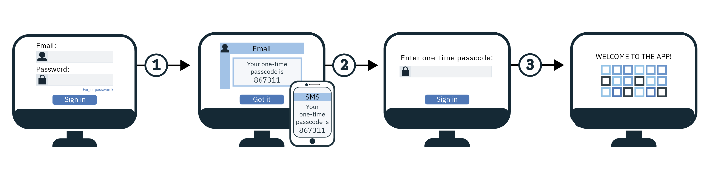

---

copyright:
  years: 2017, 2019
lastupdated: "2019-12-12"

keywords: mfa, multifactor, authentication, cloud directory, login widget, second factor, two factor, identity, mulitple factors, advanced security event, cloud directory user, sender id, phone number, email, nexmo

subcollection: appid

---

{:external: target="_blank" .external}
{:shortdesc: .shortdesc}
{:screen: .screen}
{:pre: .pre}
{:table: .aria-labeledby="caption"}
{:codeblock: .codeblock}
{:tip: .tip}
{:note: .note}
{:important: .important}
{:deprecated: .deprecated}
{:download: .download}


# Multi-factor authentication (MFA)
{: #cd-mfa}

By requiring multiple factors during sign-in, you can increase the security of user authentication to your apps. With Cloud Directory for {{site.data.keyword.appid_full}}, the first factor is the Cloud Directory user's password, which they normally use to sign in. The second authentication factor is a one-time code that {{site.data.keyword.appid_short_notm}} sends to the user either as an SMS or email. {{site.data.keyword.appid_short_notm}} uses a combination of both factors to verify the identity of a user.
{: shortdesc}

{{site.data.keyword.appid_short_notm}} MFA is supported as part of the OAuth 2.0 authorization code flow for Cloud Directory users through the Login Widget. If you're using enterprise sign-in with SAML 2.0 or social login, you can enable MFA through that identity provider.
{: note}

When MFA is enabled, the {{site.data.keyword.appid_short_notm}} Login Widget requires a second form of verification (second authentication factor) every time a user attempts to sign in. After a user successfully enters their credentials, a one-time code is sent to the email or phone number that is registered to their account.

Check out the following diagram to see how the MFA flow works.

{: caption="Figure 1. Cloud Directory MFA flow" caption-side="bottom"}

1. A user is shown {{site.data.keyword.appid_short_notm}}'s Login Widget and inputs their Cloud Directory user credentials. The credentials can be either their email or user name and their password. The Cloud Directory user credentials form the first authentication factor.

2. The credentials are validated and the MFA screen for second factor verification is returned. Based on the second factor configuration, the user receives either an email or an SMS with a one-time code and enters it into the verification screen.

3. If the MFA code is validated, the user is redirected back to the application and is signed in.


## Understanding MFA
{: #cd-mfa-understanding}


MFA is a method of confirming a user's identity by requiring them to use multiple factors to prove that they are who they say that they are. These factors can be something that they have in addition to something that they know or something that they are.
{: shortdesc}

The first time that MFA is enabled, it is set to use email by default. You can change the setting to use SMS, but you cannot configure both at the same time. 
{: note}

Defined in SCIM as a [multi-valued attribute](https://tools.ietf.org/html/rfc7643#section-2.4){: external}, a Cloud Directory user's email or phone number can contain the following:

* Value: The actual attribute value such as email address or phone number.
* Primary: A Boolean value that indicates the preferred value for the attribute. The primary attribute value `true` can occur once and only once. If not specified, the value of `primary` is assumed to be `false`.

For more information, check out the [Cloud Directory docs](/docs/services/appid?topic=appid-cloud-directory#cloud-directory).
{: note}


## Configuring the MFA email channel
{: #cd-mfa-configure-email}

You can configure {{site.data.keyword.appid_short_notm}} to send the MFA code to your users through email.
{: shortdesc} 

When you enable MFA for the first time, the following two things happen:

- By default, the email channel is selected. You can switch to the [SMS channel](/docs/services/appid?topic=appid-cd-mfa#cd-mfa-configure-sms).
- {{site.data.keyword.appid_short_notm}} automatically registers the primary email that is attached to your Cloud Directory user's profile.

If a user's email is not already confirmed, through either the [management APIs](https://us-south.appid.cloud.ibm.com/swagger-ui/#/) or through email verification when they sign up, they are confirmed when they successfully verify an MFA code.

Before you get started, be sure that your instance of {{site.data.keyword.appid_short_notm}} is on the [graduated tier pricing plan](/docs/services/appid?topic=appid-faq#faq-pricing).
{: note}

### With the GUI
{: #cd-mfa-configure-email-gui}

You can configure the MFA email channel through the GUI.

1. Navigate to the **Cloud Directory > Multi-factor authentication** tab of the {{site.data.keyword.appid_short_notm}} dashboard.

2. In the **Enable multi-factor authentication** box, on the **settings tab**, toggle MFA to **Enabled**. Acknowledge that you understand that MFA is charged as an [advanced security event](/docs/services/appid?topic=appid-faq#faq-pricing). By default, **Email** is selected as the **Authentication method**.

3. In the **Email channel** tab, review the **Email template**. You can choose to send the template with the provided wording or write your own message. Be sure to use the correct HTML tagging. In the GUI you can add parameters and insert images. To change the [language](/docs/services/appid?topic=appid-cd-messages#cd-languages) of the message, you can use <a href="https://us-south.appid.cloud.ibm.com/swagger-ui/#/Management%20API%20-%20Config/mgmt.updateLocalization" target="_blank">the APIs </a> to set the language. However, you are responsible for the content and translation of the message. Check out the following table to see the list of tables that you can use in this message and all of the other messages that you can send. If a user does not supply the information that is pulled by the parameter, it appears blank.

  <table>
    <caption>Table 2. MFA message parameters</caption>
    <tr>
      <th>Parameter</th>
      <th>Description</th>
    </tr>
    <tr>
      <td><code>%{display.logo}</code></td>
      <td> Displays the image that you configured for your Login Widget. </td>
    </tr>
    <tr>
      <td><code>%{user.displayName}</code></td>
      <td> Displays the screen name a user chose to use when interacting with the app. </td>
    </tr>
    <tr>
      <td><code>%{user.email}</code></td>
      <td> Displays the user's registered email address. </td>
    </tr>
    <tr>
      <td><code>%{user.username}</code></td>
      <td> Displays the user's specified username when the authentication method is set to username and password. </td>
    </tr>
    <tr>
      <td><code>%{user.firstName}</code></td>
      <td> Displays the user's specified given name. </td>
    </tr>
    <tr>
      <td><code>%{user.formattedName}</code></td>
      <td> Displays the user's full name. </td>
    </tr>
    <tr>
      <td><code>%{user.lastName}</code></td>
      <td> Displays the user's specified surname. </td>
    </tr>
    <tr>
      <td><code>%{mfa.code}</code></td>
      <td> Displays a one-time MFA verification code. </td>
    </tr>
  </table>

  If a user does not supply the information pulled by the parameter, it appears blank.
  {: tip}


### With the APIs
{: #cd-mfa-configure-email-apis}

Be sure that you have the following prerequisites:

* Your {{site.data.keyword.appid_short_notm}} instance's tenant ID. This ID can be found in the **Service Credentials** section of the dashboard.
* Your Identity and Access Management (IAM) token. For help with obtaining an IAM token, check out the [IAM docs](/docs/iam?topic=iam-iamtoken_from_apikey#iamtoken_from_apikey).

To enable MFA:

1. Enable MFA by making a PUT request to the `/config/mfa` endpoint with your MFA configuration to set `isActive` to `true`.

  ```
  cURL -X PUT https://<region>.appid.cloud.ibm.com/management/v4/{tenantId}/config/mfa \
    --header 'Content-Type: application/json' \
    --header 'Accept: application/json' \
    --header 'Authorization: Bearer <IAM_TOKEN>' \
    -d '{"isActive": true}'
  ```
  {: codeblock}

2. Enable your MFA channel by making a PUT request to the `/mfa/channels/{channel}` endpoint with your MFA configuration. When `isActive` is set to `true`, your MFA channel is enabled.

  ```
  $ cURL -X PUT https://<region>.appid.cloud.ibm.com/management/v4/{tenantId}/mfa/channels/email \
    --header 'Content-Type: application/json' \
    --header 'Accept: application/json' \
    --header 'Authorization: Bearer <IAM_TOKEN>' \
    -d '{"isActive": true}'
  ```
  {: codeblock}

If your {{site.data.keyword.appid_short_notm}} Cloud Directory instance is configured to work with a custom email dispatcher, then MFA uses the same dispatcher to send the one-time code. For more information on setting up a custom dispatcher, refer to the [Cloud Directory](/docs/services/appid?topic=appid-cd-messages#cd-custom-email) docs.
{: note}


## Configuring MFA to work with SMS
{: #cd-mfa-configure-sms}

You can send an SMS message to your users as a second form of verification. When you enable SMS, {{site.data.keyword.appid_short_notm}} automatically tries to register the first [valid](https://en.wikipedia.org/wiki/E.164){: external} primary phone number that is found in a Cloud Directory user's profile. If the number is invalid or no phone number is found on the user's profile, then a registration widget is displayed for the user to add a number. Then, the number is part of the user's profile and after validation, becomes the default number that is used for MFA.
{: shortdesc}

### Before you begin
{: #cd-mfa-configure-sms-before}

{{site.data.keyword.appid_short_notm}} uses [Nexmo](https://www.nexmo.com/products/sms){: external} to send MFA SMS one-time codes. Before you get started, be sure that you have an instance of {{site.data.keyword.appid_short_notm}} that is on the [graduated tier pricing plan](/docs/services/appid?topic=appid-faq#faq-pricing) and the following Nexmo information.

 - Obtain your Nexmo API key and secret. You can find the Nexmo API key and secret in your account settings page on the Nexmo dashboard. Check out the [Nexmo documentation](https://developer.nexmo.com/concepts/guides/authentication#api-key-and-secret){: external} for further information on how to obtain your credentials.

 - Register your sender ID or the `from` number with Nexmo. This `from` number is what appears on your user's phone to show who the SMS is from. In some countries, Nexmo supports alpha-numeric sender IDs. {{site.data.keyword.appid_short_notm}} uses the value that you enter as Nexmo's sender ID. So, if they are supported by Nexmo, you can use the IDs with {{site.data.keyword.appid_short_notm}}. For more information, check out the [Nexmo documentation](https://help.nexmo.com/hc/en-us/articles/217571017-What-is-a-Sender-ID){: external}.


### With the GUI
{: #cd-mfa-configure-sms-gui}

To configure MFA with the GUI, check out [Cloud Directory](/docs/services/appid?topic=appid-cloud-directory).
{: note}

1. Navigate to the **Cloud Directory > Multi-factor authentication** tab of the {{site.data.keyword.appid_short_notm}} dashboard.

2. In the **Enable multi-factor authentication** box, on the **settings tab**, toggle MFA to **Enabled**. Acknowledge that you understand that MFA is charged as an [advanced security event](/docs/services/appid?topic=appid-faq#faq-pricing).

3. Select **SMS** as your **Authentication method**.

4. In the **SMS channel** tab, configure your Nexmo account information.

    1. If you don't already have an account with Nexmo. Create one.

    2. From the Nexmo dashboard, click **SMS**.

    3. In the **Code it yourself** section, copy your API key and paste it in the **key** box in the {{site.data.keyword.appid_short_notm}} dashboard.

    4. Copy the **API secret** in the Nexmo dashboard and paste it in the **Secret** box in the {{site.data.keyword.appid_short_notm}} dashboard.

    5. Enter [the ID](https://help.nexmo.com/hc/en-us/articles/217571017-What-is-a-Sender-ID) that you want to send messages from. A valid number format follows the [E.164 international numbering format](https://en.wikipedia.org/wiki/E.164). For example, a US number takes the form `+1 999 888 7777 `. You must specify both the country code, starting with a `+` symbol and the national subscriber number. In some countries, Nexmo supports alpha-numeric sender IDs. {{site.data.keyword.appid_short_notm}} uses the value that you enter as Nexmo's sender ID. So, if they are supported by Nexmo, you can use the IDs with {{site.data.keyword.appid_short_notm}}.


### With the APIs
{: #cd-mfa-configure-sms-api}

Before you get started with the API, be sure that you have the following prerequisites:

* Your {{site.data.keyword.appid_short_notm}} instance's tenant ID. This ID can be found in the **Service Credentials** section of the dashboard.
* Your Identity and Access Management (IAM) token. For help with obtaining an IAM token, check out the [IAM docs](/docs/iam?topic=iam-iamtoken_from_apikey).


To enable MFA:


1. Enable MFA, by making a PUT request to the `/config/mfa` endpoint with your MFA configuration to set `isActive` to `true`.

  ```
  cURL -X PUT https://<region>.appid.cloud.ibm.com/management/v4/{tenantId}/config/mfa \
  --header 'Content-Type: application/json' \
  --header 'Accept: application/json' \
  --header 'Authorization: Bearer <IAM_TOKEN>' \
  -d '{"isActive": true}'
  ```
  {: codeblock}

2. Enable your MFA channel by making a PUT request to the `/mfa/channels/{channel}` endpoint with your MFA configuration. When `isActive` is set to `true`, your MFA channel is enabled.
The `config` takes in the Nexmo API key and secret as well as the `from` number.

  ```
  cURL -X PUT https://<region>.appid.cloud.ibm.com/management/v4/{tenantId}/mfa/channels/nexmo' \
  --header 'Content-Type: application/json' \ 
  --header 'Accept: application/json' \ 
  --header 'Authorization: Bearer <IAM_TOKEN>' \
  -d '{
      "isActive": true,
      "config": {
        "key": "nexmo key",
        "secret": "nexmo secret",
        "from": sender-phoneNumber
      }
  }'
  ```
  {: codeblock}

3. Once the channel is successfully configured, verify that your Nexmo configuration and connection is set up
correctly by using the test button on the UI or by using the management API.

  ```
  cURL -X PUT https://<region>.appid.cloud.ibm.com/management/v4/{tenantId}/config/cloud_directory/sms_dispatcher/test \
  --header 'Content-Type: application/json' \
  --header 'Accept: application/json' \ 
  --header 'Authorization: Bearer <IAM_TOKEN>' \
  -d '{"phone_number": "+1 999 999 9999"}'
  ```
  {: codeblock}


