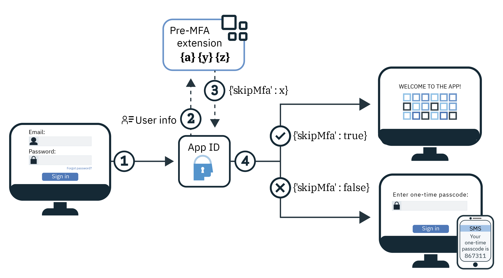

---

copyright:
  years: 2017, 2022
lastupdated: "2022-05-17"

keywords: mfa, multifactor, authentication, cloud directory, login widget, second factor, two factor, identity, mulitple factors, advanced security event, cloud directory user, sender id, phone number, email, nexmo, mfa descision, extension

subcollection: appid

---

{:codeblock: .codeblock}
{:screen: .screen}
{:download: .download}
{:external: target="_blank" .external}
{:faq: data-hd-content-type='faq'}
{:gif: data-image-type='gif'}
{:important: .important}
{:note: .note}
{:pre: .pre}
{:tip: .tip}
{:preview: .preview}
{:deprecated: .deprecated}
{:beta: .beta}
{:term: .term}
{:shortdesc: .shortdesc}
{:script: data-hd-video='script'}
{:support: data-reuse='support'}
{:table: .aria-labeledby="caption"}
{:troubleshoot: data-hd-content-type='troubleshoot'}
{:help: data-hd-content-type='help'}
{:tsCauses: .tsCauses}
{:tsResolve: .tsResolve}
{:tsSymptoms: .tsSymptoms}
{:java: .ph data-hd-programlang='java'}
{:javascript: .ph data-hd-programlang='javascript'}
{:swift: .ph data-hd-programlang='swift'}
{:curl: .ph data-hd-programlang='curl'}
{:video: .video}
{:step: data-tutorial-type='step'}
{:tutorial: data-hd-content-type='tutorial'}
{:ui: .ph data-hd-interface='ui'}
{:cli: .ph data-hd-interface='cli'}
{:api: .ph data-hd-interface='api'}
{:release-note: data-hd-content-type='release-note'}


# Multifactor authentication (MFA)
{: #cd-mfa}

With Cloud Directory for {{site.data.keyword.appid_full}}, you can require multiple authentication factors during your application sign-in flow. A second authentication factor increases the security of your application by not only confirming that a user possesses the knowledge of their credentials but also has access to their registered email or phone number. Extending the MFA flow, you can configure pre-MFA and post-MFA extensions to make custom decisions at run time about which users must complete the second factor or provide you analytical information about your sign-in flow.
{: shortdesc}

{{site.data.keyword.appid_short_notm}} MFA is supported as part of the OAuth 2.0 authorization code flow for Cloud Directory users through the Login Widget. If you're using enterprise sign-in with SAML 2.0 or social login, you can enable MFA through that identity provider.
{: note}

Check out the following diagram to see how the MFA flow works for email or SMS.

{: caption="Figure 1. Cloud Directory MFA flow" caption-side="bottom"}

1. When a user successfully signs in to your application, they complete the first authentication factor. Then, based on your MFA configuration, the user is sent either an email or SMS that contains a 6-digit code.

   When MFA is enabled, the {{site.data.keyword.appid_short_notm}} Login Widget requires a second form of verification every time a user attempts to sign in, unless an [extension is configured](/docs/appid?topic=appid-cd-mfa#cd-mfa-extensions).
   {: tip}

2. A user is expected to look in their phone or email to obtain the code and then enter it into the provided screen.

3. If the code they input matches the code that they were sent, the user is redirected back to your application and is signed in. If they enter the code incorrectly, the second authentication factor fails and users are not able to access your resources.

If email verification is not configured, {{site.data.keyword.appid_short_notm}} validates the MFA channel in the background. For example, if you configure the email channel for MFA and do not configure email verification, {{site.data.keyword.appid_short_notm}} validates the email on the first successful MFA login. But, if you configure the SMS channel, {{site.data.keyword.appid_short_notm}} validates the user's phone number on the first successful login. If you're using the SMS channel and want the email to be validated, be sure to enable email verification.
{: tip}


## Configuring an email channel
{: #cd-mfa-configure-email}

You can configure {{site.data.keyword.appid_short_notm}} to send the MFA code to your users through email.
{: shortdesc}

When you enable MFA for the first time, the following two things happen:

- By default, the email channel is selected. You can switch to the [SMS channel](/docs/appid?topic=appid-cd-mfa#cd-mfa-configure-sms).
- {{site.data.keyword.appid_short_notm}} automatically registers the primary email that is attached to your Cloud Directory user's profile.

If a user's email is not already confirmed, through either the [management APIs](https://us-south.appid.cloud.ibm.com/swagger-ui/#/) or through email verification when they sign up, they are confirmed when they successfully verify an MFA code.

The first time that MFA is enabled, it is set to use email by default. You can change the setting to use SMS, but you cannot configure both at the same time.
{: note}

### With the GUI
{: #cd-mfa-configure-email-gui}

You can configure the MFA email channel through the GUI.

1. Navigate to the **Cloud Directory > Multifactor authentication** tab of the {{site.data.keyword.appid_short_notm}} dashboard.

2. In the **Enable Multifactor authentication** box, on the **Settings** tab, toggle MFA to **Enabled**. Acknowledge that you understand that MFA is charged as an [advanced security event](/docs/appid?topic=appid-faq#faq-pricing). By default, **Email** is selected as the **Authentication method**.

3. In the **Email channel** tab, review the **Email template**. You can choose to send the template with the provided wording or write your own message. Be sure to use the correct HTML tagging. In the GUI, you can add parameters and insert images. To change the [language](/docs/appid?topic=appid-cd-types#cd-languages) of the message, you can use [the APIs](https://us-south.appid.cloud.ibm.com/swagger-ui/#/Management%20API%20-%20Config/mgmt.updateLocalization){: external} to set the language. However, you are responsible for the content and conversion of the message. Check out the following table to see the list of tables that you can use in this message and all the other messages that you can send. If a user does not supply the information that is pulled by the parameter, it appears blank.

   | Parameter | Description |
   | --------- | ----------- |
   | `%{display.logo}` |  Displays the image that you configured for your Login Widget. |
   | `%{user.displayName}` | Displays the screen name a user chose to use when interacting with the app. |
   | `%{user.email}` | Displays the user's registered email address. |
   | `%{user.username}` | Displays the user's specified username when the authentication method is set to username and password. |
   | `%{user.firstName}` | Displays the user's specified given name. |
   | `%{user.formattedName}` | Displays the user's full name. |
   | `%{user.lastName}` | Displays the user's specified surname. |
   | `%{mfa.code}` | Displays a one-time MFA verification code. |
   {: caption="Table 1. MFA message parameters" caption-side="top"}

   If a user does not supply the information that is pulled by the parameter, it appears blank.
   {: note}


### With the APIs
{: #cd-mfa-configure-email-apis}

Be sure that you have the following prerequisites:

* Your {{site.data.keyword.appid_short_notm}} instance's tenant ID. This ID can be found in the **Service Credentials** section of the dashboard.
* Your Identity and Access Management (IAM) token. For help with obtaining an IAM token, check out the [IAM docs](/docs/account?topic=account-iamtoken_from_apikey#iamtoken_from_apikey).

To enable MFA:

1. Enable MFA by making a PUT request to the `/config/cloud_directory/mfa` endpoint with your MFA configuration to set `isActive` to `true`.

   ```sh
   curl -X PUT https://<region>.appid.cloud.ibm.com/management/v4/<tenantID>/config/cloud_directory/mfa \
      --header 'Content-Type: application/json' \
      --header 'Accept: application/json' \
      --header 'Authorization: Bearer <IAMToken>' \
      -d '"isActive": true'
   ```
   {: codeblock}

2. Enable your MFA channel by making a PUT request to the `/mfa/channels/<channel>` endpoint with your MFA configuration. When `isActive` is set to `true`, your MFA channel is enabled.

   ```sh
   $ curl -X PUT https://<region>.appid.cloud.ibm.com/management/v4/<tenantID>/mfa/channels/email \
      --header 'Content-Type: application/json' \
      --header 'Accept: application/json' \
      --header 'Authorization: Bearer <IAMToken>' \
      -d '"isActive": true'
   ```
   {: codeblock}

If your {{site.data.keyword.appid_short_notm}} Cloud Directory instance is configured to work with a custom email sender, then MFA uses the same sender to deliver the one-time code. For more information, see the [Cloud Directory docs](/docs/appid?topic=appid-cd-types#cd-custom-email).
{: note}


## Configuring an SMS channel
{: #cd-mfa-configure-sms}

You can send an SMS message to your users as a second form of verification. When you enable SMS, {{site.data.keyword.appid_short_notm}} automatically tries to register the first [valid](https://en.wikipedia.org/wiki/E.164){: external} primary phone number that is found in a Cloud Directory user's profile. If the number is invalid or no phone number is found on the user's profile, then a registration widget is displayed for the user to add a number. Then, the number is part of the user's profile and after validation, becomes the default number that is used for MFA.
{: shortdesc}

When MFA is initially enabled, it is set to use email by default. You can change the setting to use SMS, but you cannot configure both at the same time.
{: note}

### Before you begin
{: #cd-mfa-configure-sms-before}

{{site.data.keyword.appid_short_notm}} uses [Vonage](https://www.vonage.com/communications-apis/sms/){: external} (formally Nexmo) to send MFA SMS one-time codes. Before you get started, be sure that you have an instance of {{site.data.keyword.appid_short_notm}} that is on the [graduated tier pricing plan](/docs/appid?topic=appid-faq#faq-pricing) and the following Vonage information.

- Obtain your Vonage API key and secret. You can find the Vonage API key and secret in your account settings page on the Vonage dashboard. Check out the [Vonage documentation](https://developer.vonage.com/concepts/guides/authentication#api-key-and-secret){: external} for further information on how to obtain your credentials.

- Register your sender ID or the `from` number with Vonage. This `from` number is what appears on your user's phone to show who the SMS is from. In some countries, Vonage supports alpha-numeric sender IDs. {{site.data.keyword.appid_short_notm}} uses the value that you enter as Vonage's sender ID. So, if they are supported by Vonage, you can use the IDs with {{site.data.keyword.appid_short_notm}}. For more information, check out the [Vonage documentation](https://help.nexmo.com/hc/en-us/articles/217571017-What-is-a-Sender-ID){: external}.


### With the GUI
{: #cd-mfa-configure-sms-gui}

To configure MFA with the GUI, check out [Cloud Directory](/docs/appid?topic=appid-cloud-directory).
{: note}

1. Navigate to the **Cloud Directory > Multifactor authentication** tab of the {{site.data.keyword.appid_short_notm}} dashboard.

2. In the **Enable multifactor authentication** box, on the **settings tab**, toggle MFA to **Enabled**. Acknowledge that you understand that MFA is charged as an [advanced security event](/docs/appid?topic=appid-faq#faq-pricing).

3. Select **SMS** as your **Authentication method**.

4. In the **SMS channel** tab, configure your Vonage account information.

   1. If you don't already have an account with Vonage. Create one.

   2. From the Vonage dashboard, click **SMS**.

   3. In the **Code it yourself** section, copy your API key and paste it in the **key** box in the {{site.data.keyword.appid_short_notm}} dashboard.

   4. Copy the **API secret** in the Vonage dashboard and paste it in the **Secret** box in the {{site.data.keyword.appid_short_notm}} dashboard.

   5. Enter [the ID](https://help.nexmo.com/hc/en-us/articles/217571017-What-is-a-Sender-ID) that you want to send messages from. A valid number format follows the [E.164 international numbering format](https://en.wikipedia.org/wiki/E.164). For example, a US number takes the form `+19998887777`. You must specify both the country code, starting with a `+` symbol and the national subscriber number. In some countries, Vonage supports alpha-numeric sender IDs. {{site.data.keyword.appid_short_notm}} uses the value that you enter as Vonage's sender ID. So, if they are supported by Vonage, you can use the IDs with {{site.data.keyword.appid_short_notm}}.


### With the APIs
{: #cd-mfa-configure-sms-api}

Before you get started with the API, be sure that you have the following prerequisites:

* Your {{site.data.keyword.appid_short_notm}} instance's tenant ID. This ID can be found in the **Service Credentials** section of the dashboard.
* Your Identity and Access Management (IAM) token. For help with obtaining an IAM token, check out the [IAM docs](/docs/account?topic=account-iamtoken_from_apikey).


1. Enable MFA by making a PUT request to the `/config/cloud_directory/mfa` endpoint with your MFA configuration to set `isActive` to `true`.

   ```sh
   curl -X PUT https://<region>.appid.cloud.ibm.com/management/v4/<tenantID>/config/cloud_directory/mfa \
   --header 'Content-Type: application/json' \
   --header 'Accept: application/json' \
   --header 'Authorization: Bearer <IAMToken>' \
   -d '{"isActive": true}'
   ```
   {: codeblock}

2. Enable your MFA channel by making a PUT request to the `/mfa/channels/<channel>` endpoint with your MFA configuration. When `isActive` is set to `true`, your MFA channel is enabled. The `config` takes in the Nexmo API key and secret as well as the `from` number.

   ```sh
   curl -X PUT https://<region>.appid.cloud.ibm.com/management/v4/<tenantID>/mfa/channels/nexmo' \
   --header 'Content-Type: application/json' \
   --header 'Accept: application/json' \
   --header 'Authorization: Bearer <IAMToken>' \
   -d '{
      "isActive": true,
      "config": {
         "key": "<nexmoKey>",
         "secret": "<nexmoSecret>",
         "from": <senderPhoneNumber>
      }
   }'
   ```
   {: codeblock}

3. After the channel is successfully configured, verify that your Nexmo configuration and connection is set up correctly by using the test button on the UI or by using the management API.

   ```sh
   curl -X PUT https://<region>.appid.cloud.ibm.com/management/v4/<tenantID>/config/cloud_directory/sms_dispatcher/test \
   --header 'Content-Type: application/json' \
   --header 'Accept: application/json' \
   --header 'Authorization: Bearer <IAMToken>' \
   -d '{"phone_number": "+1 999 999 9999"}'
   ```
   {: codeblock}


## Extending MFA
{: #cd-mfa-extensions}

With extensions, you can take the security of multifactor authentication to the next level. By making custom decisions about who is required to provide a second form of authentication, you can provide a more personal experience of your app for your users. You can also use extensions to audit MFA behaviors such as the number of failed second form authentications.


### Before you begin
{: #cd-mfa-premfa-before}

Before you register your extension, be sure that you have the following prerequisites:

* Your {{site.data.keyword.appid_short_notm}} instance's tenant ID. This ID can be found in the **Applications** section of the dashboard.
* Your Identity and Access Management (IAM) token. For help with obtaining an IAM token, check out the [IAM docs](/docs/account?topic=account-iamtoken_from_apikey).

For more information about the restrictions and limitations of working with extensions, see [{{site.data.keyword.appid_short_notm}} limits](/docs/appid?topic=appid-known-issues-limits#limits-extensions).
{: important}


### Configuring pre-mfa
{: #cd-premfa}

With a pre-mfa extension, you can define the criteria that allows users to avoid having to enter a second form of authentication when they interact with your application. 

{: caption="Figure 2. Cloud Directory pre-MFA flow" caption-side="bottom"}

1. When a user successfully signs in to your application, {{site.data.keyword.appid_short_notm}} sends a POST request to your extension.
2. Your extension uses the information from the POST request to determine whether that particular user can skip the second authentication factor requirement based on the criteria that you defined.
3. Your configuration returns a JSON response to {{site.data.keyword.appid_short_notm}} that looks similar to `{'skipMfa': true}`.
4. Based on the response from your configuration, {{site.data.keyword.appid_short_notm}} either proceeds with the MFA flow or grants access to your application.

By default, if an error occurs during the request to your extension point, {{site.data.keyword.appid_short_notm}} requires that the user completes MFA.
{: note}


To configure a pre-MFA extension:

1. Define the criteria that you want a user to meet before them being able to skip the second factor of authentication. Check out the following examples to get some ideas if you're unsure.

   | Example use case | Example validation |
   | ---------------- | ------------------ |
   | You want users to provide a second authentication factor only once a day. | Configure your extension to validate the `last_successful_first_factor` is within the same day. |
   | You have an allowlist of approved users that don't need to provide the second factor every time. | Configure your extension to validate that the `username` or `user_id` is in the allowlist. |
   | You don't want users who access your app on a desktop to provide the second factor every time. | Configure your extension to validate that `device_type` is set to `web`. |
   {: caption="Table 3. Example criteria for skipping MFA" caption-side="top"}

2. When you know your criteria, configure an extension that can listen for a POST request. The endpoint must be able to read the payload that comes from {{site.data.keyword.appid_short_notm}}. The body that is sent by {{site.data.keyword.appid_short_notm}} before the MFA flow starts is in the format: `{"jws": "jws-format-string"}`. Your extension might also [decode and validate](/docs/appid?topic=appid-token-validation#local-validation) the payload, the content is a JSON object and return a JSON response with the following schema: `{"skipMfa": Boolean }`. For example,: `{'skipMfa': true}`. 

   | Information | Description |
   | ----------- | ----------- |
   | `correlation_id` | A random number that is generated for each MFA session. If you have both a pre-mfa and a post-mfa extension, the number is the same for each for the same session. For example, `3bb9236c-792f-4cca-8ae1-ada754cc4555`. |
   | `extension` | The name of your extension. For this use case, the extension is named `premfa`. |
   | `device_type` | The type of device with which your user is accessing your application. Options include: `web` and `mobile`. |
   | `source_ip` | The IP address of the device that makes the request to your app. For example, `127.0.0.1`. |
   | `headers` | The information that is returned by the browser when a user attempts to sign in to your app. The header looks similar to: `{"user-agent": "Mozilla/5.0 (Macintosh; Intel Mac OS X x.y; rv:42.0) Gecko/20100101 Firefox/42.0"}`. | 
   | `tenant_id` | Your application's tenant ID. |
   | `client_id` | Your application's client ID. | 
   | `user_id` | The ID of the user that makes the authentication request. For example, `11112222-3333-4444-2222-555522226666`. |
   | `username` | The username of the user that makes the authentication request. For example, `testuser@email.com`. |
   | `application_type` | The type of your application. For example, if your application is a single page JavaScript web app, `browserapp` is returned. Options include: `browserapp`, `serverapp`, and `mobileapp`. |
   | `first_name` | The users given name. |
   | `last_name` | The users surname. |
   | `last_successful_first_factor` | The date of the last time the user correctly entered their credentials. For example, `2000-01-01T16:44:01.226Z`. |
   | `last_successful_mfa` | The date of the last time the user completed the full MFA flow. For example, `2000-01-01T16:44:01.226Z`. |
   {: caption="Table 4. The information that {{site.data.keyword.appid_short_notm}} forwards to your extension point." caption-side="top"}

   To see an example extension, check out [the sample](https://github.com/ibm-cloud-security/appid-sample-code-snippets/blob/master/premfa-extension-point/index.js).
   {: tip}

3. Register your extension with your instance of {{site.data.keyword.appid_short_notm}} by making a PUT request to `config/cloud_directory/mfa/extensions/premfa`. The configuration includes your extension's URL and any authorization information that is needed to access the endpoint. For development purposes, `isActive` is set to `false`. Be sure to test your configuration before you enable it.

   ```sh
   curl -X PUT https://<region>.appid.cloud.ibm.com/management/v4/<tenantID>/config/cloud_directory/mfa/extensions/premfa' \
   --header 'Content-Type: application/json' \
   --header 'Accept: application/json' \
   --header 'Authorization: Bearer <IAMToken>' \
   -d '{
      "isActive": false,
      "config": {
         "url": "<extensionsURL>",
         "headers": {
               "Authorization": "<customExtensionAuthorizationHeader>"
            }
      }
   }'
   ```
   {: codeblock}

   It is highly recommended that you always use HTTPS instead of HTTP for the `extensions_URL` to ensure that your connection is encrypted.
   {: note}

4. After the extension is successfully configured, verify that your endpoint works correctly by using the test API. {{site.data.keyword.appid_short_notm}} makes a POST request to your configured extension with the example values.

   ```sh
   curl -X POST https://<region>.appid.cloud.ibm.com/management/v4/<tenantID>/config/cloud_directory/mfa/extensions/premfa/test \
   --header 'Content-Type: application/json' \
   --header 'Accept: application/json' \
   --header 'Authorization: Bearer <IAMToken>'
   ```
   {: codeblock}

5. Enable your extension by making a PUT request that sets `isActive` to `true`.

   ```sh
   curl -X PUT https://<region>.appid.cloud.ibm.com/management/v4/<tenantID>/config/cloud_directory/mfa/extensions/premfa \
   --header 'Content-Type: application/json' \
   --header 'Accept: application/json' \
   --header 'Authorization: Bearer <IAMToken>' \
   -d '{"isActive": true}'
   ```
   {: codeblock}

   To disable your extension, set `isActive` to `false`.
   {: tip}


### Configuring post-mfa
{: #cd-postmfa}

When you configure an extension and register it with {{site.data.keyword.appid_short_notm}}, the service calls your extension after every authentication attempt in which a second-factor of identification is present. You can use that information to make better decisions for your users. For example, you can use post-mfa extension collection information for your heuristics and rules and then enforce these using pre-mfa extension.

{: caption="Figure 3. Cloud Directory post-MFA flow" caption-side="bottom"}

1. When a user successfully signs in to your application, they are prompted to enter their second authentication factor.

2. When the second authentication factor is completed successfully, two simultaneous actions occur:

   1. {{site.data.keyword.appid_short_notm}} sends information about the sign-in to your configured extension.

   2. The user is redirected to your application.


To configure a post-MFA extension:

1. Configure an extension point that can listen for a POST request. The endpoint must be able to read the payload that is sent by {{site.data.keyword.appid_short_notm}}. Optionally, it can also [decode and validate](/docs/appid?topic=appid-token-validation#local-validation) the JSON payload that is returned by {{site.data.keyword.appid_short_notm}} is not altered by a third party in any way. A string that is formatted as `{"jws": "jws-format-string"}` is returned that contains the following information:
  
   | Information | Description |
   | ----------- | ----------- |
   | `correlation_id` | A random number that is generated for each MFA session. If you have both a pre-mfa and a post-mfa extension, the number is the same for each. For example, `3bb9236c-792f-4cca-8ae1-ada754cc4555`. |
   | `extension` | The name of your extension. For this use case, the extension is named `postmfa`. |
   | `status` | The MFA status. Options include: `success` and `failed`. |
   | `reason` | The reason for an MFA failure. For example, `user locked out - exceeded maximum number of verification attempts`. |
   | `device_type` | The type of device with which your user accesses your application. Options include: `web`, `mobile`. |
   | `source_ip` | The IP address of the device that makes the request to your app. For example, `127.0.0.1`. |
   | `headers` | The information that is returned by the browser when a user attempts to sign in to your app. The header looks similar to `{"user-agent": "Mozilla/5.0 (Macintosh; Intel Mac OS X x.y; rv:42.0) Gecko/20100101 Firefox/42.0"}`. |
   | `tenant_id` | Your application's tenant ID. | 
   | `client_id` | Your application's client ID. |
   | `user_id` | The ID of the user that makes the authentication request. |
   | `username` | The username of the user that makes the authentication request. For example, `testuser@email.com`. |
   | `application_type` | The type of your application. For example, if your application is a single page JavaScript web app, `browserapp` is returned. Options include: `browserapp`, `serverapp`, and `mobileapp`. |
   | `first_name` | The users given name. |
   | `last_name` | The users surname. |
   {: caption="Table 5. The information that {{site.data.keyword.appid_short_notm}} forwards to your extension point." caption-side="top"}


2. Register your extension with your instance of {{site.data.keyword.appid_short_notm}} by making a PUT request to `config/cloud_directory/mfa/extensions/postmfa`. The configuration includes your extension's URL and any authorization information that is needed to access the endpoint. For development purposes, `isActive` is set to `false`. Be sure to test your configuration before you enable it.

   ```sh
   curl -X PUT https://<region>.appid.cloud.ibm.com/management/v4/<tenantID>/config/cloud_directory/mfa/extensions/postmfa' \
   --header 'Content-Type: application/json' \
   --header 'Accept: application/json' \
   --header 'Authorization: Bearer <IAMToken>' \
   -d '{
      "isActive": false,
      "config": {
         "url": "<extensionsURL>",
         "headers": {
               "Authorization": "<customExtensionAuthorizationHeader>"
            }
      }
   }'
   ```
   {: codeblock}

   It is highly recommended that you always use HTTPS instead of HTTP for the extensions_URL to ensure that your connection is encrypted.
   {: note}

3. Once the extension is successfully configured, verify that your endpoint works correctly by using the test API. {{site.data.keyword.appid_short_notm}} makes a POST request to your configured extension with the example values.

   ```sh
   curl -X POST https://<region>.appid.cloud.ibm.com/management/v4/<tenantID>/config/cloud_directory/mfa/extensions/postmfa/test \
   --header 'Content-Type: application/json' \
   --header 'Accept: application/json' \
   --header 'Authorization: Bearer <IAMToken>'
   ```
   {: codeblock}

4. Enable your extension by setting `isActive` to `true`.

   ```sh
   curl -X PUT https://<region>.appid.cloud.ibm.com/management/v4/<tenantID>/config/cloud_directory/mfa/extensions/postmfa \
   --header 'Content-Type: application/json' \
   --header 'Accept: application/json' \
   --header 'Authorization: Bearer <IAMToken>' \
   -d '{"isActive": true}'
   ```
   {: codeblock}

   To disable your extension, set `isActive` to `false`.
   {: tip}

