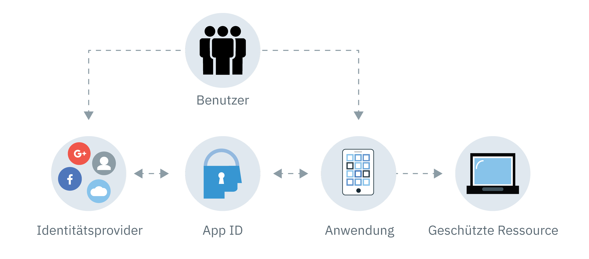

---

copyright:
  years: 2017, 2019
lastupdated: "2019-04-08"

keywords: authentication, authorization, identity, app security, secure, compliance, high availability

subcollection: appid

---

{:new_window: target="_blank"}
{:shortdesc: .shortdesc}
{:screen: .screen}
{:pre: .pre}
{:table: .aria-labeledby="caption"}
{:codeblock: .codeblock}
{:tip: .tip}
{:note: .note}
{:important: .important}
{:deprecated: .deprecated}
{:download: .download}

# Informationen zu {{site.data.keyword.appid_short_notm}}
{: #about}

Anwendungssicherheit kann unglaublich kompliziert sein. Für die meisten Entwickler stellt das Thema Sicherheit eine der größten Herausforderungen beim Erstellen einer App dar. Wie können Sie sicher sein, dass Sie die Daten Ihrer Benutzer erfolgreich schützen? Durch die Integration von {{site.data.keyword.appid_full}} in Ihre Apps können Sie selbst dann Ressourcen schützen und eine Authentifizierung hinzufügen, wenn Sie nicht viel Erfahrung mit Sicherheitsfunktionen haben.
{:shortdesc}

## Gründe für die Verwendung des Service
{: #about-reasons}

{{site.data.keyword.appid_short_notm}} erleichtert es Entwicklern, ohne großen Aufwand eine Authentifizierung zu Web-Apps und mobilen Apps mit nur wenigen Zeilen Code hinzuzufügen und ihre für die Cloud konzipierten Anwendungen und -Services mit {{site.data.keyword.cloud_notm}} zu schützen. Dadurch, dass Benutzer sich bei Ihrer App anmelden müssen, können Sie Benutzerdaten wie App-Benutzervorgaben oder Informationen aus öffentlichen Profilen von sozialen Medien speichern und diese Daten anschließend dazu nutzen, die einzelnen Benutzererfahrungen mit der App anzupassen. {{site.data.keyword.appid_short_notm}} beinhaltet ein Anmeldeframework. Sie können aber auch eigene, an Ihr Brand-Marketing angepasste Anmeldeanzeigen verwenden, die mit Cloud Directory verwendet werden sollen.
{: shortdesc}

Wie können Sie Cloud Directory einsetzen? Sehen Sie sich dieses Video an, um mehr über die verschiedenen Einsatzmöglichkeiten des Service zu erfahren. Lesen Sie anschließend die Informationen zu weiteren Szenarios in der folgenden Tabelle.

<iframe class="embed-responsive-item" id="youtubeplayer" title="Informationen zu App ID" type="text/html" width="640" height="390" src="//www.youtube.com/embed/XlrCjHdK43Q?rel=0" frameborder="0" webkitallowfullscreen mozallowfullscreen allowfullscreen> </iframe>

<table>
  <tr>
    <th>Szenario</th>
    <th>Lösung</th>
  </tr>
  <tr>
    <td>Sie müssen eine Funktion für die [Autorisierung und Authentifizierung](/docs/services/appid?topic=appid-key-concepts#key-concepts) zu Ihren mobilen Apps und Web-Apps hinzufügen, verfügen jedoch nicht über Hintergrundkenntnisse im Bereich der Sicherheit.</td>
    <td>Mit {{site.data.keyword.appid_short_notm}} können Sie ohne großen Aufwand einen Authentifizierungsschritt in Ihre Apps integrieren. Sie können eine Anmeldung über eine E-Mail-Adresse oder einen Benutzernamen, eine Anmeldung über soziale Medien oder eine Unternehmensanmeldung mithilfe von APIs, SDKs, vorgefertigten Benutzerschnittstellen oder eigenen, an Ihr Brand-Marketing angepassten Benutzerschnittstellen zu Ihren Apps hinzufügen.</td>
  </tr>
  <tr>
    <td>Sie möchten den Zugriff auf Ihre Apps und Back-End-Ressourcen begrenzen.</td>
    <td>Sie können Ihre Apps, Back-End-Ressourcen und APIs ohne großen Aufwand mit der auf Standards basierenden Authentifizierung schützen, die von {{site.data.keyword.appid_short_notm}} bereitgestellt wird.</td>
  </tr>
  <tr>
    <td>Sie möchten personalisierte App-Umgebungen für Ihre Benutzer erstellen.</td>
    <td>Mit {{site.data.keyword.appid_short_notm}} können Sie [Benutzerdaten speichern](/docs/services/appid?topic=appid-user-profile#user-profile), z. B. App-Benutzervorgaben oder Informationen aus den öffentlichen Social-Media-Profilen der Benutzer, und diese Daten anschließend zur Anpassung der verschiedenen Benutzererfahrungen in Ihrer App verwenden.</td>
  </tr>
  <tr>
    <td>Sie möchten Benutzer in einem skalierbaren Rahmen verwalten.</td>
    <td> Mit {{site.data.keyword.appid_short_notm}} können Sie ein [Cloud Directory-System](/docs/services/appid?topic=appid-cloud-directory#cloud-directory) erstellen und auf diese Weise Registrierungs- und Anmeldefunktionen für Benutzer zu Ihren Apps hinzuzufügen. Cloud Directory stellt das Framework zur Verwaltung einer Benutzerregistry bereit, die dem jeweiligen Benutzerstamm entsprechend skaliert werden kann. Mit der vordefinierten Self-Service-Funktionalität, z. B. für die E-Mail-Verifizierung und das Zurücksetzen von Kennwörtern, können Sie sich darauf verlassen, dass Ihre App eine sichere Benutzerauthentifizierung bietet.</td>
  </tr>
</table>

## Funktionsweise
{: #about-how-it-works}

Mit {{site.data.keyword.appid_short_notm}} können Sie eine zusätzliche Sicherheitsstufe in Ihren Apps implementieren, indem Sie es erforderlich machen, dass die Benutzer eine Anmeldung durchführen. Darüber hinaus können Sie auch das Server-SDK oder APIs verwenden, um Ihre Back-End-Ressourcen zu schützen.
{: shortdesc}

<dl>
  <dt>Anwendung</dt>
    <dd><strong>Server-SDK</strong>: Sie können die Back-End-Ressourcen, die in {{site.data.keyword.cloud_notm}} bereitgestellt werden, und die Web-Apps mit dem Server-SDK schützen. Das Server-SDK extrahiert das Zugriffstoken aus einer Anforderung und validiert es mit {{site.data.keyword.appid_short_notm}}.  
    <strong>Client-SDK</strong>: Sie können mobile Apps mit dem Android- oder iOS-Client-SDK schützen. Das Client-SDK kommuniziert mit den Cloud-Ressourcen, um den Authentifizierungsprozess zu starten, sobald es eine Autorisierungsanforderung (Challenge) feststellt.</dd>
  <dt>{{site.data.keyword.cloud_notm}}</dt>
    <dd><strong>{{site.data.keyword.appid_short_notm}}</strong>: Nach der erfolgreichen Authentifizierung gibt {{site.data.keyword.appid_short_notm}} Zugriffs- und Identitätstokens an die App zurück. 
    <strong>Cloud Directory</strong>: Benutzer können sich mit ihrer E-Mail-Adresse und einem Kennwort bei Ihrem Service registrieren. Sie können die Benutzer dann in einer Listenansicht über die Benutzerschnittstelle verwalten. Mit Cloud Directory fungiert {{site.data.keyword.appid_short_notm}} als Ihr Identitätsprovider.</dd>
  <dt>Extern (anderer Anbieter)</dt>
    <dd><strong>Social-Media- und Unternehmensidentitätsprovider</strong>: {{site.data.keyword.appid_short_notm}} unterstützt Facebook, Google+ und SAML 2.0 Federation als Identitätsprovideroptionen. Der Service veranlasst eine Weiterleitung an den Identitätsprovider und überprüft die zurückgegebenen Authentifizierungstoken. Wenn die Tokens gültig sind, gewährt der Service Zugriff auf Ihre App, ohne dass Zugriff auf die tatsächliche Kennphrase besteht.</dd>
</dl>

## Integrationen
{: #about-integrations}

Sie können {{site.data.keyword.appid_short_notm}} mit anderen {{site.data.keyword.cloud_notm}}-Angeboten nutzen.
{:shortdesc}

<dl>
  <dt>{{site.data.keyword.containerlong_notm}}</dt>
    <dd>Durch die Konfiguration von Ingress in einem Standardcluster können Sie Ihre Apps auf Clusterebene schützen. Einen Einstieg in dieses Thema vermitteln die Blogeinträge <a href="/docs/containers?topic=containers-ingress_annotation#appid-auth">{{site.data.keyword.appid_short_notm}} authentication Ingress annotation</a> und <a href="https://www.ibm.com/blogs/bluemix/2018/05/announcing-app-id-integration-ibm-cloud-kubernetes-service/">Announcing {{site.data.keyword.appid_short_notm}} integration to {{site.data.keyword.containerlong_notm}} </a>.</dd>
  <dt>{{site.data.keyword.openwhisk}} und API Connect</dt>
    <dd>Wenn Sie Ihre APIs mit [{{site.data.keyword.openwhisk_short}}](/docs/openwhisk?topic=cloud-functions-getting_started#getting_started) und [API Connect](/docs/services/apiconnect?topic=apiconnect-index#index) erstellen, können Sie Ihre Anwendungen auf dem Gateway anstatt in Ihrem App-Code sichern. Um die Integration in Aktion zu erleben, sehen Sie sich <a href="https://www.youtube.com/watch?v=Fa9YD2NGZiE" target="_blank">Einfache und schnelle Social-Media-OAauth-Registrierung mit APIC und {{site.data.keyword.appid_short_notm}} </a> an.</dd>
  <dt>Cloud Foundry</dt>
    <dd>Probieren Sie eine der bereitgestellten Cloud Foundry-Beispielapps aus, um zu sehen, wie Sie {{site.data.keyword.appid_short_notm}} in Ihre Apps integrieren können.</dd>
  <dt>{{site.data.keyword.cloudaccesstrailshort}}</dt>
    <dd>Sie können Verwaltungsaktivitäten in {{site.data.keyword.appid_short_notm}} wie z. B. Änderungen an der Dashboardkonfiguration mit dem [Service '{{site.data.keyword.cloudaccesstrailshort}}'](/docs/services/cloud-activity-tracker/reference?topic=cloud-activity-tracker-getting-started-with-cla#getting-started-with-cla) überwachen.</dd>
  <dt>Leitfaden für die Programmierung mit iOS</dt>
    <dd>Entwickeln Sie Apps für Apple? Ziehen Sie den [Leitfaden für die Programmierung mit iOS](/docs/swift/authenticate?topic=swift-getting_started_swift#getting_started_swift) zurate, um mehr über das Zusammenspiel Ihrer vorhandenen iOS-Apps mit {{site.data.keyword.cloud_notm}} zu erfahren, Neues auszuprobieren und diese Apps zu erweitern.</dd>
  <dt>Leitfaden für die Programmierung mit Node.js</dt>
    <dd>Entwickeln Sie Apps für Node.js? Ziehen Sie den [Leitfaden für die Programmierung mit Node.js](/docs/node?topic=nodejs-node-getting-started#node-getting-started) zurate, um mehr über das Zusammenspiel Ihrer vorhandenen Node.js-Apps mit {{site.data.keyword.cloud_notm}} zu erfahren, Neues auszuprobieren und diese Apps zu erweitern.</dd>
</dl>

## Einhaltung von Vorschriften und Standards
{: #about-compliance}

{{site.data.keyword.appid_short_notm}} hat mehrere Zertifizierungen, Prüfungen und Standards erfolgreich durchlaufen und umgesetzt.
{: shortdesc}

{{site.data.keyword.appid_short_notm}} basiert auf einer Reihe gängiger, dem Branchenstandard entsprechender Protokolle und Spezifikationen, die sowohl in unternehmens- als auch in verbraucherorientierten Anwendungen, dem OAuth 2.0-Autorisierungsframework und Open ID Connect häufig zum Einsatz kommen. OAuth 2.0 wird zum Anfordern und Überprüfen der Autorisierung für den Zugriff auf geschützte Ressourcen verwendet. Darüber hinaus fügt Open ID Connect Ihren Anwendungen eine Ebene für die Authentifizierung und den Identitätsschutz hinzu.

Eine vollständige Liste von [Zertifizierungen](https://www.ibm.com/software/reports/compatibility/clarity-reports/report/html/softwareReqsForProduct?deliverableId=BF31C8008D7C11E59F9AD7336D7D0FFB) finden Sie in Abschnitt 5.4 des Berichts zur Kompatibilität von Softwareprodukten für {{site.data.keyword.appid_short_notm}}. Zusätzlich zu den Zertifizierungen werden von {{site.data.keyword.appid_short_notm}} auch die folgenden Spezifikationen eingehalten: Oauth 2.0, OpenID Connect, JSON Web Token (JWT), JSON Web Signature (JWS), System for Cross-domain Identity Management (SCIM). 

## Regionale Hochverfügbarkeit
{: #ha-dr}

{{site.data.keyword.appid_short_notm}} ist ein hoch verfügbarer, regionaler Service, der in mehreren Zonen ausgeführt werden kann.
{: shortdesc}

In jeder unterstützten Mehrzonenregion verfügt jede Zone über einen eigenen {{site.data.keyword.containerlong_notm}}-Cluster mit mehreren Workerknoten. Auf jedem Workerknoten werden mehrere Instanzen der {{site.data.keyword.appid_short_notm}}-Komponenten ausgeführt. Jede Region verfügt über eine globale Lastausgleichsfunktion und eine Firewall für Webanwendungen, die alle Anforderungen verarbeiten, bevor sie im Cluster empfangen werden.

Die in {{site.data.keyword.appid_short_notm}} gespeicherten Daten werden verschlüsselt und in einem Datenbankcluster, der über die Verfügbarkeitszonen verteilt ist, dauerhaft gespeichert. Außerdem werden die Daten in einem separaten verschlüsselten Object Storage-System gesichert.

Da es sich bei {{site.data.keyword.appid_short_notm}} um einen regionalen Service handelt, stellt er keine automatisierten regionsübergreifenden Failoverfunktionen oder regionsübergreifenden Funktionen für die Wiederherstellung nach einem Stör-/Katastrophenfall bereit. Allerdings stellt {{site.data.keyword.appid_short_notm}} <a href="https://us-south.appid.cloud.ibm.com/swagger-ui/#/" target="_blank">zahlreiche APIs </a> bereit, die von Entwicklern zur manuellen Synchronisation ihrer Servicekonfiguration mit weiteren Instanzen von {{site.data.keyword.appid_short_notm}} verwendet werden können.
