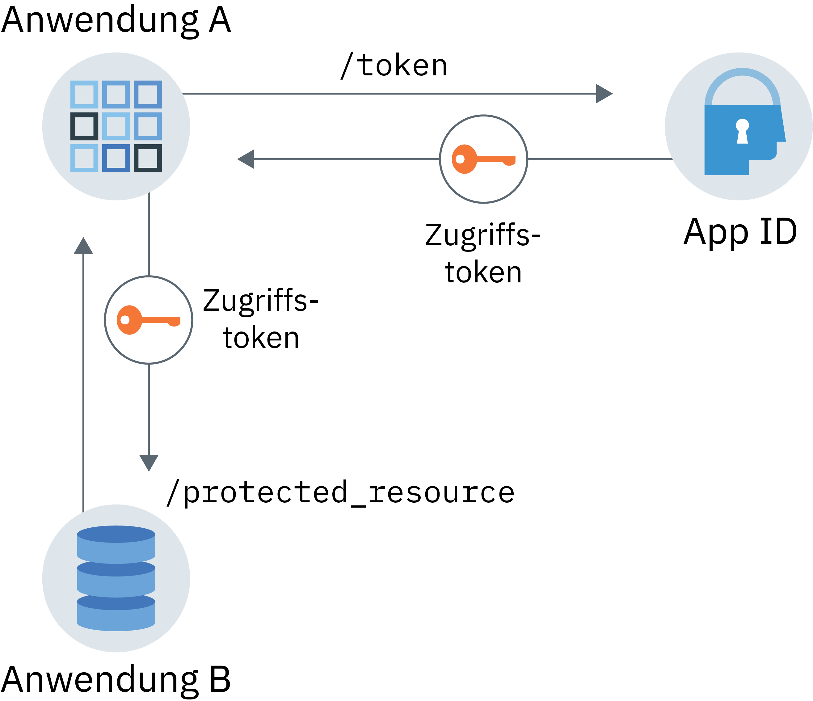

---

copyright:
  years: 2017, 2019
lastupdated: "2019-06-28"

keywords: Authentication, authorization, identity, app security, secure, application identity, app to app, access token

subcollection: appid

---

{:external: target="_blank" .external}
{:shortdesc: .shortdesc}
{:screen: .screen}
{:pre: .pre}
{:table: .aria-labeledby="caption"}
{:codeblock: .codeblock}
{:tip: .tip}
{:note: .note}
{:important: .important}
{:deprecated: .deprecated}
{:download: .download}

# Anwendungsidentität und Autorisierung
{: #app}

Bei {{site.data.keyword.appid_short_notm}} können Sie Anwendungen mithilfe der Anwendungsidentität und des Autorisierungsablaufs durch Einsatz der OAuth 2.0-Funktionalität schützen.
{: shortdesc}

## Informationen zum Kommunikationsablauf
{: #app-understanding}

Es kann aus mehreren Gründen sinnvoll sein, dass eine Anwendung ohne Benutzereingriff mit einem anderen Service oder einer anderen App kommunizieren kann. (Dies ist z. B. bei einer nicht interaktiven App der Fall, die auf eine andere Anwendung zugreifen muss, um ihre Funktion auszuführen). Dies kann Prozesse, CLIs, Dämonen oder ein IoT-Gerät umfassen, das Umgebungsvariablen auf einem Upstream-Server überwacht und meldet. Der jeweilige Anwendungsfall ist für jede Anwendung spezifisch. Zu beachten ist aber, dass die Anforderungen im Auftrag der App ausgetauscht werden, nicht im Auftrag eines Endbenutzers, und es ist die App, die authentifiziert und autorisiert wird.


### Wie funktioniert der Ablauf?
{: #app-flow-how}

{{site.data.keyword.appid_short_notm}} nutzt den Ablauf für OAuth 2.0-Clientberechtigungsnachweise, um die Kommunikation zu schützen. Wenn eine App bei {{site.data.keyword.appid_short_notm}} registriert wurde, ruft die App eine Client-ID und einen geheimen Schlüssel ab. Mit diesen Informationen kann die App ein Zugriffstoken von {{site.data.keyword.appid_short_notm}} anfordern und für den Zugriff auf eine geschützte Ressource oder API autorisiert werden. In dem Ablauf für Anwendungsidentität und Autorisierung wird der Anwendung nur ein Zugriffstoken erteilt. Sie erhält weder ein Identitätstoken noch ein Aktualisierungstoken. Weitere Informationen zu Tokens finden Sie unter [Informationen zu Token](/docs/services/appid?topic=appid-tokens).

Dieser Workflow soll nur bei vertrauenswürdigen Anwendungen verwendet werden, bei denen keine Gefahr besteht, dass der geheime Schlüssel missbraucht wird oder in falsche Hände gerät. Die Anwendung ist immer im Besitz des geheimen Clientschlüssels. Dies funktioniert nicht bei mobilen Apps.
{: tip}

### Wie sieht der Ablauf aus?
{: #app-flow-what}

In der folgenden Abbildung sehen Sie die Richtung der Kommunikation zwischen dem Service und Ihrer Anwendung.


Abbildung. Ablauf für Anwendungsidentität und Autorisierung

1. Sie registrieren die Anwendung, für die eine Authentifizierung erforderlich ist, um mit {{site.data.keyword.appid_short_notm}} auf eine geschützte Ressource zuzugreifen. 
2. Anwendung A registriert sich bei {{site.data.keyword.appid_short_notm}}, um eine Client-ID und einen geheimen Schlüssel zu erhalten.
3. Von Anwendung A wird durch Senden der im vorherigen Schritt abgerufenen Berechtigungsnachweise eine Anforderung an den Endpunkt `/token` des {{site.data.keyword.appid_short_notm}}-Autorisierungsservers gestellt.
4. {{site.data.keyword.appid_short_notm}} validiert die Anforderung, authentifiziert die App und gibt eine Antwort an Anwendung A zurück, die ein Zugriffstoken enthält.
5. Anwendung A kann jetzt das gültige Zugriffstoken verwenden, um Anforderungen an geschützte Ressourcen wie Anwendung B zu senden.

Der geheime Clientschlüssel, der zum Authentifizieren des Clients verwendet wird, enthält sehr sensible Daten und muss vertraulich behandelt werden. Da der geheime Clientschlüssel von der Anwendung in der App verwendet wird, darf dieser Workflow nur mit vertrauenswürdigen Anwendungen verwendet werden. Durch die Verwendung einer vertrauenswürdigen Anwendung wird sichergestellt, dass der geheime Clientschlüssel nicht missbraucht wird oder in falsche Hände gerät.
{: important}

## App registrieren
{: #app-register}

### Mit der GUI
{: #app-register-gui}

1. Klicken Sie auf der Registerkarte **Anwendung** im {{site.data.keyword.appid_short_notm}}-Dashboard auf **Anwendung hinzufügen**.
2. Fügen Sie Ihren Anwendungsnamen hinzu und klicken Sie auf **Speichern**, um zu einer Liste Ihrer registrierten Apps zurückzukehren. Der Name Ihrer Anwendung darf nicht mehr als 50 Zeichen lang sein.
3. Wählen Sie in der Liste der registrierten Apps die Anwendung aus, die Sie im vorherigen Schritt hinzugefügt haben. Die erweiterte Zeile zeigt Ihre Berechtigungsnachweise an.

### Mit der API
{: #app-register-api}

1. Erstellen Sie eine POST-Anforderung an den Endpunkt [`/management/v4/{tenantId}/applications`](https://us-south.appid.cloud.ibm.com/swagger-ui/#/Management%20API%20-%20Applications/mgmt.registerApplication){: external}.

  Anforderung:

  ```
  curl -X POST \  https://us-south.appid.cloud.ibm.com/management/v4/39a37f57-a227-4bfe-a044-93b6e6060b61/applications/ \
  -H 'Content-Type: application/json' \
  -H 'Authorization: Bearer IAM_TOKEN' \
  -d '{"name": "ApplicationName"}'
  ```
  {: codeblock}

  Beispielantwort:

  ```
  {
    "clientId": "c90830bf-11b0-4b44-bffe-9773f8703bad",
    "tenantId": "b42f7429-fc24-48fa-b4f9-616bcc31cfd5",
    "secret": "YWQyNjdkZjMtMGRhZC00ZWRkLThiOTQtN2E3ODEyZjhkOWQz",
    "name": "testing",
    "oAuthServerUrl": "https://us-south.appid.cloud.ibm.com/oauth/v4/b42f7429-fc24-48fa-b4f9-616bcb31cfd5",
    "profilesUrl": "https://us-south.appid.cloud.ibm.com",
    "discoveryEndpoint": "https://us-south.appid.cloud.ibm.com/oauth/v4/b42f7429-fc24-48fa-b4f9-616bcb31cfd5/.well-known/openid-configuration"
  }
  ```
  {: screen}

## Zugriffstoken abrufen
{: #obtain-token}

Nachdem Ihre App bei {{site.data.keyword.appid_short_notm}} registriert wurde und Sie Ihre Berechtigungsnachweise erhalten haben, können Sie eine Anforderung an den {{site.data.keyword.appid_short_notm}}-Autorisierungsserver stellen, um ein Zugriffstoken anzufordern.

1. Erstellen Sie eine HTTP-POST-Anforderung an den Endpunkt [`/token`](https://us-south.appid.cloud.ibm.com/swagger-ui/#/Authorization%20Server%20-%20Authorization%20Server%20V4/oauth-server.token){: external}. Die Autorisierung für die Anforderung ist `Basic auth`, wobei die Client-ID und der geheime Schlüssel als Benutzername und Kennwort verwendet werden, die Base64-codiert sind.

  Anforderung:
  ```
  curl -X POST \
    http://localhost:6002/oauth/v4/39a37f57-a227-4bfe-a044-93b6e6060b61/token \
    -H 'Authorization: Basic base64Encoded{clientId:secret}' \
    -H 'Content-Type: application/x-www-form-urlencoded' \
    -d grant_type=client_credentials
  ```
  {: codeblock}

  Beispielantwort:
  ```
  {
  "access_token": "eyJhbGciOiJS...F9A",
  "expires_in": "3600",
  "token_type": "Bearer"
  }
  ```
  {: codeblock}


## Lernprogramm: End-to-End-Ablauf mit dem Node.js-SDK
{: tutorial-node}

1. Verwenden Sie zum Abrufen eines [Zugriffstokens](/docs/services/appid?topic=appid-tokens) eines der folgenden Verfahren:

  * Über das {{site.data.keyword.appid_short_notm}} [Node.js-Server-SDK](https://github.com/ibm-cloud-security/appid-serversdk-nodejs){: external} mithilfe des Token-Managers. Initialisieren Sie den Token-Manager mit Ihren App-Berechtigungsnachweisen und rufen Sie die Methode `getApplicationIdentityToken()` auf, um das Token abzurufen.

    ```
    const TokenManager = require('ibmcloud-appid').TokenManager;
    const config = {
     clientId: "<client-ID>",
     tenantId: "<tenant-ID>",
     secret: "<secret>",
     oauthServerUrl: "https://<region>.appid.cloud.ibm.com/oauth/v4/<tenant-ID>"
    };

    const tokenManager = new TokenManager(config);

    tokenManager.getApplicationIdentityToken().then((appIdAuthContext) => {
     console.log(' Access tokens from SDK : ' + JSON.stringify(appIdAuthContext));
    }).catch((err) => {
     //console.error('Error retrieving tokens : ' + err);
    });
    ```
    {: codeblock}

  * Über den {{site.data.keyword.appid_short_notm}}-Autorisierungsserver.
  
    Die `oauthServerUrl` in der Anforderung wird bei der Registrierung Ihrer Anwendung abgerufen. Wenn Sie Ihre App mit den Management-APIs registriert haben, befindet sich die Server-URL im Antwortteil. Wenn Sie Ihre App durch Binden an die IBM Cloud-Konsole registriert haben, kann die URL in Ihrem JSON-Objekt VCAP_SERVICES enthalten sein oder über Ihre geheimen Kubernetes-Schlüssel gefunden werden.
    {: note}

    ```
    var request = require('request');

    function getAccessToken() {
      let options = {
          method: 'POST',
          url: oauthServerUrl + '/token',
          headers: { 'content-type': 'application/x-www-form-urlencoded',
              'Authorization': 'Basic ' +Buffer.from('clientId: secret').toString('base64')
          },
          form: {
              grant_type: 'client_credentials'
          }
      };

      return new Promise((resolve, reject) => {
          request(options, function (error, response, body) {
              if (error) {
                  return reject(error);
              }

              let data = JSON.parse(body);
              if(data.access_token) {
                  resolve(data.access_token);
              } else {
                  reject(data);
              }
          })
      });
    }
    ```
    {: codeblock}

2. Stellen Sie eine Anforderung an Ihre geschützte Ressource, indem Sie das Zugriffstoken verwenden, das Sie im vorherigen Schritt angefordert haben.

  ```
  let options = {
      method: 'GET',
      url: 'http://localhost:8081/protected_resource',
      headers: { authorization : 'Bearer ' + accessToken}
  }

  request(options, function (error, response, body) {
      if (error) {
       console.log(error)
      } else {
          res.status(response.statusCode).send({
      console.log(JSON.stringify(body));
          });
      }
  });
  ```
  {: codeblock}

3. Sichern Sie Ihre geschützten Ressourcen ab, indem Sie die API-Strategie aus dem {{site.data.keyword.appid_short_notm}}-Node.js-SDK verwenden.

  ```
  const express = require('express'),
    passport = require('passport');
    APIStrategy = require("ibmcloud-appid").APIStrategy;

  var app = express();
  app.use(passport.initialize());

  passport.use(new APIStrategy({
      oauthServerUrl: "https://<region>.appid.cloud.ibm.com/oauth/v4/<tenant-ID>",
      tenantId:"<tenant-ID>"
  }));

  app.get('/protected_resource',
      passport.authenticate(APIStrategy.STRATEGY_NAME, {session: false}),
      (req, res) => {
          res.send("Hello from protected resource");
  });
  ```
  {: codeblock}
