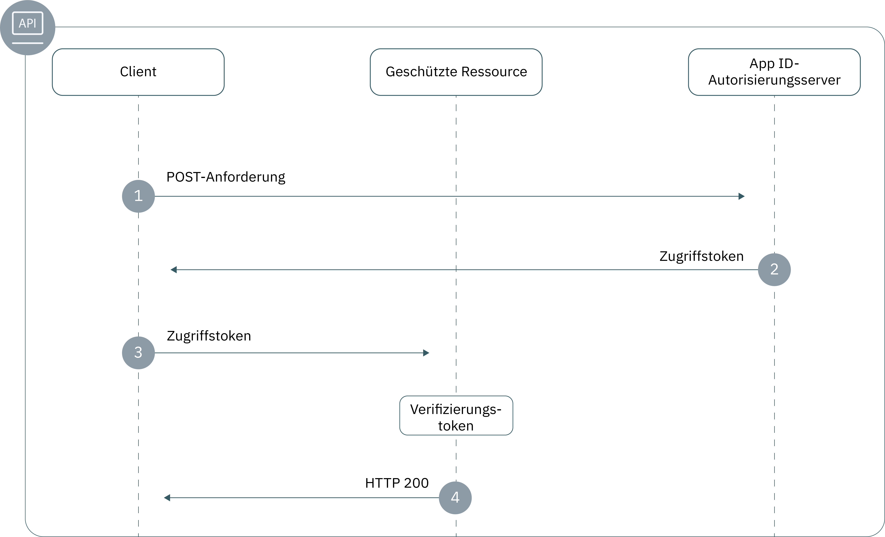

---

copyright:
  years: 2017, 2019
lastupdated: "2019-05-09"

keywords: authentication, authorization, identity, app security, secure, backend, back-end, oauth, 

subcollection: appid

---

{:new_window: target="_blank"}
{:shortdesc: .shortdesc}
{:screen: .screen}
{:pre: .pre}
{:table: .aria-labeledby="caption"}
{:codeblock: .codeblock}
{:tip: .tip}
{:note: .note}
{:important: .important}
{:deprecated: .deprecated}
{:download: .download}
{:java: .ph data-hd-programlang='java'}
{:javascript: .ph data-hd-programlang='javascript'}
{:swift: .ph data-hd-programlang='swift'}
{:curl: .ph data-hd-programlang='curl'}

# Back-End-Apps
{: #backend}

Sie können die {{site.data.keyword.appid_full}}-SDKs und -APIs zum Schutz der Endpunkte Ihrer Back-End-Anwendungen und -APIs benutzen.
{: shortdesc}


## Informationen zum Ablauf
{: #backend-understanding}

Ein Bestandteil der Entwicklung von Back-End-Apps besteht darin zu überprüfen, ob Ihre APIs vor unbefugtem Zugriff geschützt sind. Die {{site.data.keyword.appid_short_notm}}-SDKs vereinfachen den Schutz Ihrer API-Endpunkte und sorgen für die Sicherheit Ihrer App.


### Was ist die technische Basis des Ablaufs?
{: #backend-technical-flow}

{{site.data.keyword.appid_short_notm}} implementiert die [OAuth 2.0](https://tools.ietf.org/html/rfc6749)- und die OIDC-Spezifikation, die Trägertokens für Authentifizierung und Autorisierung verwendet. Diese Tokens werden als [JSON Web Token (JWT)](https://tools.ietf.org/html/rfc7519) formatiert, die digital signiert sind und Anforderungen (sog. Claims) enthalten, die das zu authentifizierende Subjekt und den Identitätsprovider beschreiben. Die APIs Ihrer Anwendung werden durch Zugriffs- und Identitätstokens geschützt. Clients, die Zugriff auf Ihre APIs benötigen, können sich mit dem Identitätsprovider über {{site.data.keyword.appid_short_notm}} im Austausch für diese Tokens authentifizieren. Die Claims in den Tokens müssen validiert worden sein, um den Zugriff auf die geschützten APIs zu gewähren.

Weitere Informationen dazu, wie Tokens in {{site.data.keyword.appid_short_notm}} verwendet werden, finden Sie unter [Informationen zu Token](/docs/services/appid?topic=appid-tokens#tokens).
{: tip}


### Wie sieht dieser Ablauf aus?
{: #backend-flow}



1. Ein Client stellt eine POST-Anforderung an den {{site.data.keyword.appid_short_notm}}-Autorisierungsserver, um ein Zugriffstoken zu erhalten. Eine POST-Anforderung hat in der Regel das folgende Format:

  ```
  POST/oauth/v4/{tenantId}/token HTTP/1.1
  Content_type: application/x-www-form-urlencoded
  Authorization header = "Basic" + base64encode({clientId}:{secret})
  FormData = {grant_type}
  ```
  {: screen}

2. Wenn der Client entsprechend qualifiziert ist, gibt der Autorisierungsserver ein Zugriffstoken zurück.

3. Der Client sendet eine Anforderung an die geschützte Ressource. Anforderungen können auf unterschiedliche Weise gesendet werden. Die Vorgehensweise ist davon abhängig, welche HTTP-Clientbibliothek Sie verwenden. Das Format einer Anforderung ist allerdings immer wie folgt:

  ```
  curl -H 'Authorization: Bearer {access_token}' {https://my-protected-resource.com}
  ```
  {: screen}

4. Die geschützte Ressource oder API validiert das Token. Wenn das Token gültig ist, wird dem Client der Zugriff auf die Ressource gewährt. Wenn das Token nicht validiert werden kann, wird der Zugriff verweigert.


## Ressourcen mit einem SDK schützen
{: #backend-secure}

Sie können die {{site.data.keyword.appid_short_notm}}-SDKs verwenden, um die Authentifizierung und Autorisierung für Ihre serverseitigen Anwendungen zu erzwingen. Mit `ApiStrategy` können Sie Ihre Back-End-Ressourcen absichern. Dazu wird die Validierung der Zugriffs- und Identitätstokens im Rahmen der Anforderung zwingend durchgeführt.
{: shortdesc}

Das Node.js-SDK von {{site.data.keyword.appid_short_notm}} arbeitet zusammen mit dem [Passport-Framework](http://www.passportjs.org/).
{: ph data-hd-programlang='javascript'}

Das serverseitige Swift-SDK von {{site.data.keyword.appid_short_notm}} stellt ein Plug-in für eine Middleware zum API-Schutz zur Verfügung, das zum Schutz der Back-End-Apps verwendet wird. Durch die Zuordnung Ihrer APIs zur Middleware können Sie Ihre App vor unbefugtem Zugriff schützen. Nachdem die API geschützt ist, stellt die Middleware sicher, dass die Token, die von {{site.data.keyword.appid_short_notm}} generiert wurden, validiert werden. Sie können dann das Verhalten der API abhängig von den Validierungsergebnissen ändern.
{: ph data-hd-programlang='swift'}

Das folgende Code-Snippet ist ein Beispiel für den Schutz der `/protectedendpoint`-API.
{: ph data-hd-programlang='swift'}

```Swift
import Foundation
import Kitura              // Server
import Credentials         // Middleware
import IBMCloudAppID       // SDK

// Routen einrichten
let router = Router()

// Obligatorische Option, die übergeben wird, wenn die App nicht in IBM Cloud bereitgestellt wird.
let options = [
    "oauthServerUrl": "https://us-south.appid.cloud.ibm.com/oauth/v4/d8438de6-c325-4956-ad34-abd49194affd",
]
let apiCreds = Credentials()

// Mindestens erforderliche Mac OS-Version
if #available(OSX 10.12, *) {

    // API-Schutz einrichten
    let apiKituraCredentialsPlugin = APIKituraCredentialsPlugin(options: options)
    apiCreds.register(plugin: apiKituraCredentialsPlugin)

    // Route zu API-Schutz zuordnen.
    router.all(middleware: apiCreds)

    // Geschützte API erstellen.
    router.get("/protectedendpoint") { request, response, next in

        response.headers["Content-Type"] = "text/html; charset=utf-8"
        do {
            if let userProfile = request.userProfile  {
                try response.status(.OK).send(
                    "<!DOCTYPE html><html><body>" +
                        "Welcome " + userProfile.displayName  +
                        "! You are logged in with " + userProfile.provider + "." +
                    "</body></html>\n\n").end()
                next()
                return
            }
            try response.status(.unauthorized).send(
                "<!DOCTYPE html><html><body>” + “You are not authorized!" +
                "</body></html>\n\n").end()
        }
        catch {}
        next()
    }

    // Server starten
    Kitura.addHTTPServer(onPort: 8090, with: router)

    Kitura.run()  
}
```
{: codeblock}
{: ph data-hd-programlang='swift'}

Sehen Sie sich das folgende Video an, um Informationen zum Schutz von Back-End-Knotenanwendungen mit {{site.data.keyword.appid_short_notm}} zu erhalten. Versuchen Sie es anschließend mithilfe einer [einfachen Beispielanwendung für Knoten](https://github.com/ibm-cloud-security/appid-video-tutorials/tree/master/02b-simple-node-backend-app).
{: ph data-hd-programlang='javascript'}

<iframe class="embed-responsive-item" id="appid-backend-nodejs" title="Informationen zu {{site.data.keyword.appid_short_notm}}" type="text/html" width="640" height="390" src="//www.youtube.com/embed/jJLSgkHpZwA?rel=0" frameborder="0" webkitallowfullscreen mozallowfullscreen allowfullscreen></iframe>
{: ph data-hd-programlang='javascript'}


Sehen Sie sich das folgende Video an, um Informationen zum Schutz von Back-End-Liberty for Java-Anwendungen mit {{site.data.keyword.appid_short_notm}} zu erhalten. Versuchen Sie es anschließend mithilfe einer [einfachen Beispielanwendung für Liberty for Java](https://github.com/ibm-cloud-security/appid-video-tutorials/tree/master/02d-simple-liberty-backend-app).
{: ph data-hd-programlang='java'}

<iframe class="embed-responsive-item" id="appid-backend-liberty" title="Informationen zu {{site.data.keyword.appid_short_notm}}" type="text/html" width="640" height="390" src="//www.youtube.com/embed/QA6DY2qqLaw?rel=0" frameborder="0" webkitallowfullscreen mozallowfullscreen allowfullscreen></iframe>
{: ph data-hd-programlang='java'}


### Vorbereitungen
{: #backend-secure-before}
{: ph data-hd-programlang='javascript'}

Bevor Sie beginnen, müssen die folgenden vorausgesetzten Komponenten vorhanden sein:
{: ph data-hd-programlang='javascript'}
  * Eine Instanz von {{site.data.keyword.appid_short_notm}}
  * NPM Version 4 oder höher
  * Node Version 6 oder höher
  {: ph data-hd-programlang='javascript'}

### SDK installieren
{: #backend-secure-install}
{: ph data-hd-programlang='javascript'}

1. Fügen Sie das {{site.data.keyword.appid_short_notm}}-Node.js-SDK zur Datei `package.json` Ihrer App hinzu.
{: ph data-hd-programlang='javascript'}
  ```
  "dependencies": {
      "ibmcloud-appid": "^6.0.0"
  }
  ```
  {: codeblock}
  {: ph data-hd-programlang='javascript'}

2. Führen Sie den folgenden Befehl aus.
{: ph data-hd-programlang='javascript'}

  ```
  npm install
  ```
  {: codeblock}
  {: ph data-hd-programlang='javascript'}

### SDK initialisieren
{: #backend-secure-initialize}
{: ph data-hd-programlang='javascript'}

1. Rufen Sie Ihre `oauth server url` ab.
  1. Navigieren Sie zur Registerkarte **Serviceberechtigungsnachweise** des {{site.data.keyword.appid_short_notm}}-Dashboards.
  2. Wenn Sie noch nicht über die erforderlichen Berechtigungsnachweise verfügen, klicken Sie auf **Neuer Berechtigungsnachweis** und anschließend auf **Hinzufügen**, um neue Berechtigungsnachweise zu erstellen. Wenn Sie dies tun, überspringen Sie diesen Schritt.
  3. Klicken Sie auf die Option **Berechtigungsnachweise anzeigen**, um Ihre Informationen anzuzeigen.
  4. Kopieren Sie die `oauth server url`, um sie im nächsten Schritt zu verwenden.
  {: ph data-hd-programlang='javascript'}

2. Initialisieren Sie die {{site.data.keyword.appid_short_notm}}-Passport-Strategie, wie dies aus dem folgenden Beispiel hervorgeht.
{: ph data-hd-programlang='javascript'}
  ```javascript
  var express = require('express'); 
  var passport = require('passport');
  var APIStrategy = require('ibmcloud-appid').APIStrategy; 
  passport.use(new APIStrategy({ oauthServerUrl: "{oauth-server-url}" })); 
  var app = express();
  app.use(passport.initialize());
  ```
  {: codeblock}
  {: ph data-hd-programlang='javascript'}


Wenn Ihre Node.js-App unter {{site.data.keyword.cloud_notm}} ausgeführt wird und an Ihre Instanz von {{site.data.keyword.appid_short_notm}} gebunden ist, muss die API-Strategiekonfiguration nicht bereitgestellt werden. Die {{site.data.keyword.appid_short_notm}}-Konfiguration ruft die Informationen unter Verwendung der Umgebungsvariablen VCAP_SERVICES ab.
{: tip}
{: ph data-hd-programlang='javascript'}


### API schützen
{: #backend-secure-api-strategy}
{: ph data-hd-programlang='javascript'}

Das folgende Snippet veranschaulicht, wie Sie `ApiStrategy` in einer Express-App verwenden, um die `/protected`-GET-API zu schützen.
{: ph data-hd-programlang='javascript'}

  ```javascript
   app.get('/protected', passport.authenticate('APIStrategy.STRATEGY_NAME', { session: false }), function(request, response){
      console.log("Security context", request.appIdAuthorizationContext);
      response.send(200, "Success!");
      }
   );
   ```
  {: codeblock}
  {: ph data-hd-programlang='javascript'}

Wenn die Tokens gültig sind, wird die nächste Middleware in der Anforderungskette aufgerufen und die Eigenschaft `appIdAuthorizationContext` wird dem Anforderungsobjekt hinzugefügt. Die Eigenschaft enthält die ursprünglichen Zugriffs- und Identitätstokens sowie die entschlüsselten Nutzdateninformationen der Tokens.
{: ph data-hd-programlang='javascript'}


## Ressourcen manuell schützen
{: #backend-secure-api}

Um Ihre Back-End-Apps und geschützten Ressourcen zu sichern, müssen Sie ein Token überprüfen. Wenn ein Client eine Anforderung an Ihre Ressource sendet, können Sie prüfen, ob das Token die definierten Spezifikationen erfüllt. Das Token kann Identifikationsinformationen, den Geltungsbereich oder andere Konfigurationsdaten enthalten, die Sie definiert haben. Sie können {{site.data.keyword.appid_short_notm}}-Zugriffs- und Identitätstokens auf verschiedene Arten prüfen. Weitere Informationen zu diesem Thema finden Sie in [Tokens validieren](/docs/services/appid?topic=appid-token-validation#token-validation).


## Nächste Schritte
{: #backend-next}

Wenn {{site.data.keyword.appid_short_notm}} in Ihrer Anwendung installiert ist, sind Sie fast bereit, Benutzer zu authentifizieren. Versuchen Sie als Nächstes, eine der folgenden Aktivitäten auszuführen:

* Konfigurieren Ihrer [Identitätsprovider](/docs/services/appid?topic=appid-social)
* Anpassen und Konfigurieren [des Anmeldewidgets](/docs/services/appid?topic=appid-login-widget)
* Abrufen weiterer Informationen zum <a href="https://github.com/ibm-cloud-security/appid-serversdk-nodejs" target="_blank">Node.js-SDK</a>
* Abrufen weiterer Informationen zum <a href="https://github.com/ibm-cloud-security/appid-serversdk-swift" target="_blank">Swift-SDK</a>
