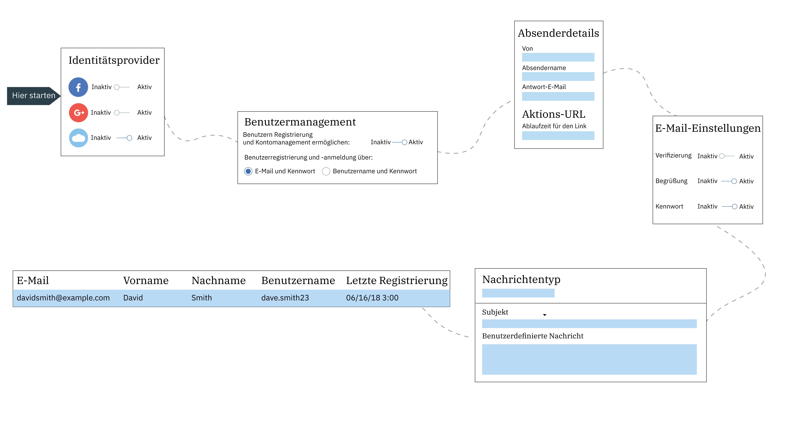

---

copyright:
  years: 2017, 2019
lastupdated: "2019-04-04"

keywords: authentication, authorization, identity, app security, secure, directory, registry, passwords, languages, lockout

subcollection: appid

---

{:new_window: target="_blank"}
{:shortdesc: .shortdesc}
{:screen: .screen}
{:pre: .pre}
{:table: .aria-labeledby="caption"}
{:codeblock: .codeblock}
{:tip: .tip}
{:note: .note}
{:important: .important}
{:deprecated: .deprecated}
{:download: .download}

# Cloud Directory konfigurieren
{: #cloud-directory}

Mit {{site.data.keyword.appid_full}} können sich die Benutzer über eine E-Mail-Adresse bzw. einen Benutzernamen und ein Kennwort bei Ihren mobilen Apps und Web-Apps registrieren und anmelden. Ein Cloudverzeichnis (Cloud Directory) ist eine Benutzerregistry, die in der Cloud verwaltet wird. Wenn sich ein Benutzer für Ihre App anmeldet, wird er zu Ihrem Benutzerverzeichnis hinzugefügt. Dieses Feature ermöglicht es Benutzern, ihr eigenes Konto innerhalb Ihrer App zu verwalten.
{: shortdesc}

## Verzeichniseinstellungen verwalten
{: #cd-settings}

Sie können die Benachrichtigungen und den Grad der Benutzersteuerung für Ihre App konfigurieren. Die Einrichtung von Cloud Directory nimmt nicht viel Zeit in Anspruch, wie in der folgenden Abbildung veranschaulicht wird. Diese Einstellungen können zu jedem beliebigen Zeitpunkt über das Service-Dashboard aktualisiert werden. Sie werden in Ihrer App nachvollzogen, ohne dass dazu eine Codeänderung vorgenommen werden muss.
{: shortdesc}

Abbildung. Konfigurationsabfolge für Cloud Directory

1. Navigieren Sie zur Registerkarte **Authentifizierungen verwalten** des {{site.data.keyword.appid_short_notm}}-Dashboards und vergewissern Sie sich, dass Cloud Directory auf **Ein** gesetzt ist.

2. Legen Sie auf der Registerkarte **Cloud Directory > Einstellungen** für **Benutzern die Registrierung und Anmeldung erlauben** entweder **E-Mail und Kennwort** oder **Benutzername und Kennwort** fest. Benutzer können sich mit einer E-Mail-Adresse anmelden, über die sie bereits verfügen, oder sie können einen Benutzernamen erstellen, der für die Interaktion mit Ihrer App verwendet wird.

  Sie können zwischen den Optionen wechseln, bevor Benutzer zu Ihrem Verzeichnis hinzugefügt werden. Nachdem der erste Benutzer hinzugefügt wurde, muss die gewählte Konfiguration auch für zukünftige Benutzer verwendet werden.
  {: note}

2. Entscheiden Sie, ob Ihre Benutzer einen Benutzernamen erstellen oder ihre E-Mail verwenden sollen, wenn sie sich anmelden. Beide Optionen erfordern ein Kennwort. Nachdem die Benutzer Ihrem Verzeichnis hinzugefügt wurden, können Sie nicht mehr zwischen den Optionen umschalten.

3. Klicken Sie in der Zeile mit den Kennwortkriterien auf **Bearbeiten**, um alle Anforderungen anzugeben, die Sie definieren wollen. Die Kennwortkriterien werden als regulärer Ausdruck angegeben. Informationen zum Bestimmen der Kennwortsicherheit oder allgemeine Beispiele finden Sie unter [Kennwortsicherheit verwalten](/docs/services/appid?topic=appid-cd-strength#cd-strength). Klicken Sie auf **Speichern**, um Ihre Anforderungen zu aktivieren.

4. Stellen Sie die Option **Benutzern die Registrierung bei Ihrer App ermöglichen** auf **Ja** ein. Sie können Benutzer auch dann über die Konsole hinzufügen, wenn die Option auf **Nein** eingestellt ist. Allerdings werden Benutzer meist nur zu Entwicklungszwecken über die Konsole hinzugefügt.

5. Stellen Sie die Option **Benutzern das Kontomanagement innerhalb Ihrer App ermöglichen** auf **Ja** ein, wenn Ihre Benutzer in der Lage sein sollen, ihr Kennwort zurückzusetzen, ihr Kennwort zu ändern oder ihre Details zurückzusetzen. Wenn Sie die Self-Service-Funktionen Ihrer Benutzer begrenzen wollen, setzen Sie den Wert auf **Nein**.

6. Konfigurieren Sie Ihre E-Mail-Einstellungen. Klicken Sie in der Zeile **Absenderdetails** auf **Bearbeiten**, um Ihre E-Mail-Einstellungen zu aktualisieren. Die E-Mail-Einstellungen gelten für die gesamte Kommunikation, die über {{site.data.keyword.appid_short_notm}} gesendet wird.

    1. Geben Sie die E-Mail-Adresse an, von der die E-Mail gesendet werden soll. Wenn Sie die Standardeinstellung ändern, wird die E-Mail möglicherweise an den Spamordner eines Benutzers gesendet.

    2. Fügen Sie einen Namen für den Absender hinzu.

    3. Geben Sie eine E-Mail-Adresse ein, die zum Senden einer Antwort verwendet werden kann.

    4. Klicken Sie auf **Speichern**.
