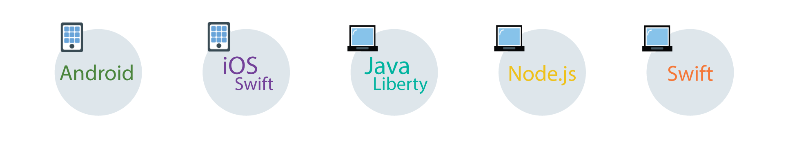

---

copyright:
  years: 2017, 2018
lastupdated: "2018-4-24"

---

{:new_window: target="_blank"}
{:shortdesc: .shortdesc}
{:screen: .screen}
{:codeblock: .codeblock}
{:pre: .pre}
{:tip: .tip}

# Cloud Directory verwalten
{: #cd}

Benutzer können sich über eine E-Mail-Adresse und ein Kennwort bei Ihren mobilen Apps und Web-Apps registrieren. Ein Cloudverzeichnis (Cloud Directory) ist eine Benutzerregistry, die in der Cloud verwaltet wird. Wenn sich ein Benutzer mit einer E-Mail-Adresse und einem Kennwort bei Ihrer App anmeldet, wird er zu Ihrem Benutzerverzeichnis hinzugefügt. Dieses Feature ermöglicht es Benutzern, ihr eigenes Konto innerhalb Ihrer App zu verwalten.
{: shortdesc}

 

## Verzeichniseinstellungen verwalten
{: #cd-settings}

Sie können die Benachrichtigungen und den Grad der Benutzersteuerung für Ihre App konfigurieren. Die Einrichtung des Cloudverzeichnisses nimmt nicht viel Zeit in Anspruch, wie in der folgenden Abbildung veranschaulicht wird. Diese Einstellungen können zu jedem beliebigen Zeitpunkt über das Dashboard aktualisiert werden.
{: shortdesc}

1. Stellen Sie sicher, dass Cloud Directory als Identitätsprovider aktiviert ist und legen Sie für **Benutzern die Registrierung und das Zurücksetzen ihres Kennworts ermöglichen** den Wert **Aktiv** fest. Wenn für die Option der Wert **Inaktiv** festgelegt ist, können Sie dennoch Benutzer über die Konsole hinzufügen, jedoch nur zu Entwicklungszwecken.
2. Konfigurieren Sie die Absenderdetails. Geben Sie die E-Mail-Adresse, die als Absender Ihrer Nachrichten angezeigt werden soll, den Absender und die Adresse, an die Benutzer ihre Antworten senden können, an.
  Stellen Sie beim Konfigurieren der Aktions-URL sicher, dass der festgelegte Zeitraum für das Klicken auf den Link ausreicht. Ein Benutzer muss seine E-Mail-Adresse verifizieren, damit ihm bestimmte Optionen zur Verfügung stehen, wie z. B. die Möglichkeit, das Zurücksetzen des Kennworts anzufordern.
  {: tip}
3. Bestimmen Sie die E-Mail-Typen, die ein Benutzer erhält, sowie die Absenderinformationen.
4. Passen Sie mithilfe der bereitgestellten Vorlagen Ihre Nachrichten mit Marken oder personalisiertem Text an. Weitere Informationen finden Sie in [Nachrichten verwalten](/docs/services/appid/cloud-directory.html#cd-messages).
5. Die Benutzer, die bei Ihrer App angemeldet sind, sind auf der Registerkarte **Benutzer** der GUI aufgeführt.

 

## Nachrichten verwalten
{: #cd-messages}

Eine Vorlage ist ein Beispiel einer E-Mail-Nachricht, die Sie an Ihre Benutzer senden können. Sie können die Vorlage anpassen, indem Sie den Inhalt und das Layout der Nachricht aktualisieren. Sie können für diese Nachrichten die Einstellung **Aktiv** oder **Inaktiv** auf der Registerkarte mit den Verzeichniseinstellungen festlegen.
{: shortdesc}

1. Wählen Sie einen **Nachrichtentyp** aus.
2. Passen Sie die Nachricht an, indem Sie den Inhalt und das Design der Nachricht ändern. Sie können Parameter verwenden, um die Nachrichten zu personalisieren. Denken Sie daran, die Änderungen zu speichern!

### Nachrichtentypen

Sie können mehrere Typen von Nachrichten an Ihre Benutzer senden. Sie können die in der Benutzerschnittstelle programmierte Beispielnachricht senden oder den Inhalt anpassen, um die App-Schnittstelle persönlicher zu gestalten.

<dl>
  <dt>Begrüßung</dt>
    <dd>
Sie können Benutzer per E-Mail bei Ihrer Anwendung begrüßen, nachdem diese eine Registrierung durchgeführt haben. Gestalten Sie die Nachrichten so attraktiv wie möglich, um die Benutzer zu begrüßen und zu binden.

    <table>
      <thead>
        <th colspan=2> Alle Nachrichtenparameter </th>
      </thead>
      <tbody>
        <tr>
          <td> %{display.logo} </td>
          <td> Zeigt das Bild an, das Sie für das Anmeldewidget konfiguriert haben. </td>
        </tr>
        <tr>
          <td> %{user.displayName} </td>
          <td> Zeigt den Anzeigenamen an, den ein Benutzer für die Interaktion mit der App ausgewählt hat.</td>
        </tr>
        <tr>
          <td> %{user.email} </td>
          <td> Zeigt die registrierte E-Mail-Adresse des Benutzers an. </td>
        </tr>
        <tr>
          <td> %{user.firstName} </td>
          <td> Zeigt den angegebenen Vornamen des Benutzers an. </td>
        </tr>
        <tr>
          <td> %{user.formattedName} </td>
          <td> Zeigt den vollständigen Namen des Benutzers an. </td>
        </tr>
        <tr>
          <td> %{user.lastName} </td>
          <td> Zeigt den angegebenen Nachnamen des Benutzers an. </td>
        </tr>
      </tbody>
    </table>
    
**Hinweis**: Wenn ein Benutzer die vom Parameter abgefragte Information nicht angibt, wird im entsprechenden Feld kein Wert angezeigt.
</dd>
  <dt>Kennwort vergessen</dt>
    <dd>
Wenn ein Benutzer das Kennwort vergisst oder es aus einem anderen Grund aktualisieren möchte, kann er ein Zurücksetzen des Kennworts anfordern. Sie können die E-Mail-Antwort auf diese Anforderung anpassen. Wenn ein Benutzer eine Änderung anfordert, wird das Kennwort erst geändert, wenn er auf den Link in dieser E-Mail klickt.

    <table>
      <thead>
        <th colspan=2> Parameter für Nachrichten zur Kennwortänderung </th>
      </thead>
      <tbody>
        <tr>
          <td> %{linkExpiration.hours} </td>
          <td> Zeigt die Anzahl der Stunden an, die der Link gültig ist. </td>
        </tr>
        <tr>
          <td> %{linkExpiration.minutes} </td>
          <td> Zeigt die Anzahl der Minuten an, die der Link gültig ist. </td>
        </tr>
        <tr>
          <td> %{resetPassword.code} </td>
          <td> Zeigt einen einmaligen Kenncode als Teil der URL an. Das bedeutet, dass jeder Person ein anderer Code zugeordnet ist. Beispiel: <code>https://appid-wfm.bluemix.net/verify/6574839563478</code>. </td>
        </tr>
        <tr>
          <td> %{resetPassword.link} </td>
          <td> Zeigt den Link an, auf den ein Benutzer klicken muss, um sein Kennwort zu ändern. </td>
        </tr>
       </tbody>
    </table>
    </dd>
  <dt>Verifizierung</dt>
    <dd>
Sie können festlegen, dass ein Benutzer sein Konto per E-Mail verifizieren muss. Indem Sie eine Verifizierung anfordern, begrenzen Sie die Anzahl der gefälschten Konten, die sich bei Ihrer App registrieren können. Sie können den Zugriff auf Ihre App einschränken, bis ein Benutzer seine E-Mail-Adresse verifiziert hat, oder Sie können auf diese Weise die Erstellung von Profilen für bestimmte Benutzer verwalten.

    <table>
      <thead>
        <th colspan=2> Parameter für Verifizierungsnachrichten </th>
      </thead>
      <tbody>
        <tr>
          <td> %{linkExpiration.hours} </td>
          <td> Zeigt die Anzahl der Stunden an, die der Link gültig ist. </td>
        </tr>
        <tr>
          <td> %{linkExpiration.minutes} </td>
          <td> Zeigt die Anzahl der Minuten an, die der Link gültig ist. </td>
        </tr>
        <tr>
          <td> %{verify.code} </td>
          <td> Zeigt eine einmalige Verifizierungs-URL an. </td>
        </tr>
        <tr>
          <td> %{verify.link} </td>
          <td> Zeigt die Aktions-URL an, die Sie in den Einstellungen angegeben haben. </td>
        </tr>
      </tbody>
    </table>
    </dd>
  <dt>Kennwortänderung</dt>
    <dd>
Sie können einen Benutzer über die Kennwortaktualisierung benachrichtigen. Dies ist nützlich, wenn die Anforderung zur Kennwortänderung nicht vom Benutzer ausging. So können die Benutzer die erforderlichen Schritte unternehmen, um ihr Konto erneut zu schützen.

    <table>
      <thead>
        <th colspan=2> Parameter für Nachrichten zur Kennwortänderung </th>
      </thead>
      <tbody>
        <tr>
          <td> %{passwordChangeInfo.time} </td>
          <td> Zeigt den Zeitpunkt an, an dem ein neues Kennwort gültig wurde. </td>
        </tr>
        <tr>
          <td> %{passwordChangeInfo.ipAddress} </td>
          <td> Zeigt die IP-Adresse an, von der aus die Kennwortänderung angefordert wurde. </td>
        </tr>
      </tbody>
    </table>
    </dd>
</dl>
 
**Hinweis**: {{site.data.keyword.appid_short_notm}} verwendet <a href="https://www.sendgrid.com" target="_blank">SendGrid </a> als Mailzustellungsservice. Alle E-Mails werden über ein einzelnes SendGrid-Konto gesendet. 

 
## Nächste Schritte
Nach der Konfiguration des Cloudverzeichnisses können Sie nun den Code für das Anmeldewidget zum App-Code hinzufügen. Klicken Sie in der folgenden Abbildung auf ein SDK-Sprachensymbol, um Informationen zur Vorgehensweise anzuzeigen.
{: shortdesc}

<map name="options-map" id="options-map">
<area href="login-widget.html#branded-ui-android" alt="Anmeldeschnittstelle mit dem Android-SDK verwalten" shape="rect" coords="187, 6, 305, 120" />
<area href="login-widget.html#branded-ui-ios-swift" alt="Anmeldeschnittstelle mit dem iOS Swift-SDK verwalten" shape="rect" coords="333, 6, 448, 125" />
<area href="login-widget.html#branded-ui-nodejs" alt="Anmeldeschnittstelle mit dem Node.js-SDK verwalten" shape="rect" coords="472, 7, 590, 121" />
</map>
