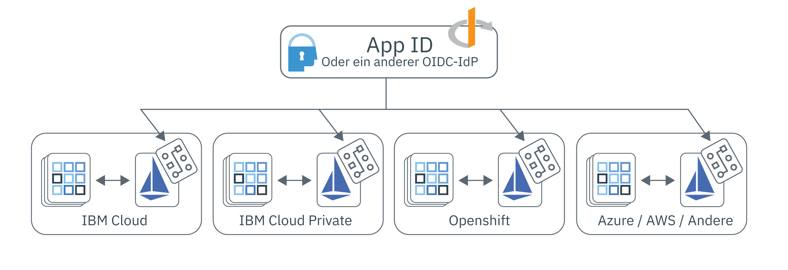

---

copyright:
  years: 2017, 2019
lastupdated: "2019-07-11"

keywords: Authentication, authorization, identity, app security, access, secure, development, any kube, kubernetes, icp, openshift, iks

subcollection: appid

---

{:external: target="_blank" .external}
{:shortdesc: .shortdesc}
{:screen: .screen}
{:pre: .pre}
{:table: .aria-labeledby="caption"}
{:codeblock: .codeblock}
{:tip: .tip}
{:note: .note}
{:important: .important}
{:deprecated: .deprecated}
{:download: .download}

# Multicloud-Apps mit Istio sichern
{: #istio-adapter}

Mithilfe der Identitäts- und Zugriffsadapter der App können Sie Ihr gesamtes Identitätsmanagement an einer Stelle zentralisieren. Da Unternehmen Clouds von mehreren Anbietern oder eine Kombination von On- und Off-Premises-Lösungen verwenden, können heterogene Bereitstellungsmodelle Ihnen dabei helfen, die vorhandene Infrastruktur zu erhalten und die Abhängigkeit von einem Anbieter zu vermeiden. Der Adapter kann so konfiguriert werden, dass er mit einem OIDC-kompatiblen Identitätsprovider wie {{site.data.keyword.appid_short_notm}} zusammenarbeitet, wodurch eine Steuerung der Authentifizierung und der Berechtigungsrichtlinie in allen Umgebungen einschließlich der Front-End- und Back-End-Anwendungen möglich ist. Und **dies geschieht alles ohne eine Änderung Ihres Codes und ohne eine erneute Bereitstellung der Anwendung**.
{: shortdesc}


## Multicloud-Architektur
{: #istio-multicloud}

Eine Multicloud-IT-Umgebung kombiniert mehrere Cloud- und/oder private Rechnerumgebungen in einer einzigen Netzarchitektur. Durch die Verteilung der Workloads über mehrere Umgebungen können Sie eine höhere Ausfallsicherheit, Flexibilität und eine größere Kosteneffizienz erreichen. Um diese Vorteile zu nutzen, ist es üblich, eine containerbasierte Anwendung mit einer Orchestrierungsebene wie beispielsweise Kubernetes zu verwenden.


Abbildung. Multicloud-Bereitstellung mithilfe des Identitäts- und Zugriffsadapters der App.


## Istio und der Adapter
{: #istio-architecure}

[Istio](https://istio.io) ist ein Open-Source-Servicenetz, das sich transparent über vorhandene, verteilte Anwendungen legt, die in Kubernetes integriert werden können. Um die Komplexität der Bereitstellungen zu reduzieren, bietet Istio Einblicke in das Verhalten und die Betriebssteuerung für das Servicenetz als Ganzes. Wenn die App-ID mit Istio kombiniert wird, wird sie zu einer skalierbaren, integrierten Identitätslösung für Multicloud-Architekturen, die keine Änderungen des angepassten Anwendungscodes erfordern. Weitere Informationen finden Sie unter ["Was ist Istio?"](https://www.ibm.com/cloud/learn/istio?cm_mmc=OSocial_Youtube-_-Hybrid+Cloud_Cloud+Platform+Digital-_-WW_WW-_-IstioYTDescription&cm_mmca1=000023UA&cm_mmca2=10010608){: external}.

Istio verwendet ein Envoy-Proxy-Sidedcar, um den gesamten eingehenden und ausgehenden Datenverkehr für alle Services im Servicenetz zu auszugleichen. Durch die Verwendung des Proxy extrahiert Istio Informationen zum Datenverkehr (auch als Telemetrie bezeichnet), die an die Istio-Komponente mit der Bezeichnung Mixer gesendet werden, um Richtlinienentscheidungen zu erzwingen. Der Identitäts- und Zugriffsadapter für die App erweitert die Mixerfunktionalität durch eine Analyse der Telemetrie (Attribute) gegenüber angepassten Richtlinien, um das Identitäts- und Zugriffsmanagement in das Servicenetz hinein und über das Servicenetz hinweg zu steuern. Die Richtlinien für das Zugriffsmanagement sind mit einzelnen Kubernetes-Services verknüpft und können auf bestimmte Serviceendpunkte optimiert werden. Weitere Informationen zu Richtlinien und zur Telemetrie finden Sie in der [Dokumentation zu Istio](https://istio.io/docs/concepts/observability/){: external}. 

Wegen einer Einschränkung von Istio speichert der Identitäts- und Zugriffsadapter der App die Informationen zur Benutzersitzung momentan intern und *nicht* persistent über Replikate oder über Failover-Konfigurationen. Wenn Sie den Adapter verwenden, schränken Sie ihre Workloads auf ein einzelnes Replikat ein, bis diese Einschränkung behoben ist.
{: note}

### Front-End-Apps schützen
{: #istio-frontend}

Wenn Sie eine browserbasierte Anwendung verwenden, können Sie den [Open ID Connect (OIDC)](https://openid.net/specs/openid-connect-core-1_0.html){: external} / OAuth 2.0 `authorization_grant`-Ablauf verwenden, um Ihre Benutzer zu authentifizieren. Wenn ein nicht authentifizierter Benutzer erkannt wurde, wird dieser automatisch an die Authentifizierungsseite weitergeleitet. Wenn die Authentifizierung abgeschlossen ist, wird der Browser an den impliziten Endpunkt `/oidc/callback` weitergeleitet, an dem der Adapter die Anforderung abfängt. An dieser Stelle ruft der Adapter Tokens vom Identitätsprovider ab und leitet den Benutzer an die ursprünglich angeforderte URL weiter. 

Um die Informationen zur Benutzersitzung einschließlich der Sitzungstokens anzuzeigen, können Sie den Header `Authorization` anzeigen. 

```
Authorization: Bearer <access_token> <id_token>
```
{: screen}

Sie können ferner authentifizierte Benutzer abmelden. Wenn ein authentifizierter Benutzer auf einen geschützten Endpunkt zugreift und dabei `oidc/logout` wie im Beispiel dargestellt angehängt hat, wird er abgemeldet. 

```
https://myhost/path/oidc/logout
```
{: screen}

Bei Bedarf kann ein Aktualisierungstoken verwendet werden, um neuen Zugriff automatisch anzufordern, ohne dass die Benutzer sich erneut authentifizieren müssen. Wenn der konfigurierte Identitätsprovider ein Aktualisierungstoken zurückgibt, wird dieses persistent in der Sitzung gespeichert und verwendet, um neue Tokens abzurufen, wenn das Identitätstoken abläuft. 


### Back-End-Apps schützen
{: #istio-backend}

Der Adapter kann zusammen mit dem OAuth 2.0 [JWT Bearer Flow](https://tools.ietf.org/html/rfc6750){: external} verwendet werden, um Service-APIs durch die Überprüfung von JWT Bearer-Tokens zu schützen. Der Bearer-Autorisierungsablauf erwartet eine Antwort mit einem Berechtigungsheader, der ein gültiges Zugriffstoken und ein optionales Identitätstoken enthält. Die erwartete Headerstruktur ist `Authorization=Bearer {access_token} [{id_token}]`. Für nicht authentifizierte Clients wird der Antwortstatus HTTP 401 mit einer Liste von Bereichen zurückgegeben, die erforderlich sind, um die Autorisierung abzurufen. Wenn die Tokens ungültig oder abgelaufen sind, gibt die API-Strategie die Antwort HTTP 401 mit einer optionalen Fehlerkomponente zurück, die wie folgt lautet: `Www-Authenticate=Bearer scope="{scope}" error="{error}"`.


Weitere Informationen zu Tokens und deren Verwendung finden Sie in [Informationen zu Tokens](/docs/services/appid?topic=appid-tokens).


## Vorbereitungen
{: #istio-before}

Stellen Sie vor dem Beginn sicher, dass Sie die folgenden Voraussetzung installiert haben. 

- [Kubernetes Cluster](https://kubernetes.io/){: external}
- [Helm](https://helm.sh/){: external}
- [Istio Version 1.1+](https://istio.io/docs/setup/kubernetes/install/){: external}
  
  Sie können auch [IBM Cloud Kubernetes Service Managed Istio](/docs/containers?topic=containers-istio) verwenden.
  {: note}


## Adapter installieren
{: #istio-install-adapter}

Um das Diagramm zu installieren, initialisieren Sie Helm in Ihrem Cluster, definieren die Optionen, die Sie verwenden möchten, und führen anschließend den Installationsbefehl aus. 

1. Wenn Sie mit IBM Cloud Kubernetes-Service arbeiten, stellen Sie sicher, dass Sie sich anmelden und legen Sie den Kontext für Ihren Cluster fest. 

2. Installieren Sie Helm in Ihrem Cluster.

    ```bash
    helm init
    ```
    {: codeblock}

    Möglicherweise möchten Sie Helm für die Verwendung des Modus `--tls` konfigurieren. Hilfe bei der Aktivierung von TLS finden Sie im [Helm-Repository](https://github.com/helm/helm/blob/master/docs/tiller_ssl.md){: external}. Wenn Sie TLS aktivieren, stellen Sie sicher, dass Sie an jeden Helm-Befehl, den Sie ausführen, `--tls` anhängen. Weitere Informationen zur Verwendung von Helm mit IBM Cloud Kubernetes Service finden Sie unter [Services mithilfe von Helm-Diagrammen hinzufügen](/docs/containers?topic=containers-helm#public_helm_install).
    {: tip}

3. Installieren Sie das Diagramm.

    ```bash
    helm install ./helm/appidentityandaccessadapter --name appidentityandaccessadapter
    ```
    {: codeblock}

## Berechtigungs- und Authentifizierungsrichtlinie anwenden
{: #istio-apply-policy}

Eine Authentifizierungs- oder Berechtigungsrichtlinie ist eine Gruppe von Bedingungen, die erfüllt sein müssen, bevor eine Anforderung auf einen Ressourcenzugriff zugreifen kann. Durch die Definition der Servicekonfiguration eines Identitätsproviders und einer Richtlinie, die definiert, wann ein bestimmter Ablauf verwendet werden soll, können Sie den Zugriff auf jede Ressource in Ihrem Servicenetz steuern. Beispiel-CRDs finden Sie im [Beispielverzeichnis](https://github.com/ibm-cloud-security/app-identity-and-access-adapter/tree/master/samples/crds){: external}.

So erstellen Sie eine Richtlinie:

1. Definieren Sie eine Konfiguration.
2. Registrieren Sie den Endpunkt.

### Eine Konfiguration definieren
{: #istio-apply-define}

Abhängig davon, ob Sie Front-End- oder Back-End-Anwendungen schützen, erstellen Sie eine Richtlinienkonfiguration mit einer der folgenden Optionen. 

* Front-End-Anwendungen: Browserbasierte Anwendungen, die eine Benutzerauthentifizierung erfordern, können so konfiguriert werden, dass Sie den Authentifizierungsablauf OIDC / OAuth 2.0 verwenden. Um eine `OidcConfig`-CRD zu definieren, die den Client enthält, der den Authentifizierungsablauf mit dem Identitätsprovider erleichtert, verwenden Sie folgendes Beispiel als Leitfaden. 

    ```yaml
    apiVersion: "security.cloud.ibm.com/v1"
    kind: OidcConfig
    metadata:
        name:      oidc-provider-config
        namespace: sample-namespace
    spec:
        discoveryUrl: https://us-south.appid.cloud.ibm.com/oauth/v4/<tenant-ID>/oidc-discovery/.well-known
        clientId:     <client-ID>
        clientSecret: <randomlyGeneratedClientSecret>
        clientSecretRef:
            name: <name-of-my-kube-secret>
            key: <key-in-my-kube-secret>
    ```
    {: screen}

    <table>
        <thead>
        <tr>
            <th>Feld</th>
            <th style="text-align:center">Typ</th>
            <th style="text-align:center">Erforderlich</th>
            <th style="text-align:center">Beschreibung</th>
        </tr>
        </thead>
        <tbody>
        <tr>
            <td><code>discoveryUrl</code></td>
            <td style="text-align:center">string</td>
            <td style="text-align:center">Ja</td>
            <td style="text-align:center">Ein bekannter Endpunkt, der das JSON-Dokument mit den OIDC/OAuth 2.0-Konfigurationsdaten enthält.</td>
        </tr>
        <tr>
            <td><code>clientId</code></td>
            <td style="text-align:center">string</td>
            <td style="text-align:center">Ja</td>
            <td style="text-align:center">Eine ID für den Client, die für die Authentifizierung verwendet wird. </td>
        </tr>
        <tr>
            <td><code>clientSecret</code></td>
            <td style="text-align:center">string</td>
            <td style="text-align:center">*Nein</td>
            <td style="text-align:center">Ein geheimer Schlüssel in Klartext, der verwendet wird, um den Client zu authentifizieren. Wenn dieser nicht bereitgestellt wird, muss ein <code>clientSecretRef</code> vorhanden sein. </td>
        </tr>
        <tr>
            <td><code>clientSecretRef</code></td>
            <td style="text-align:center">object</td>
            <td style="text-align:center">Nein</td>
            <td style="text-align:center">Ein geheimer Referenzschlüssel, der verwendet wird, um den Client zu authentifizieren. Die Referenz kann anstelle von <code>clientSecret</code> verwendet werden.</td>
        </tr>
        <tr>
            <td><code>clientSecretRef.name</code></td>
            <td style="text-align:center">string</td>
            <td style="text-align:center">Ja</td>
            <td style="text-align:center">Der Name des geheimen Kubernetes-Schlüssels, der <code>clientSecret</code> enthält.</td>
        </tr>
        <tr>
            <td><code>clientSecretRef.key</code></td>
            <td style="text-align:center">string</td>
            <td style="text-align:center">Ja</td>
            <td style="text-align:center">Das Feld im geheimen Kubernetes-Schlüssel, das <code>clientSecret</code> enthält.</td>
        </tr>
        </tbody>
    </table>

* Für Back-End-Anwendungen: Die OAuth 2.0 Bearer-Token-Spezifikation definiert ein Muster für den Schutz von APIs mithilfe von [JSON Web Tokens (JWTs)](https://tools.ietf.org/html/rfc7519.html){: external}. Definieren Sie eine `JwtConfig` CRD, die die öffentliche Schlüsselressource enthält, die für die Überprüfung der Tokensignaturen verwendet wird, indem Sie die folgende Konfiguration als Beispiel verwenden. 

    ```yaml
    apiVersion: "security.cloud.ibm.com/v1"
    kind: JwtConfig
    metadata:
      name:      jwt-config
      namespace: sample-app
    spec:
        jwksUrl: https://us-south.appid.cloud.ibm.com/oauth/v4/<tenant-ID>/publickeys
    ```
    {: screen}

### Anwendungsendpunkte registrieren
{: #istio-register-endpoints}

Registrieren Sie die Anwendungsendpunkte innerhalb der `Policy` CRD, um eingehende Anforderung zu überprüfen und Authentifizierungsregeln zu erzwingen. Jede `Policy` gilt exklusiv für den Kubernetes-Namespace, in dem das Objekt vorhanden ist, und kann die Services, Pfade und Methoden angeben, die Sie schützen möchten. 

```yaml
apiVersion: "security.cloud.ibm.com/v1"
kind: Policy
metadata:
  name:      samplepolicy
  namespace: sample-app
spec:
  targets:
    -
      serviceName: <svc-sample-app>
      paths:
        - exact: /web/home
          method: ALL
          policies:
            - policyType: oidc
              config: <oidc-provider-config>
              rules:
                - claim: scope
                  match: ALL
                  source: access_token
                  values:
                    - appid_default
                    - openid
                - claim: amr
                  match: ANY
                  source: id_token
                  values:
                    - cloud_directory
                    - google

        - exact: /web/user
          method: GET
          policies:
            - policyType: oidc
              config: <oidc-provider-config>
              redirectUri: https://github.com/ibm-cloud-security/app-identity-and-access-adapter
        - prefix: /
          method: ALL
          policies:
            -
              policyType: jwt
              config: <jwt-config>
```
{: screen}


| Serviceobjekt  | Typ | Erforderlich | Beschreibung   |
|:----------------:|:----:|:--------:| :-----------: |
| `service` | `string` | Ja | Der Name des Kubernetes-Service im Richtliniennamespace, den Sie schützen möchten. |
| `paths` | `array[Path Object]` | Ja | Eine Liste mit Pfadobjekten, die die Endpunkte definieren, die Sie schützen möchten. Wenn hier keine Angabe erfolgt, werden alle Pfade geschützt. |
{: class="simple-tab-table"}
{: caption="Tabelle 1. Serviceobjektkomponenten" caption-side="top"}
{: #service-object}
{: tab-title="Service object"}
{: tab-group="objects"}

| Pfadobjekt    | Typ | Erforderlich | Beschreibung   |
|:----------------:|:----:|:--------:|:-----------:|
| `exact or prefix` | `string` | Ja | Der Pfad, auf den Sie die Richtlinien anwenden möchten. Die Optionen umfassen `exact` und `prefix`. `exact` stimmt mit dem bereitgestellten Endpunkten exakt überein, wobei der letzte Schrägstrich `/` abgeschnitten wird. `prefix` stimmt mit den Endpunkten überein, die mit dem Weiterleitungspräfix beginnen, das Sie angegeben haben. |
| `method` | `enum` | Nein | Die geschützte HTTP-Methode. Gültige Optionen sind ALL, GET, PUT, POST, DELETE, PATCH - Der Standardwert lautet ALL:  |
| `policies` | `array[Policy]` | Nein | Die OIDC/JWT-Richtlinien, die Sie anwenden möchten. |
{: class="simple-tab-table"}
{: caption="Tabelle 2. Pfad- und Objektkomponenten" caption-side="top"}
{: #path-object}
{: tab-title="Path object"}
{: tab-group="objects"}

| Richtlinienobjekt | Typ | Erforderlich | Beschreibung   |
|:----------------:|:----:|:--------:| :-----------: |
| `policyType` | `enum` | Ja | Der Typ der OIDC-Richtlinie. Die Optionen umfassen: `jwt` oder `oidc`. |
| `config` | `string` | Ja | Der Name der Providerkonfiguration, die Sie verwenden möchten. |
| `redirectUri` | `string` | Nein | Die URL, zu der der Benutzer nach erfolgreicher Authentifizierung weitergeleitet wird. Der Standardwert ist: die ursprüngliche Anforderungs-URL. |
| `rules` | `array[Rule]` | Nein | Die Gruppe von Regeln, die Sie für die Tokenvalidierung verwenden möchten. |
{: class="simple-tab-table"}
{: caption="Tabelle 3. Richtlinienobjektkomponenten" caption-side="top"}
{: #policy-object}
{: tab-title="Policy object"}
{: tab-group="objects"}

| Regelobjekt | Typ | Erforderlich | Beschreibung   |
|:----------------:|:----:|:--------:| :-----------: |
| `claim` | `string` | Ja | Der Claim, den Sie validieren möchten. |
| `match` | `enum` | Nein | Die erforderlichen Kriterien für die Claimvalidierung. Die Optionen umfassen: `ALL`, `ANY`, oder `NOT`. Der Standardwert lautet `ALL`. |
| `source` | `enum` | Nein | Das Token, auf das Sie die Regel anwenden möchten. Die Optionen umfassen: `access_token` oder `id_token`. Der Standardwert lautet `access_token`. |
| `values` | `array[string]` | Ja | Die erforderliche Gruppe von Werten für die Validierung. |
{: class="simple-tab-table"}
{: caption="Tabelle 4. Komponenten des Richtlinienobjekts" caption-side="top"}
{: #rule-object}
{: tab-title="Rule object"}
{: tab-group="objects"}


## Adapter löschen
{: #istio-remove}

Um den Adapter und alle zugehörigen CRDs zu entfernen, müssen Sie das Helm-Diagramm und die zugehörigen Signier- und Verschlüsselungsschlüssel löschen. 

```bash
helm delete --purge appidentityandaccessadapter
kubectl delete secret appidentityandaccessadapter-keys -n istio-system
```
{: codeblock}


## Häufige Fragen und Fehlerbehebung
{: #istio-faq}

Wenn bei der Arbeit mit dem App-Identitäts- und -Zugriffsadapter ein Problem auftritt, beachten Sie die folgenden FAQ's und Fehlerbehebungstechniken. Sie können auch Fragen über ein Forum stellen oder ein Support-Ticket öffnen, wenn Sie darüber hinaus Hilfe benötigen. Wenn Sie in den Foren eine Frage stellen, versehen Sie Ihre Frage mit einem Tag, um das {{site.data.keyword.appid_short_notm}}-Entwicklungsteam auf die Frage aufmerksam zu machen.

  * Bei technischen Fragen zu {{site.data.keyword.appid_short_notm}} posten Sie Ihre Frage unter <a href="https://stackoverflow.com/" target="_blank">Stack Overflow </a> und versehen Sie sie mit dem Tag "ibm-appid".
  * Bei Fragen zum Service und zu den ersten Schritten verwenden Sie das Forum <a href="https://developer.ibm.com/" target="_blank">dW Answers </a>. Schließen Sie das Tag `appid` ein.

Weitere Informationen zum Anfordern von Unterstützung finden Sie in [Informationen zur Vorgehensweise beim Anfordern von Unterstützung](/docs/get-support?topic=get-support-getting-customer-support#getting-customer-support).


### Fehlerbehebung: Protokollierung
{: #istio-logging}

Standardmäßig werden Protokolle als JSON dargestellt und auf der Sichtbarkeitsstufe `info` zur Verfügung gestellt, um eine einfache Durchführbarkeit der Integration mit externen Protokollierungssystemen zu ermöglichen. Zur Aktualisierung der Protokollierungskonfiguration können Sie das Helm-Diagramm verwenden. Die unterstützten Protokollebenen umfassen den Bereich [-1, 7] wie im ZAP-Kern dargestellt. Weitere Informationen zu den Ebenen finden Sie in der [Dokumentation zum Zap-Kern](https://godoc.org/go.uber.org/zap/zapcore#Level).

Wenn Sie JSON-Protokolle manuell anzeigen, möchten Sie die Protokolle möglicherweise in eine Standardausgabe schreiben und mithilfe von [`jq`](https://brewinstall.org/install-jq-on-mac-with-brew/) gut lesbar ausdrucken.
{: note}

**Adapter**

Zur Anzeige der Adapterprotokolle können Sie `kubectl` verwenden oder Sie können auf den Pod `appidentityandaccessadapter` über die Konsole von Kubernetes zugreifen. 

```bash
$ alias adapter_logs="kubectl -n istio-system logs -f $(kubectl -n istio-system get pods -lapp=appidentityandaccessadapter -o jsonpath='{.items[0].metadata.name}')"
$ adapter_logs | jq
```
{: codeblock}

**Mixer**

Wenn der Adapter offensichtlich keine Anforderungen empfängt, überprüfen Sie die Mixer-Protokolle, um sicherzustellen, dass eine Verbindung zum Adapter erfolgreich hergestellt wurde. 

```bash
$ alias mixer_logs="kubectl -n istio-system logs -f $(kubectl -n istio-system get pods -lapp=telemetry -o jsonpath='{.items[0].metadata.name}') -c mixer"
$ mixer_logs | jq
```
{: codeblock}

