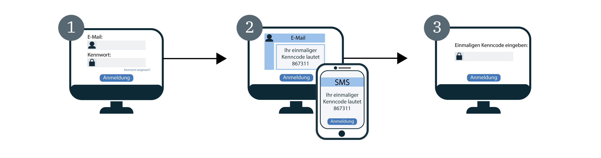

---

copyright:
  years: 2017, 2019
lastupdated: "2019-05-09"

keywords: authentication, authorization, identity, app security, secure, development, two factor, mfa 

subcollection: appid

---

{:new_window: target="_blank"}
{:shortdesc: .shortdesc}
{:screen: .screen}
{:pre: .pre}
{:table: .aria-labeledby="caption"}
{:codeblock: .codeblock}
{:tip: .tip}
{:note: .note}
{:important: .important}
{:deprecated: .deprecated}
{:download: .download}


# Mehrfaktorauthentifizierung
{: #cd-mfa}


Wenn bei der Anmeldung mehrere Faktoren erforderlich sind, können Sie die Sicherheit der Benutzerauthentifizierung bei Ihren Apps erhöhen. Bei Cloud Directory for {{site.data.keyword.appid_full}} wird als erster Faktor das Cloud Directory-Benutzerkennwort abgefragt, das normalerweise für die Anmeldung benutzt wird. Der zweite Authentifizierungsfaktor ist ein einmaliger Code, der von {{site.data.keyword.appid_short_notm}} entweder per SMS oder E-Mail an den Benutzer gesendet wird. {{site.data.keyword.appid_short_notm}} verwendet eine Kombination dieser beiden Faktoren, um die Identität eines Benutzers zu verifizieren.
{: shortdesc}

Die {{site.data.keyword.appid_short_notm}}-Mehrfaktorauthentifizierung (MFA) wird als Bestandteil des OAuth 2.0-Autorisierungscodeablaufs für Cloud Directory-Benutzer durch das Anmeldewidget unterstützt. Wenn Sie eine Unternehmensanmeldung mit SAML 2.0 oder eine Social-Media-Anmeldung verwenden, können Sie die MFA über diesen Identitätsprovider aktivieren.
{: note}

Wenn die MFA aktiviert ist, dann fordert das {{site.data.keyword.appid_short_notm}}-Anmeldewidget jedes Mal, wenn ein Benutzer versucht, sich anzumelden, eine zweite Form der Verifizierung (zweiter Authentifizierungsfaktor) an. Nachdem der Benutzer seine Berechtigungsnachweise erfolgreich eingegeben hat, wird ein einmaliger Code an die E-Mail-Adresse oder Rufnummer gesendet, die bei der Registrierung des Kontos festgelegt wurde.

Im folgenden Diagramm ist die Funktionsweise des MFA-Ablaufs dargestellt.



1. Für den Benutzer wird das {{site.data.keyword.appid_short_notm}}-Anmeldewidget angezeigt, in dem er die Cloud Directory-Benutzerberechtigungsnachweise eingeben kann. Als Berechtigungsnachweise kann der Benutzer entweder seine E-Mail-Adresse oder seinen Benutzernamen und das zugehörige Kennwort angeben. Die Cloud Directory-Benutzerberechtigungsnachweise bilden den ersten Authentifizierungsfaktor.

2. Die Berechtigungsnachweise werden validiert. Anschließend wird die MFA-Anzeige für die Verifizierung des zweiten Faktors aufgerufen. Abhängig von der Konfiguration des zweiten Faktors erhält der Benutzer nun eine E-Mail oder eine SMS mit einem einmaligen Code, der in der Verifizierungsanzeige eingegeben werden muss.

3. Nach der Validierung des MFA-Codes gelangt der Benutzer wieder zur Anwendung und wird angemeldet.


## Informationen zur MFA
{: #cd-mfa-understanding}


Bei der Mehrfaktorauthentifizierung (MFA) handelt es sich um eine Methode zur Bestätigung der Identität eines Benutzers. Dazu muss der Benutzer mehrere Faktoren verwenden, um die Richtigkeit seiner Identität zu belegen. Diese Faktoren können sich auf Informationen beziehen, die nur dem jeweiligen Benutzer bekannt sind, und die zusätzlich zu anderen benutzerbezogenen Informationen verwendet werden können.
{: shortdesc}

Bei der Erstaktivierung der MFA wird standardmäßig die Verwendung einer E-Mail-Adresse festgelegt. Diese Einstellung kann geändert werden, sodass stattdessen eine SMS verwendet wird. Die gleichzeitige Konfiguration beider Methoden ist jedoch nicht möglich. Sowohl bei der Verwendung einer E-Mail-Adresse als auch bei der Verwendung einer SMS sind bestimmte Einstellungen bereits vorkonfiguriert und können nicht geändert werden.


<table>
  <tr>
    <th>Einstellung</th>
    <th>Beschreibung</th>
  </tr>
  <tr>
    <td>Codezeichen</td>
    <td>Sechs numerische Zeichen</td>
  </tr>
  <tr>
    <td>Codeablauf</td>
    <td>Fünfzehn Minuten <br> Wenn ein Benutzer seinen Code nicht innerhalb von 15 Minuten validiert, kann er die Zusendung eines weiteren Codes anfordern, sofern die Authentifizierungssitzung nicht bereits abgelaufen ist. Innerhalb der Authentifizierungssitzung kann der Code mehrfach gesendet werden. Sobald die Authentifizierungszeit abgelaufen ist, muss der Benutzer den Anmeldeprozess von Anfang an wiederholen.</td>
  </tr>
</table>

<p>Die E-Mail-Adresse oder Rufnummer eines Cloud Directory-Benutzers wird in SCIM als <a href="https://tools.ietf.org/html/rfc7643#section-2.4" target="_blank">Attribut mit mehreren Werten </a> definiert und kann Folgendes enthalten:
<ul>
  <li>value: Der tatsächliche Attributwert, z. B. die E-Mail-Adresse oder die Rufnummer.</li>
  <li>primary: Ein boolescher Wert, der den bevorzugten Wert für das Attribut angibt. Der primäre Attributwert <code>true</code> darf nur einmal vorkommen. Erfolgt keine Angabe, dann wird für <code>primary</code> der Wert <code>false</code> angenommen.</li>
</ul>Weitere Informationen finden Sie in der [Cloud Directory-Dokumentation](/docs/services/appid?topic=appid-cloud-directory#cloud-directory).</p>


## E-Mail-Kanal für Mehrfaktorauthentifizierung konfigurieren
{: #cd-mfa-configure-email}

Sie können {{site.data.keyword.appid_short_notm}} so konfigurieren, dass der MFA-Code per E-Mail an Ihre Benutzer gesendet wird.
{: shortdesc} 

Wenn Sie die Mehrfaktorauthentifizierung (MFA) zum ersten Mal aktivieren, dann werden die folgenden beiden Aktionen ausgeführt:

- Standardmäßig wird der E-Mail-Kanal ausgewählt. Sie können zum [SMS-Kanal](/docs/services/appid?topic=appid-cd-mfa#cd-mfa-configure-sms) wechseln.
- {{site.data.keyword.appid_short_notm}} führt eine automatische Registrierung der primären E-Mail-Adresse durch, die Ihrem Cloud Directory-Benutzerprofil zugeordnet ist.

Wenn die E-Mail-Adresse eines Benutzer bei der Anmeldung noch nicht über die [Management-APIs](https://us-south.appid.cloud.ibm.com/swagger-ui/#/) oder anhand einer E-Mail-Verifizierung bestätigt wurde, dann wird diese Bestätigung bei der erfolgreichen Verifizierung eines MFA-Codes durchgeführt.

Bevor Sie beginnen, müssen Sie sich vergewissern, dass Ihre {{site.data.keyword.appid_short_notm}}-Instanz dem [Plan mit gestaffelten Preisstufen ](/docs/services/appid?topic=appid-faq#faq-pricing) unterliegt.
{: note}

### Mit der GUI
{: #cd-mfa-configure-email-gui}

Sie können den E-Mail-Kanal für die Mehrfaktorauthentifizierung (MFA) über die grafische Benutzerschnittstelle (GUI) konfigurieren.

1. Navigieren Sie zur Registerkarte **Cloud Directory > Mehrfaktorauthentifizierung** des {{site.data.keyword.appid_short_notm}}-Dashboards.

2. Legen Sie im Feld **Mehrfaktorauthentifizierung aktivieren** auf der Registerkarte für die **Einstellungen** für die MFA die Einstellung **Aktiviert** fest. Bestätigen Sie, dass Sie sich bewusst sind, dass die MFA als [erweitertes Sicherheitsereignis](/docs/services/appid?topic=appid-faq#faq-pricing) berechnet wird. Standardmäßig wird als **Authentifizierungsmethode** die Option **E-Mail** ausgewählt.

3. Überprüfen Sie auf der Registerkarte **E-Mail-Kanal** die **E-Mail-Vorlage**. Sie können auswählen, dass die Vorlage mit dem bereitgestellten Wortlaut gesendet wird, oder eine eigene Nachricht verfassen. Vergewissern Sie sich, dass das korrekte HTML-Tagging verwendet wird. In der GUI können Sie Parameter hinzu- und Bilder einfügen. Um die [Sprache](/docs/services/appid?topic=appid-cd-messages#cd-languages) der Nachricht zu ändern, können Sie die <a href="https://us-south.appid.cloud.ibm.com/swagger-ui/#/Management%20API%20-%20Config/mgmt.updateLocalization" target="_blank">APIs </a> verwenden, um die gewünschte Sprache festzulegen. Allerdings ist zu beachten, dass Sie für den Inhalt und die Übersetzung der Nachricht verantwortlich sind. In der folgenden Tabelle finden Sie die Liste der Tabellen, die Sie in dieser Nachricht und in allen anderen Nachrichten, die Sie senden können, verwenden können. Wenn ein Benutzer die vom Parameter abgefragte Information nicht angibt, wird im entsprechenden Feld kein Wert angezeigt.

  <table>
    <thead>
      <tr>
        <th colspan=2> MFA-Nachrichtenparameter</th>
      </tr>
    </thead>
    <tbody>
      <tr>
        <td><code>%{display.logo}</code></td>
        <td> Zeigt das Bild an, das Sie für das Anmeldewidget konfiguriert haben. </td>
      </tr>
      <tr>
        <td><code>%{user.displayName}</code></td>
        <td> Zeigt den Anzeigenamen an, den ein Benutzer für die Interaktion mit der App ausgewählt hat. </td>
      </tr>
      <tr>
        <td><code>%{user.email}</code></td>
        <td> Zeigt die registrierte E-Mail-Adresse des Benutzers an. </td>
      </tr>
      <tr>
        <td><code>%{user.username}</code></td>
        <td> Zeigt den angegebenen Benutzernamen des Benutzers an, wenn die Verwendung von Benutzername und Kennwort als Authentifizierungsmethode festgelegt ist. </td>
      </tr>
      <tr>
        <td><code>%{user.firstName}</code></td>
        <td> Zeigt den angegebenen Vornamen des Benutzers an. </td>
      </tr>
      <tr>
        <td><code>%{user.formattedName}</code></td>
        <td> Zeigt den vollständigen Namen des Benutzers an. </td>
      </tr>
      <tr>
        <td><code>%{user.lastName}</code></td>
        <td> Zeigt den angegebenen Nachnamen des Benutzers an. </td>
      </tr>
      <tr>
        <td><code>%{mfa.code}</code></td>
        <td> Zeigt einen einmaligen MFA-Verifizierungscode an. </td>
      </tr>
    </tbody>
  </table>

  Wenn ein Benutzer die vom Parameter abgefragte Information nicht angibt, wird im entsprechenden Feld kein Wert angezeigt.
  {: tip}


### Mit den APIs
{: #cd-mfa-configure-email-apis}

**Vorbereitungen**

Stellen Sie sicher, dass die folgenden Anforderungen erfüllt werden:

* Die Tenant-ID Ihrer {{site.data.keyword.appid_short_notm}}-Instanz. Diese ID finden Sie im Abschnitt **Serviceberechtigungsnachweise** des Dashboards.
* Ihr IAM-Token (Identity and Access Management). Hilfe zum Abrufen eines IAM-Tokens finden Sie in der [IAM-Dokumentation](/docs/iam?topic=iam-iamtoken_from_apikey#iamtoken_from_apikey).


1. Aktivieren Sie die Mehrfaktorauthentifizierung, indem Sie eine PUT-Anforderung an den Endpunkt `/config/mfa` mit der MFA-Konfiguration stellen, um `isActive` auf `true` zu setzen.

  Header:
  ```
  PUT {management-url}/management/v4/{tenantId}/config/mfa
       Host: <management-server-url>
       Authorization: Bearer <IAM_TOKEN>
       Content-Type: application/json
  ```
  {: codeblock}

  Hauptteil:
  ```
   {
       "isActive": true
   }
  ```
  {: codeblock}

  Beispielanforderung:
  ```
  $ curl -X PUT
    --header 'Content-Type: application/json'
    --header 'Accept: application/json'
    --header 'Authorization: Bearer <IAM_TOKEN>'
    -d '{
          "isActive": true
      }'
    }'
    '{management-url}/management/v4/{tenantId}/config/mfa'
  ```
  {: screen}

2. Aktivieren Sie den MFA-Kanal, indem Sie eine PUT-Anforderung an den Endpunkt `/mfa/channels/{channel}` mit der MFA-Konfiguration absetzen. Wenn `isActive` auf `true` gesetzt ist, ist Ihr MFA-Kanal aktiviert.

  Header:
  ```
  PUT /management/v4/{tenantId}/mfa/channels/{channel}
       Host: <management-server-url>
       Authorization: Bearer <IAM_TOKEN>
       Content-Type: application/json
  ```
  {: codeblock}

  Hauptteil:
  ```
   {
       "isActive": true
   }
  ```
  {: codeblock}

  Beispielanforderung:

  ```
  $ curl -X PUT
    --header 'Content-Type: application/json'
    --header 'Accept: application/json'
    --header 'Authorization: Bearer <IAM_TOKEN>'
    -d '{
          "isActive": true
      }'
    }'
    '{management-url}/management/v4/{tenantId}/mfa/channels/email'
  ```
  {: screen}

Wenn Ihre {{site.data.keyword.appid_short_notm}} Cloud Directory-Instanz zur Nutzung eines angepassten E-Mail-Dispatchers konfiguriert wurde, dann verwendet MFA denselben Dispatcher, um den einmaligen Code zu senden. Weitere Informationen zum Einrichten eines angepassten Dispatchers finden Sie in der Dokumentation zu [Cloud Directory](/docs/services/appid?topic=appid-cd-messages#cd-custom-email).
{: note}


## MFA zur Verwendung von SMS konfigurieren
{: #cd-mfa-configure-sms}

Sie können als zweite Form der Verifizierung eine SMS-Nachricht an Ihre Benutzer senden. Wenn Sie die SMS-Funktion aktivieren, dann versucht {{site.data.keyword.appid_short_notm}} automatisch, die erste [gültige](https://en.wikipedia.org/wiki/E.164) primäre Rufnummer zu registrieren, die im Profil eines Cloud Directory-Benutzers gefunden wird. Ist die Nummer ungültig oder kann im Profil des Benutzers keine Rufnummer gefunden werden, dann wird ein Registrierungswidget angezeigt, über das der Benutzer eine Nummer hinzufügen kann. Anschließend ist die Nummer Bestandteil des Benutzerprofils und wird nach der Validierung als Standardnummer festgelegt, die für die Mehrfaktorauthentifizierung (MFA) verwendet wird.
{: shortdesc}

**Vorbereitungen**

{{site.data.keyword.appid_short_notm}} verwendet [Nexmo](https://www.nexmo.com/products/sms), um einmalige Codes für die MFA per SMS zu senden. Bevor Sie beginnen, müssen Sie sich vergewissern, dass Sie über eine {{site.data.keyword.appid_short_notm}}-Instanz verfügen, die dem [Plan mit gestaffelten Preisstufen](/docs/services/appid?topic=appid-faq#faq-pricing) unterliegt. Des Weiteren benötigen Sie die folgenden Nexmo-Informationen.

 - Rufen Sie die Nexmo-API-Schlüssel und den entsprechenden geheimen Schlüssel ab. Der Nexmo-API-Schlüssel und der entsprechende geheime Schlüssel sind auf der Seite mit den Einstellungen Ihres Kontos im Nexmo-Dashboard zu finden. Weitere Informationen zur Vorgehensweise beim Abrufen Ihrer Berechtigungsnachweise finden Sie in der [Nexmo-Dokumentation](https://developer.nexmo.com/concepts/guides/authentication#api-key-and-secret).

 - Registrieren Sie Ihre Absender-ID oder die `Absenderrufnummer` bei Nexmo. Diese `Absenderrufnummer` wird auf dem Telefon Ihres Benutzers als Absender der SMS angezeigt. In einigen Ländern werden von Nexmo alphanumerische Absender-IDs unterstützt. Von {{site.data.keyword.appid_short_notm}} wird der Wert verwendet, den Sie als Absender-ID für Nexmo eingegeben haben. Falls sie von Nexmo unterstützt werden, können Sie die IDs also mit {{site.data.keyword.appid_short_notm}} verwenden. Weitere Informationen finden Sie in der [Nexmo-Dokumentation](https://help.nexmo.com/hc/en-us/articles/217571017-What-is-a-Sender-ID).


### Mit der GUI
{: #cd-mfa-configure-sms-gui}

Informationen zum Konfigurieren der Mehrfaktorauthentifizierung über die GUI finden Sie unter [Cloud Directory](/docs/services/appid?topic=appid-cloud-directory).
{: note}

1. Navigieren Sie zur Registerkarte **Cloud Directory > Mehrfaktorauthentifizierung** des {{site.data.keyword.appid_short_notm}}-Dashboards.

2. Legen Sie im Feld **Mehrfaktorauthentifizierung aktivieren** auf der Registerkarte für die **Einstellungen** für die MFA die Einstellung **Aktiviert** fest. Bestätigen Sie, dass Sie sich bewusst sind, dass die MFA als [erweitertes Sicherheitsereignis](/docs/services/appid?topic=appid-faq#faq-pricing) berechnet wird.

3. Wählen Sie **SMS** als **Authentifizierungsmethode** aus.

4. Konfigurieren Sie auf der Registerkarte **SMS-Kanal** die Nexmo-Kontoinformationen.

    1. Wenn Sie noch nicht über ein Nexmo-Konto verfügen, dann erstellen Sie jetzt ein entsprechendes Konto.

    2. Klicken Sie im Nexmo-Dashboard auf **SMS**.

    3. Kopieren Sie im Abschnitt **Selbst codieren** Ihren API-Schlüssel und fügen Sie ihn im Feld **Schlüssel** des {{site.data.keyword.appid_short_notm}}-Dashboards ein.

    4. Kopieren Sie den **geheimen API-Schlüssel** im Nexmo-Dashboard und fügen Sie ihn im Feld **Geheimer Schlüssel** des {{site.data.keyword.appid_short_notm}}-Dashboards ein.

    5. Geben Sie [die ID](https://help.nexmo.com/hc/en-us/articles/217571017-What-is-a-Sender-ID) ein, von der Sie Nachrichten senden möchten. Gültige Nummern werden im [internationalen Nummernformat gemäß E.164](https://en.wikipedia.org/wiki/E.164) angegeben, zum Beispiel in den USA im Format `+1 999 888 7777`. Sie müssen sowohl den Landescode beginnend mit einem Plussymbol `+` als auch die nationale Teilnehmernummer angeben. In einigen Ländern werden von Nexmo alphanumerische Absender-IDs unterstützt. Von {{site.data.keyword.appid_short_notm}} wird der Wert verwendet, den Sie als Absender-ID für Nexmo eingegeben haben. Falls sie von Nexmo unterstützt werden, können Sie die IDs also mit {{site.data.keyword.appid_short_notm}} verwenden.


### Mit den APIs
{: #cd-mfa-configure-sms-api}

**Vorbereitungen**

Stellen Sie sicher, dass die folgenden Anforderungen erfüllt werden:

* Die Tenant-ID Ihrer {{site.data.keyword.appid_short_notm}}-Instanz. Diese ID finden Sie im Abschnitt **Serviceberechtigungsnachweise** des Dashboards.
* Ihr IAM-Token (Identity and Access Management). Hilfe zum Abrufen eines IAM-Tokens finden Sie in der [IAM-Dokumentation](/docs/iam?topic=iam-iamtoken_from_apikey).


1. Aktivieren Sie die Mehrfaktorauthentifizierung, indem Sie eine PUT-Anforderung an den Endpunkt `/config/mfa` mit der MFA-Konfiguration stellen, um `isActive` auf `true` zu setzen.

Header:

  ```
  PUT {management-url}/management/v4/{tenantId}/config/mfa
       Host: <management-server-url>
       Authorization: Bearer <IAM_TOKEN>
       Content-Type: application/json
  ```
  {: codeblock}

Hauptteil:

  ```
  {
   "isActive": true
   }
  ```
  {: codeblock}


Beispielanforderung:

  ```
  $ curl -X PUT
    --header 'Content-Type: application/json'
    --header 'Accept: application/json'
    --header 'Authorization: Bearer <IAM_TOKEN>'
    -d '{
    "isActive": true
      }'
  '{management-url}/management/v4/{tenantId}/config/mfa'
  ```
  {: screen}

2. Aktivieren Sie den MFA-Kanal, indem Sie eine PUT-Anforderung an den Endpunkt `/mfa/channels/{channel}` mit der MFA-Konfiguration absetzen. Wenn `isActive` auf `true` gesetzt ist, ist Ihr MFA-Kanal aktiviert.
In `config` werden der Nexmo-API-Schlüssel und der entsprechende geheime Schlüssel sowie die `Absenderrufnummer` eingefügt.

Header:

  ```
  PUT /management/v4/{tenantId}/mfa/channels/{channel}
      Host: <management-server-url>
      Authorization: Bearer <IAM_TOKEN>
      Content-Type: application/json
  ```
  {: codeblock}

Hauptteil:

  ```
  {
      "isActive": true,
      "config": {
        "key": "nexmo key",
        "secret": "nexmo secret",
        "from": sender-phoneNumber
      }
  }
  ```
  {: codeblock}

Beispielanforderung:

  ```
  $ curl -X PUT
    --header 'Content-Type: application/json'
    --header 'Accept: application/json'
    --header 'Authorization: Bearer <IAM_TOKEN>'
    -d '{
         "isActive": true,
      "config": {
          "key": "key",
          "secret": "secret",
          "from": 12345678900
        }
     }'
   '{management-url}/management/v4/{tenantId}/mfa/channels/nexmo'
  ```
  {: screen}


3. Nach der erfolgreichen Konfiguration des Kanals müssen Sie die Nexmo-Konfiguration und die korrekte Einrichtung der Verbindung verifizieren, indem Sie die Testschaltfläche in der Benutzerschnittstelle oder die Management-API verwenden.

Header:

  ```
  POST /management/v4/{tenantId}/config/cloud_directory/sms_dispatcher/test
     Host: <management-server-url>
     Authorization: Bearer <IAM_TOKEN>
     Content-Type: application/json
  ```
  {: codeblock}

Hauptteil:

  ```
  {
    "phone_number": "phoneNumber-receives-test-message"
  }
  ```
  {: codeblock}

Beispielanforderung:

  ```
  $ curl -X POST
  --header 'Content-Type: application/json'
  --header 'Accept: application/json'
  --header 'Authorization: Bearer <IAM_TOKEN>'
  -d '{
        "phone_number": "+1 999 999 9999"
      }'
  '{management-url}/management/v4/{tenantId}/config/cloud_directory/sms_dispatcher/test'
  ```
  {: screen}

  </br>
