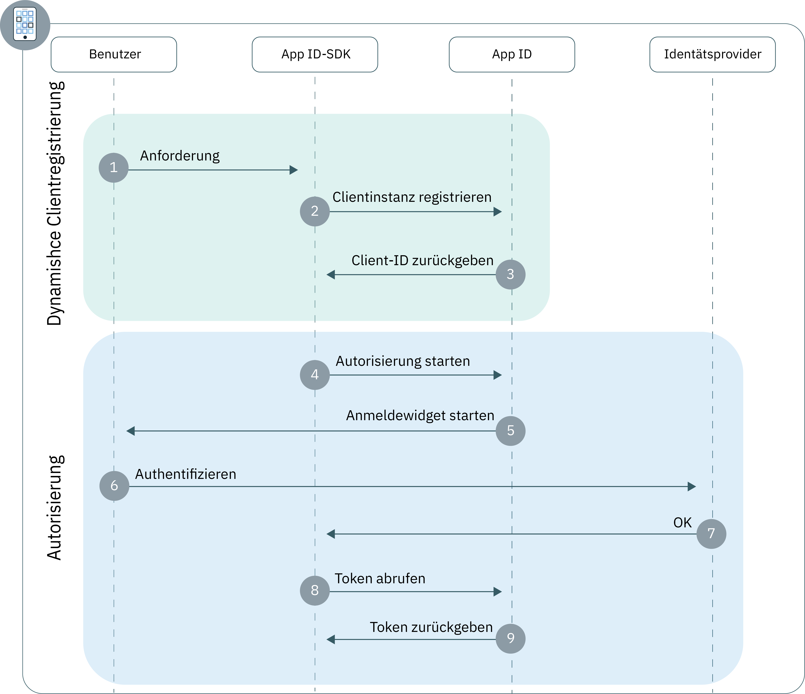

---

copyright:
  years: 2017, 2019
lastupdated: "2019-03-27"

keywords: authentication, authorization, identity, app security, secure, development, mobile, android, iOS

subcollection: appid

---

{:new_window: target="_blank"}
{:shortdesc: .shortdesc}
{:screen: .screen}
{:pre: .pre}
{:table: .aria-labeledby="caption"}
{:codeblock: .codeblock}
{:tip: .tip}
{:note: .note}
{:important: .important}
{:deprecated: .deprecated}
{:download: .download}

# Mobile Apps
{: #mobile-apps}

Mit {{site.data.keyword.appid_full}} können Sie ohne großen Zeitaufwand eine Authentifizierungsebene für Ihre mobile App (nativ oder Hybrid) erstellen.
{: shortdesc}

## Informationen zum Ablauf
{: #understanding-mobile}

Ein mobiler Ablauf ist nützlich, wenn Sie eine App entwickeln, die auf dem Gerät eines Benutzers installiert werden soll (eine native Anwendung). Durch die Verwendung dieses Ablaufs können Sie Benutzer sicher auf Ihrer App authentifizieren, um eine personalisierte Funktionalität über alle Geräte hinweg zu ermöglichen.

### Was ist die technische Basis des Ablaufs?
{: #mobile-technical-flow}

Da native Anwendungen direkt auf dem Gerät eines Benutzers installiert sind, können private Benutzerinformationen und Anwendungsberechtigungsnachweise relativ einfach von Dritten extrahiert werden. Standardmäßig werden diese Typen von Anwendungen als nicht vertrauenswürdige Clients eingestuft, da sie keine globalen Berechtigungsnachweise oder Aktualisierungstokens des Benutzers speichern können. Dies hat zur Folge, dass nicht vertrauenswürdige Clients die Benutzer jedes Mal, wenn ihre Zugriffstokens ablaufen, dazu auffordern, ihre Berechtigungsnachweise einzugeben.

Wenn Sie Ihre Anwendung in einen vertrauenswürdigen Client konvertieren möchten, nutzt {{site.data.keyword.appid_short}} die [dynamische Clientregistrierung](https://tools.ietf.org/html/rfc7591). Bevor eine Anwendungsinstanz mit der Authentifizierung von Benutzern beginnt, wird sie zunächst als OAuth2-Client bei {{site.data.keyword.appid_short}} registriert. Als Ergebnis der Clientregistrierung erhält Ihre Anwendung eine installationsspezifische Client-ID, die digital signiert und dazu verwendet werden kann, Anforderungen mit {{site.data.keyword.appid_short}} zu autorisieren. Da {{site.data.keyword.appid_short}} den entsprechenden öffentlichen Schlüssel Ihrer Anwendung speichert, kann Ihre Anforderungssignatur geprüft werden, sodass Ihre Anwendung als vertraulicher Client angesehen werden kann. Dieser Prozess minimiert bei Ihrer Anwendung das Risiko, dass Anmeldeinformationen für eine unbestimmte Zeit zugänglich sind, und verbessert die Benutzerfreundlichkeit deutlich, indem er eine automatische Aktualisierung der Token ermöglicht.

Nach der Registrierung authentifizieren sich Ihre Benutzer entweder mit dem OAuth2-Ablauf `Authorization Code` oder `Resource Owner Password` (unter [Authorization Grant](https://tools.ietf.org/html/rfc6749#section-1.3)).


### Dynamische Clientregistrierung
{: #mobile-dynamic}

1. Ein Benutzer führt eine Aktion aus, die eine Anforderung durch die Clientanwendung an das {{site.data.keyword.appid_short}}-SDK auslöst.
2. Wenn Ihre App noch nicht als mobiler Client registriert ist, leitet das SDK einen dynamischen Registrierungsablauf ein.
3. Bei einer erfolgreichen Registrierung gibt {{site.data.keyword.appid_short}} Ihre installationsspezifische Client-ID zurück.

### Autorisierungsablauf
{: #mobile-auth-flow}



1. Das {{site.data.keyword.appid_short}}-SDK startet den Autorisierungsprozess mit dem Endpunkt {{site.data.keyword.appid_short_notm}} `/authorization`.
2. Dem Benutzer wird das Anmeldewidget angezeigt.
3. Der Benutzer führt die Authentifizierung über einen der konfigurierten Identitätsprovider durch.
4. {{site.data.keyword.appid_short}} gibt eine Autorisierungserteilung zurück.
5. Die Autorisierungserteilung wird für Zugriffs-, Identitäts- und Aktualisierungstokens vom Endpunkt {{site.data.keyword.appid_short_notm}} `/token` ausgetauscht.


## Mobile App mit den {{site.data.keyword.appid_short}}-SDKs konfigurieren
{: #configuring-mobile}

Beginnen Sie mit {{site.data.keyword.appid_short}} mit unseren SDKs.
{: shortdesc}

**Vorbereitungen**

Sie benötigen die folgenden Informationen:

* Eine {{site.data.keyword.appid_short_notm}}-Instanz.

* Die Tenant-ID Ihrer Instanz. Diese finden Sie auf der Registerkarte **Serviceberechtigungsnachweise** des Service-Dashboards.

* Die {{site.data.keyword.cloud_notm}}-Bereitstellungsregion Ihrer Instanz. Sie finden Ihre Region auf der Konsole.

  <table><caption> Tabelle 1: {{site.data.keyword.cloud_notm}}-Regionen und entsprechende SDK-Werte</caption>
  <tr>
    <th>{{site.data.keyword.cloud_notm}}-Region</th>
    <th>SDK-Wert</th>
  </tr>
  <tr>
    <td>Vereinigte Staaten (Süden)</td>
    <td><code>AppID.REGION_US_SOUTH</code> </td>
  </tr>
  <tr>
    <td>Sydney</td>
    <td><code>AppID.REGION_SYDNEY </code></td>
  </tr>
  <tr>
    <td>Vereinigtes Königreich</td>
    <td><code>AppID.REGION_UK </code></td>
  </tr>
  <tr>
    <td>Deutschland</td>
    <td><code>AppID.REGION_GERMANY</code></td>
  </tr>
</table>

## Authentifizierung beim Android-SDK ausführen
{: #mobile-android}

**Vorbereitungen**

Folgendes wird vorausgesetzt:

  * API 27 oder höher
  * Java 8.x
  * Android SDK Tools 26.1.1+
  * Android SDK Platform Tools 27.0.1+
  * Android Build Tools Version 27.0.0+


### SDK installieren
{: #mobile-android-install}

1. Erstellen Sie ein Android Studio-Projekt oder öffnen Sie ein vorhandenes Projekt.

2. Fügen Sie das JitPack-Repository zur Stammdatei `build.gradle` hinzu.

  ```gradle
    allprojects {
	    repositories {
		    ...
		    maven { url 'https://jitpack.io' }
	    }
    }
  ```
  {: codeblock}

3. Suchen Sie die Datei `build.gradle` Ihrer Anwendung. **Hinweis**: Stellen Sie sicher, dass Sie die Datei für Ihre App öffnen, nicht die Projektdatei `build.gradle`.

  1. Fügen Sie das {{site.data.keyword.appid_short_notm}}-Client-SDK zum Abschnitt "dependencies" hinzu.

    ```gradle
    dependencies {
       compile group: 'com.github.ibm-cloud-security:appid-clientsdk-android:4.+'
   }
    ```
    {: codeblock}

  2. Konfigurieren Sie das Weiterleitungsschema im Abschnitt `defaultConfig`.

    ```gradle
    defaultConfig {
      ...
      manifestPlaceholders = ['appIdRedirectScheme': android.defaultConfig.applicationId]
  }
    ```
    {: codeblock}

6. Synchronisieren Sie Ihr Projekt mit Gradle. Klicken Sie auf **Tools > Android > Sync Project with Gradle Files**.

</br>

### SDK initialisieren
{: #mobile-android-initialize}


1. Übergeben Sie die Parameter 'context', 'tenantID' und 'region' an die Methode 'initialize', um das SDK zu konfigurieren.

    Eine gängige, wenngleich nicht verbindliche, Position für den Initialisierungscode ist die Methode `onCreate` der Hauptaktivität in Ihrer Android-Anwendung.
    {: tip}

    ```java
    AppID.getInstance().initialize(getApplicationContext(), <tenantId>, <region>);
    ```
    {: codeblock}

</br>
</br>

## Authentifizierung beim iOS Swift-SDK ausführen
{: #mobile-ios}

Sie können Ihre mobilen Anwendungen mit dem {{site.data.keyword.appid_short}}-Client-SDK schützen.
{:shortdesc}

</br>
**Vorbereitungen**

Folgendes wird vorausgesetzt:

  * Xcode 9.0 oder höher
  * CocoaPods 1.1.0 oder höher
  * iOS 10.0 oder höher

</br>

### SDK installieren
{: #mobile-ios-install}

Das {{site.data.keyword.appid_short_notm}}-Client-SDK wird mit CocoaPods verteilt, einem Abhängigkeitenmanager für Swift- und Objective-C Cocoa-Projekte. CocoaPods lädt Artefakte herunter und stellt sie für Ihr Projekt zur Verfügung.

1. Erstellen Sie ein Xcode-Projekt oder öffnen Sie ein vorhandenes Projekt.

2. Erstellen Sie eine neue `Poddatei` oder öffnen Sie eine vorhandene im Projektverzeichnis.

3. Fügen Sie den Pod `IBMCloudAppID` und den Befehl `use_frameworks!` zu den Abhängigkeiten Ihres Ziels hinzu.

  ```swift
  target '<yourTarget>' do
     use_frameworks!
     pod 'IBMCloudAppID'
  end
  ```
  {: codeblock}

4. Installieren Sie die Abhängigkeiten von der Befehlszeile aus in Ihrem Projektverzeichnis.

  ```swift
  $ pod install --repo-update
  ```
  {: codeblock}

5. Öffnen Sie nach der Installation die Datei `<your app>.xcworkspace`, die Ihr Xcode-Projekt und die verknüpften Abhängigkeiten enthält.

6. Ermöglichen Sie die gemeinsame Nutzung der Schlüsselkette in Ihrem XCode-Projekt. Navigieren Sie zu **Projekteinstellungen > Funktionen > Keychain-Sharing** und wählen Sie **Keychain-Sharing aktivieren** aus.

7. Öffnen Sie **Projekteinstellungen > Info > URL-Typen** und fügen Sie einen **URL-Typ** hinzu. Geben Sie den folgenden Wert in die beiden Textfelder **ID** und **URL-Schema** ein.

  ```
  $(PRODUCT_BUNDLE_IDENTIFIER)
  ```
  {: codeblock}

</br>

### SDK initialisieren
{: #mobile-ios-initialize}

1. Initialisieren Sie das Client-SDK, indem Sie die Parameter 'tenantID' und 'region' an die Methode 'initialize' übergeben.

  ```swift
    AppID.sharedInstance.initialize(tenantId: <tenantId>, region: <region>)
  ```
  {: codeblock}

  Eine gängige, aber nicht verbindliche Position für den Initialisierungscode ist die Methode `application:didFinishLaunchingWithOptions` der AppDelegate-Datei Ihrer Swift-Anwendung.
  {: tip}

2. Importieren Sie das {{site.data.keyword.appid_short}}-SDK in Ihre `AppDelegate`-Datei.

  ```swift
  import IBMCloudAppID
  ```
  {: codeblock}

3. Konfigurieren Sie Ihre Anwendung für die Verarbeitung von Weiterleitungen durch {{site.data.keyword.appid_short}}.

  ```swift
  func application( application: UIApplication, open url: URL, options :[UIApplicationOpenURLOptionsKey : Any]) -> Bool {
      return AppID.sharedInstance.application(application, open: url, options: options)
      }
  ```
  {: codeblock}


## Auf geschützte APIs zugreifen
{: #mobile-accessing-apis}

Nach einem erfolgreichen Anmeldeablauf können Sie Ihre Zugriffs- und Identitätstokens verwenden, um geschützte Back-End-Ressourcen aufzurufen, die das SDK oder eine Netzbibliothek Ihrer Wahl verwenden.

</br>

### Mit dem Swift-SDK
{: #mobile-access-api-swift}

1.  Fügen Sie die folgenden Importe zu der Datei hinzu, in der Sie eine geschützte Ressourcenanforderung aufrufen möchten:

  ```swift
  import BMSCore
  import IBMCloudAppID
  ```
  {: codeblock}

2. Rufen Sie Ihre geschützte Ressource auf.

   ```swift
  BMSClient.sharedInstance.initialize(region: <region>)
  BMSClient.sharedInstance.authorizationManager = AppIDAuthorizationManager(appid: AppID.sharedInstance)

  let request =  Request(url: "<your protected resource url>")

  request.send { (response: Response?, error: Error?) in

      guard let response = response, error == null else {
          print("An error occurred invoking a protected resources", error?.localizedDescription ?? "No response was received")
          return;
      }
      // use your response object
  })
  ```
  {: codeblock}

</br>

### Mit dem Android-SDK
{: #mobile-access-api-android}

1. Fügen Sie die folgenden Importe zu der Datei hinzu, in der Sie eine geschützte Ressourcenanforderung aufrufen möchten:

  ```java
  import com.ibm.mobilefirstplatform.clientsdk.android.core.api.BMSClient;
  import com.ibm.cloud.appid.android.api.AppIDAuthorizationManager;
  ```

2. Rufen Sie Ihre geschützte Ressource auf.

   ```java
   BMSClient bmsClient = BMSClient.getInstance();
   bmsClient.initialize(getApplicationContext(), <region>);

   AppIDAuthorizationManager appIdAuthMgr = new AppIDAuthorizationManager(AppID.getInstance())
  bmsClient.setAuthorizationManager(appIdAuthMgr);

   Request request = new Request("<your protected resource url>", Request.GET);
  request.send(this, new ResponseListener() {

   @Override
	public void onSuccess (Response response) {
       Log.d("My app", "onSuccess :: " + response.getResponseText());
   }

   @Override
	public void onFailure (Response response, Throwable t, JSONObject extendedInfo) {
       if (null != t) {
           Log.d("My app", "onFailure :: " + t.getMessage());
       } else if (null != extendedInfo) {
           Log.d("My app", "onFailure :: " + extendedInfo.toString());
       } else {
           Log.d("My app", "onFailure :: " + response.getResponseText());
           }
       }
   });
  ```
  {: codeblock}

</br>

### Ohne ein SDK
{: #mobile-access-api-nosdk}

Wenn Sie die Bibliothek Ihrer Wahl verwenden, setzen Sie den Anforderungsheader 'Authorization' auf das Authentifizierungsschema 'Bearer', um das Zugriffstoken zu übertragen.

Beispielanforderungsformat:

  ```
  GET /resource HTTP/1.1
  Host: server.example.com
  Authorization: Bearer <access token> <optional identity token>
  ```
  {: screen}

</br>
</br>

## Nächste Schritte
{: #mobile-next}

Wenn {{site.data.keyword.appid_short}} in Ihrer Anwendung installiert ist, sind Sie fast bereit, Benutzer zu authentifizieren. Versuchen Sie als Nächstes, eine der folgenden Aktivitäten auszuführen:

* Konfigurieren Sie Ihre [Identitätsprovider](/docs/services/appid?topic=appid-social)
* Führen Sie die Anpassung und Konfiguration [des Anmeldewidgets](/docs/services/appid?topic=appid-login-widget) aus
* Abrufen weiterer Informationen zum <a href="https://github.com/ibm-cloud-security/appid-clientsdk-android" target="_blank">Android-SDK</a>
* Abrufen weiterer Informationen zum <a href="https://github.com/ibm-cloud-security/appid-clientsdk-swift" target="_blank">iOS-SDK</a>
