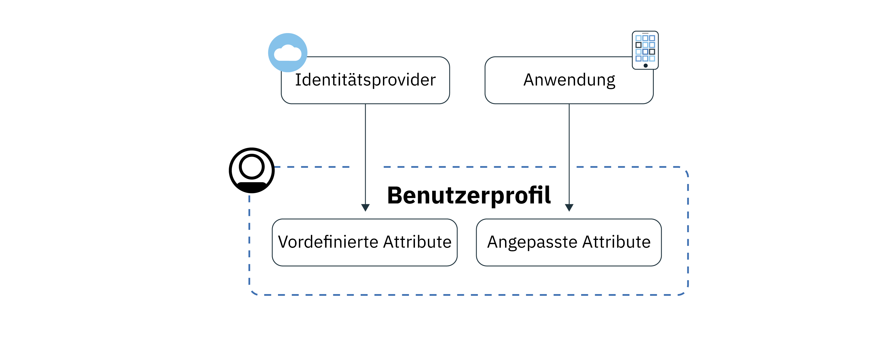
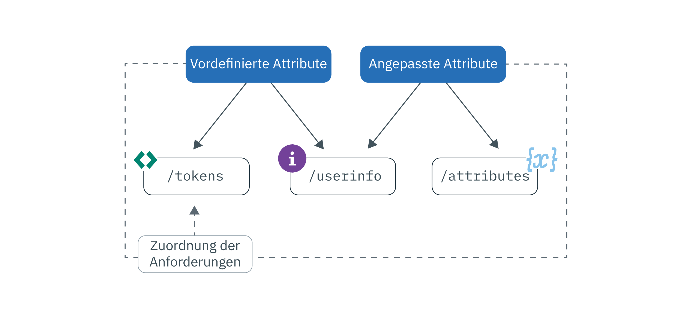

---

copyright:
  years: 2017, 2019
lastupdated: "2019-06-06"

keywords: Authentication, authorization, identity, app security, secure, attributes, user information, storing, accessing

subcollection: appid

---

{:new_window: target="_blank"}
{:shortdesc: .shortdesc}
{:screen: .screen}
{:pre: .pre}
{:table: .aria-labeledby="caption"}
{:codeblock: .codeblock}
{:tip: .tip}
{:note: .note}
{:important: .important}
{:deprecated: .deprecated}
{:download: .download}
{:java: .ph data-hd-programlang='java'}
{:javascript: .ph data-hd-programlang='javascript'}
{:swift: .ph data-hd-programlang='swift'}
{:curl: .ph data-hd-programlang='curl'}


# Profile speichern und auf sie zugreifen
{: #profiles}

Ein Benutzerprofil umfasst alle Informationen, die zu einem bestimmten Benutzer vorhanden sind; sie sind in einem Objekt zusammengestellt und werden von {{site.data.keyword.appid_full}} gespeichert. Die Informationen können vordefiniert, zugewiesen oder im Verlauf der Interaktion mit dem Benutzer erfasst worden sein. Anhand der Profilfunktion können Sie für jeden Benutzer eine anwenderspezifische App-Erfahrung erstellen.
{: shortdesc}


Suchen Sie nach Informationen zu den Cloud Directory-Benutzern? Weitere Informationen finden Sie unter [Benutzer verwalten](/docs/services/appid?topic=appid-cd-users).
{: tip}

Es gibt zwei Arten von Informationen, die mithilfe der App-ID abgerufen und gespeichert werden können: vordefinierte Attribute und angepasste Attribute. Vordefinierte Attribute sind spezifisch für die Identität der Benutzer und werden von einem Identitätsprovider zurückgegeben, wenn sich der Benutzer an der App anmeldet; sie können Informationen wie seinen Name oder sein Alter umfassen. Angepasste Attribute werden verwendet, um zusätzliche Informationen zu den Benutzern zu speichern. Sie können von Ihnen festgelegt oder anhand der Interaktion mit dem Benutzer erfasst werden. Angepasste Attribute können zum Beispiel eine zugeordnete Rolle, eine Vorliebe für bestimmte Lebensmittel oder die Bevorzugung von Gangplätzen im Flugzeug sein. 



Abbildung. Ablauf der Benutzerprofilinformationen


Sie können für jeden Benutzer 100 KB an Informationen speichern.
{: note}


## Auf Benutzerprofile zugreifen
{: #profile-access}

Es gibt verschiedene Methoden, auf Attribute zuzugreifen. Nach einer erfolgreichen Benutzerauthentifizierung empfängt die App Zugriffs- und Identitätstoken von {{site.data.keyword.appid_short_notm}}. Die Endpunkte für Benutzerinformationen und für angepasste Attribute werden über das Zugriffstoken geschützt, das von {{site.data.keyword.appid_short_notm}} zum Ende des Authentifizierungsprozesses generiert wird. Das Identitätstoken enthält eine normalisierte Untergruppe von Benutzerattributen (Informationen), die von einem Identitätsprovider zurückgegeben wurden. Eine vollständige Liste der Benutzerattribute können Sie über den OIDC-Endpunkt [`/userinfo` abrufen](https://us-south.appid.cloud.ibm.com/swagger-ui/#/Authorization_Server_V4/userInfo). 
{: shortdesc}


Weitere Informationen zu Identitäts- und Zugriffstokens finden Sie unter [Informationen zu Tokens](/docs/services/appid?topic=appid-tokens#tokens) und [Tokens validieren](/docs/services/appid?topic=appid-token-validation).


Überprüfen Sie die folgende Abbildung, um sich mit den verschiedenen Möglichkeiten vertraut zu machen, die Ihnen zum Abrufen der Benutzerinformationen zur Verfügung stehen. 

Abbildung . Optionen für den Zugriff auf Benutzerprofile


Von App ID wird eine Teilmenge der Attribute automatisch in die Zugriffs- und Identitätstoken eingefügt. Sie können die Vorteile der angepassten Claimzuordnung nutzen und weitere vordefinierte und angepasste Claims in den Tokens zuordnen. Weitere Informationen zur empfohlenen Methode für den Zugriff auf Benutzerinformationen finden Sie unter [Tokens anpassen](/docs/services/appid?topic=appid-customizing-tokens).
{: note}


### Auf Endpunkt '/userinfo' mit SDK zugreifen
{: #profile-predefined-access}

Wenn Sie die Informationen zu Benutzern anzeigen möchten, die von den konfigurierten Identitätsprovidern bereitgestellt werden, können Sie auf die vordefinierten Attribute zugreifen.
{: shortdesc}

**iOS Swift**
{: ph data-hd-programlang='swift'}

Werden neue Tokens nicht explizit an das SDK übergeben, verwendet {{site.data.keyword.appid_short_notm}} die zuletzt empfangenen Tokens zum Abrufen und Validieren der Antwort. Sie können nach einer erfolgreichen Authentifizierung beispielsweise den folgenden Code ausführen. Das SDK ruft daraufhin zusätzliche Informationen zu dem jeweiligen Benutzer ab.
{: ph data-hd-programlang='swift'}

```
AppID.sharedInstance.userProfileManager.getUserInfo { (error: Error?, userInfo: [String: Any]?) in
	guard let userInfo = userInfo, err == nil {
		return // Ein Fehler ist aufgetreten.
	}
	// Benutzerinformationen erfolgreich abgerufen.
}
```
{: codeblock}
{: ph data-hd-programlang='swift'}

Sie können stattdessen jedoch auch explizit Zugriffs- und Identitätstokens übergeben. Das Identitätstoken ist optional und dient, wenn es übergeben wird, zur Validierung der Antwort auf die Benutzerinformationen.
{: ph data-hd-programlang='swift'}

```
AppID.sharedInstance.userProfileManager.getUserInfo(accessToken: String, identityToken: String?) { (error: Error?, userInfo: [String: Any]?) in
	guard let userInfo = userInfo, err == nil {
		return // Ein Fehler ist aufgetreten.
	}
	// Benutzerinformationen erfolgreich abgerufen.
}
```
{: codeblock}
{: ph data-hd-programlang='swift'}

**Java**
{: ph data-hd-programlang='java'}

Werden neue Tokens nicht explizit an das SDK übergeben, verwendet {{site.data.keyword.appid_short_notm}} die zuletzt empfangenen Tokens zum Abrufen und Validieren der Antwort. Sie können nach einer erfolgreichen Authentifizierung beispielsweise den folgenden Code ausführen. Das SDK ruft daraufhin zusätzliche Informationen zu dem jeweiligen Benutzer ab.
{: ph data-hd-programlang='java'}

```
AppID appId = AppID.getInstance();

appId.getUserProfileManager().getUserInfo(new UserProfileResponseListener() {
	@Override
	public void onSuccess(JSONObject userInfo) {
		// Benutzerinformationen erfolgreich abgerufen
 }

	@Override
	public void onFailure(UserInfoException e) {
		// Eine Ausnahmebedingung ist aufgetreten.
	}
});
```
{: codeblock}
{: ph data-hd-programlang='java'}

Sie können stattdessen jedoch auch explizit Zugriffs- und Identitätstokens übergeben. Das Identitätstoken ist optional. Wenn es übergeben wird, wird es zur Validierung der Antwort verwendet.
{: ph data-hd-programlang='java'}

```
AppID appId = AppID.getInstance();

appId.getUserProfileManager().getUserInfo(accessToken, identityToken, new UserProfileResponseListener() {
	@Override
	public void onSuccess(JSONObject userInfo) {
		// Attribut "name" wurde erfolgreich abgerufen
	}

	@Override
	public void onFailure(UserInfoException e) {
		// Eine Ausnahmebedingung ist aufgetreten.
	}
});
```
{: codeblock}
{: ph data-hd-programlang='java'}

**Node.js**
{: ph data-hd-programlang='javascript'}

Mithilfe eines serverseitigen SDKs können Sie zusätzliche Informationen zu Ihren Benutzern abrufen. Sie können die folgende Methode mit den gespeicherten Zugriffs- und Identitätstokens aufrufen oder Tokens explizit übergeben. Das Identitätstoken ist optional und dient, wenn es übergeben wird, zur Validierung der Antwort auf die Benutzerinformationen.
{: ph data-hd-programlang='javascript'}

```javascript
let userProfileManager = UserProfileManager(options: options)

let accessToken = req.session[WebAppStrategy.AUTH_CONTEXT].accessToken;
let identityToken = req.session[WebAppStrategy.AUTH_CONTEXT].identityToken;


// Benutzerinformationen abrufen und anhand des gegebenen Identitätstokens validieren
userProfileManager.getUserInfo(accessToken, identityToken).then(function (profile) {
	// Benutzerinformationen erfolgreich abgerufen
});

// Benutzerinformationen ohne Validierung abrufen
userProfileManager.getUserInfo(accessToken).then(function (profile) {
	// Benutzerinformationen erfolgreich abgerufen
});
```
{: codeblock}
{: ph data-hd-programlang='javascript'}


**Serverseitiges Swift**
{: ph data-hd-programlang='swift'}

Mithilfe eines serverseitigen SDKs können Sie zusätzliche Informationen zu Ihren Benutzern abrufen. Sie können die folgende Methode mit den gespeicherten Zugriffs- und Identitätstokens aufrufen oder Tokens explizit übergeben. Das Identitätstoken ist optional und dient, wenn es übergeben wird, zur Validierung der Antwort auf die Benutzerinformationen.
{: ph data-hd-programlang='swift'}


```swift
let userProfileManager = UserProfileManager(options: options)

let accessToken = "<access token>"
let identityToken = "<identity token>"

// Bei Übergabe eines Identitätstokens (empfohlene Vorgehensweise) wird die Antwort mit dem Identitätstoken validiert.
userProfileManager.getUserInfo(accessToken: accessToken, identityToken: identityToken) { (err, userInfo) in
	guard let userInfo = userInfo, err == nil {
		return // Ein Fehler ist aufgetreten.
	}
	// Benutzerinformationen erfolgreich abgerufen.
}

// Benutzerinformationen ohne Validierung abrufen
userProfileManager.getUserInfo(accessToken: accessToken) { (err, userInfo) in
	guard let userInfo = userInfo, err == nil {
		return // Ein Fehler ist aufgetreten.
	}
	// Benutzerinformationen erfolgreich abgerufen.
}
```
{: codeblock}
{: ph data-hd-programlang='swift'}


### Auf Endpunkt '/userinfo' mit der API zugreifen
{: #profile-predefined-api}


Sie können zusätzliche Informationen über den Endpunkt `/userinfo` anzeigen.

1. Stellen Sie sicher, dass Sie über ein gültiges Zugriffstoken mit dem Bereich `openid` verfügen. Sie können mithilfe des Endpunkts `/introspect` überprüfen, ob Ihr Token gültig ist.

2. Setzen Sie eine Anforderung an den Endpunkt [`/userinfo` ab](https://us-south.appid.cloud.ibm.com/swagger-ui/#/Authorization_Server_V4/userInfo).
  ```
  GET [POST] https://{oauth-server-endpoint}/userinfo
  Authorization: 'Bearer {ACCESS_TOKEN}'
  ```
  {: codeblock}

  Beispielausgabe:
  ```
  "sub": "cad9f1d4-e23b-3683-b81b-d1c4c4fd7d4c",
  "name": "John Doe",
  "email": "john.doe@gmail.com",
  "picture": "https://lh3.googleusercontent.com/-XdUIqdbhg/AAAAAAAAI/AAAAAAA/42rbcbv5M/photo.jpg",
  "gender": "male",
  "locale": "en",
  "identities": [
      {
          "provider": "google",
          "id": "104560903311317789798",
          "profile": {
              "id": "104560903311317789798",
              "email": "john.doe@gmail.com",
              "verified_email": true,
              "name": "John Doe",
              "given_name": "John",
              "family_name": "Doe",
              "link": "https://plus.google.com/104560903311317789798",
              "picture": "https://lh3.googleusercontent.com/-XdUIqdbhg/AAAAAAAAI/AAAAAAA/42rbcbv5M/photo.jpg",
              "gender": "male",
              "locale": "en",
              "idpType": "google"
          }
      }
  ]
  ```
  {: screen}

3. Stellen Sie sicher, dass der Claim `sub` genau mit dem Claim `sub` im Identitätstoken übereinstimmt. Verwenden Sie die zurückgegebenen Informationen nicht, wenn diese Claims nicht übereinstimmen. Weitere Informationen zur Tokenersetzung finden Sie in der <a href="https://openid.net/specs/openid-connect-core-1_0.html#TokenSubstitution" target="__blank">OIDC-Spezifikation </a>.

Wenn Änderungen von einem externen Identitätsprovider vorgenommen werden, erhalten Sie die aktualisierten Informationen bei der nächsten Anmeldung der Benutzer. Ihre neuen Tokens rufen die aktuellen Daten ab.
{: tip}


### Auf Endpunkt `/attributes` zugreifen
{: #profile-attributes-access}

Abhängig von Ihrer Konfiguration werden Attribute verschlüsselt und als Teil eines Benutzerprofils gespeichert, wenn ein Benutzer mit Ihrer Anwendung interagiert. Die Interaktion könnte durch einen Benutzer erfolgen, der sich anmeldet oder eine Benutzervorgabe in Ihrer App festlegt. Übergeben Sie für den Zugriff auf die Attribute ein Zugriffstoken über eine API-Methode.
{: shortdesc}

**iOS Swift**
{: ph data-hd-programlang='swift'}

  ```
  func setAttribute(key: String, value: String, completionHandler: @escaping(Error?, [String:Any]?) -> Void)
  func setAttribute(key: String, value: String, accessTokenString: String, completionHandler: @escaping(Error?, [String:Any]?) -> Void)

  func getAttribute(key: String, completionHandler: @escaping(Error?, [String:Any]?) -> Void)
  func getAttribute(key: String, accessTokenString: String, completionHandler: @escaping(Error?, [String:Any]?) -> Void)

  func getAttributes(completionHandler: @escaping(Error?, [String:Any]?) -> Void)
  func getAttributes(accessTokenString: String, completionHandler: @escaping(Error?, [String:Any]?) -> Void)

  func deleteAttribute(key: String, completionHandler: @escaping(Error?, [String:Any]?) -> Void)
  func deleteAttribute(key: String, accessTokenString: String, completionHandler: @escaping(Error?, [String:Any]?) -> Void)
  ```
  {: codeblock}
  {: ph data-hd-programlang='swift'}

  **Java**
  {: ph data-hd-programlang='java'}

  ```
  void setAttribute(@NonNull String name, @NonNull String value, UserAttributeResponseListener listener);
void setAttribute(@NonNull String name, @NonNull String value, @NonNull AccessToken accessToken, UserAttributeResponseListener listener);

  void getAttribute(@NonNull String name, UserAttributeResponseListener listener);
void getAttribute(@NonNull String name, @NonNull AccessToken accessToken, UserAttributeResponseListener listener);

  void deleteAttribute(@NonNull String name, UserAttributeResponseListener listener);
void deleteAttribute(@NonNull String name, @NonNull AccessToken accessToken, UserAttributeResponseListener listener);

  void getAllAttributes(@NonNull UserAttributeResponseListener listener);
void getAllAttributes(@NonNull AccessToken accessToken, @NonNull UserAttributeResponseListener listener);
  ```
  {: codeblock}
  {: ph data-hd-programlang='java'}

  **Node.js**
  {: ph data-hd-programlang='javascript'}

  ```
  function getAllAttributes(accessTokenString) {}
	function getAttribute(accessTokenString, key) {}
	function setAttribute(accessTokenString, key, value) {}
	function deleteAttribute(accessTokenString, name) {}
  ```
  {: codeblock}
  {: ph data-hd-programlang='javascript'}

  **Serverseitiges Swift**
  {: ph data-hd-programlang='swift'}

  ```
  func getAllAttributes(accessToken: String, completionHandler: (Swift.Error?, [String: Any]?) -> Void)
  func getAttribute(accessToken: String, attributeName: String, completionHandler: (Swift.Error?, [String: Any]?) -> Void)
  func setAttribute(accessToken: String, attributeName: String, attributeValue : "abc", completionHandler: (Swift.Error?, [String: Any]?) -> Void)
  func deleteAllAttributes(accessToken: String, completionHandler: (Swift.Error?, [String: Any]?) -> Void)
  ```
  {: codeblock}
  {: ph data-hd-programlang='swift'}


## Angepasste Attribute festlegen
{: #profile-set-custom}

Sie können zum Profil der Benutzer durch Festlegen eines angepassten Attributs Informationen wie eine Rolle oder Vorgabe hinzufügen.
{: shortdesc}

Angepasste Attribute können standardmäßig geändert werden und können mit einem App ID-Zugriffstoken von einer Clientanwendung aus aktualisiert werden. Dies bedeutet, dass der Benutzer oder die Anwendung ohne besondere Vorsichtsmaßnahmen die angepassten Attribute unmittelbar nach der ersten Anmeldung aktualisieren kann, vorausgesetzt, es besteht Zugriff auf ein Zugriffstoken. Dies kann unbeabsichtigte Folgen haben. Ein Benutzer könnte beispielsweise seine Rolle von 'Benutzer' in 'Administrator' ändern. Dadurch könnten Administratorberechtigungen in die falschen Hände gelangen.
{: important}

1. Navigieren Sie im APP ID-Dashboard zur Registerkarte **Profile** und schalten Sie für die angepassten Attribute zu **Aktiviert** um. 
2. [Rufen Sie ein Zugriffstoken ab](/docs/services/appid?topic=appid-obtain-tokens). Alle eingehenden Anforderungen an Ihre App verfügen über einen Berechtigungsheader mit der Angabe `access_token`. 
3. Erstellen Sie eine Anforderung an die [APIs für Attribute](https://us-south.appid.cloud.ibm.com/swagger-ui/#/Attributes) oder fügen Sie eines der folgenden Snippets zum Verwenden eines der bereitgestellten SDKs zum Code hinzu. 

  **iOS Swift**
  {: ph data-hd-programlang='swift'}

  ```
	AppID.sharedInstance.userProfileManager?.setAttribute("key", "value") { (error, result) in
		guard let result = result, error == nil else {
	  		return // Ein Fehler ist aufgetreten.
		}
		// Attribute als Verzeichnis empfangen.
	})
  ```
  {: codeblock}
  {: ph data-hd-programlang='swift'}

  **Java**
  {: ph data-hd-programlang='java'}

  ```
  appId.getUserProfileManager().setAttribute(name, value, useThisToken, new UserProfileResponseListener() {
  	@Override
		public void onSuccess(JSONObject attributes) {
  		// Attribute im JSON-Format nach erfolgreicher Antwort empfangen.
		}

  	@Override
		public void onFailure(UserAttributesException e) {
  		// Eine Ausnahmebedingung ist aufgetreten.
	}
  });
  ```
  {: codeblock}
  {: ph data-hd-programlang='java'}

  **Node.js**
  {: ph data-hd-programlang='javascript'}

  ```
	const userProfileManager = require("ibmcloud-appid").UserProfileManager;
	userProfileManager.init();

	var accessToken = req.session[WebAppStrategy.AUTH_CONTEXT].accessToken;

	userProfileManager.setAttribute(accessToken, name, value).then(function (attributes) {
		// Attribute als Verzeichnis zurückgegeben.
	});
  ```
  {: codeblock}
  {: ph data-hd-programlang='javascript'}

**Serverseitiges Swift**
{: ph data-hd-programlang='swift'}

  ```
  let userProfileManager = UserProfileManager(options: options)
	let accesstoken = "access token"

  userProfileManager.setAttribute(accessToken: accessToken, attributeName: "name", attributeValue : "abc") { (error, response) in
		guard let response = response, error == error else {
      return // Ein Fehler ist aufgetreten.
		}
    // Attribute als Verzeichnis empfangen
  }
  ```
  {: codeblock}
  {: ph data-hd-programlang='swift'}


## Nächste Schritte
{: #next-custom-attributes}

Weitere Informationen zum Arbeiten mit einem SDK für eine bestimmte Sprache finden Sie in den folgenden GitHub-Repositorys:

* <a href="https://github.com/ibm-cloud-security/appid-clientsdk-android" target="_blank">Android-SDK </a>
* <a href="https://github.com/ibm-cloud-security/appid-clientsdk-swift" target="_blank">iOS Swift-SDK </a>
* <a href="https://github.com/ibm-cloud-security/appid-serversdk-nodejs" target="_blank">Node.js-SDK </a>
* <a href="https://github.com/ibm-cloud-security/appid-serversdk-swift" target="_blank">Server Swift-SDK </a>

