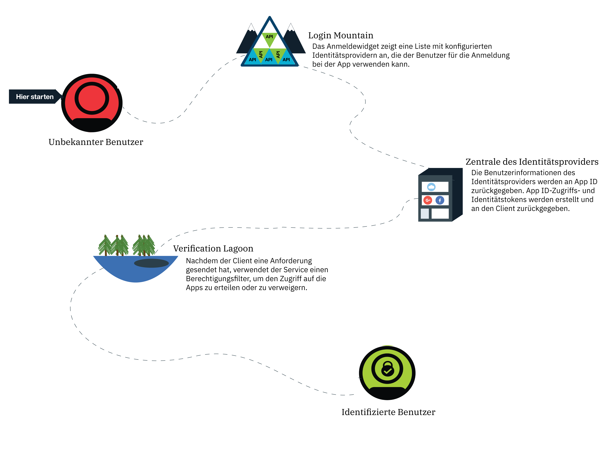
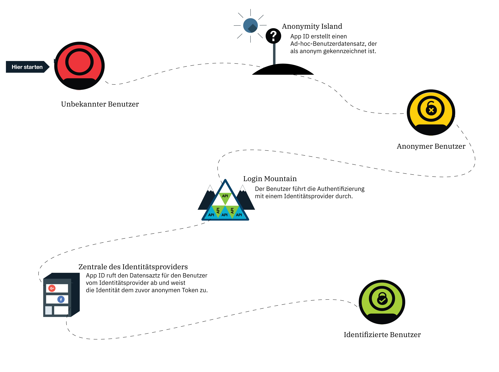

---

copyright:
  years: 2017, 2019
lastupdated: "2019-03-06"

keywords: authentication, authorization, identity, app security, secure, anonymous, progressive, profiles, sign in

subcollection: appid

---

{:new_window: target="_blank"}
{:shortdesc: .shortdesc}
{:screen: .screen}
{:pre: .pre}
{:table: .aria-labeledby="caption"}
{:codeblock: .codeblock}
{:tip: .tip}
{:note: .note}
{:important: .important}
{:deprecated: .deprecated}
{:download: .download}

# Anonyme Authentifizierung
{: #anonymous}

Beim Entwickeln von Apps bildet die Sicherheit eine der zentralen Problemstellungen. Wie kann sichergestellt werden, dass nur Benutzer mit den korrekten Zugriffsberechtigungen Ihre App verwenden? Sie müssen einen Autorisierungsprozess verwenden. In den meisten Prozessen sind Autorisierung und Authentifizierung miteinander gekoppelt, was dazu führen kann, dass Änderungen an Ihren Sicherheitsrichtlinien und Identitätsprovidern kompliziert sind. Bei {{site.data.keyword.appid_full}} sind die Autorisierung und die Authentifizierung separate Prozesse.
{: shortdesc}

Wenn sich ein Benutzer erfolgreich anmeldet, wird er zu einem identifizierten Benutzer. Der Identitätsprovider gibt Zugriffs- und Identitätstokens mit Informationen zum Benutzer an {{site.data.keyword.appid_short}} zurück. Der Service verwendet die bereitgestellten Tokens und stellt fest, ob ein Benutzer über die erforderlichen Berechtigungsnachweise für den Zugriff auf eine App verfügt. Wenn die Tokens validiert sind, autorisiert der Service den Zugriff des Benutzers auf die App. Die Authentifizierungsdaten sind dem Profil der Benutzer zugeordnet, nachdem diese autorisiert wurden. Von jedem Client aus, der mit demselben Identitätsprovider authentifiziert wird, kann auf das Profil und seine Attribute zugegriffen werden.

## Progressive Authentifizierung
{: #progressive}

Mit {{site.data.keyword.appid_short_notm}} kann sich ein anonymer Benutzer entscheiden, ein identifizierter Benutzer zu werden.

Wenn sich ein Benutzer entscheidet, sich nicht sofort anzumelden, wird er als anonymer Benutzer betrachtet. Ein Benutzer könnte beispielsweise sofort mit dem Hinzufügen von Artikeln zu einem Warenkorb beginnen, ohne dass er sich anmeldet. Für anonyme Benutzer erstellt {{site.data.keyword.appid_short_notm}} ein Ad-hoc-Benutzerprofil und ruft die OAuth-Anmelde-API auf, die Zugriffs- und Identitätstokens für den anonymen Zugriff zurückgibt. Mithilfe dieser Tokens kann die App im Benutzerprofil gespeicherte Attribute erstellen, lesen, aktualisieren und löschen.

Wenn sich ein anonymer Benutzer anmeldet, wird sein Zugriffstoken an die Anmelde-API weitergeleitet. Der Service authentifiziert den Aufruf mit einem Identitätsprovider. Der Service verwendet das Zugriffstoken, um das anonyme Profil zu suchen, und ordnet ihm die Identität des Benutzers zu. Die neuen Zugriffs- und Identitätstokens enthalten die öffentlichen Informationen, die vom Identitätsprovider geteilt werden. Nachdem ein Benutzer identifiziert ist, wird sein anonymes Token ungültig. Der Benutzer kann jedoch weiterhin auf seine Attribute zugreifen, da dies mit dem neuen Token möglich ist.

Eine Identität kann nur dann einem anonymen Profil zugewiesen werden, wenn sie nicht bereits einem anderen Benutzer zugewiesen wurde.
{: tip}

Ist die Identität bereits einem anderen {{site.data.keyword.appid_short_notm}}-Benutzer zugewiesen, enthalten die Tokens Informationen zu diesem Benutzerprofil und ermöglichen den Zugriff auf die zugehörigen Attribute. Auf die Attribute des vorherigen anonymen Benutzers kann mit dem neuen Token nicht zugegriffen werden. Solange das Token noch nicht abgelaufen ist, kann auf die Informationen über das anonyme Zugriffstoken zugegriffen werden. Während Sie Ihre App entwickeln, können Sie auswählen, wie die anonymen Attribute mit dem bekannten Benutzer zusammengeführt werden sollen.
