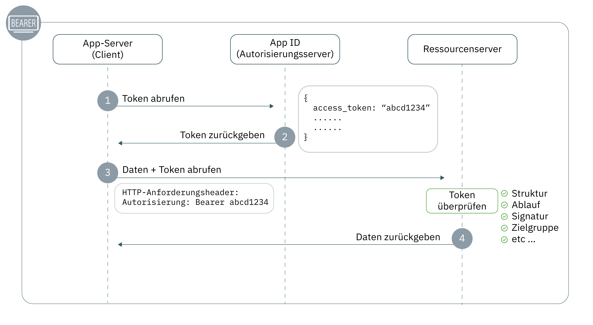

---

copyright:
  years: 2017, 2019
lastupdated: "2019-07-11"

keywords: Authentication, authorization, identity, app security, secure, development, access management, liberty, backend, java, token

subcollection: appid

---

{:external: target="_blank" .external}
{:shortdesc: .shortdesc}
{:screen: .screen}
{:pre: .pre}
{:table: .aria-labeledby="caption"}
{:codeblock: .codeblock}
{:tip: .tip}
{:note: .note}
{:important: .important}
{:deprecated: .deprecated}
{:download: .download}


# Back-End: Liberty for Java
{: #backend-liberty}

Mit {{site.data.keyword.appid_short_notm}} können Sie Ihre API-Endpunkte auf einfache Weise schützen und die Sicherheit Ihrer Back-End-Anwendungen mit Liberty for Java gewährleisten. Mit diesem Handbuch können Sie in weniger als 20 Minuten einen einfachen Authentifizierungsablauf erstellen, der sofort betriebsbereit ist.
{: shortdesc}




1. Um eine Anforderung an eine geschützte Ressource zu stellen, muss ein Client über ein Zugriffstoken verfügen. In Schritt 1 stellt der Client eine Anforderung für ein Token an {{site.data.keyword.appid_short_notm}}. Weitere Informationen zum Abrufen von Zugriffstokens finden Sie unter [Token abrufen](/docs/services/appid?topic=appid-obtain-tokens).
2. {{site.data.keyword.appid_short_notm}} gibt die Tokens zurück. 
3. Mithilfe des Zugriffstokens stellt der Client eine Anforderung für den Zugriff auf die geschützte Ressource. 
4. Die Ressource überprüft das Token einschließlich der Struktur, des Verfallsdatums, der Signatur, der Kennung und anderer vorhandener Felder. Wenn das Token nicht gültig ist, verweigert der Ressourcenserver den Zugriff. Wenn die Tokenvalidierung erfolgreich ist, gibt sie die Daten zurück.


## Schulungsvideo
{: #backend-liberty-video}

Sehen Sie sich das folgende Video an, um zu erfahren, wie Sie {{site.data.keyword.appid_short_notm}} verwenden können, um eine einfache Liberty for Java-Anwendung zu schützen. Alle Informationen aus dem Video können Sie auch in schriftlicher Form auf dieser Seite finden. 

<iframe class="embed-responsive-item" id="appid-liberty-backend-app" title="Informationen zu {{site.data.keyword.appid_short_notm}}" type="text/html" width="640" height="390" src="//www.youtube.com/embed/QA6DY2qqLaw?rel=0" frameborder="0" webkitallowfullscreen mozallowfullscreen allowfullscreen></iframe>

Sie haben keine App, mit der Sie den Ablauf ausprobieren können? Kein Problem! {{site.data.keyword.appid_short_notm}} stellt eine [einfache Liberty for Java-Beispielapp](https://github.com/ibm-cloud-security/appid-video-tutorials/tree/master/02d-simple-liberty-backend-app) zur Verfügung.


## Vorbereitungen
{: #liberty-before}

Bevor Sie {{site.data.keyword.appid_short_notm}} in Ihrer Liberty for Java-Back-End-Anwendung verwenden können, müssen Sie über die folgenden Voraussetzungen verfügen: 

* Eine Instanz des [{{site.data.keyword.appid_short_notm}}-Service](https://cloud.ibm.com/catalog/services/app-id){: external}
* [IBM Cloud-CLI](/docs/cli?topic=cloud-cli-getting-started)
* [Apache Maven 3.5+](https://maven.apache.org/download.cgi){: external}
* [Java 8+](https://www.java.com/download/){: external}
* Die [{{site.data.keyword.appid_short_notm}} Postman-Gruppe](https://github.com/ibm-cloud-security/appid-postman){: external} zum Testen

## Schritt 1: Rufen Sie Ihre Berechtigungsnachweise ab
{: #liberty-obtain-credentials}

Sie können Ihre Berechtigungsnachweise mithilfe einer der folgenden Methoden abrufen.


  * Navigieren Sie zur Registerkarte **Anwendungen** des {{site.data.keyword.appid_short_notm}}-Dashboards. Wenn Sie noch nicht über eine Anwendung verfügen, dann können Sie auf **Anwendung hinzufügen** klicken, um eine neue Anwendung zu erstellen.

  * Durch eine POST-Anforderung an den Endpunkt [`/management/v4/{tenantId}/applications`](https://us-south.appid.cloud.ibm.com/swagger-ui/#!/Applications/registerApplication){: external}.

    Anforderungsformat:
    ```
    curl -X POST \  https://us-south.appid.cloud.ibm.com/management/v4/<tenantID>/applications/ \
    -H 'Content-Type: application/json' \
    -H 'Authorization: Bearer IAM_TOKEN' \
    -d '{"name": "ApplicationName"}'
    ```
    {: codeblock}

    Beispielantwort:
    ```
    {
      "clientId": "xxxxx-34a4-4c5e-b34d-d12cc811c86d",
      "tenantId": "xxxxx-9b1f-433e-9d46-0a5521f2b1c4",
      "secret": "ZDk5YWZkYmYt*******",
      "name": "app1",
      "oAuthServerUrl": "https://us-south.appid.cloud.ibm.com/oauth/v4/xxxxx-9b1f-433e-9d46-0a5521f2b1c4",
      "profilesUrl": "https://us-south.appid.cloud.ibm.com",
      "discoveryEndpoint": "https://us-south.appid.cloud.ibm.com/oauth/v4/xxxxxx-9b1f-433e-9d46-0a5521f2b1c4/.well-known/openid-configuration"
    }
    ```
    {: screen}


## Schritt 2: Konfigurieren Sie die Datei `server.xml`
{: #liberty-configure-server}
 
1. Öffnen Sie die Datei `server.xml`. 
2. Fügen Sie die folgenden Features zum Abschnitt `featureManager` hinzu. Einige Features sind möglicherweise in Liberty integriert. Wenn Sie beim Ausführen des Servers einen Fehler erhalten, können Sie sie installieren, indem Sie `.installUtility install <name_of_server>` im Verzeichnis "bin" Ihrer Liberty-Installation ausführen.

    ```xml
    <featureManager>
        <feature>appSecurity-2.0</feature>
        <feature>openidConnectClient-1.0</feature>
        <feature>ssl-1.0</feature>
        <feature>servlet-3.1</feature>
    </featureManager>
    ```
    {: codeblock}

3. Konfigurieren Sie SSL, indem Sie der Datei `server.xml` folgenden Code hinzufügen. 

    ```xml
    <keyStore id="defaultKeyStore" password="{password}"/>
    <keyStore id="RootCA" password="{password}" location="${server.config.dir}/resources/security/{myTrustStore}"/>
    <ssl id="{sslID}" keyStoreRef="defaultKeyStore" trustStoreRef="{truststore-ref}"/>
    ```
    {: codeblock}

4. Erstellen Sie ein Open ID Connect-Client-Feature und definieren Sie die folgenden Platzhalter. Mit den Berechtigungsnachweisen, die Sie erhalten haben, füllen Sie die Platzhalter aus.

    ```xml
    <openidConnectClient 
        id="oidc-client-simple-liberty-backend-app" 		
        inboundPropagation="required"
        jwkEndpointUrl="{region}.appid.cloud.ibm.com/oauth/v4/{tenantID}/publickeys"
        issuerIdentifier="{region).appid.cloud.ibm.com/oauth/v4/{tenantID}"
        signatureAlgorithm="RS256"
        audiences="{client-id}"
        sslRef="oidcClientSSL"
    /> 	
    ```
    {: codeblock}

    <table>
    <caption>Tabelle. OIDC-Elementvariablen für Liberty for Java-Apps</caption>
        <tr>
            <th colspan="2"> Informationen zu den OIDC-Elementvariablen</th>
        </tr>
        <tr>
            <td><code>id</code></td>
            <td>Der Name Ihrer Anwendung.</td>
        </tr>
        <tr>
            <td><code>inboundPropagation</code></td>
            <td>Für den Wert muss "erforderlich" festgelegt werden, um die im Token empfangenen Informationen weiterleiten zu können.</td>
        </tr>
        <tr>
            <td><code> jwkEndpointUrl </code></td>
            <td>Der Endpunkt, der zum Abrufen von Schlüsseln verwendet wird, um das Token zu validieren. Folgende Regionsoptionen sind verfügbar: <code>au-syd</code>, <code>eu-de</code>, <code>eu-gb</code>, <code>jp-tok</code> und <code>us-south</code>. Sie können Ihre Tenant-ID in den Berechtigungsnachweisen finden, die Sie zuvor erstellt haben. </td>
        </tr>
        <tr>
            <td><code> issuerIdentifier </code></td>
            <td>Die Aussteller-ID definiert Ihren Berechtigungsserver. Folgende Regionsoptionen sind verfügbar: <code>au-syd</code>, <code>eu-de</code>, <code>eu-gb</code>, <code>jp-tok</code> und <code>us-south</code>. Sie können Ihre Tenant-ID in den Berechtigungsnachweisen finden, die Sie zuvor erstellt haben. </td>
        </tr>
        <tr>
            <td><code> signatureAlgorithm </code></td>
            <td>Als "RS256" angegeben.</td>
        </tr>
        <tr>
            <td><code>audiences</code></td>
            <td>Standardmäßig wird das Token für Ihre {{site.data.keyword.appid_short_notm}}-Client-ID ausgegeben, die sich in Ihren Anwendungsberechtigungsnachweisen befindet. </td>
        </tr>
        <tr>
            <td><code>sslRef</code></td>
            <td>Der Name der SSL-Konfiguration, die Sie verwenden möchten. </td>
        </tr>
    </table>

5. Definieren Sie Ihren speziellen Subjekttyp als `ALL_AUTHENTICATED_USERS`.

    ```xml
    <application 
        id="simple-liberty-backend-app" 
        location="location-of-your-war-file" 
        name="simple-liberty-backend-app" 
        type="war">

        <application-bnd>
            <security-role name="myrole">
                <special-subject type="ALL_AUTHENTICATED_USERS"/>
            </security-role>
        </application-bnd>
    </application>
    ```
    {: codeblock}


## Schritt 3: Konfigurieren Sie die Datei `web.xml`
{: #liberty-configure-web}

Definieren Sie in der Datei `web.xml` die Bereiche Ihrer Anwendung, die Sie schützen möchten. 

1. Definieren Sie eine Sicherheitsrolle. Hierbei sollte es sich um die gleiche Rolle handeln, die Sie in der Datei `server.xml` definiert haben.

    ```
    <security-role>
		<role-name>myrole</role-name>
	</security-role>
    ```
    {: codeblock}

2. Definieren Sie eine Integritätsbedingung für die Sicherheit

    ```
	<security-constraint>
		<display-name>Security Constraints</display-name>
		<web-resource-collection>
			<web-resource-name>ProtectedArea</web-resource-name>
			<url-pattern>/api/*</url-pattern>
		</web-resource-collection>
		<auth-constraint>
			<role-name>myrole</role-name>
		</auth-constraint>
		<user-data-constraint>
			<transport-guarantee>NONE</transport-guarantee>
		</user-data-constraint>
	</security-constraint>
    ```
    {: codeblock}


## Schritt 4: Testen Sie Ihre Konfiguration
{: #liberty-test}

Jetzt haben Sie die Erstinstallation beendet, die App erstellt und Ihre Konfiguration getestet, um sicherzustellen, dass alles wie erwartet funktioniert. 

1. Wechseln Sie in Ihr Anwendungsverzeichnis.

2. Erstellen Sie Ihre Anwendung.

    ```
    server run
    ```
    {: codeblock}

3. Stellen Sie eine Anforderung an den geschützten Endpunkt. Es wird ein Fehler zurückgegeben.

4. [Rufen Sie ein Zugriffstoken ab](/docs/services/appid?topic=appid-obtain-tokens).

5. Stellen Sie mit dem Zugriffstoken, das Sie im vorherigen Schritt erhalten haben, eine Anforderung an den Endpunkt. Sie sollten jetzt in der Lage sein, auf den geschützten Endpunkt zuzugreifen. Überprüfen Sie, dass die Antwort den erwarteten Inhalt aufweist. 


## Nächste Schritte
{: #liberty-next}

Sind Sie bereit, Ihre Authentifizierungserfahrung zu perfektionieren? Lesen Sie dazu in [diesem Blog](https://www.ibm.com/cloud/blog/perfecting-the-login-experience-with-liberty-oauth2-and-appid){: external} oder erfahren Sie in der Dokumentation mehr über die [App-zu-App-Kommunikation](/docs/services/appid?topic=appid-app).


