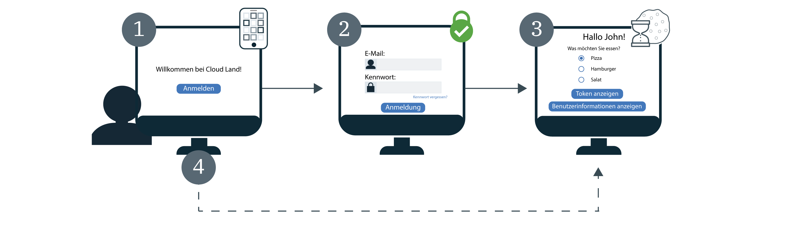

---

copyright:
  years: 2017, 2019
lastupdated: "2019-04-04"

keywords: authentication, authorization, identity, app security, secure, development, sso, directory, users, registry, multiple apps

subcollection: appid

---

{:new_window: target="_blank"}
{:shortdesc: .shortdesc}
{:screen: .screen}
{:pre: .pre}
{:table: .aria-labeledby="caption"}
{:codeblock: .codeblock}
{:tip: .tip}
{:note: .note}
{:important: .important}
{:deprecated: .deprecated}
{:download: .download}


# Single Sign-on (SSO)
{: #cd-sso}

Mit Single Sign-on (SSO) for Cloud Directory können Sie Ihren Benutzern eine reibungslose Authentifizierung zwischen mehreren Web-Apps bieten. Wenn SSO bei der Erstanmeldung eines Benutzers aktiviert wird, dann müssen bei der nächsten Anmeldung die Berechtigungsnachweise nicht erneut eingegeben werden. Stattdessen wird der Benutzer automatisch bei allen Ihren Apps angemeldet, die mit derselben {{site.data.keyword.appid_short_notm}}-Instanz geschützt werden.


## Funktionsweise
{: #cd-sso-how-it-works}

Im folgenden Diagramm ist die Funktionsweise von SSO dargestellt.



1. Ein Cloud Directory-Benutzer meldet sich bei Ihrer App zum ersten Mal an.
2. Der Benutzer wird aufgefordert, sich durch Angabe eines Benutzernamens oder einer E-Mail-Adresse sowie eines zugehörigen Kennworts zu authentifizieren.
3. Wenn die Berechtigungsnachweise gültig sind, dann wird der Benutzer bei Ihrer App angemeldet. Gleichzeitig erstellt {{site.data.keyword.appid_short_notm}} eine Sitzung und legt im Browser des Benutzers ein Cookie fest.
4. Wenn der Benutzer versucht, sich bei einer Ihrer anderen Anwendungen anzumelden, dann erkennt {{site.data.keyword.appid_short_notm}} das Sitzungscookie und meldet den Benutzer automatisch bei Ihrer App an. {{site.data.keyword.appid_short_notm}}-Sitzungscookies sind instanzspezifisch und werden mit dem eindeutigen privaten Schlüssel der Instanz signiert.

Wenn Ihre Instanz so konfiguriert ist, dass Identitätsprovider (z. B. SAML oder Facebook) zusammen mit Cloud Directory verwendet werden, dann wird weiterhin das Anmeldewidget angezeigt. Benutzter werden zur Eingabe ihrer Cloud Directory-Berechtigungsnachweise oder zur Auswahl eines der anderen Provider aufgefordert, auch wenn sie über eine gültige SSO-Sitzung verfügen.
{: note}


## SSO konfigurieren
{: #cd-sso-configure}

Sie können Single Sign-on konfigurieren, indem Sie das {{site.data.keyword.appid_short_notm}}-Dashboard oder die APIs verwenden.
{: shortdesc}


### Mit der GUI
{: #cd-sso-configure-gui}


Sie können SSO über die GUI konfigurieren.

1. Navigieren Sie zur Registerkarte **Cloud Directory > Single Sign-on** des {{site.data.keyword.appid_short_notm}}-Dashboards.

2. Legen Sie im Feld **Single Sign-on aktivieren** für SSO die Einstellung **Aktiviert** fest.

3. Legen Sie die Zeitdauer fest, für die ein Benutzer inaktiv sein kann, bevor die SSO-Sitzung abläuft. Läuft die Sitzung ab, dann muss sich der Benutzer erneut anmelden. Die Zeitdauer wird in Minuten angegeben und das zulässige Maximum für die Inaktivität beträgt 10.080 Minuten (7 Tage). Die Standardzeitdauer beträgt 1440 Minuten (1 Tag).

4. Fügen Sie die Weiterleitungs-URIs im Feld **Weiterleitungs-URI für Abmeldung** hinzu und klicken Sie dann auf das Pluszeichen (**+**). Beachten Sie hierbei unbedingt, dass nur Anwendungen registriert werden sollten, die Sie als vertrauenswürdig einstufen. Wenn Sie den URI registrieren, autorisieren Sie {{site.data.keyword.appid_short_notm}}, ihn in den Autorisierungsworkflow einzubinden.

5. Klicken Sie auf **Speichern**.


### Mit der API
{: #cd-sso-configure-api}

Sie können über die Administrator-API für die SSO-Konfiguration drei Einstellungen definieren, um das Feature zu aktivieren.

Beispielaufruf:

```json
{
  "isActive": true,
  "inactivityTimeoutSeconds": 86400,
  "logoutRedirectUris": [
    "http://my-first-app.com/after_logout",
    "http://my-second-app.com/after_logout"
  ]
}
```
{: screen}

<table>
  <tr>
    <th>Einstellung</th>
    <th>Definition</th>
  </tr>
  <tr>
    <td><code>isActive</code></td>
    <td>Um SSO zu aktivieren, müssen Sie diesen Wert auf <code>true</code> setzen. Die Standardeinstellung ist <code>false</code>.</td>
  </tr>
  <tr>
    <td><code>inactivityTimeoutSeconds</code></td>
    <td>Die längste Zeitdauer ohne Benutzeraktivität, nach deren Ablauf der Benutzer seine Berechtigungsnachweise erneut eingeben muss. Dieser Wert wird in Sekunden angegeben und kann maximal <code>604800 Sekunden</code> (7 Tage) betragen. Die Standardeinstellung ist <code>86400 Sekunden</code> (1 Tag).</td>
  </tr>
  <tr>
    <td><code>logoutRedirectUris</code></td>
    <td>Eine durch Kommas getrennte Liste zulässiger URIs, an die {{site.data.keyword.appid_short_notm}} Ihre Benutzer nach deren Abmeldung weiterleiten kann.</td>
  </tr>
</table>


## Abmeldung konfigurieren
{: #cd-sso-log-out}

Mit {{site.data.keyword.appid_short_notm}} können Sie die SSO-Sitzung eines Benutzers im aktuellen Browser beenden. Wenn im Browser des Benutzers auf den API-Endpunkt zugegriffen wird, dann wird die Sitzung beendet und der Benutzer wird beim nächsten Anmeldeversuch in diesem Browser für jede Ihrer Apps zur Eingabe seiner Berechtigungsnachweise aufgefordert.
{: shortdesc}


Wenn einer der Abläufe zum Ändern, Zurücksetzen oder Erneuern des Kennworts gestartet wird, dann werden für den Benutzer die Sitzungen aller Clients automatisch beendet.
{: note}


### Mit der API
{: #cd-sso-log-out-api}

Um einen Benutzer abzumelden, muss der Browser mithilfe der verfügbaren Informationen weitergeleitet werden, um den folgenden API-Aufruf auszuführen.

```
https://<region>.appid.cloud.ibm.com/oauth/v4/<tenant-id>/cloud_directory/sso/logout?redirect_uri=<redirect_uri>&client_id=<clientId>
```
{: pre}

<table>
  <tr>
    <th>Variable</th>
    <th>Wert</th>
  </tr>
  <tr>
    <td><code>Region</code></td>
    <td>Die Region, in der Ihre Instanz von {{site.data.keyword.appid_short_notm}} bereitgestellt wird. Folgende Optionen sind verfügbar: <code>au-syd</code>, <code>eu-de</code>, <code>eu-gb</code>, <code>jp-tok</code> und <code>us-south</code>.</td>
  </tr>
  <tr>
    <td><code>tenant-id</code></td>
    <td>Die eindeutige ID Ihrer {{site.data.keyword.appid_short_notm}}-Instanz. Dieser Wert befindet sich auf der Registerkarte <em>Serviceberechtigungsnachweise</em> des {{site.data.keyword.appid_short_notm}}-Dashboards. Wenn Sie nicht über eine Gruppe von Serviceberechtigungsnachweisen verfügen, können Sie eine solche Gruppe erstellen und den Wert aus dieser Gruppe verwenden.</td>
  </tr>
  <tr>
    <td><code>redirect_uri</code></td>
    <td>Ein URI, den Sie in Ihrer SSO-Konfiguration über das {{site.data.keyword.appid_short_notm}}-Dashboard angegeben haben. Aus Sicherheitsgründen kann keine Weiterleitung durchgeführt werden, wenn Sie keinen Wert angeben. In diesem Fall wird ein Fehler angezeigt.</td>
  </tr>
</table>

Auch wenn die SSO-Sitzung beendet wird, muss ein Benutzer mit einem gültigen Zugriffstoken, das in der Sitzung des Benutzers gespeichert ist, seine Berechtigungsnachweise möglicherweise erst dann erneut eingeben, wenn die Gültigkeit des Tokens abläuft. Standardmäßig läuft die Gültigkeit des Tokens nach einer Stunde ab.
{: note}


### Mit dem SDK des Node.JS-Servers
{: #cd-sso-log-out-nodejs}

Sie können auch das SDK des {{site.data.keyword.appid_short_notm}}-Node.js-Servers verwenden, um die Weiterleitung automatisch durchzuführen.

Beispiel:

```javascript
app.get('/logoutSSO', (req, res) => {
  res.clearCookie("refreshToken");
  webAppStrategy.logoutSSO(req,res, { "redirect_uri": "https://my-app.com/after_logout" });
  });
```
{: screen}


## Alle Sitzungen eines Benutzers beenden
{: cd-sso-ending-all-sessions}

Als Administrator können Sie alle SSO-Sitzungen eines bestimmten Benutzers über die {{site.data.keyword.appid_short_notm}}-Administrator-APIs beenden. Die APIs werden mithilfe eines Cloud IAM-Tokens geschützt.

Beispiel für API-Anforderung:

```
POST https://<region>.appid.cloud.ibm.com/management/v4/{tenant-id}/cloud_directory/Users/{user-id}/sso/logout
Headers:
Authorization: <IAM TOKEN>
```
{: pre}

<table>
  <tr>
    <th>Variable</th>
    <th>Wert</th>
  </tr>
  <tr>
    <td><code>Region</code></td>
    <td>Die Region, in der Ihre Instanz von {{site.data.keyword.appid_short_notm}} bereitgestellt wird. Folgende Optionen sind verfügbar: <code>us-south</code>, <code>eu-gb</code> und <code>eu-de</code>.</td>
  </tr>
  <tr>
    <td><code>tenant-id</code></td>
    <td>Die eindeutige ID Ihrer {{site.data.keyword.appid_short_notm}}-Instanz. Dieser Wert befindet sich auf der Registerkarte <em>Serviceberechtigungsnachweise</em> des {{site.data.keyword.appid_short_notm}}-Dashboards. Wenn Sie nicht über eine Gruppe von Serviceberechtigungsnachweisen verfügen, können Sie eine solche Gruppe erstellen und den Wert aus dieser Gruppe verwenden.</td>
  </tr>
  <tr>
    <td><code>user-id</code></td>
    <td>Die eindeutige ID eines Cloud Directory-Benutzers. Sie können die ID mithilfe der [Cloud Directory-Benutzer-APIs](https://us-south.appid.cloud.ibm.com/swagger-ui/#/) oder durch Anzeigen des Identitätstokens des Benutzers anfordern.</td>
  </tr>
</table>

Wenn Sie diese API aufrufen, dann werden alle SSO-Sitzungen des angegebenen Benutzers inaktiviert. Dies bedeutet, dass der Benutzer beim nächsten Anmeldeversuch bei einer Ihrer Apps über jede Einheit und jeden Browser zur erneuten Eingabe seiner Berechtigungsnachweise aufgefordert wird.

