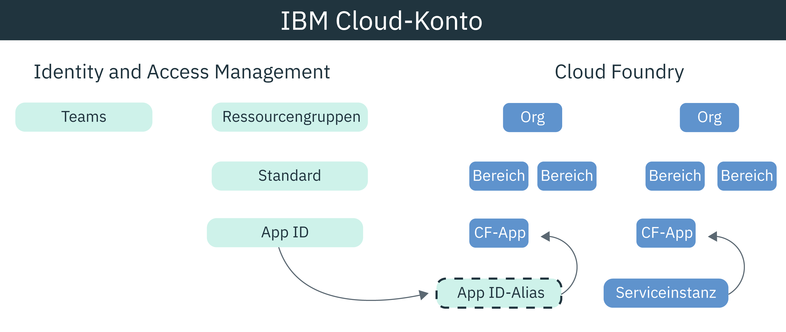

---

copyright:
  years: 2017, 2019
lastupdated: "2019-03-20"

keywords: authentication, authorization, identity, app security, secure, development, cloud foundry, access management, iam, java, node.js

subcollection: appid

---

{:new_window: target="_blank"}
{:shortdesc: .shortdesc}
{:screen: .screen}
{:pre: .pre}
{:table: .aria-labeledby="caption"}
{:codeblock: .codeblock}
{:tip: .tip}
{:note: .note}
{:important: .important}
{:deprecated: .deprecated}
{:download: .download}


# Lernprogramm: Cloud Foundry zur Verwendung von {{site.data.keyword.appid_short_notm}} konfigurieren
{: #cloud-foundry}

Mit {{site.data.keyword.cloud_notm}} können Sie Ihre Apps mit zwei verschiedenen Typen des Zugriffsmanagements (Identity and Access Management (IAM) und Cloud Foundry) schützen. Standardmäßig verwenden alle neuen Instanzen von {{site.data.keyword.appid_short_notm}} IAM-Ressourcengruppen für das Zugriffsmanagement. Wenn Sie zum Verwalten Ihrer Anwendung Cloud Foundry verwenden, können Sie die Managementmodelle verbinden, indem Sie einen Servicealias erstellen und den Service an die App binden.
{: shortdesc}


## Informationen zu Cloud Foundry
{: #cf-understand}

Ein Alias erstellt eine Verbindung zwischen Ihrem von IAM verwalteten Service (z. B. {{site.data.keyword.appid_short_notm}}) und Ihrer Cloud Foundry-Anwendung. Wenn Sie eine Anwendung binden, werden Serviceberechtigungsnachweise erstellt und automatisch an die App übergeben. Obwohl die Bindung ein erforderlicher Schritt in der Konfiguration ist, hat sie die folgenden Vorteile:

* Automatisierung: Da die Serviceberechtigungsnachweise nun in der Umgebungsvariablen VCAP_SERVICES gespeichert sind, müssen Sie sie nicht mehr manuell in die App kopieren. Alle erforderlichen Operationen werden für Sie im Hintergrund mit den {{site.data.keyword.appid_short_notm}}-SDKs ausgeführt.
* Sicherheit: Die Konfiguration wird fehlerresistent, da der Prozess automatisch ausgeführt wird.
* Sicherheit: Die zugriffsrelevanten Operationen sind in Ihrer Anwendung nicht fest codiert, da die Serviceberechtigungsnachweise nur in den Umgebungsvariablen vorhanden sind.

Wird Ihre Cloud Foundry-App auf einer anderen Plattform gehostet? Das ist kein Problem. Sie können Anwendungsberechtigungsnachweise in Ihrer App definieren, um eine Bindung zum Service herzustellen. Sie können Ihre Anwendungsberechtigungsnachweise über das {{site.data.keyword.appid_short_notm}}-Dashboard suchen oder hierzu eine Anforderung an den [Endpunkt /applications](https://us-south.appid.cloud.ibm.com/swagger-ui/#!/Applications/registerApplication) absetzen.
{: tip}

Im folgenden Diagramm wird das Zusammenspiel der Modelle dargestellt:



## Vorbereitungen
{: #cf-before}

Bevor Sie beginnen, müssen Sie sicherstellen, dass die folgenden vorausgesetzten Komponenten vorhanden sind:

* Ein {{site.data.keyword.cloud_notm}}-Konto
* Eine Instanz von {{site.data.keyword.appid_short_notm}}
* Eine lokal installierte Instanz der [{{site.data.keyword.cloud_notm}}-CLI](/docs/cli/reference/ibmcloud?topic=cloud-cli-ibmcloud-cli#ibmcloud-cli)

## Node.js-App bereitstellen
{: #cf-node}


1. Navigieren Sie zu Ihrer {{site.data.keyword.appid_short_notm}}-Instanz.

2. Klicken Sie auf der Registerkarte **Übersicht** des Service-Dashboards auf **Beispiel herunterladen**.

3. Klicken Sie auf **Node.js**. Laden Sie die Beispielapp herunter und extrahieren Sie sie.

4. Überprüfen Sie, ob alle Voraussetzungen für Node.js erfüllt sind.

5. Öffnen Sie das Terminal und wechseln Sie in den Beispielordner.

6. Melden Sie sich bei der {{site.data.keyword.cloud_notm}}-CLI an. Daraufhin werden Sie von der CLI aufgefordert, ein Konto und eine Region auszuwählen, wenn Sie keine entsprechenden Angaben gemacht haben.

  ```
  ibmcloud login -a cloud.ibm.com -r <region>
  ```
  {: pre}

  <table>
    <tr>
      <th>Region</th>
      <th>Endpunkt</th>
    </tr>
    <tr>
      <td>Dallas</td>
      <td><code>us-south</code></td>
    </tr>
    <tr>
      <td>Frankfurt</td>
      <td><code>eu-de</code></td>
    </tr>
    <tr>
      <td>Sydney</td>
      <td><code>au-syd</code></td>
    </tr>
    <tr>
      <td>London</td>
      <td><code>eu-gb</code></td>
    </tr>
    <tr>
      <td>Tokio</td>
      <td><code>jp-tok</code></td>
    </tr>
  </table>

7. Befolgen Sie die Eingabeaufforderungen des Systems, um die Cloud Foundry-Organisation und den entsprechenden Bereich, in denen Sie arbeiten wollen, als Ziel anzugeben.

  ```
  ibmcloud target --cf
  ```
  {: pre}

8. Erstellen Sie einen Alias für die {{site.data.keyword.appid_short_notm}}-Serviceinstanz.

  ```
  ibmcloud resource service-alias-create {ALIAS_NAME} --instance-name {SERVICE_INSTANCE_NAME}
  ```
  {: pre}

9. Bearbeiten Sie die Host- und Namenswerte in der Datei `manifest.yml` Ihres Projekts mit den Informationen, die im vorherigen Befehl abgerufen wurden. Fügen Sie den Alias, den Sie erstellen, zu Ihren Services hinzu.

10. Binden Sie die Services, die in der Datei `manifest.yml` aufgelistet werden, indem Sie eine Beispielapp bereitstellen.

  ```
  ibmcloud app push
  ```
  {: pre}

## Java-App bereitstellen
{: #java}

1. Navigieren Sie zu Ihrer {{site.data.keyword.appid_short_notm}}-Instanz.

2. Klicken Sie auf der Registerkarte **Übersicht** des Service-Dashboards auf **Beispiel herunterladen**.

3. Klicken Sie auf **Java**. Laden Sie die Beispielapp herunter und extrahieren Sie sie.

4. Überprüfen Sie, ob alle Voraussetzungen für Java erfüllt sind.

5. Öffnen Sie das Terminal und wechseln Sie in den Beispielordner.

6. Generieren Sie Ihre `WAR`-Datei und laden Sie sie hoch.

  ```
  mvn clean install
  ```
  {: pre}

7. Wechseln Sie in den Ordner 'Liberty'.

8. Melden Sie sich bei der {{site.data.keyword.cloud_notm}}-CLI an. Daraufhin werden Sie von der CLI aufgefordert, ein Konto und eine Region auszuwählen, wenn Sie keine entsprechenden Angaben gemacht haben.

  ```
  ibmcloud login -a cloud.ibm.com -r <region>
  ```
  {: pre}

8. Befolgen Sie die Eingabeaufforderungen des Systems, um die Cloud Foundry-Organisation und den entsprechenden Bereich, in denen Sie arbeiten wollen, als Ziel anzugeben.

  ```
  ibmcloud target --cf
  ```
  {: pre}

10. Erstellen Sie einen Alias für die {{site.data.keyword.appid_short_notm}}-Serviceinstanz.

  ```
  ibmcloud resource service-alias-create {ALIAS_NAME} --instance-name {SERVICE_INSTANCE_NAME}
  ```
  {: pre}

11. Bearbeiten Sie die Host- und Namenswerte in der Datei `manifest.yml` Ihres Projekts mit den Informationen, die im vorherigen Befehl abgerufen wurden. Fügen Sie den Alias, den Sie erstellen, zu Ihren Services hinzu.

  Beispiel:
  ```
    applications:
  - name: ApplicationName
    host: HostName
    buildpack: liberty-for-java
    instances: 1
    memory: 512M
    disk_quota: 1024M
    timeout: 180
    services:
    - AppID-alias
  ```
  {: screen}

13. Binden Sie die Services, die in der Datei `manifest.yml` aufgelistet werden, indem Sie eine Beispielapp bereitstellen.

  ```
  ibmcloud app push
  ```
  {: pre}

