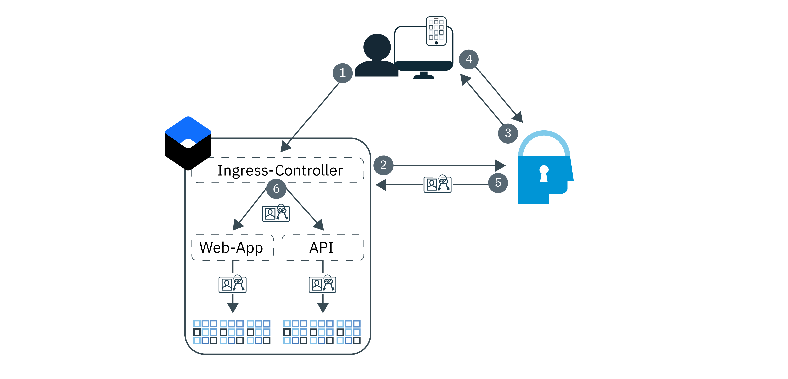

---

copyright:
  years: 2017, 2019
lastupdated: "2019-03-21"

keywords: authentication, authorization, identity, app security, secure, development, ingress, policy, networking, containers, kubernetes

subcollection: appid

---

{:new_window: target="_blank"}
{:shortdesc: .shortdesc}
{:screen: .screen}
{:pre: .pre}
{:table: .aria-labeledby="caption"}
{:codeblock: .codeblock}
{:tip: .tip}
{:note: .note}
{:important: .important}
{:deprecated: .deprecated}
{:download: .download}


# Lernprogramm: Ingress zur Verwendung von {{site.data.keyword.appid_short_notm}} konfigurieren
{: #kube-auth}

Sie können die Verwendung der richtlinienbasierten Sicherheit konsistent durchsetzen, indem Sie die Ingress-Netzbetriebsfunktion in {{site.data.keyword.containerlong}} nutzen. Mit diesem Ansatz können Sie die Autorisierung und Authentifizierung aller Anwendungen in Ihrem Cluster gleichzeitig aktivieren, ohne dass hierzu der App-Code geändert werden muss. In diesem in einzelne Arbeitsschritte aufgegliederten Leitfaden erfahren Sie, wie Sie den Ingress-Controller zur Verwendung von {{site.data.keyword.appid_short_notm}} konfigurieren.
{: shortdesc}

Im folgenden Diagramm ist der Authentifizierungsablauf dargestellt:



1. Ein Benutzer öffnet Ihre Anwendung und löst eine Anforderung an die Web-App oder API aus.
2. Für den API-Ablauf versucht der Ingress-Controller, die angegebenen Tokens zu validieren. Wenn der Webablauf verwendet wird, wird ein OIDC-Authentifizierungsprozess mit drei Teilen gestartet.
3. {{site.data.keyword.appid_short_notm}} beginnt den Authentifizierungsprozess mit der Anzeige des Anmeldewidgets.
4. Der Benutzer gibt einen Benutzernamen oder eine E-Mail-Adresse und ein zugehöriges Kennwort an.
5. Der Ingress-Controller ruft Zugriffs- und Identitätstokens für die Autorisierung aus {{site.data.keyword.appid_short_notm}} ab.
6. Jede Anforderung, die validiert und vom Ingress-Controller an Ihre Apps weitergeleitet wird, verfügt über einen Autorisierungsheader, der die Tokens enthält.

Die Integration des Ingress-Controllers mit {{site.data.keyword.appid_short_notm}} bietet momentan keine Unterstützung für Aktualisierungstokens. Wenn die Gültigkeit Ihrer Zugriffs- und Identitätstokens abläuft, dann müssen Sie sich erneut authentifizieren.
{: note}


## Vorbereitende Schritte
{: #kube-prereqs}

Bevor Sie beginnen können, müssen Sie sicherstellen, dass die folgenden vorausgesetzten Komponenten vorhanden sind.
{: shortdesc}

Aus Sicherheitsgründen unterstützt die {{site.data.keyword.appid_short_notm}}-Authentifizierung nur Back-End-Einheiten, für die TLS/SSL aktiviert wurde.
{: note}

* Eine App oder Beispiel-App.
* Ein Standard-Kubernetes-Cluster mit mindestens zwei Worker-Knoten pro Zone. Wenn Sie Ingress in Clustern mit mehreren Zonen verwenden, dann überprüfen Sie die zusätzlichen Voraussetzungen, die in der [Kubernetes-Service-Dokumentation](/docs/containers?topic=containers-ingress#config_prereqs) aufgeführt sind.
* Eine Instanz von {{site.data.keyword.appid_short_notm}} in derselben Region, in der auch Ihr Cluster bereitgestellt wurde. Vergewissern Sie sich, dass der Servicename keine Leerzeichen enthält.

* Die folgenden [{{site.data.keyword.cloud_notm}}-IAM-Rollen](/docs/containers?topic=containers-access_reference#access_reference):
  * Cluster: Plattformrolle 'Administrator'
  * Kubernetes-Namensbereiche: Servicerolle 'Manager'

* Die folgenden CLIs:

  * [{{site.data.keyword.cloud_notm}}](/docs/cli/reference/ibmcloud/cloud-cli-install_use?topic=cloud-cli-ibmcloud-cli#ibmcloud-cli)
  * [Kubernetes](https://kubernetes.io/docs/tasks/tools/install-kubectl/)
  * [Docker](https://www.docker.com/products/docker-engine#/download)

* Die folgenden [{{site.data.keyword.cloud_notm}}-CLI-Plug-ins](/docs/cli/reference/ibmcloud?topic=cloud-cli-plug-ins#plug-ins):

  * Kubernetes-Service
  * Container-Registry

Wenn Sie Hilfe beim Herunterladen der CLIs und Plug-ins sowie beim Konfigurieren der Kubernetes-Service-Umgebung benötigen, dann machen Sie sich mit dem Lernprogramm zum [Erstellen von Kubernetes-Clustern](/docs/containers?topic=containers-cs_cluster_tutorial#cs_cluster_tutorial_lesson1) vertraut.
{: tip}

Jetzt kann es losgehen!

## Schritt 1: Bindung zwischen {{site.data.keyword.appid_short_notm}} und Ihrem Cluster herstellen
{: #kube-create-appid}

Sie können Ihre Instanz von {{site.data.keyword.appid_short_notm}} an Ihren Cluster binden, um allen Instanzen Ihrer App, die in Ihrem Cluster bereitgestellt werden, die Nutzung derselben App ID-Instanz zu ermöglichen. Durch die Bindung Ihrer Serviceinstanz an Ihren Cluster stehen Ihre {{site.data.keyword.appid_short_notm}}-Metadaten und -Berechtigungsnachweise als geheime Kubernetes-Schlüssel zur Verfügung, sobald Ihre Anwendung gestartet wird.
{: shortdesc}


1. Melden Sie sich bei der {{site.data.keyword.cloud_notm}}-CLI an. Folgen Sie den Eingabeaufforderungen in der CLI, um die Anmeldung durchzuführen.

  ```
  ibmcloud login -a cloud.ibm.com -r <region>
  ```
  {: codeblock}

  <table>
    <tr>
      <th>Region</th>
      <th>Endpunkt</th>
    </tr>
    <tr>
      <td>Dallas</td>
      <td><code>us-south</code></td>
    </tr>
    <tr>
      <td>Frankfurt</td>
      <td><code>eu-de</code></td>
    </tr>
    <tr>
      <td>Sydney</td>
      <td><code>au-syd</code></td>
    </tr>
    <tr>
      <td>London</td>
      <td><code>eu-gb</code></td>
    </tr>
    <tr>
      <td>Tokio</td>
      <td><code>jp-tok</code></td>
    </tr>
  </table>

2. Legen Sie den Kontext für Ihren Cluster fest.

  1. Rufen Sie den Befehl ab, um die Umgebungsvariable festzulegen, und laden Sie die Kubernetes-Konfigurationsdateien herunter.

    ```
    ibmcloud ks cluster-config <cluster_name_or_ID>
    ```
    {: codeblock}

  2. Kopieren Sie die Ausgabe beginnend bei `export` und fügen Sie sie in Ihr Terminal ein, um die Umgebungsvariable `KUBECONFIG` festzulegen.

3. Überprüfen Sie, ob Sie bereits über einen Ingress-Controller in Ihrem Standardnamensbereich verfügen. Der IBM Cloud Kubernetes-Service unterstützt eine Ingress-Instanz pro Namensbereich. Wenn Sie bereits über eine solche Instanz verfügen, dann können Sie die vorhandene Ingress-Konfiguration aktualisieren oder einen anderen Namensbereich verwenden.

  ```
  kubectl get ingress
  ```
  {: pre}

4. Binden Sie Ihre Instanz von {{site.data.keyword.appid_short_notm}}. Durch das Binden wird ein Serviceschlüssel für die Serviceinstanz erstellt. Sie können einen vorhandenen Serviceschlüssel angeben, indem Sie das Flag `-key` verwenden.

  ```
  ibmcloud ks cluster-service-bind --cluster <cluster_name_or_ID> --namespace <namespace> --service <App-ID_instance_name> [--key <service_instance_key>]
  ```
  {: pre}

  Wenn Sie keinen Namensbereich angeben, dann wird der geheime Schlüssel im Namensbereich `default` erstellt.
  {: tip}

  Beispielausgabe:

  ```
  ibmcloud ks cluster-service-bind --cluster mycluster --namespace default --service appid1
  Binding service instance to namespace...
  OK
  Namespace:    default
  Secret name:  binding-appid1
  ```
  {: screen}

Ganz hervorragend!

## Schritt 2: App mit einer Push-Operation ins Container-Registry übertragen
{: #kube-registry}

Damit Ihre Anwendung in Kubernetes ausgeführt werden kann, müssen Sie sie in einer Registry hosten.
{: shortdesc}


1. Melden Sie sich beim CLI-Plug-in der Container-Registry an.

  ```
  ibmcloud cr login
  ```
  {: pre}

2. Erstellen Sie einen Container-Registry-Namensbereich.

  ```
  ibmcloud cr namespace-add <my_namespace>
  ```
  {: pre}

3. Erstellen, kennzeichnen und übertragen Sie die App als Bild mit einer Push-Operation in den Namensbereich der Container-Registry. Vergewissern Sie sich, dass der Punkt (.) am Ende des Befehls angegeben ist.

  ```
  ibmcloud cr build -t registry.<region>.bluemix.net/<namespace>/<app-name>:<tag> .
  ```
  {: pre}

Prima! Sie sind fast fertig mit den Vorbereitungen für die Bereitstellung.

## Schritt 3: Ingress konfigurieren
{: kube-ingress}

Während der Clustererstellung werden sowohl ein privater als auch ein öffentlicher Ingress-ALB für Sie erstellt. Um Ihre Anwendung bereitzustellen und die Vorteile Ihres Ingress-Controllers zu nutzen, müssen Sie ein Bereitstellungsscript erstellen.
{: shortdesc}

1. Rufen Sie den geheimen Schlüssel ab, der in Ihrem Cluster-Namensbereich erstellt wurde, als Sie {{site.data.keyword.appid_short_notm}} an Ihren Cluster gebunden haben. Hinweis: Hierbei handelt es sich **nicht** um Ihren Container-Registry-Namensbereich.

  ```
  kubectl get secrets --namespace=<namespace>
  ```
  {: pre}

  Beispielausgabe:

  ```
  NAME                       TYPE                                  DATA      AGE
  binding-appid1             Opaque                                1         1m
  bluemix-default-secret     kubernetes.io/dockercfg               1         1h
  default-token-kf97z        kubernetes.io/service-account-token   3         1h
  ```
  {: screen}

2. Verwenden Sie die folgende `yaml`-Beispieldatei, um Ihre Ingress-Konfiguration zu erstellen. Wenn Sie Hilfe beim Definieren der restlichen Bereitstellung benötigen, dann lesen Sie die Informationen im Abschnitt zur [Bereitstellung von Apps mit der CLI](/docs/containers?topic=containers-app#app_cli).

  ```
  apiVersion: extensions/v1beta1
  kind: Ingress
  metadata:
    name: myingress
    annotations:
      ingress.bluemix.net/appid-auth: "bindSecret=<bind_secret> namespace=<namespace> requestType=<request_type> serviceName=<myservice> [idToken=false]"
  spec:
    tls:
    - hosts:
      - mydomain
      secretName: mytlssecret
    rules:
    - host: mydomain
      http:
        paths:
        - path: /
          backend:
            serviceName: myservice
            servicePort: 8080
  ```
  {: screen}

  <table>
    <tr>
      <th>Variable</th>
      <th>Beschreibung</th>
    </tr>
    <tr>
      <td><code>bindSecret</code></td>
      <td>Der geheime Kubernetes-Schlüssel, der erstellt wurde, als Sie Ihre {{site.data.keyword.appid_short_notm}}-Serviceinstanz an Ihren Cluster gebunden haben.</td>
    </tr>
    <tr>
      <td><code>namespace</code></td>
      <td>Der Namensbereich, in dem <code>bindSecret</code> erstellt wurde. Wenn Sie keinen Namensbereich angegeben haben, wird der Standardnamensbereich (<code>default</code>) verwendet.</td>
    </tr>
    <tr>
      <td><code>requestType</code></td>
      <td><p>Der Typ der Anforderung, die an {{site.data.keyword.appid_short_notm}} gesendet werden soll. Folgende Optionen sind verfügbar: <code>web</code> und <code>api</code>. Wenn Sie als Anforderungstyp <code>web</code> festlegen, dann wird eine Webanforderung, die ein {{site.data.keyword.appid_short_notm}}-Zugriffstoken enthält, validiert. Schlägt die Tokenvalidierung fehl, dann wird die Webanforderung zurückgewiesen. Enthält die Anforderung kein Zugriffstoken, dann wird die Anforderung an die {{site.data.keyword.appid_short_notm}}-Anmeldeseite weitergeleitet. Damit die {{site.data.keyword.appid_short_notm}}-Webauthentifizierung funktioniert, müssen im Browser des Benutzers Cookies aktiviert werden.</p><p>Wenn Sie als Anforderungstyp <code>api</code> festlegen, dann wird eine API-Anforderung, die ein {{site.data.keyword.appid_short_notm}}-Zugriffstoken enthält, validiert. Enthält die Anforderung kein Zugriffstoken, dann wird eine Fehlernachricht vom Typ <code>401: Unauthorized</code> an den Benutzer zurückgegeben.</p></td>
    </tr>
    <tr>
      <td><code>serviceName</code></td>
      <td><p>Erforderlich: Der Name des Kubernetes-Service, den Sie für Ihre App erstellt haben. Wenn kein Servicename angegeben wird, dann aktiviert das System die Annotation für alle Services.</p> <p>Wenn Sie mehrere Anforderungstypen in demselben Cluster verwenden möchten, konfigurieren Sie eine Instanz von {{site.data.keyword.appid_short_notm}}, die <code>web</code> verwendet, und eine weitere Instanz, die <code>api</code>verwendet.</p></td>
    </tr>
    <tr>
      <td><code>idToken</code></td>
      <td>Optional: Der Liberty-OIDC-Client kann das Zugriffs- und das Identitätstoken nicht gleichzeitig parsen. Beim Arbeiten mit Liberty müssen Sie diesen Wert auf <code>false</code> setzen, damit das Identitätstoken nicht an den Liberty-Server gesendet wird.</td>
    </tr>
    <tr>
      <td><code>secretName</code></td>
      <td>Der geheime TLS-Schlüssel, der Ihrem TLS-Zertifikat zugeordnet ist. Wenn Ihr Zertifikat in IBM Cloud Certificate Manager gehostet wird, können Sie <code>ibmcloud ks alb-cert-deploy --secret-name <secret_name> --cluster <cluster_name_or_ID> --cert-crn <certificate_crn></code> ausführen, um die Bereitstellung in Ihrem Cluster durchzuführen. Wenn Sie über kein Zertifikat verfügen, dann führen Sie Schritt 3 in [Apps mit Ingress bereitstellen](/docs/containers?topic=containers-ingress#ingress_expose_public) aus.</td>
    </tr>
  </table>

3. Führen Sie die Konfigurationsdatei aus.

  ```
  kubectl apply -f <file-name>.yaml
  ```
  {: pre}

Ganz hervorragend!


## Schritt 4: Weiterleitungs-URLs hinzufügen
{: #kube-add-redirect}

Als Weiterleitungs-URL wird die URL der Site bezeichnet, an die {{site.data.keyword.appid_short_notm}} Ihre Benutzer nach einer erfolgreichen Authentifizierung weiterleiten soll.
{: shortdesc}

1. Navigieren Sie zur {{site.data.keyword.cloud_notm}}-GUI und öffnen Sie das {{site.data.keyword.appid_short_notm}}-Dashboard.

2. Legen Sie unter **Identitätsprovider > Verwalten** für die Provider, die Sie verwenden wollen, die Einstellung **Ein** fest. Wenn ein Provider nicht aktiviert wird, erhalten Benutzer ein Zugriffstoken, das den anonymen Zugriff auf Ihre App ermöglicht.

3. Klicken Sie auf **Authentifizierungseinstellungen**.

4. Klicken Sie auf das Plussymbol (**+**) im Feld **Webweiterleitungs-URLs hinzufügen**.

  * Angepasste Domäne:

    Eine URL, die mit einer angepassten Domäne registriert wurde, hat folgendes Format: `http://mydomain.net/myapp2path/appid_callback`. Wenn sich die Apps, die Sie bereitstellen wollen, in demselben Cluster befinden, jedoch in unterschiedlichen Namensbereichen, dann können Sie ein Platzhalterzeichen verwenden, um alle Apps im Cluster in einem Arbeitsschritt anzugeben. Dies kann während der Entwicklung hilfreich sein, Sie sollten jedoch mit Bedacht vorgehen, wenn Platzhalterzeichen in Produktionsumgebungen verwendet werden. Beispiel: `https://custom_domain.net/*`

  * Ingress-Unterdomäne:

    Wenn Ihre App in einer IBM Ingress-Unterdomäne registriert wurde, dann hat Ihre Callback-URL folgendes Format: `https://mycluster.us-south.containers.appdomain.cloud/myapp1path/appid_callback`

{{site.data.keyword.appid_short_notm}} stellt eine Abmeldefunktion bereit: Wenn `/logout` in Ihrem {{site.data.keyword.appid_short_notm}}-Pfad vorhanden ist, dann werden die Cookies entfernt und der Benutzer wird wieder an die Anmeldeseite weitergeleitet. Zur Verwendung dieser Funktion müssen Sie an Ihre Domäne `/appid_logout` anfügen, sodass Sie das Format `https://mycluster.us-south.containers.appdomain.cloud/myapp1path/appid_logout` erhält. Außerdem müssen Sie diese Angabe in Ihre Weiterleitungs-URLs einfügen.
{: note}


Ganz ausgezeichnet! Jetzt können Sie überprüfen, ob die Bereitstellung erfolgreich war, indem Sie zu Ihrer Ingress-Unterdomäne oder zu einer angepassten Domäne navigieren, um sie zu testen.


## Nächste Schritte
{: #kube-next}

Nachdem Ihre Anwendung nun in einem Kubernetes-Cluster ausgeführt wird und Ingress konfiguriert wurde, können Sie folgende Arbeitsschritte ausführen:

* Verwenden angepasster Attribute zum [Festlegen von Rollen](/docs/services/appid?topic=appid-tutorial-roles)
* Konfigurieren der [Mehrfaktorauthentifizierung](/docs/services/appid?topic=appid-cd-mfa)
* Anpassen des [Anmeldewidgets](/docs/services/appid?topic=appid-login-widget)


