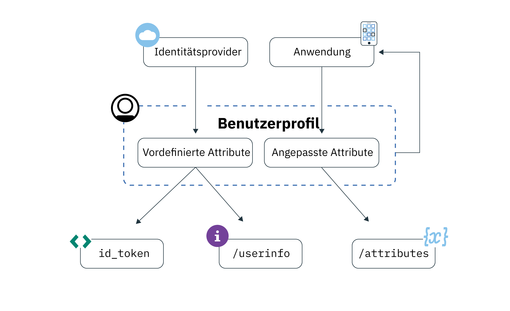

---

copyright:
  years: 2017, 2019
lastupdated: "2019-04-04"

keywords: authentication, authorization, identity, app security, secure, user profiles, personalized apps, attributes, 

subcollection: appid

---

{:new_window: target="_blank"}
{:shortdesc: .shortdesc}
{:screen: .screen}
{:pre: .pre}
{:table: .aria-labeledby="caption"}
{:codeblock: .codeblock}
{:tip: .tip}
{:note: .note}
{:important: .important}
{:deprecated: .deprecated}
{:download: .download}

# Informationen zu Benutzerprofilen
{: #user-profile}

Mit {{site.data.keyword.appid_full}} können Sie für Ihre App individuelle Benutzererfahrungen gestalten, indem Sie auf Informationen zu Ihren Benutzern zugreifen, die von {{site.data.keyword.appid_short_notm}} gespeichert werden.
{: shortdesc}

## Zentrale Konzepte
{: #profile-concepts}

**Was ist ein Benutzerprofil?**

Bei einem Benutzerprofil handelt es sich um eine Gruppe von Attributen, die von {{site.data.keyword.appid_short_notm}} gespeichert werden. Bei den Attributen handelt es sich um Angaben über die Benutzer, die mit Ihrer App interagieren. Sie können zwei Typen von Attributen nutzen: `vordefinierte` und `angepasste` Attribute.

**Was sind vordefinierte Attribute?**

Vordefinierte Attribute werden vom Identitätsprovider zurückgegeben, wenn ein Benutzer sich bei Ihrer App anmeldet. Die Attribute umfassen den zugehörigen Benutzernamen sowie Alter und Geschlecht.

**Was sind angepasste Attribute?**

Angepasste Attribute zu Ihren Benutzern werden im Laufe der Interaktion mit Ihrer App erfasst. Angepasste Attribute können von Ihnen festgelegt werden, bevor sich Benutzer zum ersten Mal in Ihrer App registrieren. Dabei kann es sich um die verwendete Schriftgröße oder Elemente handeln, die vom Benutzer in einen Warenkorb platziert wurden. Angepasste Attribute können bearbeitet werden. Informieren Sie sich über die [Auswirkungen auf die Sicherheit](/docs/services/appid?topic=appid-custom-attributes), die sich ergeben, wenn Benutzern die Bearbeitung ihrer Attribute ermöglicht wird, bevor Sie die Standardeinstellung ändern.

## Auf Benutzerattribute zugreifen
{: #profile-access}

Sie können auf unterschiedliche Weise auf [vordefinierte](/docs/services/appid?topic=appid-predefined-attributes) und [angepasste](/docs/services/appid?topic=appid-custom-attributes) Attribute zugreifen. Nach einer erfolgreichen Benutzerauthentifizierung empfängt Ihre App Zugriffs- und Identitätstoken. Das Identitätstoken enthält eine normalisierte Untergruppe von Benutzerattributen, die von einem Identitätsprovider zurückgegeben wurden. Eine vollständige Liste der Benutzerattribute können Sie über den OIDC-Endpunkt [`/userinfo` abrufen](https://us-south.appid.cloud.ibm.com/swagger-ui/#/Authorization_Server_V4/userInfo). Zur Verwaltung von angepassten Attributen eignet sich die `REST-API`. Die Endpunkte für Benutzerinformationen und für angepasste Attribute werden über das Zugriffstoken geschützt, das von {{site.data.keyword.appid_short_notm}} zum Ende des Authentifizierungsprozesses generiert wird.

Weitere Informationen zu Identitäts- und Zugriffstokens finden Sie unter [Informationen zu Tokens](/docs/services/appid?topic=appid-tokens#tokens) oder [Tokens validieren](/docs/services/appid?topic=appid-token-validation).

Abbildung. Ablauf der Benutzerprofilinformationen

Verwenden Sie zum Anzeigen von angepassten Attributen die <a href="https://us-south.appid.cloud.ibm.com/swagger-ui/#/Attributes" target="_blank">REST-API </a>.

