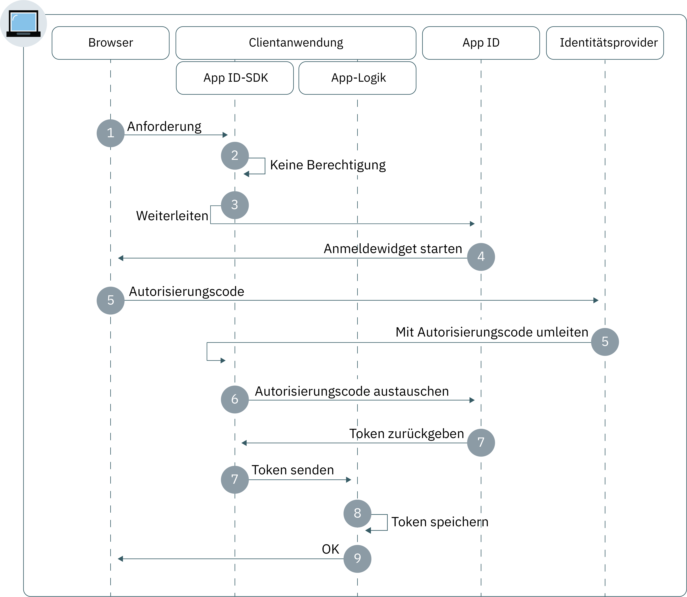

---

copyright:
  years: 2017, 2019
lastupdated: "2019-05-21"

keywords: authentication, authorization, identity, app security, secure, web apps, client, server

subcollection: appid

---

{:new_window: target="_blank"}
{:shortdesc: .shortdesc}
{:screen: .screen}
{:pre: .pre}
{:table: .aria-labeledby="caption"}
{:codeblock: .codeblock}
{:tip: .tip}
{:note: .note}
{:important: .important}
{:deprecated: .deprecated}
{:download: .download}


# Web-Apps
{: #web-apps}

Mit {{site.data.keyword.appid_full}} können Sie ohne großen Zeitaufwand eine Authentifizierungsebene für Ihre Webanwendungen erstellen.
{: shortdesc}

## Informationen zum Ablauf
{: #web-understanding}

**Wann ist dieser Ablauf sinnvoll?**

Wenn Sie eine Webanwendung entwickeln, können Sie den {{site.data.keyword.appid_short_notm}}-Webablauf verwenden, um Benutzer sicher zu authentifizieren. Benutzer sind dann in der Lage, auf Ihre geschützten serverseitigen Inhalte in Ihren Web-Apps zuzugreifen.

**Was ist die technische Basis des Ablaufs?**

Webanwendungen setzen häufig voraus, dass sich Benutzer authentifizieren, um auf geschützte Inhalte zugreifen zu können. {{site.data.keyword.appid_short_notm}} verwendet den OIDC-Autorisierungscodeablauf, um Benutzer sicher zu authentifizieren. Wenn der Benutzer authentifiziert wurde, erhält die App durch diesen Ablauf einen Autorisierungscode. Der Code wird dann gegen ein Zugriffs-, Identitäts- und Aktualisierungstoken getauscht. Beim Austausch des Codes werden die Tokens immer über einen sicheren Backchannel zwischen der App und dem OIDC-Server gesendet. Dies bietet eine zusätzliche Sicherheitsebene, da ein Angreifer nicht in der Lage ist, die Tokens abzufangen. Diese Tokens können zur Benutzerauthentifizierung direkt an die Web-Server-Hosting-Anwendung gesendet werden.

**Wie funktioniert dieser Ablauf?**



1. Ein Benutzer leitet den Autorisierungsablauf ein, indem er eine Anforderung über das {{site.data.keyword.appid_short_notm}}-SDK oder die API an den Endpunkt `/authorization` sendet.

2. Wenn der Benutzer nicht berechtigt ist, wird der Authentifizierungsablauf mit einer Weiterleitung an {{site.data.keyword.appid_short_notm}} gestartet.

3. Abhängig von den `/authorization`-Anforderungsparametern des Benutzers oder der Konfiguration des Identitätsproviders wird das Anmeldewidget im Benutzerbrowser gestartet.

4. Der Benutzer wählt einen Identitätsprovider für die Authentifizierung aus und führt den Anmeldeprozess durch.

5. Der Identitätsprovider leitet die Client-App mit dem Autorisierungscode um.

6. Das {{site.data.keyword.appid_short_notm}}-SDK tauscht den Autorisierungscode für Zugriffs-, Identitäts- und optionale Aktualisierungstokens vom {{site.data.keyword.appid_short_notm}}-Service aus.

7. Die Tokens werden durch das {{site.data.keyword.appid_short_notm}}-SDK gespeichert und es erfolgt eine Weiterleitung an die Clientanwendung.

8. Dem Benutzer wird der Zugriff auf die App gewährt.


## Node.js-SDK konfigurieren
{: #web-configuring-nodejs}

Sie können {{site.data.keyword.appid_short_notm}} für die kombinierte Verwendung mit Ihren Node.js-Webanwendungen konfigurieren.
{: shortdesc}

**Vorbereitungen**

Folgendes wird vorausgesetzt:

* Eine Instanz des {{site.data.keyword.appid_short_notm}}-Service
* Die erforderlichen Serviceberechtigungsnachweise
* NPM Version 4 oder höher
* Node Version 6 oder höher
* Ihr Weiterleitungs-URI im {{site.data.keyword.appid_short_notm}}-Service-Dashboard


Sehen Sie sich folgende Video an, um Informationen zum Schutz von Node-Knotenanwendungen mit {{site.data.keyword.appid_short_notm}} zu erhalten. Versuchen Sie es anschließend mithilfe einer [einfachen Beispielanwendung für Knoten](https://github.com/ibm-cloud-security/appid-video-tutorials/tree/master/02a-simple-node-web-app). 

<iframe class="embed-responsive-item" id="appid-nodejs" title="Informationen zu {{site.data.keyword.appid_short_notm}}" type="text/html" width="640" height="390" src="//www.youtube.com/embed/6roa1ZOvwtw?rel=0" frameborder="0" webkitallowfullscreen mozallowfullscreen allowfullscreen></iframe>


### Node.js-SDK installieren
{: #web-nodejs-install}

1. Wechseln Sie über die Befehlszeile in das Verzeichnis, das die Node.js-App enthält.

2. Installieren Sie den {{site.data.keyword.appid_short_notm}}-Service.

  ```bash
  npm install --save ibmcloud-appid
  ```
  {: codeblock}

### Node.js-SDK initialisieren
{: #web-nodejs-initialize}

1. Fügen Sie die folgenden `require`-Definitionen in Ihrer Datei `server.js` hinzu.

  ```javascript
  const express = require('express');
    const session = require('express-session')
    const passport = require('passport');
    const WebAppStrategy = require("ibmcloud-appid").WebAppStrategy;
    const CALLBACK_URL = "/ibm/cloud/appid/callback";
  ```
  {: codeblock}

2. Richten Sie die Express-App so ein, dass Middleware des Typs 'express-session' verwendet wird.

  ```javascript
  const app = express();
    app.use(session({
        secret: "123456",
        resave: true,
        saveUninitialized: true
        }));
    app.use(passport.initialize());
    app.use(passport.session());
  ```
  {: codeblock}

  Sie müssen die Middleware mit dem passenden Sitzungsspeicher für die Produktionsumgebungen konfigurieren. Weitere Informationen finden Sie in der <a href="https://github.com/expressjs/session" target="_blank"> Dokumentation zu express.js</a>.
  {: note}

3. Fordern Sie Ihre Berechtigungsnachweise auf eine der folgenden Arten an.

  * Navigieren Sie zur Registerkarte **Anwendungen** des {{site.data.keyword.appid_short_notm}}-Dashboards. Wenn keine Anwendung aufgelistet wird, dann können Sie auf **Anwendung hinzufügen** klicken, um eine neue Anwendung zu erstellen.

  * Erstellen Sie eine POST-Anforderung an den Endpunkt [`/management/v4/{tenantId}/applications`](https://us-south.appid.cloud.ibm.com/swagger-ui/#/Management%20API%20-%20Applications/mgmt.registerApplication).

    Anforderungsformat:
    ```
    curl -X POST \  https://us-south.appid.cloud.ibm.com/management/v4/39a37f57-a227-4bfe-a044-93b6e6060b61/applications/ \
    -H 'Content-Type: application/json' \
    -H 'Authorization: Bearer IAM_TOKEN' \
    -d '{"name": "ApplicationName"}'
    ```
    {: codeblock}

    Beispielantwort:
    ```
    {
    "clientId": "111c22c3-38ea-4de8-b5d4-338744d83b0f",
    "tenantId": "39a37f57-a227-4bfe-a044-93b6e6060b61",
    "secret": "ZmE5ZDQ5ODctMmA1ZS00OGRiLWExZDMtZTA1MjkyZTc4MDB4",
    "name": "ApplicationName",
    "oAuthServerUrl": "https://us-south.appid.cloud.ibm.com/oauth/v4/39a37f57-a227-4bfe-a044-93b6e6060b61"
    }
    ```
    {: screen}

4. Optional: Legen Sie fest, wie Ihr Weiterleitungs-URI formatiert werden soll. Die Weiterleitung kann auf zwei verschiedene Arten formatiert werden.

  * Manuell in einem neuen Element `WebAppStrategy({redirectUri: "...."})`.
  * Als Umgebungsvariable mit dem Namen `redirectUri`.

  Wenn keine dieser Optionen angegeben wird, dann versucht das {{site.data.keyword.appid_short_notm}}-SDK, den Wert von `application_uri` der App abzurufen, die in {{site.data.keyword.cloud_notm}} ausgeführt wird, und ein Standardsuffix `/ibm/cloud/appid/callback` anzufügen.

5. Initialisieren Sie das SDK und verwenden Sie dazu die im vorherigen Schritt abgerufenen Informationen.

  ```javascript
    passport.use(new WebAppStrategy({
    tenantId: "{tenant-id}",
    clientId: "{client-id}",
    secret: "{secret}",
    oauthServerUrl: "{oauth-server-url}",
    redirectUri: "{app-url}" + CALLBACK_URL
    }));
  ```
  {: codeblock}

6. Konfigurieren Sie Passport mit Serialisierung und ohne Deserialisierung. Dieser Konfigurationsschritt ist für ein Aufrechterhalten authentifizierter Sitzungen für HTTP-Anforderungen erforderlich. Weitere Informationen finden Sie in der <a href="http://www.passportjs.org/docs/" target="_blank">Dokumentation zu Passport </a>.

  ```javascript
  passport.serializeUser(function(user, cb) {
    cb(null, user);
    });

  passport.deserializeUser(function(obj, cb) {
    cb(null, obj);
    });
  ```
  {: codeblock}

5. Fügen Sie den nachfolgend dargestellten Code in der Datei `server.js` hinzu, um die Serviceweiterleitungen auszuführen.

   ```javascript
   app.get(CALLBACK_URL, passport.authenticate(WebAppStrategy.STRATEGY_NAME));
   ```
   {: codeblock}

6. Registrieren Sie Ihren geschützten Endpunkt.

   ```javascript
   app.get(‘/protected’, passport.authenticate(WebAppStrategy.STRATEGY_NAME), function(req, res) {res.json(req.user); });
   ```
   {: codeblock}

Weitere Informationen finden Sie im Abschnitt zum <a href="https://github.com/ibm-cloud-security/appid-serversdk-nodejs" target="_blank">{{site.data.keyword.appid_short_notm}}-Node.js GitHub-Repository </a>.


## Liberty for Java-SDK konfigurieren
{: #web-configuring-liberty}

Sie können {{site.data.keyword.appid_short_notm}} für eine Verwendung Ihrer Liberty for Java-Webanwendungen konfigurieren.
{:shortdesc}

**Vorbereitungen**

Folgendes wird vorausgesetzt:
* Eine Instanz des {{site.data.keyword.appid_short_notm}}-Service
* Die erforderlichen Serviceberechtigungsnachweise
* Apache Maven 3.5 oder höher
* Java 1.8
* Eine Liberty for Java-Webanwendung


Sehen Sie sich folgende Video an, um Informationen zum Schutz von Liberty for Java-Anwendungen mit {{site.data.keyword.appid_short_notm}} zu erhalten. Versuchen Sie es anschließend mithilfe einer [einfachen Beispielanwendung für Liberty for Java](https://github.com/ibm-cloud-security/appid-video-tutorials/tree/master/02c-simple-liberty-web-app). 

<iframe class="embed-responsive-item" id="appid-liberty-web" title="Informationen zu {{site.data.keyword.appid_short_notm}}" type="text/html" width="640" height="390" src="//www.youtube.com/embed/o_Er69YUsMQ?rel=0" frameborder="0" webkitallowfullscreen mozallowfullscreen allowfullscreen></iframe>


### Liberty for Java-SDK installieren
{: #web-liberty-install}

1. Fügen Sie ein OpenID Connect-Feature in Ihrer Datei `server.xml` hinzu.

  ```xml
  <featureManager>
      <feature>ssl-1.0</feature>
      <feature>appSecurity-2.0</feature>
      <feature>openidConnectClient-1.0</feature>
  </featureManager>
  ```
  {: codeblock}

2. Fordern Sie Ihre Berechtigungsnachweise auf eine der beiden folgenden Arten an.

  * Navigieren Sie zur Registerkarte **Anwendungen** des {{site.data.keyword.appid_short_notm}}-Dashboards. Wenn Sie noch nicht über eine Anwendung verfügen, dann können Sie auf **Anwendung hinzufügen** klicken, um eine neue Anwendung zu erstellen.

  * Erstellen Sie eine POST-Anforderung an den Endpunkt [`/management/v4/{tenantId}/applications`](https://us-south.appid.cloud.ibm.com/swagger-ui/#!/Applications/registerApplication).

    Anforderungsformat:
    ```
    curl -X POST \  https://us-south.appid.cloud.ibm.com/management/v4/39a37f57-a227-4bfe-a044-93b6e6060b61/applications/ \
    -H 'Content-Type: application/json' \
    -H 'Authorization: Bearer IAM_TOKEN' \
    -d '{"name": "ApplicationName"}'
    ```
    {: codeblock}

    Beispielantwort:
    ```
    {
    "clientId": "111c22c3-38ea-4de8-b5d4-338744d83b0f",
    "tenantId": "39a37f57-a227-4bfe-a044-93b6e6060b61",
    "secret": "ZmE5ZDQ5ODctMmA1ZS00OGRiLWExZDMtZTA1MjkyZTc4MDB4",
    "name": "ApplicationName",
    "oAuthServerUrl": "https://us-south.appid.cloud.ibm.com/oauth/v4/39a37f57-a227-4bfe-a044-93b6e6060b61"
    }
    ```
    {: screen}

3. Erstellen Sie ein Open ID Connect-Client-Feature und definieren Sie die folgenden Platzhalter. Verwenden Sie die Serviceberechtigungsnachweise, um die Platzhalter zu füllen.

  ```xml
  <openidConnectClient
    clientId='{{site.data.keyword.appid_short_notm}} client_ID'
    clientSecret='{{site.data.keyword.appid_short_notm}} Secret'
    authorizationEndpointUrl='oauthServerUrl/authorization'
    tokenEndpointUrl='oauthServerUrl/token'
    jwkEndpointUrl='oauthServerUrl/publickeys'
    issuerIdentifier='Changed according to the region'
    tokenEndpointAuthMethod="basic"
    signatureAlgorithm="RS256"
    authFilterid="myAuthFilter"
    trustAliasName="ibm.com"
  />
  ```
  {: codeblock}

  <table>
  <caption>Tabelle. OIDC-Elementvariablen für Liberty for Java-Apps</caption>
    <tr>
      <th> Komponente </th>
      <th> Beschreibung </th>
    </tr>
    <tr>
    <td><code>clientID</code> </br> <code>secret</code> </br> <code>oauth-server-url</code> </br></td>
    <td>Führen Sie Schritt 2 aus, um Ihre Serviceberechtigungsnachweise abzurufen.</td>
    </tr>
    <tr>
      <td><code> authorizationEndpointURL </code></td>
      <td> Fügen Sie <code>/authorization</code> am Ende von <code>oauthServerURL</code> hinzu.</td>
    </tr>
    <tr>
      <td><code> tokenEndpointUrl </code></td>
      <td>Fügen Sie <code>/token</code> am Ende von <code>oauthServerURL</code> hinzu.</td>
    </tr>
    <tr>
      <td><code> jwkEndpointUrl </code></td>
      <td>Fügen Sie <code>/publickeys</code> am Ende von <code>oauthServerURL</code> hinzu.</td>
    </tr>
    <tr>
      <td><code> issuerIdentifier </code></td>
      <td>Die Aussteller-ID hat folgendes Format: <code>&lt;region>&gt;.cloud.ibm.com</code>. Folgende Regionsoptionen sind verfügbar: <code>au-syd</code>, <code>eu-de</code>, <code>eu-gb</code>, <code>jp-tok</code> und <code>us-south</code>.</td>
    </tr>
    <tr>
      <td><code> tokenEndpointAuthMethod </code></td>
      <td>Als "basic" angegeben.</td>
    </tr>
    <tr>
      <td><code> signatureAlgorithm </code></td>
      <td>Als "RS256" angegeben.</td>
    </tr>
    <tr>
      <td><code> authFilterid </code></td>
      <td>Liste der zu schützenden Ressourcen.</td>
    </tr>
    <tr>
      <td><code> trustAliasName </code></td>
      <td>Name des Zertifikats im Truststore.</td>
    </tr>
  </table>

### Liberty for Java-SDK initialisieren
{: #web-liberty-initialize}

1. Definieren Sie in der Datei `server.xml` einen Autorisierungsfilter für die Angabe geschützter Ressourcen. Ist kein Filter <a href="https://www.ibm.com/support/knowledgecenter/en/SSD28V_9.0.0/com.ibm.websphere.wlp.core.doc/ae/rwlp_auth_filter.html" target="_blank">definiert </a>, schützt der Service alle Ressourcen.

  ```xml
  <authFilter id="myAuthFilter">
             <requestUrl id="myRequestUrl" urlPattern="/protected" matchType="contains"/>
    </authFilter>
  ```
  {: codeblock}

2. Definieren Sie Ihren speziellen Subjekttyp als `ALL_AUTHENTICATED_USERS`.

  ```xml
  <application type="war" id="ProtectedServlet" context-root="/appidSample"
  location="${server.config.dir}/apps/libertySample-1.0.0.war">
    <application-bnd>
        <security-role name="myrole">
        <special-subject type="ALL_AUTHENTICATED_USERS"/>
        </security-role>
            </application-bnd>
        </application>
  ```
  {: codeblock}

3. Laden Sie die Datei `libertySample-1.0.0.war` von <a href="https://github.com/ibm-cloud-security/appid-sample-code-snippets/tree/master/liberty-for-java" target="_blank">GitHub </a> herunter und legen Sie sie im Ordner für Apps Ihres Servers ab. Wenn Ihr Server beispielsweise den Namen `defaultServer` trägt, wird die WAR-Datei unter `target/liberty/wlp/usr/servers/defaultServer/apps/` abgelegt.

4. Konfigurieren Sie SSL, indem Sie der Datei `server.xml` folgenden Code hinzufügen. Sie müssen auch einen Truststore erstellen.

  ```xml
    <keyStore id="defaultKeyStore" password="myPassword"/>
  <keyStore id="appidtruststore" password="Liberty" location="${server.config.dir}/mytruststore.jks"/>
  <ssl id="defaultSSLConfig" keyStoreRef="defaultKeyStore" trustStoreRef="appidtruststore"/>
  ```
  {: codeblock}

Für die SSL-Standardkonfiguration muss der Truststore für OpenID Connect konfiguriert sein. Weitere Informationen hierzu finden Sie unter <a href="https://www.ibm.com/support/knowledgecenter/en/SSEQTP_liberty/com.ibm.websphere.wlp.doc/ae/twlp_config_oidc_rp.html" target="_blank">OpenID Connect-Client in Liberty konfigurieren </a>.
{: tip}


## Spring Boot for Java-SDK konfigurieren
{: #web-configuring-spring-boot}

Sie können {{site.data.keyword.appid_short_notm}} für eine Verwendung Ihrer Spring Boot-Webanwendungen konfigurieren.
{:shortdesc}

**Vorbereitungen**

Folgendes wird vorausgesetzt:

* Eine Instanz des {{site.data.keyword.appid_short_notm}}-Service
* Die erforderlichen Serviceberechtigungsnachweise
* Ein Java + Maven-Projekt
* Apache Maven 3.5 oder höher
* Java 1.8
* Spring Boot 2.0 und Security OAuth 2.0 oder höher


### Spring Boot-Framework initialisieren
{: #web-spring-boot-initialize}

1. Fügen Sie Folgendes zwischen den Tags `<project> </project>` in Ihrer Maven-Datei `pom.xml` hinzu.

  ```xml
  <parent>
      <groupId>org.springframework.boot</groupId>
      <artifactId>spring-boot-starter-parent</artifactId>
      <version>2.0.2.RELEASE</version>
      <relativePath/>
  </parent>
  ```
  {: codeblock}

2. Fügen Sie die folgenden Abhängigkeiten zu Ihrer Maven-Datei `pom.xml` hinzu.

  ```xml
  <dependencies>
      <dependency>
          <groupId>org.springframework.boot</groupId>
          <artifactId>spring-boot-starter-web</artifactId>
      </dependency>
      <dependency>
          <groupId>org.springframework.boot</groupId>
          <artifactId>spring-boot-starter-security</artifactId>
      </dependency>
      <dependency>
          <groupId>org.springframework.security.oauth.boot</groupId>
          <artifactId>spring-security-oauth2-autoconfigure</artifactId>
          <version>2.0.0.RELEASE</version>
      </dependency>
  </dependencies>
  ```
  {: codeblock}

3. Fügen Sie das Maven-Plug-in in dieselbe Datei ein.

  ```xml
  <plugin>
      <groupId>org.springframework.boot</groupId>
      <artifactId>spring-boot-maven-plugin</artifactId>
  </plugin>
  ```
  {: codeblock}

### OAuth2 initialisieren
{: #web-oauth-initialize}

1. Fügen Sie die folgenden Annotationen zur Java-Datei hinzu.

  ```java
  @SpringBootApplication
  @EnableOAuth2Sso
  ```
  {: codeblock}

2. Erweitern Sie die Klasse mit `WebSecurityConfigurerAdapter`.
3. Überschreiben Sie alle Sicherheitskonfigurationen und registrieren Sie Ihren geschützten Endpunkt.

  ```java
    @Override
    protected void configure(HttpSecurity http) throws Exception {
        http.authorizeRequests()
                .antMatchers("/protectedResource").authenticated()
                .and().logout().logoutSuccessUrl("/").permitAll();
    }
  ```
  {: codeblock}


### Berechtigungsnachweise hinzufügen
{: #web-spring-boot-credentials}

1. Fordern Sie Ihre Berechtigungsnachweise auf eine der folgenden Arten an.

  * Navigieren Sie zur Registerkarte **Anwendungen** des {{site.data.keyword.appid_short_notm}}-Dashboards. Wenn Sie noch nicht über eine Anwendung verfügen, dann können Sie auf **Anwendung hinzufügen** klicken, um eine neue Anwendung zu erstellen.

  * Erstellen Sie eine POST-Anforderung an den Endpunkt [`/management/v4/{tenantId}/applications`](https://us-south.appid.cloud.ibm.com/swagger-ui/#!/Applications/registerApplication).

    Anforderungsformat:
    ```
    curl -X POST \  https://us-south.appid.cloud.ibm.com/management/v4/39a37f57-a227-4bfe-a044-93b6e6060b61/applications/ \
    -H 'Content-Type: application/json' \
    -H 'Authorization: Bearer IAM_TOKEN' \
    -d '{"name": "ApplicationName"}'
    ```
    {: codeblock}

    Beispielantwort:
    ```
    {
    "clientId": "111c22c3-38ea-4de8-b5d4-338744d83b0f",
    "tenantId": "39a37f57-a227-4bfe-a044-93b6e6060b61",
    "secret": "ZmE5ZDQ5ODctMmA1ZS00OGRiLWExZDMtZTA1MjkyZTc4MDB4",
    "name": "ApplicationName",
    "oAuthServerUrl": "https://us-south.appid.cloud.ibm.com/oauth/v4/39a37f57-a227-4bfe-a044-93b6e6060b61"
    }
    ```
    {: screen}

2. Fügen Sie eine Konfigurationsdatei `application.yml` zum Verzeichnis `/springbootsample/src/main/resources/` hinzu. Sie können für die Konfiguration die Informationen aus Ihren Serviceberechtigungsnachweisen angeben.

  ```
  security:
  oauth2:
    client:
      clientId: {client ID}
      clientSecret: {client Secret}
      accessTokenUri: {oauthServerUrl}/token
      userAuthorizationUri: {oauthServerUrl}/authorization
    resource:
      userInfoUri: {oauthServerUrl}/userinfo
  ```
  {: codeblock}

Ein Schritt-für-Schritt-Beispiel finden Sie in <a href="https://www.ibm.com/cloud/blog/creating-spring-boot-applications-app-id" target="_blank">diesem Blog</a>.


## {{site.data.keyword.appid_short_notm}} mit anderen Sprachen verwenden
{: #web-other-languages}

Mit einem OIDC-konformen Client-SDK können Sie {{site.data.keyword.appid_short_notm}} mit anderen Sprachen verwenden. Weitere Informationen finden Sie in der Liste <a href="https://openid.net/developers/certified/">zertifizierter Bibliotheken</a>.

## Nächste Schritte
{: #web-next}

Wenn {{site.data.keyword.appid_short_notm}} in Ihrer Anwendung installiert ist, sind Sie fast bereit, Benutzer zu authentifizieren. Versuchen Sie als Nächstes, eine der folgenden Aktivitäten auszuführen:

* Konfigurieren Ihrer [Identitätsprovider](/docs/services/appid?topic=appid-social)
* Anpassen und Konfigurieren [des Anmeldewidgets](/docs/services/appid?topic=appid-login-widget)
* Abrufen weiterer Informationen zum <a href="https://github.com/ibm-cloud-security/appid-serversdk-nodejs" target="_blank">Node.js-SDK</a>
