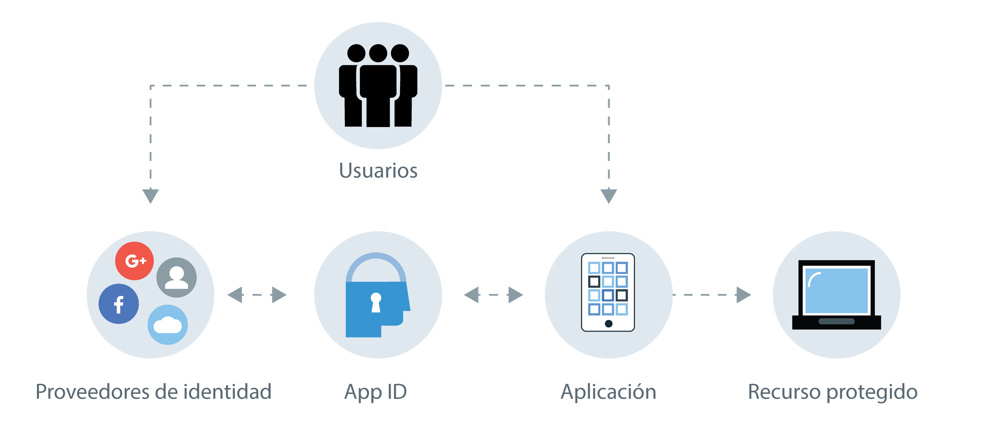

---

copyright:
  years: 2017, 2019
lastupdated: "2019-04-08"

keywords: authentication, authorization, identity, app security, secure, compliance, high availability

subcollection: appid

---

{:new_window: target="_blank"}
{:shortdesc: .shortdesc}
{:screen: .screen}
{:pre: .pre}
{:table: .aria-labeledby="caption"}
{:codeblock: .codeblock}
{:tip: .tip}
{:note: .note}
{:important: .important}
{:deprecated: .deprecated}
{:download: .download}

# Acerca de {{site.data.keyword.appid_short_notm}}
{: #about}

La seguridad de aplicación se puede complicar de forma increíble. Para la mayoría de los desarrolladores, es una de las partes más difíciles de la creación de una app. ¿Cómo puede estar seguro de que está protegiendo la información de los usuarios? Al integrar {{site.data.keyword.appid_full}} en sus apps, puede proteger recursos y añadir autenticación- incluso aunque no tenga mucha experiencia en seguridad.
{:shortdesc}

## Motivos para utilizar el servicio
{: #about-reasons}

{{site.data.keyword.appid_short_notm}} permite a los desarrolladores añadir fácilmente autenticación a sus apps web y móviles con unas pocas líneas de código, y proteger sus aplicaciones y servicios nativos de nube en {{site.data.keyword.cloud_notm}}. Al exigir a los usuarios que inicien sesión en la app, puede almacenar datos de usuario como preferencias de la app, o información de los perfiles sociales públicos, y luego utilizar esos datos para personalizar la experiencia de cada usuario en la app. {{site.data.keyword.appid_short_notm}} proporciona una infraestructura de inicio de sesión, pero también puede traer las pantallas de su propia marca para utilizarlas con el directorio en la nube.
{: shortdesc}

¿Qué puede hacer el directorio en la nube? Vea este vídeo para obtener más información sobre las diferentes maneras de utilizar el servicio y, a continuación, lea más en la tabla siguiente sobre otros casos de ejemplo.

<iframe class="embed-responsive-item" id="youtubeplayer" title="Acerca de App ID" type="text/html" width="640" height="390" src="//www.youtube.com/embed/XlrCjHdK43Q?rel=0" frameborder="0" webkitallowfullscreen mozallowfullscreen allowfullscreen> </iframe>

<table>
  <tr>
    <th>Caso de ejemplo</th>
    <th>Solución</th>
  </tr>
  <tr>
    <td>Debe añadir [autorización y autenticación](/docs/services/appid?topic=appid-key-concepts#key-concepts) a sus apps web y móvil pero no tiene un fondo de seguridad.</td>
    <td>{{site.data.keyword.appid_short_notm}} permite añadir fácilmente un paso de autenticación a sus apps. Puede añadir inicio de sesión de correo electrónico o nombre de usuario, social o empresarial a sus apps con API, SDK, IU creadas previamente o IU de su propia marca.</td>
  </tr>
  <tr>
    <td>Desea limitar el acceso a sus apps y recursos de fondo.</td>
    <td>Puede proteger sus apps, recursos de fondo y API fácilmente mediante la autenticación basada en estándares que proporciona {{site.data.keyword.appid_short_notm}}.</td>
  </tr>
  <tr>
    <td>Desea crear experiencias de la app personalizadas para sus usuarios.</td>
    <td>Con {{site.data.keyword.appid_short_notm}} puede [almacenar datos de usuario](/docs/services/appid?topic=appid-user-profile#user-profile) como preferencias de la app o información de sus perfiles sociales públicos y entonces utilizar esos datos para personalizar cada experiencia de su app.</td>
  </tr>
  <tr>
    <td>Desea gestionar usuarios de forma escalable.</td>
    <td> Con {{site.data.keyword.appid_short_notm}} puede crear un [directorio en la nube](/docs/services/appid?topic=appid-cloud-directory#cloud-directory), que le permite añadir el registro e inicio de sesión de usuarios a sus apps. El directorio en la nube le proporciona la infraestructura para mantener un registro de usuarios que puede escalar con su base de usuarios. Con la funcionalidad integrada para el autoservicio, como verificación de correo electrónico y restablecimiento de contraseñas, puede garantizar la seguridad de la autenticación de los usuarios de su app.</td>
  </tr>
</table>

## Cómo funciona
{: #about-how-it-works}

Con {{site.data.keyword.appid_short_notm}}, puede añadir un nivel de seguridad a sus apps solicitando a los usuarios que inicien la sesión. También puede utilizar las API o el SDK del servidor para proteger sus recursos de fondo.
{: shortdesc}

<dl>
  <dt>Aplicación</dt>
    <dd><strong>SDK del servidor</strong>: Puede proteger sus recursos de programa de fondo alojados en {{site.data.keyword.cloud_notm}} y sus apps web utilizando el SDK del servidor. Extrae la señal de acceso de la solicitud y la valida con {{site.data.keyword.appid_short_notm}}.  
    <strong>SDK del cliente</strong>: Puede proteger sus apps móviles con el SDK del cliente de Android o iOS. El SDK del cliente se comunica con sus recursos en la nube para iniciar el proceso de autenticación cuando detecta un desafío de autorización.</dd>
  <dt>{{site.data.keyword.cloud_notm}}</dt>
    <dd><strong>{{site.data.keyword.appid_short_notm}}</strong>: Tras la correcta autenticación, {{site.data.keyword.appid_short_notm}} devuelve las señales de identidad y de acceso a la app. 
    <strong>Directorio en la nube</strong>: Los usuarios pueden registrarse en su servicio con su correo electrónico y contraseña. Luego podrá gestionar sus usuarios en una vista de lista a través de la IU. Con el directorio en la nube, {{site.data.keyword.appid_short_notm}} funciona como proveedor de identidad.</dd>
  <dt>Externa (de terceros)</dt>
    <dd><strong>Proveedores de identidad sociales y empresariales</strong>: {{site.data.keyword.appid_short_notm}} admite Facebook, Google+ y SAML 2.0 Federation como opciones de proveedor de identidad. El servicio organiza una redirección al proveedor de identidad y verifica las señales de autenticación devueltas. Si las señales son válidas, el servicio otorga acceso a la app incluso sin tener acceso a la frase de contraseña real.</dd>
</dl>

## Integraciones
{: #about-integrations}

Puede utilizar {{site.data.keyword.appid_short_notm}} con otras ofertas de {{site.data.keyword.cloud_notm}}.
{:shortdesc}

<dl>
  <dt>{{site.data.keyword.containerlong_notm}}</dt>
    <dd>Al configurar el ingreso en un clúster estándar, puede proteger sus apps en el nivel de clúster. Consulte la <a href="/docs/containers?topic=containers-ingress_annotation#appid-auth">anotación de Ingress de autenticación de {{site.data.keyword.appid_short_notm}}</a> o la publicación de blog <a href="https://www.ibm.com/blogs/bluemix/2018/05/announcing-app-id-integration-ibm-cloud-kubernetes-service/">Anuncio de la integración de {{site.data.keyword.appid_short_notm}} en {{site.data.keyword.containerlong_notm}} </a> para empezar.</dd>
  <dt>{{site.data.keyword.openwhisk}} y API Connect</dt>
    <dd>Al crear sus API con [{{site.data.keyword.openwhisk_short}}](/docs/openwhisk?topic=cloud-functions-getting_started#getting_started) y [API Connect](/docs/services/apiconnect?topic=apiconnect-index#index), puede proteger sus aplicaciones en la pasarela en lugar de en el código de la app. Para ver la integración en acción, vea <a href="https://www.youtube.com/watch?v=Fa9YD2NGZiE" target="_blank">OAauth de inicio de sesión en redes sociales rápido y simple con APIC y {{site.data.keyword.appid_short_notm}} </a>.</dd>
  <dt>Cloud Foundry</dt>
    <dd>Pruebe una de las apps de Cloud Foundry de muestra que se proporcionan para ver cómo puede integrar {{site.data.keyword.appid_short_notm}} en sus apps.</dd>
  <dt>{{site.data.keyword.cloudaccesstrailshort}}</dt>
    <dd>Puede supervisar la actividad administrativa que se realiza en {{site.data.keyword.appid_short_notm}}, como los cambios en la configuración del panel de control, mediante el [servicio {{site.data.keyword.cloudaccesstrailshort}}](/docs/services/cloud-activity-tracker/reference?topic=cloud-activity-tracker-getting-started-with-cla#getting-started-with-cla).</dd>
  <dt>Guía de programación de iOS</dt>
    <dd>¿Desarrolla apps para Apple? Pruebe la [Guía de programación de iOS](/docs/swift/authenticate?topic=swift-getting_started_swift#getting_started_swift) para aprender, experimentar y mejorar sus apps de iOS existentes con {{site.data.keyword.cloud_notm}}.</dd>
  <dt>Guía de programación de Node.js</dt>
    <dd>¿Desarrolla apps en Node.js? Pruebe la [Guía de programación de Node.js](/docs/node?topic=nodejs-node-getting-started#node-getting-started) para aprender, experimentar y mejorar sus apps de Node.js existentes con {{site.data.keyword.cloud_notm}}.</dd>
</dl>

## Conformidad y estándares
{: #about-compliance}

{{site.data.keyword.appid_short_notm}} ha completado con éxito varias certificaciones, auditorías y estándares. 
{: shortdesc}

{{site.data.keyword.appid_short_notm}} se basa en un conjunto de protocolos estándares y estándares del sector conocidos, que se suelen encontrar tanto en aplicaciones de empresa como en aplicaciones de cara al consumidor, OAuth 2.0 Authorization Framework y Open ID Connect. OAuth 2.0 se utiliza para obtener y verificar la autorización para acceder a recursos protegidos. Además, Open ID Connect añade una capa de autenticación y protección de identidad a la aplicación.

Consulte la sección 5.4 del informe de compatibilidad de productos de software {{site.data.keyword.appid_short_notm}} para revisar una lista completa de las [certificaciones](https://www.ibm.com/software/reports/compatibility/clarity-reports/report/html/softwareReqsForProduct?deliverableId=BF31C8008D7C11E59F9AD7336D7D0FFB). Además de las certificaciones, {{site.data.keyword.appid_short_notm}} también es compatible con las especificaciones siguientes: Oauth 2.0, OpenID Connect, JSON Web Token (JWT), JSON Web Signature (JWS), System for Cross-domain Identity Management (SCIM). 

## Alta disponibilidad regional
{: #ha-dr}

{{site.data.keyword.appid_short_notm}} es un servicio regional altamente disponible que se ejecuta en varias zonas.
{: shortdesc}

En cada región multizona soportada, cada zona tiene su propio pulgadas de {{site.data.keyword.containerlong_notm}} con varios nodos de trabajador. Cada nodo de trabajador ejecuta varias instancias de componentes de {{site.data.keyword.appid_short_notm}}. Cada región tiene como primer elemento un equilibrador de carga global y un cortafuegos de aplicación web.

Los datos que se almacenan en {{site.data.keyword.appid_short_notm}} están cifrados y son persistentes en un clúster de base de datos que se distribuye en distintas zonas de disponibilidad. La copia de seguridad de los datos también se realiza en un almacenamiento de objetos cifrados independiente.

Como {{site.data.keyword.appid_short_notm}} es un servicio regional, no proporciona migración tras error ni recuperación tras desastre entre regiones de forma automatizada. Sin embargo, {{site.data.keyword.appid_short_notm}} proporciona una <a href="https://us-south.appid.cloud.ibm.com/swagger-ui/#/" target="_blank">amplia API</a> que los desarrolladores pueden utilizar para sincronizar manualmente su configuración de servicio con otra instancia o instancias de {{site.data.keyword.appid_short_notm}}.
