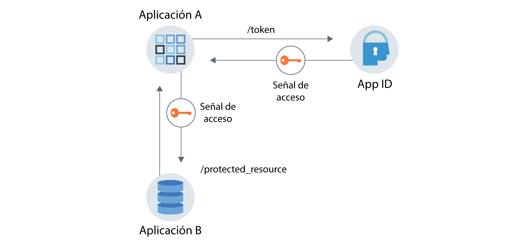

---

copyright:
  years: 2017, 2018
lastupdated: "2018-12-19"

---

{:new_window: target="_blank"}
{:shortdesc: .shortdesc}
{:screen: .screen}
{:codeblock: .codeblock}
{:tip: .tip}

# Autorización e identidad de la aplicación
{: #app}

Con {{site.data.keyword.appid_short_notm}}, puede proteger las aplicaciones utilizando el flujo de autorización e identidad de la aplicación optimizando las prestaciones de OAuth2.0.
{: shortdesc}

## Comprensión del flujo de comunicación
{: #understanding}

**¿Cuándo será útil este flujo?**

Existen varias razones por las que es posible que desee que una aplicación se comunique con otro servicio o app sin la intervención de ningún usuario. Por ejemplo, una app no interactiva que necesita acceder a otra aplicación para realizar su trabajo. Esto podría incluir procesos, CLI, daemons o un dispositivo IoT que supervise e informe acerca de las variables de entorno a un servidor en sentido ascendente. El caso de uso específico es único de cada aplicación, pero lo más importante que se debe recordar es que las solicitudes se intercambian en nombre de la app, no del usuario final, y es la app la que se autentica y autoriza.

Consulte el ejemplo sobre la <a href="https://www.ibm.com/blogs/bluemix/2018/02/using-app-id-secure-docker-kubernetes-applications/" target="_blank">Utilización de {{site.data.keyword.appid_short_notm}} para proteger aplicaciones de Docker y Kubernetes </a>.

**¿Cómo funciona el flujo de autorización e identidad de la aplicación?**

{{site.data.keyword.appid_short_notm}} optimiza el flujo de las credenciales del cliente OAuth2.0 para proteger la comunicación. Después de que una app se registre con {{site.data.keyword.appid_short_notm}}, esta obtiene un ID de cliente y un secreto. Con esta información, la app puede solicitar una señal de acceso de {{site.data.keyword.appid_short_notm}} y obtener autorización para acceder a un recurso o API protegidos. En el flujo de autorización e identidad de la aplicación, esta obtiene únicamente una señal de acceso. No obtiene una señal de identidad o de renovación. Para obtener más información sobre las señales, consulte [Comprensión de las señales](/docs/services/appid/authorization.html#tokens).

Este flujo de trabajo está pensado para utilizarse solo con aplicaciones de confianza en las que no existe riesgo de que el secreto se utilice de forma indebida o de que se filtre. La aplicación siempre mantiene el secreto del cliente. No funcionará en apps para móvil.
{: tip}

**¿Qué aspecto tiene el flujo?**

En la imagen siguiente, puede ver la dirección de la comunicación entre el servicio y la aplicación.


Figura. Flujo de autorización e identidad de la aplicación

1. La aplicación A se registra con {{site.data.keyword.appid_short_notm}} para obtener un ID de cliente y un secreto.
2. La aplicación A realiza una solicitud a {{site.data.keyword.appid_short_notm}} enviando las credenciales recuperadas en el paso anterior.
3. {{site.data.keyword.appid_short_notm}} valida la solicitud, autentica la app y devuelve una respuesta a la aplicación A que contiene una señal de acceso.
4. La aplicación A ahora puede utilizar la señal de acceso para enviar solicitudes a la aplicación B como, por ejemplo, un recurso protegido.

## Registro de la app
{: #registering}

**Registro de la app con la GUI**

1. En el separador **Aplicación** del panel de control de {{site.data.keyword.appid_short_notm}}, pulse **Añadir aplicación**.
2. Añada el nombre de la aplicación y pulse **Guardar** para volver a una lista de las apps registradas. El nombre de la aplicación no puede superar los 50 caracteres.
3. En la lista de apps registradas, seleccione la aplicación que ha añadido en el paso anterior. La fila se expande para mostrar las credenciales.

**Registro de la app con la API**

1. Realice una solicitud POST en el punto final [`/management/v4/{tenantId}/applications`](https://appid-management.ng.bluemix.net/swagger-ui/#!/Applications/registerApplication).

  Solicitud:
  ```
  curl -X POST \  https://appid-management.ng.bluemix.net/management/v4/39a37f57-a227-4bfe-a044-93b6e6060b61/applications/ \
  -H 'Content-Type: application/json' \
  -H 'Authorization: Bearer IAM_TOKEN' \
  -d '{"name": "ApplicationName"}'
  ```
  {: codeblock}

  Ejemplo de respuesta:
  ```
  {
  "clientId": "111c22c3-38ea-4de8-b5d4-338744d83b0f",
   "tenantId": "39a37f57-a227-4bfe-a044-93b6e6060b61",
  "secret": "ZmE5ZDQ5ODctMmA1ZS00OGRiLWExZDMtZTA1MjkyZTc4MDB4",
  "name": "ApplicationName",
   "oAuthServerUrl": "https://appid-oauth.eu-gb.bluemix.net/oauth/v3/39a37f57-a227-4bfe-a044-93b6e6060b61"
   }
  ```
  {: codeblock}


## Obtención de una señal de acceso
{: #obtain-token}

Una vez que haya registrado la app con {{site.data.keyword.appid_short_notm}} y haya obtenido las credenciales, puede realizar una solicitud al servidor de autorización {{site.data.keyword.appid_short_notm}} para obtener una señal de acceso.

1. Realice una solicitud POST HTTP en el punto final [`/oauth/v3/{tenantId}/token`](https://appid-oauth.ng.bluemix.net/swagger-ui/#!/Authorization_Server_V3/token). La autorización para la solicitud es `Basic auth` con el ID de cliente y el secreto que se utilizan como nombre de usuario y contraseña codificados en base64.

  Solicitud:
  ```
  curl -X POST \
    http://localhost:6002/oauth/v3/39a37f57-a227-4bfe-a044-93b6e6060b61/token \
    -H 'Authorization: Basic base64Encoded{clientId:secret}' \
    -H 'Content-Type: application/x-www-form-urlencoded' \
    -d grant_type=client_credentials
  ```
  {: codeblock}

  Ejemplo de respuesta:
  ```
  {
  "access_token": "eyJhbGciOiJS...F9A",
  "expires_in": "3600",
  "token_type": "Bearer"
  }
  ```
  {: codeblock}


## Guía de aprendizaje: Flujo de extremo a extremo con el SDK de Node.js
{: tutorial-node}

1. Obtenga una [señal de acceso](/docs/services/appid/authorization.html#tokens) de una de las formas siguientes:

  * Desde el {{site.data.keyword.appid_short_notm}} [SDK del servidor Node.js ](https://github.com/ibm-cloud-security/appid-serversdk-nodejs) utilizando el gestor de señales. Inicialice el gestor de señales con las credenciales de la app y llame al método `getApplicationIdentityToken()` para obtener la señal.

    ```
    const TokenManager = require('ibmcloud-appid').TokenManager;
    const config = {
     clientId: "29a19759-aafb-41c7-9ef7-ee7b0ca88818",
     tenantId: "39a37f57-a227-4bfe-a044-93b6e6060b61",
     secret: "ZTEzZTA2MDAtMjljZS00MWNlLTk5NTktZDliMjY3YzUxZTYx",
     oauthServerUrl: "https://appid-oauth.eu-gb.bluemix.net/oauth/v3/39a37f57-a227-4bfe-a044-93b6e6060b61"
    };

    const tokenManager = new TokenManager(config);

    tokenManager.getApplicationIdentityToken().then((appIdAuthContext) => {
     console.log(' Access tokens from SDK : ' + JSON.stringify(appIdAuthContext));
    }).catch((err) => {
     //console.error('Error retrieving tokens : ' + err);
    });
    ```
    {: codeblock}

  * Desde el servidor de autorización de {{site.data.keyword.appid_short_notm}}. **Nota**: El `oauthServerUrl` de la solicitud se obtiene cuando se registra en la aplicación. Si ha registrado la app con las API de gestión, el URL del servidor se encontrará en el cuerpo de respuesta. Si ha registrado la app enlazándola con la consola de IBM Cloud, podrá encontrar el URL en el objeto JSON VCAP_SERVICES o mediante los secretos de Kubernetes.

    ```
    var request = require('request');

    function getAccessToken() {
      let options = {
          method: 'POST',
          url: oauthServerUrl + '/token',
          headers: { 'content-type': 'application/x-www-form-urlencoded',
              'Authorization': 'Basic ' +Buffer.from('clientId: secret').toString('base64')
          },
          form: {
              grant_type: 'client_credentials'
          }
      };

      return new Promise((resolve, reject) => {
          request(options, function (error, response, body) {
              if (error) {
                  return reject(error);
              }

              let data = JSON.parse(body);
              if(data.access_token) {
                  resolve(data.access_token);
              } else {
                  reject(data);
              }
          })
      });
    }
    ```
    {: codeblock}

2. Realice una solicitud al recurso protegido utilizando la señal de acceso que ha obtenido en el paso anterior.

  ```
  let options = {
      method: 'GET',
      url: 'http://localhost:8081/protected_resource',
      headers: { authorization : 'Bearer ' + accessToken}
  }

  request(options, function (error, response, body) {
      if (error) {
       console.log(error)
      } else {
          res.status(response.statusCode).send({
      console.log(JSON.stringify(body));
          });
      }
  });
  ```
  {: codeblock}

3. Asegure los recursos protegidos utilizando la estrategia de API del SDK del Node.js de {{site.data.keyword.appid_short_notm}}.

  ```
  const express = require('express'),
    passport = require('passport');

  var app = express();
  app.use(passport.initialize());

  passport.use(new APIStrategy({
      oauthServerUrl: "https://appid-oauth.eu-gb.bluemix.net/oauth/v3/398ec248-5e93-48b8-a122-ccabc714fe85",
      tenantId:"398ec248-5e93-48b8-a122-ccabc714fe85"
  }));

  app.get('/protected_resource',
      passport.authenticate(APIStrategy.STRATEGY_NAME, {session: false}),
      (req, res) => {
          res.send("Hello from protected resource");
  });
  ```
  {: codeblock}
