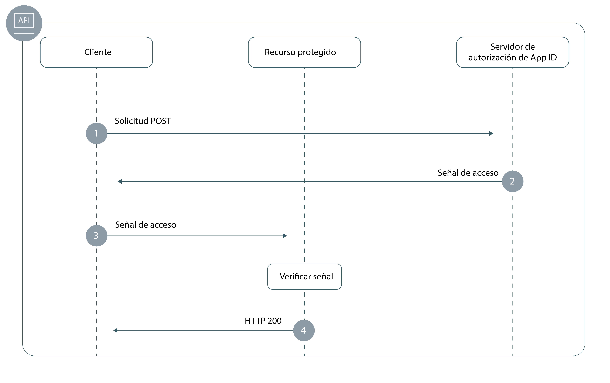

---

copyright:
  years: 2017, 2018
lastupdated: "2018-12-19"

---

{:new_window: target="_blank"}
{:shortdesc: .shortdesc}
{:pre: .pre}
{:tip: .tip}
{:screen: .screen}

# Apps de fondo
{: #adding-backend}

Puede utilizar las API y SDK de {{site.data.keyword.appid_full}} para proteger las API y puntos finales de la aplicación de fondo.
{: shortdesc}


## Comprensión del flujo
{: #understanding}

**¿Cuándo será útil este flujo?**

Parte del desarrollo de apps de fondo es verificar que las API estén protegidas del acceso no autorizado. Los SDK de {{site.data.keyword.appid_short_notm}} facilitan la protección de los puntos finales de API y garantizan la seguridad de la app.

**¿Cuál es la base técnica del flujo?**

{{site.data.keyword.appid_short_notm}} implementa [OAuth2](https://tools.ietf.org/html/rfc6749) y la especificación OIDC, que utiliza señales portadores para la autenticación y autorización. Estas señales tienen el formato de [señales web de JSON ](https://tools.ietf.org/html/rfc7519), que están firmadas digitalmente y contienen reclamaciones que describen el sujeto que se está autenticando y el proveedor de identidad. Las API de la aplicación están protegidas por señales de identidad y acceso. Es posible autenticar los clientes que necesitan acceso a las API con el proveedor de identidad mediante {{site.data.keyword.appid_short_notm}} a cambio de estas señales. Las reclamaciones de las señales tienen que ser validadas para poder otorgar acceso a las API protegidas.

Para obtener más información sobre cómo se utilizan las señales en {{site.data.keyword.appid_short_notm}}, consulte [Comprensión de las señales](/docs/services/appid/authorization.html#tokens).
{: tip}

**¿Qué aspecto tiene el flujo?**



1. Un cliente realiza una solicitud POST al servidor de autorización de {{site.data.keyword.appid_short_notm}} para obtener una señal de acceso. Por lo general, una solicitud POST tiene el formato siguiente:

  ```
  POST/oauth/v3/{tenantId}/token HTTP/1.1
  Content_type: application/x-www-form-urlencoded
  Authorization header = "Basic" + base64encode({clientId}:{secret})
  FormData = {grant_type}
  ```
  {: screen}

2. Si el cliente cumple con las cualificaciones, el servidor de autorización devolverá una señal de acceso.

3. El cliente envía una solicitud al recurso protegido.

4. El recurso protegido o la API validan la señal. Si la señal es válida, se otorgará el acceso al recurso para el cliente. Si la señal no se puede validar, se denegará el acceso.


## Protección de recursos con el SDK de Node.js
{: #secure-node}

El SDK del servidor de {{site.data.keyword.appid_short_notm}} impone la autenticación y autorización con la [infraestructura Passport](http://www.passportjs.org/). Con `ApiStrategy`, puede proteger los recursos de fondo solicitando que las señales de identidad y acceso se validen en la cabecera de autorización como parte de la solicitud.
{: shortdesc}

**Antes de empezar**

Debe tener los siguientes requisitos previos antes de poder empezar:
 * Una instancia de {{site.data.keyword.appid_short_notm}}
 * NPM versión 4 o superior
 * Node versión 6 o superior

**Instalación del SDK**

1. Añada el SDK de Node.js de {{site.data.keyword.appid_short_notm}} en el archivo `package.json` de su app.

  ```
  "dependencies": {
      "ibmcloud-appid": "^4.0.0"
  }
  ```
  {: codeblock}

2. Ejecute el mandato siguiente.

  ```
  npm install
  ```
  {: codeblock}

**Inicialización del SDK**

Puede inicializar el SDK utilizando un `url de servidor oauth`.

1. Obtenga el `url de servidor oauth`.
  1. Vaya al separador **Credenciales de servicio** del panel de control de {{site.data.keyword.appid_short_notm}}.
  2. Si aún no dispone de un conjunto de credenciales, pulse en **Nueva credencial** y, a continuación, en **Añadir** para crear uno nuevo. Si ya lo tiene, omita este paso.
  3. Pulse en el conmutador **Ver credenciales** para ver la información.
  4. Copie el `url de servidor de oauth` para utilizarlo en el paso siguiente.

2. Inicialice la estrategia Passport de {{site.data.keyword.appid_short_notm}} como se muestra en el ejemplo siguiente.

  ```javascript
  var express = require('express'); 
  var passport = require('passport');
  var APIStrategy = require('ibmcloud-appid').APIStrategy; 
  passport.use(new APIStrategy({ oauthServerUrl: "{oauth-server-url}" })); 
  var app = express();
  app.use(passport.initialize());
  ```
  {: codeblock}


Si la app Node.js se ejecuta en {{site.data.keyword.Bluemix_notm}} y está enlazada a la instancia de {{site.data.keyword.appid_short_notm}}, no será necesario proporcionar la configuración de estrategia de la API. La configuración de {{site.data.keyword.appid_short_notm}} obtiene la información utilizando la variable de entorno VCAP_SERVICES.
{: tip}

**Protección de la API**

El fragmento de código siguiente muestra cómo utilizar `ApiStrategy` en una app Express para proteger la API GET `/protected`.

  ```javascript
   app.get('/protected', passport.authenticate('APIStrategy.STRATEGY_NAME', { session: false }), function(request, response){
      console.log("Security context", request.appIdAuthorizationContext);
      response.send(200, "Success!");
      }
   );
   ```
  {: codeblock}

Cuando las señales son válidas, se llama al siguiente middleware en la cadena de solicitudes y la propiedad `appIdAuthorizationContext` se añade al objeto de solicitud. La propiedad contiene el acceso original y las señales de identidad, además de información de carga útil descodificada de las señales correspondientes.


## Protección de recursos con el SDK de Swift
{: #secure-swift}

Puede utilizar {{site.data.keyword.appid_short_notm}} para proteger los recursos del lado del servidor utilizando el SDK de Swift.
{: shortdesc}

El [SDK del servidor de Swift](https://github.com/ibm-cloud-security/appid-serversdk-swift) de {{site.data.keyword.appid_short_notm}} proporciona un plugin de middleware de protección de la API que se utiliza para proteger sus apps de fondo. Al asociar las API con el middleware, puede proteger la app de acceso no autorizado. Una vez que la API esté protegida, el middleware garantiza que las señales generadas por {{site.data.keyword.appid_short_notm}} estén validadas. Entonces podrá modificar el comportamiento de la API dependiendo de los resultados de la validación.

Consulte el siguiente fragmento de código para ver un ejemplo de cómo proteger la API de `/protectedendpoint`.

```Swift
import Foundation
import Kitura              // server
import Credentials         // middleware
import IBMCloudAppID       // SDK

// configurar rutas
let router = Router()

// opción obligatoria que se pasará si la app no está desplegada en IBM Cloud
let options = [
    "oauthServerUrl": "https://appid-oauth.ng.bluemix.net/oauth/v3/d8438de6-c325-4956-ad34-abd49194affd",
]
let apiCreds = Credentials()

// Versión de macOS mínima necesaria
if #available(OSX 10.12, *) {

    // configuración de la protección de la API
    let apiKituraCredentialsPlugin = APIKituraCredentialsPlugin(options: options)
    apiCreds.register(plugin: apiKituraCredentialsPlugin)

    // asociar ruta con protección de la API
    router.all(middleware: apiCreds)

    // crear API protegida
    router.get("/protectedendpoint") { request, response, next in

        response.headers["Content-Type"] = "text/html; charset=utf-8"
        do {
            if let userProfile = request.userProfile  {
                try response.status(.OK).send(
                    "<!DOCTYPE html><html><body>" +
                        "Welcome " + userProfile.displayName  +
                        "! You are logged in with " + userProfile.provider + ".
" +
                    "</body></html>\n\n").end()
                next()
                return
            }
            try response.status(.unauthorized).send(
                "<!DOCTYPE html><html><body>” + “You are not authorized!" +
                "</body></html>\n\n").end()
        }
        catch {}
        next()
    }

    // Iniciar el servidor
    Kitura.addHTTPServer(onPort: 8090, with: router)

    Kitura.run()  
}
```
{: codeblock}

## Protección de recursos de forma manual
{: secure-api}

La protección de apps de fondo y recursos protegidos implica la validación de señales. Puede validar señales de identidad y acceso de {{site.data.keyword.appid_short_notm}} de diversas formas. Para obtener ayudar con la validación de señales, consulte [Validación de señales](/docs/services/appid/tokens.html).


## Pasos siguientes
{: #next}

Con {{site.data.keyword.appid_short_notm}} instalado en la aplicación, casi está listo para iniciar la autenticación de usuarios. A continuación, intente realizar una de las siguientes actividades:

* Configure los [proveedores de identidad](/docs/services/appid/identity-providers.html)
* Personalice y configure el [widget de inicio de sesión](/docs/services/appid/login-widget.html)
* Obtenga más información sobre el <a href="https://github.com/ibm-cloud-security/appid-serversdk-nodejs" target="_blank">SDK de Node.js </a>
* Obtenga más información sobre el <a href="https://github.com/ibm-cloud-security/appid-serversdk-swift" target="_blank">SDK de Swift</a>
