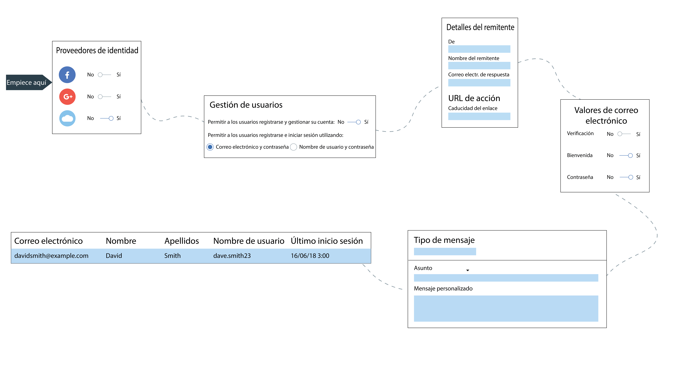

---

copyright:
  years: 2017, 2019
lastupdated: "2019-04-04"

keywords: authentication, authorization, identity, app security, secure, directory, registry, passwords, languages, lockout

subcollection: appid

---

{:new_window: target="_blank"}
{:shortdesc: .shortdesc}
{:screen: .screen}
{:pre: .pre}
{:table: .aria-labeledby="caption"}
{:codeblock: .codeblock}
{:tip: .tip}
{:note: .note}
{:important: .important}
{:deprecated: .deprecated}
{:download: .download}

# Configuración del Directorio en la nube
{: #cloud-directory}

Con {{site.data.keyword.appid_full}}, los usuarios pueden registrarse e iniciar la sesión en sus apps web y móviles mediante un correo electrónico o un nombre de usuario y una contraseña. Un directorio en la nube es un registro de usuarios que está mantenido en la nube. Cuando un usuario se registra en su app, se le añade al directorio de usuarios. Con esta característica, los usuarios tienen la libertad de gestionar sus propias cuentas dentro de la app.
{: shortdesc}

## Gestión de los valores de directorio
{: #cd-settings}

Puede configurar las notificaciones y el nivel de control de usuario para su app. La configuración del directorio en la nube puede realizarse rápidamente, tal como se muestra en la siguiente imagen. Estos valores pueden actualizarse en cualquier momento desde el panel de control del servicio y se reflejan en su app sin necesidad de realizar ningún cambio de código.
{: shortdesc}

Figura. Guía de configuración del Directorio en la nube

1. Vaya al separador **Gestionar autenticaciones** del panel de control de {{site.data.keyword.appid_short_notm}}, asegúrese de que el directorio en la nube esté establecido en **Activado**.

2. En el separador **Directorio en la nube > Valores**, establezca **Permitir a los usuarios registrarse e iniciar sesión** en **Correo electrónico y contraseña** o **Nombre de usuario y contraseña**. El usuario puede iniciar sesión con un correo electrónico que ya tenga o crear un nombre de usuario que se utilizará cuando interactúe con la app.

  Puede alternar entre las opciones antes de añadir usuarios al directorio. Una vez añadido el primer usuario, todos los usuarios posteriores deberán utilizar la misma configuración.
  {: note}

2. Decida si desea que los usuarios creen un nombre de usuario o utilicen su correo electrónico cuando inicien sesión. Ambas opciones requieren una contraseña. Una vez que los usuarios se hayan añadido al directorio, ya no podrá alternar entre las opciones.

3. Pulse en **Editar** en la fila de criterios de contraseña para especificar los requisitos que desea poner en marcha. Los criterios de contraseña se proporcionan en forma de expresión regular. Para ayudar a determinar la fortaleza o ver ejemplos comunes, consulte [Gestionar la fortaleza de contraseña](/docs/services/appid?topic=appid-cd-strength#cd-strength). Pulse en **Guardar** para poner los requisitos en acción.

4. Establezca **Permitir a los usuarios iniciar sesión en la app** en **Sí**. Todavía puede añadir usuarios a través de la consola si la opción está establecida en **No**. Sin embargo, es más común añadir usuarios a través de la consola solo con fines de desarrollo.

5. Establezca **Permitir a los usuarios gestionar su cuenta desde la app** en **Sí** si desea que los usuarios puedan restablecer o cambiar la contraseña o restablecer los detalles. Si desea limitar la capacidad de autoservicio de su usuario, establezca el valor en **No**.

6. Configure los valores de correo electrónico. Pulse **Editar** en la fila **Detalles del remitente** para actualizar la configuración de correo electrónico. Los valores de correo electrónico se aplican a todas las comunicaciones que se envían a través de {{site.data.keyword.appid_short_notm}}.

    1. Especifique la dirección de correo electrónico que debe enviar el correo electrónico. Si opta por cambiar el valor predeterminado, el correo electrónico podría enviarse a la carpeta de correo basura de un usuario.

    2. Añada un nombre para el Remitente.

    3. Especifique un correo electrónico que se pueda utilizar para enviar una respuesta.

    4. Pulse **Guardar**.
