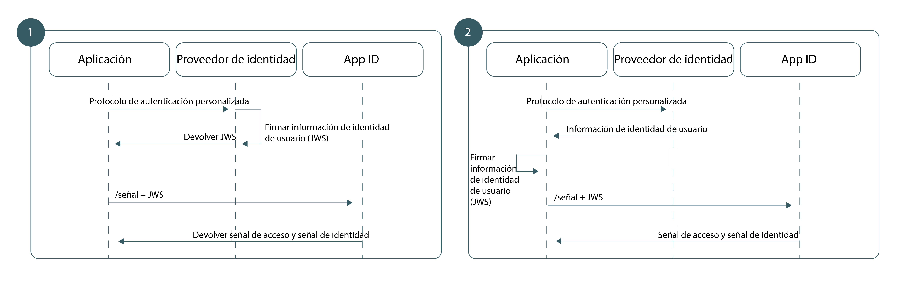

---

copyright:
  years: 2017, 2019
lastupdated: "2019-05-31"

keywords: authentication, authorization, identity, app security, secure, custom, proprietary, 

subcollection: appid

---

{:new_window: target="_blank"}
{:shortdesc: .shortdesc}
{:screen: .screen}
{:pre: .pre}
{:table: .aria-labeledby="caption"}
{:codeblock: .codeblock}
{:tip: .tip}
{:note: .note}
{:important: .important}
{:deprecated: .deprecated}
{:download: .download}

# Utilización de la identidad personalizada en la app
{: #custom-auth}

Puede utilizar su propio proveedor de identidad personalizado cuando realice la autenticación. El proveedor de identidad puede ajustarse a cualquier mecanismo de autenticación alternativo a los soportados por {{site.data.keyword.appid_full}}, incluidos el propietario o herencia.
{: shortdesc}

## Visión general
{: #custom-auth-overview}

Al traer su propio proveedor de identidad, puede crear un flujo de autenticación personalizado que utilice sus propios protocolos. Tiene más control como, por ejemplo, información que desea compartir o información que se almacena.
{: shortdesc}

Asegúrese de [configurar el proveedor personalizado](/docs/services/appid?topic=appid-custom-identity) antes de añadirlo a la aplicación.
{: tip}

### ¿Cuándo debo utilizar este flujo?
{: #custom-auth-when}

Si {{site.data.keyword.appid_short_notm}} no proporciona soporte directo para un proveedor de identidad en concreto, puede utilizar el flujo de identidad personalizado para establecer un puente en el protocolo de autenticación hacia el flujo de autenticación existente de {{site.data.keyword.appid_short_notm}}. Por ejemplo, desea utilizar GitHub o LinkedIn para permitir a los usuarios iniciar sesión. Puede utilizar el SDK existente del proveedor de identidad para facilitar la información de autenticación de usuario antes de empaquetarla e intercambiarla con {{site.data.keyword.appid_short_notm}}.

Existen muchos casos de ejemplo en los que es necesario un flujo de autenticación distinto:

 - Proveedores de identidad internos y de propiedad 
 - Proveedores de identidad de terceros 
 - Flujos de autenticación complicados que pueden incluir mecanismos de multifactores de propiedad 

Ocasionalmente, un proveedor heredado puede utilizar su propio protocolo de autenticación personalizado. Puesto que el flujo de identidad personalizado desacopla completamente la autenticación de la autorización, puede adoptar cualquier mecanismo de autenticación de su elección y proporcionar la información de autenticación resultante a {{site.data.keyword.appid_short_notm}}. Todo ello sin exponer las credenciales de usuario.

</br>

### Técnicamente, ¿cómo funciona este flujo?
{: #custom-auth-tech}

El flujo de trabajo de identidad personalizado se basa en el tipo de otorgamiento de la extensión JWT-Bearer que se define en Assertion Framework for OAuth 2.0 Authorization Grants [[RFC7521]](https://tools.ietf.org/html/rfc7523#section-2.1). Para poder intercambiar información de usuario para las señales de {{site.data.keyword.appid_short_notm}}, la arquitectura de autenticación crea una relación de confianza con {{site.data.keyword.appid_short_notm}} utilizando un par de claves RSA asimétricas. Una vez se haya establecido la confianza, puede utilizar el tipo de otorgamiento JWT-Bearer para intercambiar información de usuario verificada en un JWT firmado para las señales {{site.data.keyword.appid_short_notm}}.

### ¿Qué aspecto tiene el flujo?
{: #custom-auth-flow}

Al igual que todos los flujos de autenticación, la identidad personalizada requiere que la aplicación sea capaz de establecer un grado de confianza con {{site.data.keyword.appid_short_notm}} para garantizar la integridad de la información de usuario del proveedor de identidad. La identidad personalizada utiliza un par de claves públicas y privadas de RSA asimétricas para establecer la relación de confianza. En función de los requisitos arquitectónicos, la identidad personalizada admite dos modelos de confianza que difieren únicamente en la ubicación del almacenamiento y el uso de la clave privada.


Figura. Los flujos de solicitud de la autenticación personalizada

<dl>
  <dt>1. Proveedor de identidad firmado</dt>
    <dd>Al igual que con los flujos OAuth 2.0 tradicionales, el modelo de confianza más seguro crea una relación entre su proveedor de identidad y el servidor de autorización; en este caso es directamente {{site.data.keyword.appid_short_notm}}. En este modelo, el proveedor de identidad es responsable de almacenar la clave privada y de firmar las aserciones de JWT. Cuando se pasan a {{site.data.keyword.appid_short_notm}}, dichas aserciones se validan con la clave pública coincidente, lo que garantiza que la información de usuario de su proveedor de identidad no se haya alterado malintencionadamente durante el transporte.</dd>
  <dt>2. Aplicación firmada</dt>
    <dd>De forma alternativa, puede basar su modelo en la relación entre la app y {{site.data.keyword.appid_short_notm}}. En este flujo de trabajo, la clave privada se almacena en la aplicación del lado del servidor. Tras una autenticación correcta, la app es responsable de convertir la respuesta de los proveedores de identidad en JWT y de firmarla con la clave privada antes de que la app envíe la señal a {{site.data.keyword.appid_short_notm}}. Puesto que el proveedor de identidad no tiene ninguna relación con {{site.data.keyword.appid_short_notm}}, la arquitectura crea un modelo de confianza más débil. Si bien {{site.data.keyword.appid_short_notm}} puede confiar en la información enviada por la aplicación del lado del servidor, no puede estar seguro de que los datos son los primeros que envió el proveedor de identidad.</dd>
</dl>


## Generación de una señal web de JSON
{: #generating-jwts}

Puede convertir los datos de usuario verificados en un JWT de identidad personalizado generando una <a href="https://tools.ietf.org/html/rfc7515" target="blank">señal web de JSON </a>. La señal debe estar firmada con la clave privada que coincide con la clave pública preconfigurada. Para obtener una lista de bibliotecas de firma de señales, consulte <a href="https://jwt.io/" target="blank">https://jwt.io/ </a>.
{: shortdesc}

### Formato JWT de ejemplo
{: #jwts-example}

Cabecera de señal:
  ```
  {
  "alg": "RS256",
  "typ": "JOSE"
  }
  ```
  {: screen}

Carga útil de señal:
  ```
  {
    // Obligatorio
    iss: String, // Debe hacer referencia al proveedor de identidad
    aud: String, // Debe ser el nombre de URL de servidor
    exp: Int,    // Debe ser un valor con un período de vida corto
    sub: String, // Debe ser el ID de usuario único proporcionado por el proveedor de identidad

    // Reclamaciones normalizadas (opcional)
    name: String
    email: String
    locale: String
    picture: String
    gender: String

    // Ámbitos personalizados para añadirlos a la señal de acceso (opcional)
    scope="custom_scope1 custom_scope2"

    // Otras reclamaciones personalizadas (opcional)
    role="admin"
  }
  ```
  {: screen}

  <table>
  <thead>
    <th colspan=2> Campos JWS</th>
  </thead>
  <tbody>
    <tr>
      <td><code>iss</code></td>
      <td>Debería contener una referencia al proveedor de identidad.</td>
    </tr>
    <tr>
      <td><code>aud</code></td>
      <td>El URL de servidor OAuth. Formato: `https://{region}.appid.cloud.ibm.com/oauth/v4/{tenantId}`.</td>
    </tr>
    <tr>
      <td><code>exp</code></td>
      <td>El período de tiempo durante el que la señal es válida. Por razones de seguridad, debe tener un período de vida corta y ser específico.</td>
    </tr>
    <tr>
      <td><code>sub</code></td>
      <td>El ID de usuario exclusivo que proporciona el proveedor de identidad.</td>
    </tr>
    <tr>
      <td>Reclamaciones normalizadas</td>
      <td>Todas las [reclamaciones normalizadas](/docs/services/appid?topic=appid-tokens) se proporcionan en la señal de identidad que se devuelve como respuesta a esta solicitud. Se pueden encontrar más reclamaciones personalizadas utilizando el [punto final `/userinfo`](/docs/services/appid?topic=appid-profiles).</td>
    </tr>
    <tr>
      <td>Ámbito</td>
      <td>De forma predeterminada, todas las señales de {{site.data.keyword.appid_short_notm}} contienen un grupo de ámbito preestablecidos. Puede solicitar ámbitos adicionales realizando una de las acciones siguientes:<ul><li> Especificar el ámbito en el campo de ámbito de la señal JWS.</li> <li>Especificar el ámbito mediante el parámetro del ámbito de formulario url de la solicitud `/token`.</li></ul></td>
    </tr>
  </tbody>
  </table>

## Recuperación de señales de {{site.data.keyword.appid_short_notm}}
{: #exchanging-jwts}

Para crear el puente entre el proveedor personalizado y {{site.data.keyword.appid_short_notm}} debe tener señales de {{site.data.keyword.appid_short_notm}}. Para obtener señales de servicio, cambie la información de usuario verificada utilizando el punto final [`/token`](https://us-south.appid.cloud.ibm.com/swagger-ui/#/Authorization_Server_V4/token).
{: shortdesc}

  ```
  Post /token
  Content-Type: application/x-www-from-urlencoded
  grant_type=urn:ietf:params:oauth:grant-type:jwt-bearer
  assertion=<payload>
  scope="<space separated scope array>"
  ```
  {: codeblock}
  <table>
    <thead>
      <th colspan=2> Construcción de solicitud</th>
    </thead>
    <tbody>
      <tr>
        <td>Content-type</td>
        <td><code>applications/x-www-from-urlencoded</code></td>
      </tr>
      <tr>
        <td>grant_type</td>
        <td><code>urn:ietf:params:oauth:grant-type:jwt-bearer</code></td>
      </tr>
      <tr>
        <td>assertion</td>
        <td>A JWS payload string.</td>
      </tr>
      <tr>
        <td>scope</td>
        <td>Una lista separada por espacios en blanco de los ámbitos personalizados.</td>
      </tr>
    </tbody>
  </table>
