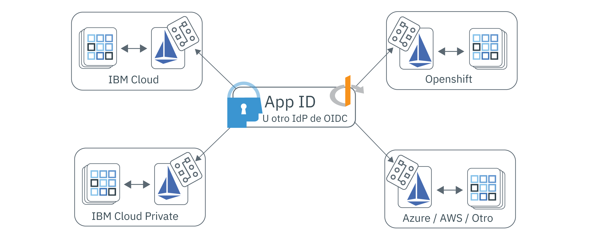

---

copyright:
  years: 2017, 2019
lastupdated: "2019-07-11"

keywords: Authentication, authorization, identity, app security, access, secure, development, any kube, kubernetes, icp, openshift, iks

subcollection: appid

---

{:external: target="_blank" .external}
{:shortdesc: .shortdesc}
{:screen: .screen}
{:pre: .pre}
{:table: .aria-labeledby="caption"}
{:codeblock: .codeblock}
{:tip: .tip}
{:note: .note}
{:important: .important}
{:deprecated: .deprecated}
{:download: .download}

# Protección de apps de varias nubes con Istio
{: #istio-adapter}

Mediante el uso del adaptador App Identity and Access, puede centralizar toda la gestión de identidades en un único lugar. Dado que las empresas utilizan nubes de varios proveedores o una combinación de soluciones locales y externas, los modelos de despliegue heterogéneos pueden ayudarle a conservar la infraestructura existente sin la obligación de permanecer con un proveedor. El adaptador se puede configurar para operar con cualquier proveedor de identidad compatible con OIDC, como {{site.data.keyword.appid_short_notm}}, que le permite controlar las políticas de autorización y autenticación en todos los entornos, incluidas las aplicaciones frontales y de fondo. Además, **todo ello sin necesidad de modificar el código ni de volver a desplegar la aplicación**.
{: shortdesc}


## Arquitectura multinube
{: #istio-multicloud}

Un entorno informático multinube combina varios entornos informáticos privados y/o de nube en una única arquitectura de red. Al distribuir las cargas de trabajo entre varios entornos, es posible aumentar la resiliencia, la flexibilidad y la rentabilidad. Para disfrutar estas ventajas, es habitual utilizar una aplicación basada en contenedor con una capa de orquestación, como por ejemplo Kubernetes.


Figura. Despliegue multinube realizado con el adaptador App Identity and Access.


## Istio y el adaptador
{: #istio-architecure}

[Istio](https://istio.io) es una malla de servicios de código abierto que se sitúa como capa de forma transparente en las aplicaciones distribuidas existentes que pueden integrarse con Kubernetes. Para reducir la complejidad de los despliegues, Istio proporciona información sobre el comportamiento y el control operativo sobre la malla de servicios en su conjunto. Cuando App ID se combina con Istio, se convierte en una solución de identidad escalable e integrada para arquitecturas de varias nubes que no requiere ningún cambio personalizado en el código de aplicación. Para obtener más información, consulte ["¿Qué es Istio?"](https://www.ibm.com/cloud/learn/istio?cm_mmc=OSocial_Youtube-_-Hybrid+Cloud_Cloud+Platform+Digital-_-WW_WW-_-IstioYTDescription&cm_mmca1=000023UA&cm_mmca2=10010608){: external}.

Istio utiliza un sidecar de proxy Envoy para mediar en todo el tráfico de entrada y salida para todos los servicios de la malla de servicios. Mediante el uso del proxy, Istio extrae información sobre el tráfico, lo que se conoce como telemetría, que se envía al componente Istio denominado Mixer para aplicar las decisiones de política. El adaptador App Identity and Access amplía la funcionalidad de Mixer mediante el análisis de la telemetría (atributos) de acuerdo con las políticas personalizadas para controlar la gestión de identidad y acceso en la malla de servicios. Las políticas de gestión de acceso están vinculadas con servicios concretos de Kubernetes y se pueden ajustar de forma detallada para puntos finales de servicio específicos. Para obtener más información sobre las políticas y la telemetría, consulte la [documentación de Istio](https://istio.io/docs/concepts/observability/){: external}. 

Debido a una limitación de Istio, el adaptador App Identity and Access actualmente almacena la información de sesión de usuario internamente y *no* conserva la información en las réplicas o en las configuraciones de migración tras error. Cuando utilice el adaptador, limite las cargas de trabajo a una única réplica hasta que se resuelva esta limitación.
{: note}

### Protección de apps frontales
{: #istio-frontend}

Si utiliza una aplicación basada en navegador, puede utilizar el flujo `authorization_grant` de [Open ID Connect (OIDC)](https://openid.net/specs/openid-connect-core-1_0.html){: external}/OAuth 2.0 para autenticar a los usuarios. Cuando se detecta un usuario no autenticado, se le redirige automáticamente a la página de autenticación. Cuando se completa la autenticación, el navegador se redirige a un punto final `/oidc/callback` implícito, donde el adaptador intercepta la solicitud. En este punto, el adaptador obtiene señales del proveedor de identidades y, a continuación, redirige al usuario de nuevo al URL solicitado inicialmente.

Para ver la información de sesión de usuario, incluidas las señales de sesión, puede consultar la cabecera `Authorization`.

```
Authorization: Bearer <access_token> <id_token>
```
{: screen}

También puede cerrar la sesión de usuarios autenticados. Cuando un usuario autenticado accede a un punto final protegido con `oidc/logout` añadido, tal como se muestra en el ejemplo siguiente, se le desconecta.

```
https://myhost/path/oidc/logout
```
{: screen}

Si es necesario, se puede utilizar una señal de renovación para adquirir automáticamente nuevas señales de acceso y de identidad sin que el usuario tenga que volver a autenticarse. Si el proveedor de identidades configurado devuelve una señal de renovación, se mantiene en la sesión y se utiliza para recuperar nuevas señales cuando caduca la señal de identidad.


### Protección de apps de fondo
{: #istio-backend}

El adaptador se puede utilizar en colaboración con el [flujo JWT Bearer](https://tools.ietf.org/html/rfc6750){: external} de OAuth 2.0 para proteger las API de servicio validando señales de JWT Bearer. El flujo de autorización de Bearer espera que una solicitud contenga una cabecera de Authorization con una señal de acceso válida y una señal de identidad opcional. La estructura de cabecera esperada es `Authorization=Bearer {access_token} [{id_token}]`. A los clientes no autenticados se les devuelve un estado de respuesta HTTP 401 con una lista de los ámbitos que son necesarios para obtener la autorización. Si las señales no son válidas o han caducado, la estrategia de API devuelve una respuesta HTTP 401 con un componente de error opcional que dice `Www-Authenticate=Bearer scope="{scope}" error="{error}"`.


Para obtener más información sobre las señales y cómo se utilizan, consulte [Información sobre las señales](/docs/services/appid?topic=appid-tokens).


## Antes de empezar
{: #istio-before}

Antes de empezar, asegúrese de tener instalados los siguientes requisitos previos.

- [Clúster de Kubernetes](https://kubernetes.io/){: external}
- [Helm](https://helm.sh/){: external}
- [Istio v1.1+](https://istio.io/docs/setup/kubernetes/install/){: external}
  
  También puede utilizar [IBM Cloud Kubernetes Service Managed Istio](/docs/containers?topic=containers-istio).
  {: note}


## Instalación del adaptador
{: #istio-install-adapter}

Para instalar el diagrama, inicialice Helm en el clúster, defina las opciones que desea utilizar y, a continuación, ejecute el mandato de instalación.

1. Si está trabajando con el servicio IBM Cloud Kubernetes, asegúrese de iniciar la sesión y establecer el contexto para el clúster.

2. Instale Helm en el clúster.

    ```bash
    helm init
    ```
    {: codeblock}

    Es posible que desee configurar Helm para que utilice la modalidad `--tls`. Para obtener ayuda sobre la habilitación de TLS, consulte el [Repositorio de Helm](https://github.com/helm/helm/blob/master/docs/tiller_ssl.md){: external}. Si habilita TLS, asegúrese de añadir `--tls` a todos los mandatos de Helm que ejecute. Para obtener más información sobre el uso de Helm con el servicio IBM Cloud Kubernetes Service, consulte [Adición de servicios utilizando diagramas de Helm](/docs/containers?topic=containers-helm#public_helm_install).
    {: tip}

3. Instale el diagrama.

    ```bash
    helm install ./helm/appidentityandaccessadapter --name appidentityandaccessadapter
    ```
    {: codeblock}

## Aplicación de una política de autorización y autenticación
{: #istio-apply-policy}

Una política de autenticación o autorización es un conjunto de condiciones que deben cumplirse para que una solicitud pueda acceder a un acceso de recurso. Al definir la configuración de servicio de un proveedor de identidades y una política que describe cuándo debe utilizarse un flujo determinado, puede controlar el acceso a cualquier recurso de la malla de servicios. Para ver CRD de ejemplo, consulte el [directorio de ejemplos](https://github.com/ibm-cloud-security/app-identity-and-access-adapter/tree/master/samples/crds){: external}.

Para crear una política:

1. Defina una configuración.
2. Registre el punto final.

### Definición de una configuración
{: #istio-apply-define}

En función de si va a proteger aplicaciones frontales o de fondo, cree una configuración de política con una de las opciones siguientes.

* Para aplicaciones frontales: las aplicaciones basadas en navegador que requieren autenticación de usuario se pueden configurar para que utilicen el flujo de autenticación de OIDC/OAuth 2.0. Para definir un CRD de `OidcConfig` que contenga el cliente utilizado para facilitar el flujo de autenticación con el proveedor de identidad, utilice el ejemplo siguiente como guía.

    ```yaml
    apiVersion: "security.cloud.ibm.com/v1"
    kind: OidcConfig
    metadata:
        name:      oidc-provider-config
        namespace: sample-namespace
    spec:
        discoveryUrl: https://us-south.appid.cloud.ibm.com/oauth/v4/<tenant-ID>/oidc-discovery/.well-known
        clientId:     <client-ID>
        clientSecret: <randomlyGeneratedClientSecret>
        clientSecretRef:
            name: <name-of-my-kube-secret>
            key: <key-in-my-kube-secret>
    ```
    {: screen}

    <table>
        <thead>
        <tr>
            <th>Campo</th>
            <th style="text-align:center">Tipo</th>
            <th style="text-align:center">Necesario</th>
            <th style="text-align:center">Descripción</th>
        </tr>
        </thead>
        <tbody>
        <tr>
            <td><code>discoveryUrl</code></td>
            <td style="text-align:center">serie</td>
            <td style="text-align:center">Sí</td>
            <td style="text-align:center">Un punto final conocido que proporciona un documento JSON de información de configuración de OIDC/OAuth 2.0.</td>
        </tr>
        <tr>
            <td><code>clientId</code></td>
            <td style="text-align:center">serie</td>
            <td style="text-align:center">Sí</td>
            <td style="text-align:center">Un identificador para el cliente que se utiliza para la autenticación.</td>
        </tr>
        <tr>
            <td><code>clientSecret</code></td>
            <td style="text-align:center">serie</td>
            <td style="text-align:center">*No</td>
            <td style="text-align:center">Un secreto de texto sin formato que se utiliza para autenticar al cliente. Si no se proporciona, debe existir un campo <code>clientSecretRef</code>.</td>
        </tr>
        <tr>
            <td><code>clientSecretRef</code></td>
            <td style="text-align:center">objeto</td>
            <td style="text-align:center">No</td>
            <td style="text-align:center">Un secreto de referencia que se utiliza para autenticar al cliente. La referencia se puede utilizar en lugar del campo <code>clientSecret</code>.</td>
        </tr>
        <tr>
            <td><code>clientSecretRef.name</code></td>
            <td style="text-align:center">serie</td>
            <td style="text-align:center">Sí</td>
            <td style="text-align:center">El nombre del secreto de Kubernetes que contiene el campo <code>clientSecret</code>.</td>
        </tr>
        <tr>
            <td><code>clientSecretRef.key</code></td>
            <td style="text-align:center">serie</td>
            <td style="text-align:center">Sí</td>
            <td style="text-align:center">El campo dentro del secreto de Kubernetes que contiene el valor de <code>clientSecret</code>.</td>
        </tr>
        </tbody>
    </table>

* Para aplicaciones de fondo: la especificación de señal Bearer de OAuth 2.0 define un patrón para proteger las API mediante [señales web JSON (JWT)](https://tools.ietf.org/html/rfc7519.html){: external}. Al utilizar la configuración siguiente como ejemplo, defina un CRD `JwtConfig` que contenga el recurso de clave pública, que se utiliza para validar firmas de señales.

    ```yaml
    apiVersion: "security.cloud.ibm.com/v1"
    kind: JwtConfig
    metadata:
      name:      jwt-config
      namespace: sample-app
    spec:
        jwksUrl: https://us-south.appid.cloud.ibm.com/oauth/v4/<tenant-ID>/publickeys
    ```
    {: screen}

### Registro de puntos finales de aplicación
{: #istio-register-endpoints}

Registre los puntos finales de aplicación dentro de un CRD de `Policy` para validar las solicitudes entrantes y aplicar las reglas de autenticación. Cada `Policy` se aplica exclusivamente al espacio de nombres de Kubernetes en el que vive el objeto, y puede especificar los servicios, las vías de acceso y los métodos que desea proteger.

```yaml
apiVersion: "security.cloud.ibm.com/v1"
kind: Policy
metadata:
  name:      samplepolicy
  namespace: sample-app
spec:
  targets:
    -
      serviceName: <svc-sample-app>
      paths:
        - exact: /web/home
          method: ALL
          policies:
            - policyType: oidc
              config: <oidc-provider-config>
              rules:
                - claim: scope
                  match: ALL
                  source: access_token
                  values:
                    - appid_default
                    - openid
                - claim: amr
                  match: ANY
                  source: id_token
                  values:
                    - cloud_directory
                    - google

        - exact: /web/user
          method: GET
          policies:
            - policyType: oidc
              config: <oidc-provider-config>
              redirectUri: https://github.com/ibm-cloud-security/app-identity-and-access-adapter
        - prefix: /
          method: ALL
          policies:
            -
              policyType: jwt
              config: <jwt-config>
```
{: screen}


| Objeto de servicio | Tipo | Necesario | Descripción   |
|:----------------:|:----:|:--------:| :-----------: |
| `service` | `serie` | Sí | El nombre del servicio Kubernetes en el espacio de nombres de política que desea proteger. |
| `paths` | `matriz [objeto de vía de acceso]` | Sí | Una lista de objetos de vía de acceso que define los puntos finales que desea proteger. Si se deja vacío, se protegen todas las vías de acceso. |
{: class="simple-tab-table"}
{: caption="Tabla 1. Descripción de los componentes de objeto de servicio" caption-side="top"}
{: #service-object}
{: tab-title="Service object"}
{: tab-group="objects"}

| Objeto de vía de acceso    | Tipo | Necesario | Descripción   |
|:----------------:|:----:|:--------:|:-----------:|
| `exact o prefix` | `serie` | Sí | La vía de acceso en la que desea aplicar las políticas. Las opciones incluyen `exact` y `prefix`. `exact` coincide exactamente con los puntos finales especificados con el último `/` recortado. `prefix` coincide con los puntos finales que empiezan por el prefijo de ruta que se proporciona. |
| `method` | `enum` | No | El método HTTP protegido. Opciones válidas: ALL, GET, PUT, POST, DELETE, PATCH. Valor predeterminado: ALL.  |
| `policies` | `matriz [Política]` | No | Las políticas de OIDC/JWT que desea aplicar.  |
{: class="simple-tab-table"}
{: caption="Tabla 2. Descripción de los componentes de objeto de vía de acceso" caption-side="top"}
{: #path-object}
{: tab-title="Path object"}
{: tab-group="objects"}

| Objeto de política  | Tipo | Necesario | Descripción   |
|:----------------:|:----:|:--------:| :-----------: |
| `policyType` | `enum` | Sí | El tipo de política de OIDC. Las opciones incluyen: `jwt` u `oidc`. |
| `config` | `serie` | Sí | El nombre de la configuración de proveedor que desea utilizar. |
| `redirectUri` | `serie` | No | El URL al que desea que se redirija al usuario tras una correcta autenticación. Valor predeterminado: el URL de la solicitud original. |
| `rules` | `matriz [Regla]` | No | El conjunto de reglas que desea utilizar para la validación de señal. |
{: class="simple-tab-table"}
{: caption="Tabla 3. Descripción de los componentes de objeto de política" caption-side="top"}
{: #policy-object}
{: tab-title="Policy object"}
{: tab-group="objects"}

| Objeto de regla  | Tipo | Necesario | Descripción   |
|:----------------:|:----:|:--------:| :-----------: |
| `claim` | `serie` | Sí | La reclamación que desea validar. |
| `match` | `enum` | No | Los criterios necesarios para la validación de reclamación. Las opciones incluyen: `ALL`, `ANY` o `NOT`. El valor predeterminado se establece en `ALL`. |
| `source` | `enum` | No | La señal en la que desea aplicar la regla. Las opciones incluyen: `access_token` o `id_token`. El valor predeterminado se establece en `access_token`. |
| `values` | `matriz [serie]` | Sí | El conjunto necesario de valores para la validación. |
{: class="simple-tab-table"}
{: caption="Tabla 4. Descripción de los componentes de objeto de regla" caption-side="top"}
{: #rule-object}
{: tab-title="Rule object"}
{: tab-group="objects"}


## Supresión del adaptador
{: #istio-remove}

Para eliminar el adaptador y todos los CRD asociados, debe suprimir el diagrama de Helm y las claves de firma y cifrado asociadas.

```bash
helm delete --purge appidentityandaccessadapter
kubectl delete secret appidentityandaccessadapter-keys -n istio-system
```
{: codeblock}


## Preguntas más frecuentes y resolución de problemas
{: #istio-faq}

Si detecta un problema mientras trabaja con el adaptador App Identity and Access, tenga en cuenta las siguientes técnicas de resolución de problemas y preguntas frecuentes. Para obtener más ayuda, puede formular preguntas a través de un foro o abrir una incidencia de soporte. Si utiliza los foros para hacer preguntas, etiquete su pregunta para que los equipos de desarrolladores de {{site.data.keyword.appid_short_notm}} la puedan ver.

  * Si tiene preguntas técnicas sobre {{site.data.keyword.appid_short_notm}}, publique la pregunta en <a href="https://stackoverflow.com/" target="_blank">Stack Overflow </a> y etiquete la pregunta con "ibm-appid".
  * Para formular preguntas sobre el servicio y obtener instrucciones de iniciación, utilice el foro <a href="https://developer.ibm.com/" target="_blank">dW Answers </a>. Incluya la etiqueta `appid`.

Para obtener más información sobre cómo obtener ayuda, consulte [¿cómo puedo obtener la ayuda que necesito?](/docs/get-support?topic=get-support-getting-customer-support#getting-customer-support).


### Resolución de problemas: Registro
{: #istio-logging}

De forma predeterminada, el estilo de los registros es JSON, y se proporcionan con un nivel de visibilidad `info` para facilitar la integración con los sistemas de registro externos. Para actualizar la configuración de registro, puede utilizar el diagrama de Helm. Los niveles de registro soportados incluyen el rango [-1, 7], como se muestra en el núcleo de Zap. Para obtener más información sobre los niveles, consulte la [documentación de núcleo de Zap](https://godoc.org/go.uber.org/zap/zapcore#Level).

Cuando visualiza manualmente los registros de JSON, es posible que desee realizar un seguimiento de los registros e "imprimirlos con formato" mediante [`jq`](https://brewinstall.org/install-jq-on-mac-with-brew/).
{: note}

**Adaptador**

Para ver los registros del adaptador, puede utilizar `kubectl` o acceder al pod desde el pod `appidentityandaccessadapter` desde la consola de Kubernetes.

```bash
$ alias adapter_logs="kubectl -n istio-system logs -f $(kubectl -n istio-system get pods -lapp=appidentityandaccessadapter -o jsonpath='{.items[0].metadata.name}')"
$ adapter_logs | jq
```
{: codeblock}

**Mixer**

Si el adaptador no parece recibir las solicitudes, compruebe los registros de Mixer para asegurarse de que se ha conectado correctamente al adaptador.

```bash
$ alias mixer_logs="kubectl -n istio-system logs -f $(kubectl -n istio-system get pods -lapp=telemetry -o jsonpath='{.items[0].metadata.name}') -c mixer"
$ mixer_logs | jq
```
{: codeblock}

