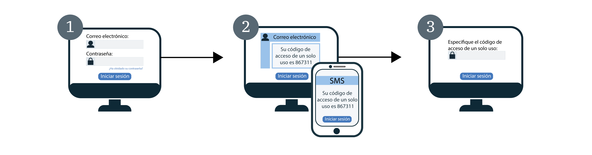

---

copyright:
  years: 2017, 2019
lastupdated: "2019-04-04"

keywords: authentication, authorization, identity, app security, secure, development, two factor, mfa 

subcollection: appid

---

{:new_window: target="_blank"}
{:shortdesc: .shortdesc}
{:screen: .screen}
{:pre: .pre}
{:table: .aria-labeledby="caption"}
{:codeblock: .codeblock}
{:tip: .tip}
{:note: .note}
{:important: .important}
{:deprecated: .deprecated}
{:download: .download}


# Autenticación de multifactores
{: #cd-mfa}


Al exigir varios factores en el inicio de sesión, puede aumentar la seguridad de la autenticación de usuario en sus apps. Con el directorio en la nube para {{site.data.keyword.appid_full}}, el primer factor es la contraseña del usuario del directorio en la nube, que normalmente utilizan para iniciar la sesión. El segundo factor de autenticación es un código de un solo uso que {{site.data.keyword.appid_short_notm}} envía al usuario como un SMS o como un correo electrónico. {{site.data.keyword.appid_short_notm}} utiliza una combinación de ambos factores para verificar la identidad de un usuario.
{: shortdesc}

La MFA de {{site.data.keyword.appid_short_notm}} se soporta como parte del flujo de código de autorización OAuth 2.0 para usuarios de Directorio en la nube mediante el Widget de inicio de sesión. Si utiliza el inicio de sesión de la empresa con SAML 2.0 o el inicio de sesión social, puede habilitar MFA a través del proveedor de identidad.
{: note}

Cuando la MFA está habilitada, el widget de inicio de sesión de {{site.data.keyword.appid_short_notm}} requiere una segunda forma de verificación (segundo factor de autenticación) cada vez que un usuario intenta iniciar sesión. Una vez que el usuario haya especificado correctamente sus credenciales, se envía un código de un solo uso al correo electrónico o número de teléfono que está registrado con la cuenta.

Consulte el siguiente diagrama para ver cómo funciona el flujo de MFA.



1. Se muestra un usuario en el widget de inicio de sesión de {{site.data.keyword.appid_short_notm}} e introduce sus credenciales de usuario del directorio en la nube. Las credenciales pueden ser su correo electrónico o su nombre de usuario y su contraseña. Las credenciales de usuario del directorio en la nube forman el primer factor de autenticación.

2. Se validan las credenciales y se devuelve la pantalla de MFA para la verificación del segundo factor. En función de la configuración del segundo factor, el usuario recibe un mensaje de correo electrónico o un SMS con un código de un solo uso y lo introduce en la pantalla de verificación.

3. Si se valida el código de MFA, el usuario es redirigido de nuevo a la aplicación e inicia la sesión.


## Visión general de MFA
{: #cd-mfa-understanding}


La autenticación de multifactores (MFA) es un método para confirmar la identidad de un usuario requiriendo al mismo que utilice múltiples factores para probar que son quienes afirman ser. Estos factores pueden ser algo que tienen, además de algo que saben o algo que son.
{: shortdesc}

La primera vez que se habilita la MFA, se establece para que utilice el correo electrónico de forma predeterminada. Puede cambiar el valor para que utilice SMS, pero no puede configurar ambos al mismo tiempo. Tanto para correo electrónico como para SMS, hay algunos valores que están configurados para usted y no pueden cambiarse.


<table>
  <tr>
    <th>Valor</th>
    <th>Descripción</th>
  </tr>
  <tr>
    <td>Caracteres de código</td>
    <td>Seis caracteres numéricos</td>
  </tr>
  <tr>
    <td>Caducidad de código</td>
    <td>Quince minutos <br> Si un usuario no valida su código en un plazo de 15 minutos, puede solicitar que se envíe otro código, siempre que la sesión de autenticación no haya caducado. En la misma sesión de autenticación, el código se puede enviar varias veces. Una vez que caduque la sesión de autenticación, el usuario debe repetir el proceso de inicio de sesión desde el principio.</td>
  </tr>
</table>

<p>Definido en SCIM como <a href="https://tools.ietf.org/html/rfc7643#section-2.4" target="_blank">atributo multivalor </a>, un correo electrónico o número de teléfono de un directorio en la nube puede contener lo siguiente:
<ul>
  <li>Valor: el valor de atributo real, por ejemplo, la dirección de correo electrónico o el número de teléfono.</li>
  <li>Primario: Un valor booleano que indica el valor preferido para el atributo. El valor de atributo primario <code>true</code> se puede producir una vez y solo una vez. Si no se especifica, se supone que el valor de <code>primary</code> es <code>false</code>.</li>
</ul>Para obtener más información, consulte la [documentación del directorio en la nube](/docs/services/appid?topic=appid-cloud-directory#cloud-directory).</p>


## Configuración del canal de correo electrónico de MFA
{: #cd-mfa-configure-email}

Puede configurar {{site.data.keyword.appid_short_notm}} para enviar el código de MFA a los usuarios a través del correo electrónico.
{: shortdesc} 

Cuando habilita la MFA por primera vez, ocurre lo siguiente:

- De forma predeterminada, el canal de correo electrónico está seleccionado. Puede cambiarlo al [canal de SMS](/docs/services/appid?topic=appid-cd-mfa#cd-mfa-configure-sms).
- {{site.data.keyword.appid_short_notm}} registra automáticamente el correo electrónico primario que está conectado al perfil del usuario del directorio en la nube.

Si el correo electrónico de un usuario aún no está confirmado, a través de las [API de gestión](https://us-south.appid.cloud.ibm.com/swagger-ui/#/) o mediante la verificación por correo electrónico cuando se registra, se confirma cuando verifica satisfactoriamente un código de MFA.

Antes de empezar, asegúrese de que su instancia de {{site.data.keyword.appid_short_notm}} se encuentra en el [plan de precios de nivel graduado](/docs/services/appid?topic=appid-faq#faq-pricing).
{: note}

### Con la GUI
{: #cd-mfa-configure-email-gui}

Puede configurar el canal de correo electrónico de MFA a través de la GUI.

1. Vaya al separador **Directorio en la nube > Autenticación de multifactores** del panel de control de {{site.data.keyword.appid_short_notm}}.

2. En el recuadro **Habilitar autenticación de multifactores**, en el **separador de valores**, cambie la MFA a **Habilitada**. Acepte que comprende que la MFA se carga como [suceso de seguridad avanzada](/docs/services/appid?topic=appid-faq#faq-pricing). De forma predeterminada, se selecciona **Correo electrónico** como el **Método de autenticación**.

3. En el separador **Canal de correo electrónico**, revise la **Plantilla de correo electrónico**. Puede optar por enviar la plantilla con el texto proporcionado o escribir su propio mensaje. Asegúrese de utilizar el etiquetado HTML correcto. En la GUI, puede añadir parámetros e insertar imágenes. Para cambiar el [idioma](/docs/services/appid?topic=appid-cd-messages#cd-languages) del mensaje, puede utilizar <a href="https://us-south.appid.cloud.ibm.com/swagger-ui/#/Management%20API%20-%20Config/mgmt.updateLocalization" target="_blank">las API de </a> para establecer el idioma. Sin embargo, usted es el responsable del contenido y la traducción del mensaje. Consulte la tabla siguiente para ver la lista de tablas que puede utilizar en este mensaje y todos los demás mensajes que puede enviar. Si un usuario no proporciona la información extraída por el parámetro, aparecerá en blanco.

  <table>
    <thead>
      <tr>
        <th colspan=2> Parámetros de mensajes de MFA</th>
      </tr>
    </thead>
    <tbody>
      <tr>
        <td><code>%{display.logo}</code></td>
        <td> Muestra la imagen que ha configurado para su widget de inicio de sesión. </td>
      </tr>
      <tr>
        <td><code>%{user.displayName}</code></td>
        <td> Muestra el nombre de pantalla que elige un usuario para utilizar al interactuar con la app. </td>
      </tr>
      <tr>
        <td><code>%{user.email}</code></td>
        <td> Muestra la dirección de correo electrónico registrada del usuario. </td>
      </tr>
      <tr>
        <td><code>%{user.username}</code></td>
        <td> Muestra el nombre de usuario especificado del usuario cuando el método de autenticación se establece en nombre de usuario y contraseña. </td>
      </tr>
      <tr>
        <td><code>%{user.firstName}</code></td>
        <td> Muestra el nombre especificado del usuario. </td>
      </tr>
      <tr>
        <td><code>%{user.formattedName}</code></td>
        <td> Muestra el nombre completo del usuario. </td>
      </tr>
      <tr>
        <td><code>%{user.lastName}</code></td>
        <td> Muestra el apellido especificado del usuario. </td>
      </tr>
      <tr>
        <td><code>%{mfa.code}</code></td>
        <td> Muestra un código de verificación MFA de un único uso. </td>
      </tr>
    </tbody>
  </table>

  Si un usuario no proporciona la información extraída por el parámetro, aparecerá en blanco.
  {: tip}


### Con las API
{: #cd-mfa-configure-email-apis}

**Antes de empezar**

Asegúrese de que tiene los requisitos previos siguientes:

* El ID de arrendatario de la instancia de {{site.data.keyword.appid_short_notm}}. Lo encontrará en la sección **Credenciales de servicio** del panel de control.
* La señal Gestión de identidad y acceso (IAM). Si necesita ayuda para obtener la señal de IAM, consulte los [documentos de IAM](/docs/iam?topic=iam-iamtoken_from_apikey#iamtoken_from_apikey).


1. Habilite la MFA, realizando una solicitud PUT en el punto final `/config/mfa` con la configuración de MFA para establecer `isActive` en `true`.

  Cabecera:
  ```
  PUT {management-url}/management/v4/{tenantId}/config/mfa
       Host: <management-server-url>
       Authorization: Bearer <IAM_TOKEN>
       Content-Type: application/json
  ```
  {: pre}

  Cuerpo:
  ```
   {
       "isActive": true
   }
  ```
  {: pre}

  Solicitud de ejemplo:
  ```
  $ curl -X PUT
    --header 'Content-Type: application/json'
    --header 'Accept: application/json'
    --header 'Authorization: Bearer <IAM_TOKEN>'
    -d '{
          "isActive": true
      }'
    }'
    '{management-url}/management/v4/{tenantId}/config/mfa'
  ```
  {: screen}

2. Habilite el canal de MFA realizando una solicitud PUT en el punto final `/mfa/channels/{channel}` con la configuración de MFA. Cuando `isActive` se establece en `true`, se habilita el canal de MFA.

  Cabecera:
  ```
  PUT /management/v4/{tenantId}/mfa/channels/{channel}
       Host: <management-server-url>
       Authorization: Bearer <IAM_TOKEN>
       Content-Type: application/json
  ```
  {: pre}

  Cuerpo:
  ```
   {
       "isActive": true
   }
  ```
  {: pre}

  Solicitud de ejemplo:

  ```
  $ curl -X PUT
    --header 'Content-Type: application/json'
    --header 'Accept: application/json'
    --header 'Authorization: Bearer <IAM_TOKEN>'
    -d '{
          "isActive": true
      }'
    }'
    '{management-url}/management/v4/{tenantId}/mfa/channels/email'
  ```
  {: screen}

Si la instancia del directorio en la nube de {{site.data.keyword.appid_short_notm}} está configurada para funcionar con un distribuidor de correo electrónico, la MFA utiliza el mismo distribuidor para enviar el código de un solo uso. Para obtener más información sobre la configuración de un distribuidor personalizado, consulte los documentos del [directorio en la nube](/docs/services/appid?topic=appid-cd-messages#cd-custom-email).
{: note}


## Configuración de MFA para que trabaje con SMS
{: #cd-mfa-configure-sms}

Puede enviar un mensaje SMS a los usuarios como segunda forma de verificación. Cuando habilita los SMS, {{site.data.keyword.appid_short_notm}} intenta registrar automáticamente el primer número de teléfono primario [válido](https://en.wikipedia.org/wiki/E.164) que se encuentra en el perfil de un usuario del directorio en la nube. Si el número no es válido o no hay ningún número de teléfono en el perfil del usuario, aparece un widget de registro para que el usuario añada un número. A continuación, el número forma parte del perfil del usuario y después de la validación, se convierte en el número predeterminado que se utiliza para la MFA.
{: shortdesc}

**Antes de empezar**

{{site.data.keyword.appid_short_notm}} utiliza [Nexmo](https://www.nexmo.com/products/sms) para enviar códigos de un solo uso de SMS de MFA. Antes de empezar, asegúrese de que tiene una instancia de {{site.data.keyword.appid_short_notm}} que se encuentra en el [plan de precios de nivel graduado](/docs/services/appid?topic=appid-faq#faq-pricing) y la siguiente información de Nexmo.

 - Obtenga el secreto y la clave de API de Nexmo. Puede encontrarlos en la página de configuración de la cuenta en el panel de control de Nexmo. Consulte la [Documentación de Nexmo](https://developer.nexmo.com/concepts/guides/authentication#api-key-and-secret) para obtener más información sobre cómo obtener sus credenciales.

 - Registre el ID del remitente o el número `from` con Nexmo. Este número `from` es lo que aparece en el teléfono del usuario para mostrar de quién es el SMS. Para obtener más información, consulte la [documentación de Nexmo](https://help.nexmo.com/hc/en-us/articles/217571017-What-is-a-Sender-ID).


### Con la GUI
{: #cd-mfa-configure-sms-gui}

Para configurar la MFA mediante la GUI, consulte el [Directorio en la nube](/docs/services/appid?topic=appid-cloud-directory).
{: note}

1. Vaya al separador **Directorio en la nube > Autenticación de multifactores** del panel de control de {{site.data.keyword.appid_short_notm}}.

2. En el recuadro **Habilitar autenticación de multifactores**, en el **separador de valores**, cambie la MFA a **Habilitada**. Acepte que comprende que la MFA se carga como [suceso de seguridad avanzada](/docs/services/appid?topic=appid-faq#faq-pricing).

3. Seleccione **SMS** como **Método de autenticación**.

4. En el separador **Canal SMS** configure la información de la cuenta de Nexmo.

    1. Si todavía no tiene una cuenta con Nexmo, cree una.

    2. En el panel de control de Nexmo, pulse **SMS**.

    3. En la sección **Cree su propio código**, copie la clave de API y péguela en el recuadro **clave** en el panel de control de {{site.data.keyword.appid_short_notm}}.

    4. Copie el **secreto de API** en el panel de control de Nexmo y péguelo en el recuadro **Secreto** en el panel de control de {{site.data.keyword.appid_short_notm}}.

    5. Especifique el [número](https://help.nexmo.com/hc/en-us/articles/217571017-What-is-a-Sender-ID) desde el cual desea enviar mensajes. Un formato de número válido sigue el [formato de numeración internacional E.164](https://en.wikipedia.org/wiki/E.164) (por ejemplo, número de Estados Unidos, + 1 999 888 7777). Debe especificar el código de país, empezando con un símbolo + y el número nacional del suscriptor.


### Con las API
{: #cd-mfa-configure-sms-api}

**Antes de empezar**

Asegúrese de que tiene los requisitos previos siguientes:

* El ID de arrendatario de la instancia de {{site.data.keyword.appid_short_notm}}. Lo encontrará en la sección **Credenciales de servicio** del panel de control.
* La señal Gestión de identidad y acceso (IAM). Si necesita ayuda para obtener la señal de IAM, consulte los [documentos de IAM](/docs/iam?topic=iam-iamtoken_from_apikey).


1. Habilite la MFA, realizando una solicitud PUT en el punto final `/config/mfa` con la configuración de MFA para establecer `isActive` en `true`.

Cabecera:

  ```
  PUT {management-url}/management/v4/{tenantId}/config/mfa
       Host: <management-server-url>
       Authorization: Bearer <IAM_TOKEN>
       Content-Type: application/json
  ```
  {: pre}

Cuerpo:

  ```
  {
   "isActive": true
   }
  ```
  {: pre}


Solicitud de ejemplo:

  ```
  $ curl -X PUT
    --header 'Content-Type: application/json'
    --header 'Accept: application/json'
    --header 'Authorization: Bearer <IAM_TOKEN>'
    -d '{
    "isActive": true
      }'
  '{management-url}/management/v4/{tenantId}/config/mfa'
  ```
  {: screen}

2. Habilite el canal de MFA realizando una solicitud PUT en el punto final `/mfa/channels/{channel}` con la configuración de MFA. Cuando `isActive` se establece en `true`, se habilita el canal de MFA.
La `configuración` incorpora la clave y el secreto de la API de Nexmo, así como el número `from`.

Cabecera:

  ```
  PUT /management/v4/{tenantId}/mfa/channels/{channel}
      Host: <management-server-url>
      Authorization: Bearer <IAM_TOKEN>
      Content-Type: application/json
  ```
  {: pre}

Cuerpo:

  ```
  {
      "isActive": true,
      "config": {
        "key": "nexmo key",
        "secret": "nexmo secret",
        "from": sender-phoneNumber
      }
  }
  ```
  {: pre}

Solicitud de ejemplo:

  ```
  $ curl -X PUT
    --header 'Content-Type: application/json'
    --header 'Accept: application/json'
    --header 'Authorization: Bearer <IAM_TOKEN>'
    -d '{
         "isActive": true,
      "config": {
          "key": "key",
          "secret": "secret",
          "from": 12345678900
        }
     }'
   '{management-url}/management/v4/{tenantId}/mfa/channels/nexmo'
  ```
  {: screen}


3. Una vez que el canal se ha configurado correctamente, verifique que la configuración y la conexión de Nexmo se hayan configurado correctamente utilizando el botón de prueba en la interfaz de usuario o la API de gestión.

Cabecera:

  ```
  POST /management/v4/{tenantId}/config/cloud_directory/sms_dispatcher/test
     Host: <management-server-url>
     Authorization: Bearer <IAM_TOKEN>
     Content-Type: application/json
  ```
  {: pre}

Cuerpo:

  ```
  {
    "phone_number": "phoneNumber-receives-test-message"
  }
  ```
  {: pre}

Solicitud de ejemplo:

  ```
  $ curl -X POST
  --header 'Content-Type: application/json'
  --header 'Accept: application/json'
  --header 'Authorization: Bearer <IAM_TOKEN>'
  -d '{
        "phone_number": "+1 999 999 9999"
      }'
  '{management-url}/management/v4/{tenantId}/config/cloud_directory/sms_dispatcher/test'
  ```
  {: screen}

  </br>
