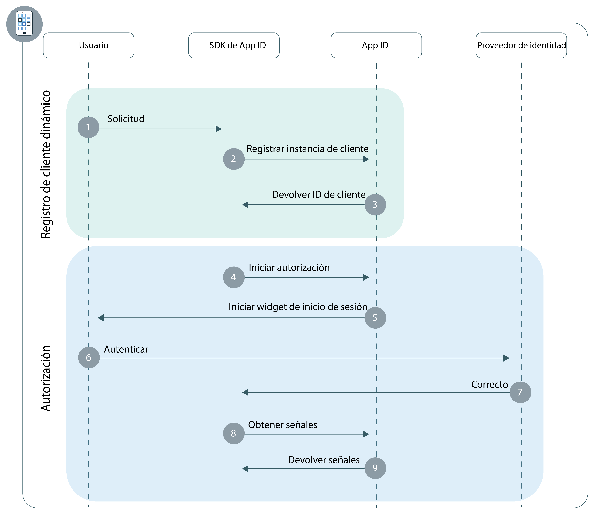

---

copyright:
  years: 2017, 2018
lastupdated: "2018-11-14"

---

{:new_window: target="_blank"}
{:shortdesc: .shortdesc}
{:pre: .pre}
{:tip: .tip}
{:screen: .screen}

# Apps móviles
{: #adding-mobile}

Con {{site.data.keyword.appid_full}}, puede construir rápidamente una capa de autenticación para la app para móvil híbrida o nativa.
{: shortdesc}

## Comprensión del flujo
{: #understanding}

**¿Cuándo será útil este flujo?**

Un flujo móvil es útil cuando está desarrollando una app que se va a instalar en un dispositivo de usuario (una aplicación nativa). Al utilizar este flujo, puede autenticar de forma segura usuarios en la app para proporcionar experiencias de usuario personalizadas a través de dispositivos.

**¿Cuál es la base técnica del flujo?**

Puesto que las aplicaciones nativas se instalan directamente en el dispositivo de un usuario, las credenciales de aplicación e información de usuario privadas pueden ser extraídas por terceros fácilmente. De forma predeterminada, este tipo de aplicaciones se conoce como clientes que no son de confianza, puesto que no pueden almacenar credenciales globales o señales para renovación de usuario. Como resultado, los clientes que no son de confianza requieren que los usuarios introduzcan las credenciales cada vez que caduquen las señales de acceso.

Para convertir la aplicación en un cliente de confianza, {{site.data.keyword.appid_short}} optimiza el [Registro de cliente dinámico](https://tools.ietf.org/html/rfc7591). Antes de que una instancia de aplicación comience a autenticar usuarios, primer se registra como cliente OAuth2 con {{site.data.keyword.appid_short}}. Como resultado del registro del cliente, la aplicación recibe un ID de cliente específico de la instalación que se puede firmar digitalmente y que se utiliza para autorizar las solicitudes con {{site.data.keyword.appid_short}}. Puesto que {{site.data.keyword.appid_short}} almacena la clave pública correspondiente de la aplicación, puede validar la firma de la solicitud que permite que la aplicación se visualice como un cliente confidencial. Este proceso minimiza el riesgo de la aplicación de exponer las credenciales de forma indefinida y mejora la experiencia de usuario permitiendo la actualización automática de la señal.

Después del registro, los usuarios se autentican utilizando los flujos `código de autorización` de OAuth2 u [otorgamiento de autorización](https://tools.ietf.org/html/rfc6749#section-1.3) de la `contraseña del propietario del recurso` para autenticar a los usuarios.

**¿Qué aspecto tiene el flujo?**



**Registro de cliente dinámico**

1. Un usuario realiza una acción que activa una solicitud de la aplicación del cliente al SDK de {{site.data.keyword.appid_short}}.
2. Si la app todavía no está registrada como cliente móvil, el SDK inicia un flujo de registro dinámico.
3. Cuando un registro se realiza correctamente, {{site.data.keyword.appid_short}} devuelve el ID de cliente específico de la instalación.

**Flujo de autorización**

1. El SDK de {{site.data.keyword.appid_short}} inicia el proceso de autorización utilizando el punto final {{site.data.keyword.appid_short_notm}} `/authorization`.
2. El widget de inicio de sesión se muestra al usuario.
3. Mediante uno de los proveedores de identidad configurados, el usuario se autentica.
4. {{site.data.keyword.appid_short}} devuelve un otorgamiento de autorización.
5. El otorgamiento de autorización se intercambia para las señales de renovación, identidad y acceso del punto final {{site.data.keyword.appid_short_notm}} `/token`.


## Configuración de una ap móvil con los SDK de {{site.data.keyword.appid_short}}
{: #configuring}

Iniciación a {{site.data.keyword.appid_short}} con nuestros SDK.
{: shortdesc}

**Antes de empezar**

Necesita la siguiente información:

* Una instancia de {{site.data.keyword.appid_short_notm}}

* El ID de arrendatario de la instancia. Lo encontrará en el separador **Credenciales de servicio** del panel de control de servicio.

* La región de {{site.data.keyword.Bluemix}} de despliegue de su instancia. Encontrará la región buscando en la consola.

  <table><caption> Tabla 1. Regiones de {{site.data.keyword.Bluemix_notm}} y sus correspondientes valores de SDK</caption>
  <tr>
    <th>Región de {{site.data.keyword.Bluemix}}</th>
    <th>Valor de SDK</th>
  </tr>
  <tr>
    <td>EE.UU. sur</td>
    <td><code>AppID.REGION_US_SOUTH</code> </td>
  </tr>
  <tr>
    <td>Sídney</td>
    <td><code>AppID.REGION_SYDNEY </code></td>
  </tr>
  <tr>
    <td>Reino Unido</td>
    <td><code>AppID.REGION_UK </code></td>
  </tr>
  <tr>
    <td>Alemania</td>
    <td><code>AppID.REGION_GERMANY</code></td>
  </tr>
</table>

## Autenticación con el SDK de Android
{: #android-setup}

**Antes de empezar**

Debe tener los siguientes requisitos previos antes de empezar:

  * API 27 o superior
  * Java 8.x
  * Android SDK Tools 26.1.1+
  * Android SDK Platform Tools 27.0.1+
  * Android Build Tools versión 27.0.0+

</br>

**Instalación del SDK**

1. Cree un proyecto de Android Studio o abra uno ya existente.

2. Añada el repositorio de JitPack a su archivo `build.gradle` raíz.

  ```gradle
    allprojects {
	    repositories {
		    ...
		    maven { url 'https://jitpack.io' }
	    }
    }
  ```
  {: codeblock}

3. Busque el archivo `build.gradle` de la aplicación. **Nota**: Asegúrese de abrir el archivo para su app, no el archivo `build.gradle` del proyecto.

  1. Añada el SDK de cliente de {{site.data.keyword.appid_short_notm}} a la sección de dependencias.

    ```gradle
    dependencies {
       compile group: 'com.github.ibm-cloud-security:appid-clientsdk-android:4.+'
   }
    ```
    {: codeblock}

  2. En la sección `defaultConfig`, configure el esquema de redirección.

    ```gradle
    defaultConfig {
      ...
      manifestPlaceholders = ['appIdRedirectScheme': android.defaultConfig.applicationId]
  }
    ```
    {: codeblock}

6. Sincronice el proyecto con Gradle. Pulse **Tools > Android > Sync Project with Gradle Files**.

</br>

**Inicialización del SDK**


1. Pase los parámetros de contexto, ID de arrendatario y región al método de initialize para configurar el SDK.

    Un lugar habitual, pero no obligatorio, donde poner el código de inicialización es en el método onCreate de la actividad principal de la aplicación de Android.
    {: tip}

    ```java
    AppID.getInstance().initialize(getApplicationContext(), <tenantId>, <region>);
    ```
    {: codeblock}

</br>
</br>

## Autenticación con el SDK de Swift de iOS
{: #ios-setup}

Proteja las aplicaciones móviles utilizando el SDK de cliente de {{site.data.keyword.appid_short}}.
{:shortdesc}

</br>
**Antes de empezar**

Debe tener los siguientes requisitos previos antes de empezar:

  * Xcode 9.0 o superior
  * CocoaPods 1.1.0 o superior
  * iOS 10.0 o posterior

</br>

**Instalación del SDK**

El SDK del cliente de {{site.data.keyword.appid_short_notm}} se distribuye con CocoaPods, un gestor de dependencias para proyectos de Swift y de Objective-C Cocoa. CocoaPods descarga artefactos, y los pone a disposición de su proyecto.

1. Cree un proyecto de Xcode o abra uno ya existente.

2. Cree un `Podfile` nuevo o abra uno existente en el directorio del proyecto.

3. Añada el pod `IBMCloudAppID` y el mandato `use_frameworks!` a las dependencias del destino

  ```swift
  target '<yourTarget>' do
     use_frameworks!
     pod 'IBMCloudAppID'
  end
  ```
  {: codeblock}

4. Instale las dependencias desde la línea de mandatos dentro del directorio del proyecto.

  ```swift
  $ pod install --repo-update
  ```
  {: codeblock}

5. Después de la instalación, abra el archivo `<your app>.xcworkspace` que contiene el proyecto de Xcode y las dependencias enlazadas

6. Habilite la compartición de cadena de claves en el proyecto Xcode. Vaya a **Project Settings > Capabilities > Keychain Sharing** y seleccione **Enable keychain sharing**.

7. Abra **Project Settings > Info > URL Types**, y añada un **URL Type**. Coloque el valor siguiente en los recuadros de texto **Identificador** y **Esquema de URL**.

  ```
  $(PRODUCT_BUNDLE_IDENTIFIER)
  ```
  {: codeblock}

</br>

**Inicialización del SDK**

1. Inicialice el SDK del cliente pasando los parámetros de ID de arrendatario y region al método initialize.

  ```swift
    AppID.sharedInstance.initialize(tenantId: <tenantId>, region: <region>)
  ```
  {: codeblock}

  Un lugar habitual, pero no obligatorio, donde poner el código de inicialización es en el método `application:didFinishLaunchingWithOptions`: del AppDelegate de la aplicación Swift.
  {: tip}

2. Importe el SDK de {{site.data.keyword.appid_short}} al archivo de `AppDelegate`.

  ```swift
  import IBMCloudAppID
  ```
  {: codeblock}

3. Configure la aplicación para que procese las redirecciones a través de {{site.data.keyword.appid_short}}.

  ```swift
  func application( application: UIApplication, open url: URL, options :[UIApplicationOpenURLOptionsKey : Any]) -> Bool {
      return AppID.sharedInstance.application(application, open: url, options: options)
      }
  ```
  {: codeblock}

</br>
</br>

## Acceso a API protegidas
{: #accessing-protected-apis}

Después de que el flujo de inicio de sesión se haya realizado correctamente, puede utilizar las señales de identidad y acceso para invocar los recursos que utilizan el SDK o la biblioteca de red de su elección.

</br>

### Acceso a API protegidas con el SDK de Swift

1.  Añada las siguientes importaciones al archivo en el que desea invocar una solicitud de recurso protegido:

  ```swift
  import BMSCore
  import IBMCloudAppID
  ```
  {: codeblock}

2. Invoque el recurso protegido

   ```swift
  BMSClient.sharedInstance.initialize(region: <region>)
  BMSClient.sharedInstance.authorizationManager = AppIDAuthorizationManager(appid: AppID.sharedInstance)

  let request =  Request(url: "<your protected resource url>")

  request.send { (response: Response?, error: Error?) in

      guard let response = response, error == null else {
          print("An error occurred invoking a protected resources", error?.localizedDescription ?? "No response was received")
          return;
      }
      // use your response object
  })
  ```
  {: codeblock}

</br>

### Acceso a las API protegidas con el SDK de Android

1. Añada las siguientes importaciones al archivo en el que desea invocar una solicitud de recurso protegido:

  ```java
  import com.ibm.mobilefirstplatform.clientsdk.android.core.api.BMSClient;
  import com.ibm.cloud.appid.android.api.AppIDAuthorizationManager;
  ```

2. Invoque el recurso protegido

   ```java
   BMSClient bmsClient = BMSClient.getInstance();
   bmsClient.initialize(getApplicationContext(), <region>);

   AppIDAuthorizationManager appIdAuthMgr = new AppIDAuthorizationManager(AppID.getInstance())
  bmsClient.setAuthorizationManager(appIdAuthMgr);

   Request request = new Request("<your protected resource url>", Request.GET);
  request.send(this, new ResponseListener() {

   @Override
		public void onSuccess (Response response) {
       Log.d("My app", "onSuccess :: " + response.getResponseText());
   }

   @Override
		public void onFailure (Response response, Throwable t, JSONObject extendedInfo) {
       if (null != t) {
           Log.d("My app", "onFailure :: " + t.getMessage());
       } else if (null != extendedInfo) {
           Log.d("My app", "onFailure :: " + extendedInfo.toString());
       } else {
           Log.d("My app", "onFailure :: " + response.getResponseText());
           }
       }
   });
  ```
  {: codeblock}

</br>

### Acceso a API protegidas sin un SDK

Con la biblioteca que elija, establezca la cabecera de solicitud `Autorización` para que utilice el esquema de autenticación `Bearer` para transmitir la señal de acceso.

Ejemplo de formato de la solicitud:

  ```
  GET /resource HTTP/1.1
  Host: server.example.com
  Authorization: Bearer <access token> <optional identity token>
  ```
  {: screen}

</br>
</br>

## Siguientes pasos
{: #next}

Con {{site.data.keyword.appid_short}} instalado en la aplicación, casi está listo para iniciar la autenticación de usuarios. A continuación, intente realizar una de las siguientes actividades:

* Configure los [proveedores de identidad](/docs/services/appid/identity-providers.html)
* Personalice y configure [el widget de inicio de sesión](/docs/services/appid/login-widget.html)
* Obtenga más información acerca del <a href="https://github.com/ibm-cloud-security/appid-clientsdk-android" target="_blank">SDK de Android </a>
* Obtenga más información acerca del <a href="https://github.com/ibm-cloud-security/appid-clientsdk-swift" target="_blank">SDK de iOS </a>
