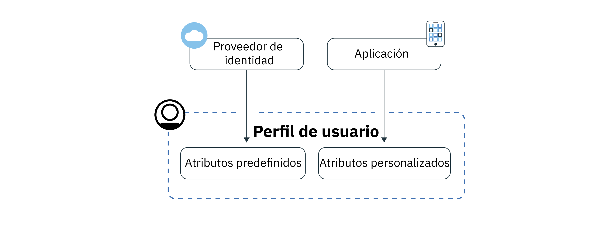
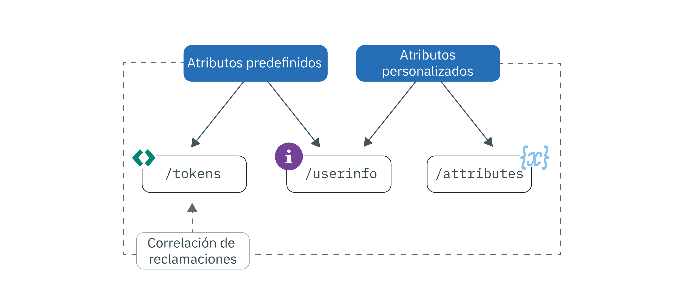

---

copyright:
  years: 2017, 2019
lastupdated: "2019-07-09"

keywords: Authentication, authorization, identity, app security, secure, attributes, user information, storing, accessing

subcollection: appid

---

{:external: target="_blank" .external}
{:shortdesc: .shortdesc}
{:screen: .screen}
{:pre: .pre}
{:table: .aria-labeledby="caption"}
{:codeblock: .codeblock}
{:tip: .tip}
{:note: .note}
{:important: .important}
{:deprecated: .deprecated}
{:download: .download}
{:java: .ph data-hd-programlang='java'}
{:javascript: .ph data-hd-programlang='javascript'}
{:swift: .ph data-hd-programlang='swift'}
{:curl: .ph data-hd-programlang='curl'}


# Almacenamiento y acceso a perfiles
{: #profiles}

Un perfil de usuario es toda la información que se conoce acerca de un usuario específico compilado en un objeto y almacenado por {{site.data.keyword.appid_full}}. Puede ser información predefinida, asignada o aprendida sobre los usuarios a medida que interactúan con la aplicación. Con la característica de perfiles, puede crear experiencias de app personalizadas para cada usuario.
{: shortdesc}


¿Busca información acerca de los usuarios de Directorio en la nube? Consulte [gestión de usuarios](/docs/services/appid?topic=appid-cd-users).
{: tip}

Hay dos tipos de información que puede obtener y almacenar APP ID: atributos predefinidos y atributos personalizados. Los atributos predefinidos son específicos de la identidad de los usuarios y son devueltos por un proveedor de identidad cuando el usuario inicia sesión en la app, y puede incluir información como por ejemplo su nombre o su edad. Los atributos personalizados se utilizan para almacenar información adicional sobre los usuarios. Los puede establecer usted o se pueden aprender sobre el usuario a medida que éste interactúa con la app. Los atributos personalizados pueden incluir un rol asignado, una preferencia de comida o la preferencia por un asiento de pasillo en un avión.



Figura. Flujo de información de perfil de usuario


Puede almacenar hasta 100 KB de información de cada usuario.
{: note}


## Acceso a los perfiles de usuario
{: #profile-access}

Se puede acceder a los atributos de distintas formas. Tras una autenticación de usuario satisfactoria, la app recibe señales de acceso e identidad de {{site.data.keyword.appid_short_notm}}. Tanto el punto final de información de usuario como el de atributo personalizado están protegidos por una señal de acceso que genera {{site.data.keyword.appid_short_notm}} al final del proceso de autenticación. La señal de identidad contiene un subconjunto normalizado de atributos de usuario (información) que devuelve un proveedor de identidad. Para obtener la lista completa de atributos de usuario, puede utilizar el punto final [`/userinfo` de OIDC](https://us-south.appid.cloud.ibm.com/swagger-ui/#/Authorization_Server_V4/userInfo). 
{: shortdesc}


Para obtener más información sobre las señales de identidad y acceso, consulte [Comprensión](/docs/services/appid?topic=appid-tokens#tokens) y [Validación de señales](/docs/services/appid?topic=appid-token-validation).


Revise la imagen siguiente para ver las distintas formas en que puede obtener información de usuario.


Figura. Acceder a opciones de perfil de usuario


App ID inyecta automáticamente un subconjunto de atributos en las señales de acceso y de identidad. Puede utilizar la correlación de reclamaciones personalizadas y correlacionar otras reclamaciones predefinidas y personalizadas en las señales. Para obtener más detalles sobre la forma recomendada de acceder a la información de usuario, consulte [personalización de señales](/docs/services/appid?topic=appid-customizing-tokens). 
{: note}


### Acceso al punto final /userinfo con un SDK
{: #profile-predefined-access}

Para ver la información acerca de los usuarios que proporcionan los proveedores de identidades que tiene configurados, puede acceder a sus atributos predefinidos.
{: shortdesc}

**iOS Swift**
{: ph data-hd-programlang='swift'}

Si las nuevas señales no se pasan de forma explícita al SDK, {{site.data.keyword.appid_short_notm}} utiliza las últimas señales recibidas para recuperar y validar la respuesta. Por ejemplo, puede ejecutar el código siguiente tras una autenticación satisfactoria y el SDK recuperará información adicional sobre el usuario.
{: ph data-hd-programlang='swift'}

```
AppID.sharedInstance.userProfileManager.getUserInfo { (error: Error?, userInfo: [String: Any]?) in
	guard let userInfo = userInfo, err == nil {
		return //se ha producido un error
		}
	//información de usuario recuperada correctamente
}
```
{: codeblock}
{: ph data-hd-programlang='swift'}

Como alternativa, puede pasar de forma explícita las señales de acceso y de identidad. La señal de identidad es opcional, pero cuando se pasa, se utiliza para validar la respuesta.
{: ph data-hd-programlang='swift'}

```
AppID.sharedInstance.userProfileManager.getUserInfo(accessToken: String, identityToken: String?) { (error: Error?, userInfo: [String: Any]?) in
	guard let userInfo = userInfo, err == nil {
		return //se ha producido un error
		}
	//información de usuario recuperada correctamente
}
```
{: codeblock}
{: ph data-hd-programlang='swift'}

**Java**
{: ph data-hd-programlang='java'}

Si las nuevas señales no se pasan de forma explícita al SDK, {{site.data.keyword.appid_short_notm}} utiliza las últimas señales recibidas para recuperar y validar la respuesta. Por ejemplo, puede ejecutar el código siguiente tras una autenticación satisfactoria y el SDK recuperará información adicional sobre el usuario.
{: ph data-hd-programlang='java'}

```
AppID appId = AppID.getInstance();

appId.getUserProfileManager().getUserInfo(new UserProfileResponseListener() {
	@Override
	public void onSuccess(JSONObject userInfo) {
		//información de usuario recuperada correctamente
}

	@Override
	public void onFailure(UserInfoException e) {
		//se ha producido una excepción
	}
});
```
{: codeblock}
{: ph data-hd-programlang='java'}

Como alternativa, puede pasar de forma explícita las señales de acceso y de identidad. La señal de identidad es opcional. Pero cuando se pasa, se utiliza para validar la respuesta.
{: ph data-hd-programlang='java'}

```
AppID appId = AppID.getInstance();

appId.getUserProfileManager().getUserInfo(accessToken, identityToken, new UserProfileResponseListener() {
	@Override
	public void onSuccess(JSONObject userInfo) {
		//atributo "name" recuperado correctamente
	}

	@Override
	public void onFailure(UserInfoException e) {
		//se ha producido una excepción
	}
});
```
{: codeblock}
{: ph data-hd-programlang='java'}

**Node.js**
{: ph data-hd-programlang='javascript'}

Mediante el uso de un SDK del lado del servidor, puede recuperar información adicional sobre los usuarios. Puede llamar al método siguiente utilizando las señales de acceso y de identidad almacenadas, o puede pasar de forma explícita las señales. La señal de identidad es opcional, pero cuando se pasa, se utiliza para validar la respuesta.
{: ph data-hd-programlang='javascript'}

```javascript
let userProfileManager = UserProfileManager(options: options)

let accessToken = req.session[WebAppStrategy.AUTH_CONTEXT].accessToken;
let identityToken = req.session[WebAppStrategy.AUTH_CONTEXT].identityToken;


//Recuperar información de usuario y validarla con la señal de identidad determinada
userProfileManager.getUserInfo(accessToken, identityToken).then(function (profile) {
	//información de usuario recuperada correctamente
});

//Recuperar información de usuario sin validación
userProfileManager.getUserInfo(accessToken).then(function (profile) {
	//información de usuario recuperada correctamente
});
```
{: codeblock}
{: ph data-hd-programlang='javascript'}


**Swift del lado del servidor**
{: ph data-hd-programlang='swift'}

Mediante el uso de un SDK del lado del servidor, puede recuperar información adicional sobre los usuarios. Puede llamar al método siguiente utilizando las señales de acceso y de identidad almacenadas, o puede pasar de forma explícita las señales. La señal de identidad es opcional, pero cuando se pasa, se utiliza para validar la respuesta.
{: ph data-hd-programlang='swift'}


```swift
let userProfileManager = UserProfileManager(options: options)

let accessToken = "<access token>"
let identityToken = "<identity token>"

//Si se proporciona la señal de identidad (enfoque recomendado), la respuesta se valida con la señal de identidad
userProfileManager.getUserInfo(accessToken: accessToken, identityToken: identityToken) { (err, userInfo) in
	guard let userInfo = userInfo, err == nil {
		return //se ha producido un error
		}
	//información de usuario recuperada correctamente
}

//Recuperar la información de usuario sin validación
userProfileManager.getUserInfo(accessToken: accessToken) { (err, userInfo) in
	guard let userInfo = userInfo, err == nil {
		return //se ha producido un error
		}
	//información de usuario recuperada correctamente
}
```
{: codeblock}
{: ph data-hd-programlang='swift'}


### Acceso al punto final /userinfo con la API
{: #profile-predefined-api}


Puede ver información adicional a través del punto final `/userinfo`.

1. Asegúrese de que tiene una señal de acceso válida con un alcance `openid`. Puede verificar que la señal es válida mediante el punto final `/introspect`.

2. Realice una solicitud al punto final [`/userinfo`](https://us-south.appid.cloud.ibm.com/swagger-ui/#/Authorization_Server_V4/userInfo).
  ```
  GET [POST] https://{oauth-server-endpoint}/userinfo
  Authorization: 'Bearer {ACCESS_TOKEN}'
  ```
  {: codeblock}

  Salida de ejemplo:
  ```
  "sub": "cad9f1d4-e23b-3683-b81b-d1c4c4fd7d4c",
  "name": "John Doe",
  "email": "john.doe@gmail.com",
  "picture": "https://lh3.googleusercontent.com/-XdUIqdbhg/AAAAAAAAI/AAAAAAA/42rbcbv5M/photo.jpg",
  "gender": "male",
  "locale": "en",
  "identities": [
      {
          "provider": "google",
          "id": "104560903311317789798",
          "profile": {
              "id": "104560903311317789798",
              "email": "john.doe@gmail.com",
              "verified_email": true,
              "name": "John Doe",
              "given_name": "John",
              "family_name": "Doe",
              "link": "https://plus.google.com/104560903311317789798",
              "picture": "https://lh3.googleusercontent.com/-XdUIqdbhg/AAAAAAAAI/AAAAAAA/42rbcbv5M/photo.jpg",
              "gender": "male",
              "locale": "en",
              "idpType": "google"
          }
      }
  ]
  ```
  {: screen}

3. Verifique que la reclamación `sub` coincida exactamente con la reclamación `sub` en la señal de identidad. Si no coinciden, no utilice la información devuelta. Para obtener más información sobre la sustitución de señales, consulte la <a href="https://openid.net/specs/openid-connect-core-1_0.html#TokenSubstitution" target="__blank">especificación de OIDC </a>.

Si un proveedor de identidad externo hace algún cambio, puede obtener la información actualizada cuando el usuario vuelva a iniciar sesión. Las nuevas señales recuperan los datos más actualizados.
{: tip}


### Acceso al punto final `/attributes`
{: #profile-attributes-access}

En función de la configuración, los atributos se cifran y guardan como parte el perfil de usuario cuando este interactúa con la aplicación. La interacción puede ser, por ejemplo, un usuario iniciando sesión o estableciendo una preferencia en la app. Para acceder a los atributos, pase una señal de acceso a través de un método de API.
{: shortdesc}

**iOS Swift**
{: ph data-hd-programlang='swift'}

  ```
  func setAttribute(key: String, value: String, completionHandler: @escaping(Error?, [String:Any]?) -> Void)
  func setAttribute(key: String, value: String, accessTokenString: String, completionHandler: @escaping(Error?, [String:Any]?) -> Void)

  func getAttribute(key: String, completionHandler: @escaping(Error?, [String:Any]?) -> Void)
  func getAttribute(key: String, accessTokenString: String, completionHandler: @escaping(Error?, [String:Any]?) -> Void)

  func getAttributes(completionHandler: @escaping(Error?, [String:Any]?) -> Void)
  func getAttributes(accessTokenString: String, completionHandler: @escaping(Error?, [String:Any]?) -> Void)

  func deleteAttribute(key: String, completionHandler: @escaping(Error?, [String:Any]?) -> Void)
  func deleteAttribute(key: String, accessTokenString: String, completionHandler: @escaping(Error?, [String:Any]?) -> Void)
  ```
  {: codeblock}
  {: ph data-hd-programlang='swift'}

  **Java**
  {: ph data-hd-programlang='java'}

  ```
  void setAttribute(@NonNull String name, @NonNull String value, UserAttributeResponseListener listener);
  void setAttribute(@NonNull String name, @NonNull String value, @NonNull AccessToken accessToken, UserAttributeResponseListener listener);

  void getAttribute(@NonNull String name, UserAttributeResponseListener listener);
  void getAttribute(@NonNull String name, @NonNull AccessToken accessToken, UserAttributeResponseListener listener);

  void deleteAttribute(@NonNull String name, UserAttributeResponseListener listener);
  void deleteAttribute(@NonNull String name, @NonNull AccessToken accessToken, UserAttributeResponseListener listener);

  void getAllAttributes(@NonNull UserAttributeResponseListener listener);
  void getAllAttributes(@NonNull AccessToken accessToken, @NonNull UserAttributeResponseListener listener);
  ```
  {: codeblock}
  {: ph data-hd-programlang='java'}

  **Node.js**
  {: ph data-hd-programlang='javascript'}

  ```
  function getAllAttributes(accessTokenString) {}
	function getAttribute(accessTokenString, key) {}
	function setAttribute(accessTokenString, key, value) {}
	function deleteAttribute(accessTokenString, name) {}
  ```
  {: codeblock}
  {: ph data-hd-programlang='javascript'}

  **Swift del lado del servidor**
  {: ph data-hd-programlang='swift'}

  ```
  func getAllAttributes(accessToken: String, completionHandler: (Swift.Error?, [String: Any]?) -> Void)
  func getAttribute(accessToken: String, attributeName: String, completionHandler: (Swift.Error?, [String: Any]?) -> Void)
  func setAttribute(accessToken: String, attributeName: String, attributeValue : "abc", completionHandler: (Swift.Error?, [String: Any]?) -> Void)
  func deleteAllAttributes(accessToken: String, completionHandler: (Swift.Error?, [String: Any]?) -> Void)
  ```
  {: codeblock}
  {: ph data-hd-programlang='swift'}


## Establecer atributos personalizados
{: #profile-set-custom}

Puede añadir información sobre los usuarios en el perfil de los mismos, como por ejemplo un rol o una preferencia, estableciendo un atributo personalizado.
{: shortdesc}

De forma predeterminada, los atributos personalizados se pueden modificar y actualizar utilizando una señal de acceso de App ID de una aplicación cliente. Esto significa que si no se toman las precauciones adecuadas, el usuario o la aplicación pueden actualizar atributos personalizados inmediatamente tras el inicio de sesión del primer usuario, siempre que tengan acceso a una señal de acceso. Esto puede provocar consecuencias no deseadas. Por ejemplo, un usuario podría cambiar el rol de usuario a administrador, lo que podría exponer privilegios administrativos a usuarios malintencionados.
{: important}

1. Vaya al separador **Perfiles** del panel de control de App ID y conmute los atributos personalizados a **Habilitado**.
2. [Obtenga una señal de acceso](/docs/services/appid?topic=appid-obtain-tokens). Todas las solicitudes entrantes a la app tienen una cabecera de autorización, con `access_token`.
3. Haga una solicitud a [las API de los atributos](https://us-south.appid.cloud.ibm.com/swagger-ui/#/Attributes) o añada uno de los fragmentos de código siguientes al código para utilizar uno de los SDK proporcionados.

  **iOS Swift**
  {: ph data-hd-programlang='swift'}

  ```
	AppID.sharedInstance.userProfileManager?.setAttribute("key", "value") { (error, result) in
		guard let result = result, error == nil else {
	  		return //se ha producido un error
		}
		//atributos recibidos como diccionario
	})
  ```
  {: codeblock}
  {: ph data-hd-programlang='swift'}

  **Java**
  {: ph data-hd-programlang='java'}

  ```
  appId.getUserProfileManager().setAttribute(name, value, useThisToken, new UserProfileResponseListener() {
  	@Override
		public void onSuccess(JSONObject attributes) {
  		//atributos recibidos en formato JSON con una respuesta satisfactoria
		}

  	@Override
		public void onFailure(UserAttributesException e) {
  		//se ha producido una excepción
	}
  });
  ```
  {: codeblock}
  {: ph data-hd-programlang='java'}

  **Node.js**
  {: ph data-hd-programlang='javascript'}

  ```
	const userProfileManager = require("ibmcloud-appid").UserProfileManager;
	userProfileManager.init();

	var accessToken = req.session[WebAppStrategy.AUTH_CONTEXT].accessToken;

	userProfileManager.setAttribute(accessToken, name, value).then(function (attributes) {
		//atributos devueltos como diccionario
	});
  ```
  {: codeblock}
  {: ph data-hd-programlang='javascript'}

**Swift del lado del servidor**
{: ph data-hd-programlang='swift'}

  ```
  let userProfileManager = UserProfileManager(options: options)
	let accesstoken = "access token"

  userProfileManager.setAttribute(accessToken: accessToken, attributeName: "name", attributeValue : "abc") { (error, response) in
		guard let response = response, error == error else {
      return //se ha producido un error
		}
    //atributos recibidos como diccionario
	}
  ```
  {: codeblock}
  {: ph data-hd-programlang='swift'}


## Pasos siguientes
{: #next-custom-attributes}

Para obtener más información sobre cómo trabajar con un SDK de lenguaje específico, consulte los siguientes repositorios de GitHub:

* <a href="https://github.com/ibm-cloud-security/appid-clientsdk-android" target="_blank">SDK de Android </a>
* <a href="https://github.com/ibm-cloud-security/appid-clientsdk-swift" target="_blank">SDK de Swift de iOS </a>
* <a href="https://github.com/ibm-cloud-security/appid-serversdk-nodejs" target="_blank">SDK de Node.js </a>
* <a href="https://github.com/ibm-cloud-security/appid-serversdk-swift" target="_blank">SDK de Swift de servidor </a>

