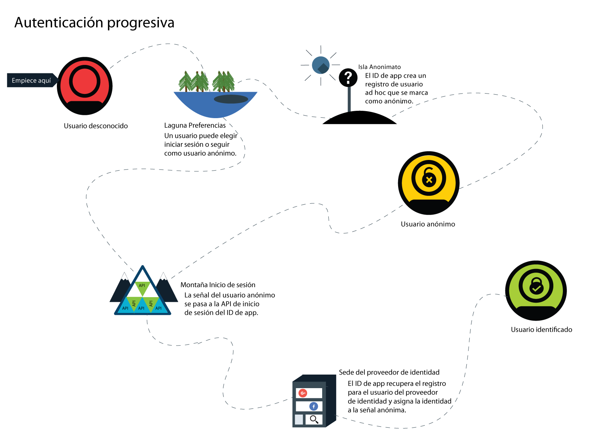
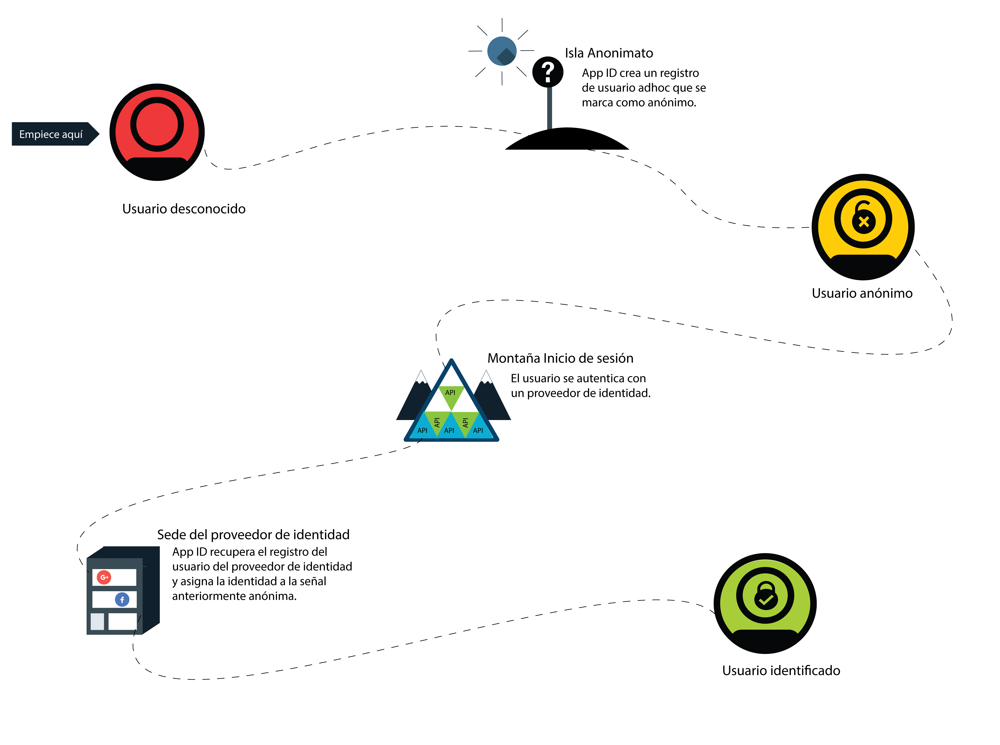

---

copyright:
  years: 2017, 2019
lastupdated: "2019-03-06"

keywords: authentication, authorization, identity, app security, secure, anonymous, progressive, profiles, sign in

subcollection: appid

---

{:new_window: target="_blank"}
{:shortdesc: .shortdesc}
{:screen: .screen}
{:pre: .pre}
{:table: .aria-labeledby="caption"}
{:codeblock: .codeblock}
{:tip: .tip}
{:note: .note}
{:important: .important}
{:deprecated: .deprecated}
{:download: .download}

# Autenticación anónima
{: #anonymous}

Al desarrollar apps, una de las mayores preocupaciones es la seguridad. ¿Cómo puede garantizar que solo los usuarios con el acceso correcto estén utilizando la app? Debe utilizar un proceso de autorización. En la mayoría de los procesos, la autorización y la autenticación están unidas, lo que puede hacer complicado cambiar las políticas de seguridad y los proveedores de identidad. Con {{site.data.keyword.appid_full}}, la autorización y la autenticación son procesos separados.
{: shortdesc}

Cuando un usuario inicia sesión correctamente, se convierte en un usuario identificado. El proveedor de identidad devuelve señales de acceso e identidad que contienen información sobre el usuario a {{site.data.keyword.appid_short}}. El servicio toma las señales proporcionadas y determina si un usuario tiene las credenciales suficientes para acceder a la app. Si las señales están validadas, el servicio autoriza el acceso de los usuarios a la app. La información de autenticación está asociada con el perfil del usuario una vez que esté autorizado. Se puede volver a acceder al registro de usuario y a sus atributos desde cualquier cliente que se autentique con el mismo proveedor de identidad.

## Autenticación progresiva
{: #progressive}

Con {{site.data.keyword.appid_short_notm}}, un usuario anónimo puede elegir pasar a ser un usuario identificado.

Cuando un usuario no inicia la sesión inmediatamente, se considera como un usuario anónimo. Por ejemplo, un usuario puede empezar inmediatamente a añadir artículos al carro de la compra sin iniciar la sesión. Para los usuarios anónimos, {{site.data.keyword.appid_short_notm}} crea un perfil de usuario ad hoc y llama a la API de inicio de sesión OAuth que devuelve señales de acceso e identidad anónimas. Al utilizar esas señales, la app puede crear, leer, actualizar y suprimir los atributos almacenados en el perfil de usuario.

Cuando un usuario anónimo inicia la sesión, la señal de acceso pasa a la API de inicio de sesión. El servicio autentica la llamada con un proveedor de identidad. El servicio utiliza la señal de acceso para encontrar el perfil anónimo y le adjunta la identidad del usuario. Las nuevas señales de acceso e identidad contienen la información pública compartida por el proveedor de identidad. Cuando se identifica un usuario, su señal anónima pasa a ser no válida. Sin embargo, el usuario aún puede acceder a sus atributos ya que son accesibles con la nueva señal.

Se puede asignar una identidad a un perfil anónimo solo si todavía no se ha asignado a otro usuario.
{: tip}

Si la identidad ya está asociada con otro usuario de {{site.data.keyword.appid_short_notm}}, las señales contienen la información de ese perfil de usuario y proporcionan acceso a sus atributos. Los atributos del usuario anónimo anterior no son accesibles a través de la nueva señal. Hasta que la señal caduque, aún se podrá acceder a la información a través de la señal de acceso anónimo. Durante el desarrollo de la app, puede elegir cómo fusionar los atributos anónimos con los usuarios conocidos.
