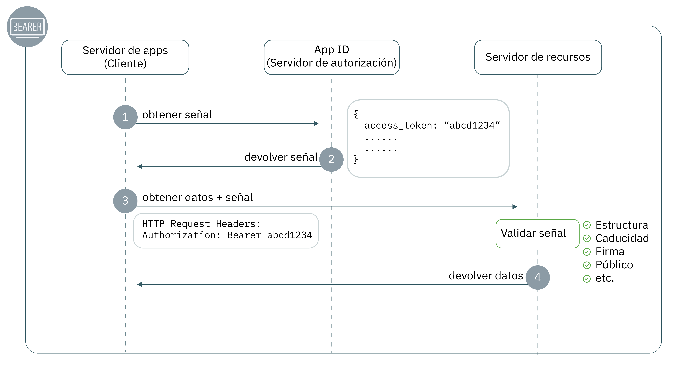

---

copyright:
  years: 2017, 2019
lastupdated: "2019-07-11"

keywords: Authentication, authorization, identity, app security, secure, development, access management, liberty, backend, java, token

subcollection: appid

---

{:external: target="_blank" .external}
{:shortdesc: .shortdesc}
{:screen: .screen}
{:pre: .pre}
{:table: .aria-labeledby="caption"}
{:codeblock: .codeblock}
{:tip: .tip}
{:note: .note}
{:important: .important}
{:deprecated: .deprecated}
{:download: .download}


# Programa de fondo: Liberty for Java
{: #backend-liberty}

Con {{site.data.keyword.appid_short_notm}}, puede proteger fácilmente los puntos finales de API y garantizar la seguridad de las aplicaciones de fondo de Liberty for Java. Con esta guía, se puede obtener rápidamente un flujo de autenticación simple que se ejecuta en menos de 20 minutos.
{: shortdesc}




1. Para realizar una solicitud a un recurso protegido, los clientes deben tener una señal de acceso. En el paso 1, el cliente solicita una señal a {{site.data.keyword.appid_short_notm}}. Para obtener más información sobre la obtención de señales de acceso, consulte [Obtención de señales](/docs/services/appid?topic=appid-obtain-tokens).
2. {{site.data.keyword.appid_short_notm}} devuelve las señales.
3. Utilizando la señal de acceso, el cliente hace una solicitud para acceder al recurso protegido.
4. El recurso valida la señal, incluida la estructura, la caducidad, la firma, el público y cualquier otro campo presente. Si la señal no es válida, el servidor de recursos deniega el acceso. Si la validación de la señal es satisfactoria, devuelve los datos.


## Tutorial de vídeo
{: #backend-liberty-video}

Consulte el vídeo siguiente para ver cómo utilizar {{site.data.keyword.appid_short_notm}} para proteger una aplicación de Liberty for Java simple. Toda la información que se incluye en el vídeo también se puede encontrar por escrito en esta página.

<iframe class="embed-responsive-item" id="appid-liberty-backend-app" title="Acerca de {{site.data.keyword.appid_short_notm}}" type="text/html" width="640" height="390" src="//www.youtube.com/embed/QA6DY2qqLaw?rel=0" frameborder="0" webkitallowfullscreen mozallowfullscreen allowfullscreen></iframe>

¿No tiene una app con la que poder probar el flujo? No hay ningún problema. {{site.data.keyword.appid_short_notm}} proporciona una [app de ejemplo de Liberty for Java simple](https://github.com/ibm-cloud-security/appid-video-tutorials/tree/master/02d-simple-liberty-backend-app).


## Antes de empezar
{: #liberty-before}

Antes de empezar con {{site.data.keyword.appid_short_notm}} en la aplicación de fondo de Liberty for Java, debe tener los requisitos previos siguientes:

* Una instancia del [servicio {{site.data.keyword.appid_short_notm}}](https://cloud.ibm.com/catalog/services/app-id){: external}
* [La CLI de IBM Cloud](/docs/cli?topic=cloud-cli-getting-started)
* [Apache Maven 3.5+](https://maven.apache.org/download.cgi){: external}
* [Java 8+](https://www.java.com/download/){: external}
* La [recopilación de Postman de {{site.data.keyword.appid_short_notm}}](https://github.com/ibm-cloud-security/appid-postman){: external} para pruebas

## Paso 1: Obtener las credenciales
{: #liberty-obtain-credentials}

Puede obtener sus credenciales de dos maneras.

  * Vaya al separador **Aplicaciones** del panel de control de {{site.data.keyword.appid_short_notm}}. Si aún no dispone de una, puede pulsar **Añadir aplicación** para crear una nueva.

  * Realice una solicitud POST en el punto final [`/management/v4/{tenantId}/applications`](https://us-south.appid.cloud.ibm.com/swagger-ui/#!/Applications/registerApplication){: external}.

    Formato de la solicitud:
    ```
    curl -X POST \  https://us-south.appid.cloud.ibm.com/management/v4/<tenantID>/applications/ \
    -H 'Content-Type: application/json' \
    -H 'Authorization: Bearer IAM_TOKEN' \
    -d '{"name": "ApplicationName"}'
    ```
    {: codeblock}

    Ejemplo de respuesta:
    ```
    {
      "clientId": "xxxxx-34a4-4c5e-b34d-d12cc811c86d",
      "tenantId": "xxxxx-9b1f-433e-9d46-0a5521f2b1c4",
      "secret": "ZDk5YWZkYmYt*******",
      "name": "app1",
      "oAuthServerUrl": "https://us-south.appid.cloud.ibm.com/oauth/v4/xxxxx-9b1f-433e-9d46-0a5521f2b1c4",
      "profilesUrl": "https://us-south.appid.cloud.ibm.com",
      "discoveryEndpoint": "https://us-south.appid.cloud.ibm.com/oauth/v4/xxxxxx-9b1f-433e-9d46-0a5521f2b1c4/.well-known/openid-configuration"
    }
    ```
    {: screen}


## Paso 2: Configurar el archivo `server.xml`
{: #liberty-configure-server}
 
1. Abra el archivo `server.xml`.
2. Añada las características siguientes a la sección `featureManager`. Es posible que algunas características puedan estar incluidas con Liberty. Si recibe un error al ejecutar el servidor, puede instalarlas ejecutando `.installUtility install <name_of_server>` desde el directorio bin de la instalación de Liberty.

    ```xml
    <featureManager>
        <feature>appSecurity-2.0</feature>
        <feature>openidConnectClient-1.0</feature>
        <feature>ssl-1.0</feature>
        <feature>servlet-3.1</feature>
    </featureManager>
    ```
    {: codeblock}

3. Configure SSL añadiendo lo siguiente al archivo `server.xml`. 

    ```xml
    <keyStore id="defaultKeyStore" password="{password}"/>
    <keyStore id="RootCA" password="{password}" location="${server.config.dir}/resources/security/{myTrustStore}"/>
    <ssl id="{sslID}" keyStoreRef="defaultKeyStore" trustStoreRef="{truststore-ref}"/>
    ```
    {: codeblock}

4. Cree una característica de Open ID Connect Client y defina los siguientes marcadores de posición. Con las credenciales que ha obtenido, rellene los marcadores.

    ```xml
    <openidConnectClient 
        id="oidc-client-simple-liberty-backend-app" 		
        inboundPropagation="required"
        jwkEndpointUrl="{region}.appid.cloud.ibm.com/oauth/v4/{tenantID}/publickeys"
        issuerIdentifier="{region).appid.cloud.ibm.com/oauth/v4/{tenantID}"
        signatureAlgorithm="RS256"
        audiences="{client-id}"
        sslRef="oidcClientSSL"
    /> 	
    ```
    {: codeblock}

    <table>
    <caption>Tabla. Variables del elemento de OIDC para las apps de Liberty for Java</caption>
        <tr>
            <th colspan="2"> Descripción de las variables de elemento OIDC </th>
        </tr>
        <tr>
            <td><code>id </code></td>
            <td>El nombre de la aplicación.</td>
        </tr>
        <tr>
            <td><code>inboundPropagation</code></td>
            <td>A fin de propagar la información recibida en la señal, el valor debe establecerse en "obligatorio".</td>
        </tr>
        <tr>
            <td><code>jwkEndpointUrl</code></td>
            <td>El punto final que se utiliza para obtener claves para validar la señal. Las opciones de región incluyen: <code>au-syd</code>, <code>eu-de</code>, <code>eu-gb</code>, <code>jp-tok</code> y <code>us-south</code>. Puede encontrar el ID de arrendatario en las credenciales que ha creado previamente.</td>
        </tr>
        <tr>
            <td><code>issuerIdentifier</code></td>
            <td>El identificador de emisor define el servidor de autorización. Las opciones de región incluyen: <code>au-syd</code>, <code>eu-de</code>, <code>eu-gb</code>, <code>jp-tok</code> y <code>us-south</code>. Puede encontrar el ID de arrendatario en las credenciales que ha creado previamente.</td>
        </tr>
        <tr>
            <td><code>signatureAlgorithm</code></td>
            <td>Especificado como "RS256".</td>
        </tr>
        <tr>
            <td><code>audiences</code></td>
            <td>De forma predeterminada, la señal se emite para el ID de cliente de {{site.data.keyword.appid_short_notm}} que se encuentra en las credenciales de la aplicación.</td>
        </tr>
        <tr>
            <td><code>sslRef</code></td>
            <td>El nombre de la configuración de SSL que desea utilizar.</td>
        </tr>
    </table>

5. Defina el tipo de sujeto especial como `ALL_AUTHENTICATED_USERS`.

    ```xml
    <application 
        id="simple-liberty-backend-app" 
        location="location-of-your-war-file" 
        name="simple-liberty-backend-app" 
        type="war">

        <application-bnd>
            <security-role name="myrole">
                <special-subject type="ALL_AUTHENTICATED_USERS"/>
            </security-role>
        </application-bnd>
    </application>
    ```
    {: codeblock}


## Paso 3: Configurar el archivo `web.xml`
{: #liberty-configure-web}

En el archivo `web.xml`, defina las áreas de la aplicación que desea proteger.

1. Defina un rol de seguridad. Debe ser el mismo rol que ha definido en el archivo `server.xml`.

    ```
    <security-role>
		<role-name>myrole</role-name>
	</security-role>
    ```
    {: codeblock}

2. Defina una restricción de seguridad.

    ```
	<security-constraint>
		<display-name>Security Constraints</display-name>
		<web-resource-collection>
			<web-resource-name>ProtectedArea</web-resource-name>
			<url-pattern>/api/*</url-pattern>
		</web-resource-collection>
		<auth-constraint>
			<role-name>myrole</role-name>
		</auth-constraint>
		<user-data-constraint>
			<transport-guarantee>NONE</transport-guarantee>
		</user-data-constraint>
	</security-constraint>
    ```
    {: codeblock}


## Paso 4: Probar la configuración
{: #liberty-test}

Ahora que ha finalizado la instalación inicial, cree la app y pruebe la configuración para asegurarse de que todo funciona según lo esperado.

1. Cambie al directorio de la aplicación.

2. Cree la aplicación.

    ```
    server run
    ```
    {: codeblock}

3. Realice una solicitud al punto final protegido. Se devuelve un error.

4. [Obtenga una señal de acceso](/docs/services/appid?topic=appid-obtain-tokens).

5. Con la señal de acceso que ha obtenido en el paso anterior, realice una solicitud al punto final. Ahora debería poder acceder al punto final protegido. Verifique que la respuesta contiene la información esperada.


## Pasos siguientes
{: #liberty-next}

¿Está listo para empezar a perfeccionar su experiencia de autenticación? Intente seguir los pasos de [este blog](https://www.ibm.com/cloud/blog/perfecting-the-login-experience-with-liberty-oauth2-and-appid){: external} u obtenga más información sobre la [comunicación entre apps](/docs/services/appid?topic=appid-app).


