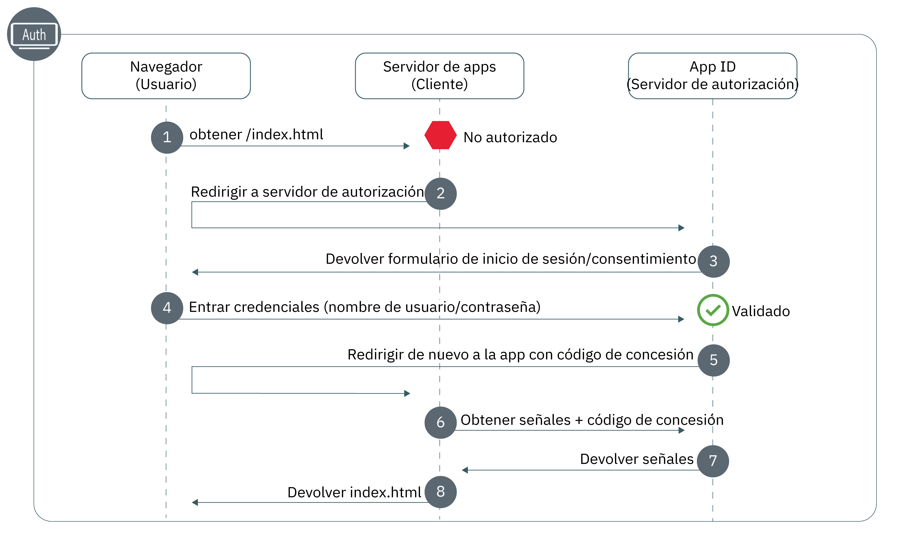

---

copyright:
  years: 2017, 2019
lastupdated: "2019-07-11"

keywords: Authentication, authorization, identity, app security, secure, development, nodejs, frontend, web apps, 

subcollection: appid

---

{:external: target="_blank" .external}
{:shortdesc: .shortdesc}
{:screen: .screen}
{:pre: .pre}
{:table: .aria-labeledby="caption"}
{:codeblock: .codeblock}
{:tip: .tip}
{:note: .note}
{:important: .important}
{:deprecated: .deprecated}
{:download: .download}


# Web: Node.js
{: #web-node}

Con {{site.data.keyword.appid_short_notm}}, puede proteger fácilmente las aplicaciones web frontales de Node.js. Con esta guía, se puede obtener rápidamente un flujo de autenticación simple que se ejecuta en menos de 20 minutos.
{: shortdesc}

Consulte el diagrama siguiente para ver el flujo de trabajo OAuth 2.0 de código de autorización.



1. Un usuario intenta obtener acceso a la aplicación web protegida, pero no está autorizado.
2. La aplicación redirige al usuario a {{site.data.keyword.appid_short_notm}}.
3. {{site.data.keyword.appid_short_notm}} muestra una pantalla de inicio de sesión que el usuario puede utilizar para autenticarse.
4. El usuario introducen sus credenciales, como un nombre de usuario y una contraseña. App ID valida las credenciales.
5. {{site.data.keyword.appid_short_notm}} redirige al usuario de nuevo a la aplicación con un código de concesión.
6. Al utilizar el código de concesión, la aplicación realiza una solicitud a {{site.data.keyword.appid_short_notm}} para asegurarse de que se valide el usuario. Para obtener más información sobre la obtención de señales de acceso, consulte [Obtención de señales](/docs/services/appid?topic=appid-obtain-tokens).
7. {{site.data.keyword.appid_short_notm}} devuelve las señales de acceso y de identidad para el usuario validado.
8. A continuación, se otorga al usuario el acceso a la aplicación.


## Tutorial de vídeo
{: #web-node-video}

Consulte el vídeo siguiente para ver cómo utilizar {{site.data.keyword.appid_short_notm}} para proteger una aplicación web Node.js simple. Toda la información que se incluye en el vídeo también se puede encontrar por escrito en esta página.

<iframe class="embed-responsive-item" id="appid-web-node" title="Acerca de aplicaciones Node.js de {{site.data.keyword.appid_short_notm}}" type="text/html" width="640" height="390" src="//www.youtube.com/embed/6roa1ZOvwtw?rel=0" frameborder="0" webkitallowfullscreen mozallowfullscreen allowfullscreen></iframe>

¿No tiene una app con la que poder probar el flujo? No hay ningún problema. {{site.data.keyword.appid_short_notm}} proporciona una [app web Node.js simple de ejemplo](https://github.com/ibm-cloud-security/appid-video-tutorials/tree/master/02a-simple-node-web-app){: external}.

 

## Antes de empezar
{: #web-node-before}

Antes de empezar con {{site.data.keyword.appid_short_notm}} en las aplicaciones web Node.js, debe tener los requisitos previos siguientes.
{: shortdesc}

* Una instancia del [servicio {{site.data.keyword.appid_short_notm}}](https://cloud.ibm.com/catalog/services/app-id){: external}
* [La CLI de IBM Cloud](/docs/cli?topic=cloud-cli-getting-started)
* [NPM versión 4+](https://www.npmjs.com/get-npm){: external}
* [Node versión 6+](https://nodejs.org/en/download/){: external}


## Paso 1: Registrar el URI de redirección
{: #node-web-redirect-uri}

Un URI de redirección es el punto final de devolución de llamada de la app. Durante el flujo de inicio de sesión, {{site.data.keyword.appid_short_notm}} valida los URI antes de permitir que los clientes participen en el flujo de trabajo de autorización, lo que ayuda a impedir ataques de phishing y filtraciones de código. Al registrar el URI, está diciendo a {{site.data.keyword.appid_short_notm}} que el URI es de confianza y que es correcto redirigir a los usuarios.
{: shortdesc}

1. Pulse **Gestionar autenticaciones > Valores de autenticación**.

2. En el campo **Añadir URI de redirección web**, escriba el URI. Cada URI debe empezar por `http://` o `https://` y debe incluir la vía de acceso completa, con los parámetros de consulta para que la redirección funcione correctamente.

3. Pulse el símbolo **+** en el recuadro **Añadir URI de redirección web**.

4. Repita los pasos uno a tres hasta que todos los URI posibles se añadan a la lista.


## Paso 2: Obtener las credenciales
{: #node-web-credentials}

Puede obtener sus credenciales de dos maneras.
{: shortdesc}

  * Vaya al separador **Aplicaciones** del panel de control de {{site.data.keyword.appid_short_notm}}. Si aún no dispone de una, puede pulsar **Añadir aplicación** para crear una nueva.

  * Realice una solicitud POST en el punto final [`/management/v4/{tenantId}/applications`](https://us-south.appid.cloud.ibm.com/swagger-ui/#!/Applications/registerApplication).

    Formato de la solicitud:
    ```javascript
    curl -X POST \  https://us-south.appid.cloud.ibm.com/management/v4/39a37f57-a227-4bfe-a044-93b6e6060b61/applications/ \
    -H 'Content-Type: application/json' \
    -H 'Authorization: Bearer IAM_TOKEN' \
    -d '{"name": "ApplicationName"}'
    ```
    {: codeblock}

    Ejemplo de respuesta:
    ```javascript
    {
      "clientId": "xxxxx-34a4-4c5e-b34d-d12cc811c86d",
      "tenantId": "xxxxx-9b1f-433e-9d46-0a5521f2b1c4",
      "secret": "ZDk5YWZkYmYt*******",
      "name": "app1",
      "oAuthServerUrl": "https://us-south.appid.cloud.ibm.com/oauth/v4/xxxxx-9b1f-433e-9d46-0a5521f2b1c4",
      "profilesUrl": "https://us-south.appid.cloud.ibm.com",
      "discoveryEndpoint": "https://us-south.appid.cloud.ibm.com/oauth/v4/xxxxxx-9b1f-433e-9d46-0a5521f2b1c4/.well-known/openid-configuration"
    }
    ```
    {: screen}


## Paso 3: Inicializar el SDK
{: #web-node-install}

La forma más fácil de trabajar con {{site.data.keyword.appid_short_notm}} es utilizar el SDK de Node.JS.
{: shortdesc}


1. Utilizando la línea de mandatos, vaya al directorio que contiene la aplicación Node.js.

2. Instale los siguientes requisitos de NPM.

    ```javascript
    npm install --save express express-session passport
    ```
    {: codeblock}

3. Instale el servicio {{site.data.keyword.appid_short_notm}}.

    ```javascript
    npm install --save ibmcloud-appid
    ```
    {: codeblock}

4. Añada los requisitos siguientes al archivo `server.js`.

    ```javascript
    const express = require('express'); 								// https://www.npmjs.com/package/express
    const session = require('express-session');							// https://www.npmjs.com/package/express-session
    const passport = require('passport');								// https://www.npmjs.com/package/passport
    const WebAppStrategy = require('ibmcloud-appid').WebAppStrategy;	// https://www.npmjs.com/package/ibmcloud-appid
    ```
    {: shortdesc}

5. Configure la aplicación para que utilice el middleware de sesión express utilizando las credenciales que ha obtenido en el paso 1. Puede elegir formatear el URI de redirección de dos maneras. Manualmente, utilizando un nuevo valor `WebAppStrategy({redirectUri: "...."})` o estableciendo el valor como una variable de entorno, tal como se muestra en el código de ejemplo.

    ```javascript
    const app = express();
    app.use(session({
        secret: '123456',
        resave: true,
        saveUninitialized: true
    }));
    app.use(passport.initialize());
    app.use(passport.session());
    passport.serializeUser((user, cb) => cb(null, user));
    passport.deserializeUser((user, cb) => cb(null, user));
    passport.use(new WebAppStrategy({
        tenantId: "<tenant_ID>",
        clientId: "<client_ID>",
        secret: "<secret>",
        oauthServerUrl: "<OAuth_Server_URL>",
        redirectUri: "<redirect_URI>"
    }));
    ```
    {: codeblock}

    Debe configurar el middleware con el almacenamiento de sesión adecuado para entornos de producción. Para obtener más información, consulte la <a href="https://github.com/expressjs/session" target="_blank">documentación de express.js </a>.
    {: note}


## Paso 4: Proteger la aplicación
{: #node-web-protect}

Ahora que tiene {{site.data.keyword.appid_short_notm}} instalado, está preparado para proteger la aplicación. Puede elegir proteger toda la aplicación o sólo recursos específicos mediante la definición de una estrategia de app web.
{: shortdesc}


1. Configure el punto final de devolución de llamada. La devolución de llamada finaliza el proceso de autorización recuperando las señales de acceso y de identidad de App ID y redirigiendo al usuario a una de las ubicaciones siguientes:<ul><li>El URL original de la solicitud que ha desencadenado la autenticación, como haya persistido en la sesión HTTP como `WebAppStrategy.ORIGINAL_URL`.</li><li>Una redirección especificada en caso de autenticación satisfactoria.</li><li>La raíz de aplicación (`/`), tal como se muestra en el paso siguiente.</li></ul>

    ```javascript
    app.get(CALLBACK_URL, passport.authenticate(WebAppStrategy.STRATEGY_NAME));
    ```
    {: codeblock}

2. Establezca un inicio de sesión en el punto final que siempre redirija a un navegador al widget de inicio de sesión. Asegúrese de añadir una opción de redirección correcta para que no termine en un bucle de autenticación interminable.

    ```javascript
    app.get('/appid/login', passport.authenticate(WebAppStrategy.STRATEGY_NAME, {
        successRedirect: '/',
        forceLogin: true
    }));
    ```
    {: codeblock}

3. Configure el inicio de sesión. Cuando un usuario cierra la sesión de la aplicación, toda su información de autenticación se borra de esa sesión. Para interactuar con la aplicación, debe volver a iniciar sesión.

    ```javascript
    app.get('/appid/logout', function(req, res){
        webappstrategy.logout(req);
        res.redirect('/');
    });
    ```
    {: shortdesc}

## Paso 5: Personalizar la app
{: #node-web-user-info}

Puede extraer información facilitada por los proveedores de identidad para personalizar la experiencia de su app.
{: shortdesc}

1. Configure la aplicación para obtener información de usuario. `protected` es una variable de marcador que puede cambiar para que coincida con el punto final de la aplicación.

    ```javascript
    app.get("/protected", passport.authenticate(WebAppStrategy.STRATEGY_NAME), function(req, res){
        res.json(req.user);
    });
    ```
    {: codeblock}

    Por ejemplo, en la aplicación de ejemplo, puede ver cómo obtener el nombre de usuario para personalizar la aplicación.
    ```javascript
    app.get('/api/user', (req, res) => {
        // console.log(req.session[WebAppStrategy.AUTH_CONTEXT]);
        res.json({
            user: {
                name: req.user.name
            }
        });
    });
    ```
    {: codeblock}


## Paso 6: Probar la configuración
{: #node-web-test}

Para probar la configuración de la autorización, navegue hasta el URL en el que está a la escucha el servidor, tal como se define en la aplicación. Intente iniciar la sesión e intente cerrar la sesión. Asegúrese de que la configuración funciona según lo esperado. 

Cuando esté listo para pasar al paso siguiente, puede intentar habilitar la [autenticación de multifactores para el directorio en la nube](/docs/services/appid?topic=appid-cd-mfa) o añadir [atributos personalizados](/docs/services/appid?topic=appid-profiles) para personalizar más la app.


