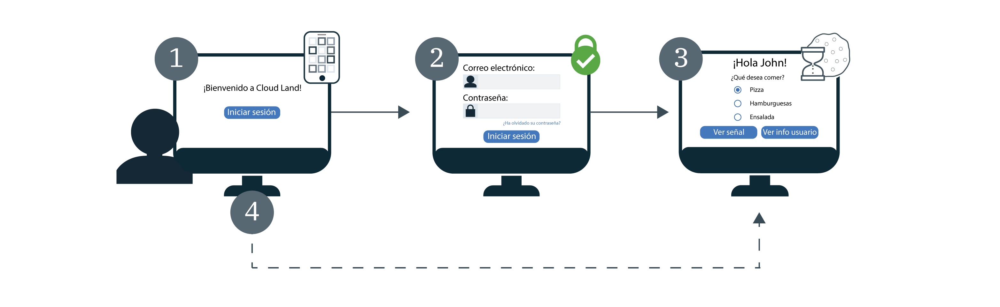

---

copyright:
  years: 2017, 2019
lastupdated: "2019-05-09"

keywords: authentication, authorization, identity, app security, secure, development, sso, directory, users, registry, multiple apps

subcollection: appid

---

{:new_window: target="_blank"}
{:shortdesc: .shortdesc}
{:screen: .screen}
{:pre: .pre}
{:table: .aria-labeledby="caption"}
{:codeblock: .codeblock}
{:tip: .tip}
{:note: .note}
{:important: .important}
{:deprecated: .deprecated}
{:download: .download}


# Inicio de sesión único (SSO)
{: #cd-sso}

Con el inicio de sesión único (SSO) para el directorio en la nube puede proporcionar una experiencia de autenticación fluida entre varias apps web. Si el inicio de sesión único está activado cuando un usuario inicia la sesión, no es necesario que vuelva a especificar sus credenciales la próxima vez que inicie sesión. En su lugar, iniciará sesión automáticamente en cualquiera de las apps que estén protegidas por la misma instancia de {{site.data.keyword.appid_short_notm}}.


## Cómo funciona
{: #cd-sso-how-it-works}

Consulte el diagrama siguiente para ver el inicio de sesión único en acción.



1. Un usuario del directorio en la nube inicia sesión en la app por primera vez.
2. Se le solicita que se autentique proporcionando un nombre de usuario o un correo electrónico y una contraseña.
3. Si las credenciales son válidas, el usuario inicia sesión en la app. Al mismo tiempo, {{site.data.keyword.appid_short_notm}} crea una sesión y establece una cookie en el navegador del usuario.
4. Si un usuario intenta iniciar sesión en una de las otras aplicaciones, {{site.data.keyword.appid_short_notm}} detecta la cookie de sesión y automáticamente inicia la sesión en la app para el usuario. Las cookies de sesión de {{site.data.keyword.appid_short_notm}} son específicas de la instancia y están firmadas por la clave privada exclusiva de la instancia.

Si su instancia está configurada para utilizar proveedores de identidad junto con el directorio en la nube, como SAML o Facebook, aún se mostrará el widget de inicio de sesión. Se solicita a los usuarios que entren en sus credenciales del directorio en la nube o que elijan uno de los demás proveedores, incluso si tienen una sesión de SSO válida.
{: note}


## Configuración del inicio de sesión único (SSO)
{: #cd-sso-configure}

Puede configurar el inicio de sesión único utilizando el panel de control de {{site.data.keyword.appid_short_notm}} o las API.
{: shortdesc}


### Con la GUI
{: #cd-sso-configure-gui}


Puede configurar el SSO a través de la GUI.

1. Vaya al separador **Directorio en la nube > Inicio de sesión único** del panel de control de {{site.data.keyword.appid_short_notm}}.

2. En el recuadro **Habilitar inicio de sesión único** cambie SSO a **Habilitado**.

3. Establezca la cantidad de tiempo que un usuario puede estar inactivo antes de que caduque la sesión de SSO. Cuando caduque, deben volver a iniciar sesión. El tiempo se especifica en minutos y el tiempo máximo permitido de inactividad es de 10.080 minutos (7 días). El tiempo predeterminado es de 1440 minutos, lo que equivale a 1 día.

4. Añada los URI de redirección al recuadro **URI de redirección de cierre de sesión** y pulse el signo **+**. Asegúrese de registrar únicamente aplicaciones en las que confía. Al registrar el URI, está autorizando que {{site.data.keyword.appid_short_notm}} lo incluya en el flujo de trabajo de autorización.

5. Pulse **Guardar**.


### Con la API
{: #cd-sso-configure-api}

Al utilizar la API de administración de configuración de SSO para definir tres valores, puede activar la característica.

Una llamada de ejemplo:

```json
{
  "isActive": true,
  "inactivityTimeoutSeconds": 86400,
  "logoutRedirectUris": [
    "http://my-first-app.com/after_logout",
    "http://my-second-app.com/after_logout"
  ]
}
```
{: screen}

<table>
  <tr>
    <th>Valor</th>
    <th>Definición</th>
  </tr>
  <tr>
    <td><code>isActive</code></td>
    <td>Para habilitar SSO, establezca este valor en <code>true</code>. El valor predeterminado es <code>false</code>.</td>
  </tr>
  <tr>
    <td><code>inactivityTimeoutSeconds</code></td>
    <td>El periodo de tiempo más largo que puede pasar sin ninguna actividad de usuario antes de que el usuario esté obligado a volver a especificar sus credenciales. Este valor se especifica en segundos y puede ser un máximo de <code>604800 segundos</code> (7 días). El valor predeterminado es <code>86400 segundos</code> (1 día).</td>
  </tr>
  <tr>
    <td><code>logoutRedirectUris</code></td>
    <td>Una lista separada por comas de los URI permitidos a los que {{site.data.keyword.appid_short_notm}} puede redirigir a los usuarios después de que hayan finalizado la sesión.</td>
  </tr>
</table>


## Configuración del cierre de sesión
{: #cd-sso-log-out}

Con {{site.data.keyword.appid_short_notm}} puede cerrar la sesión de SSO de un usuario para su navegador actual. Si el navegador del usuario accede al punto final de la API, se termina la sesión y se solicita al usuario que especifique sus credenciales en el siguiente inicio de sesión en ese navegador - para cualquiera de sus apps.
{: shortdesc}


Cuando se inicia uno de los flujos de cambiar, restablecer o renovar contraseña, las sesiones de todos los clientes finalizan automáticamente para el usuario.
{: note}


### Utilizando la API
{: #cd-sso-log-out-api}

Para cerrar la sesión de un usuario, redirija su navegador utilizando su información para completar la siguiente llamada de API.

```
https://<region>.appid.cloud.ibm.com/oauth/v4/<tenant-id>/cloud_directory/sso/logout?redirect_uri=<redirect_uri>&client_id=<clientId>
```
{: codeblock}

<table>
  <tr>
    <th>Variable</th>
    <th>Valor</th>
  </tr>
  <tr>
    <td><code>región</code></td>
    <td>La región en la que se ha suministrado la instancia de {{site.data.keyword.appid_short_notm}}. Las opciones incluyen: <code>au-syd</code>, <code>eu-de</code>, <code>eu-gb</code>, <code>jp-tok</code> y <code>us-south</code>.</td>
  </tr>
  <tr>
    <td><code>tenant-id</code></td>
    <td>El identificador exclusivo de la instancia de {{site.data.keyword.appid_short_notm}}. Puede encontrar este valor en el separador <em>Credenciales de servicio</em> del panel de control de {{site.data.keyword.appid_short_notm}}. Si no dispone de un conjunto de credenciales de servicio, puede crear uno y tomar el valor de ahí.</td>
  </tr>
  <tr>
    <td><code>redirect_uri</code></td>
    <td>Un URI que ha especificado en la configuración de SSO a través del panel de control de {{site.data.keyword.appid_short_notm}}. Por razones de seguridad, si no especifica un valor, no se puede realizar la redirección y se muestra un error.</td>
  </tr>
</table>

Incluso si finaliza la sesión de SSO, es posible que no sea necesario que un usuario con una señal de acceso válida almacenada en su sesión tenga que volver a entrar sus credenciales de nuevo hasta que caduque la señal. De forma predeterminada, la señal caduca después de una hora.
{: note}


### Utilizando el SDK del servidor de Node.JS
{: #cd-sso-log-out-nodejs}

También puede utilizar el SDK del servidor de Node.js de {{site.data.keyword.appid_short_notm}} para que se encargue de la redirección automáticamente.

Ejemplo:

```javascript
app.get('/logoutSSO', (req, res) => {
  res.clearCookie("refreshToken");
  webAppStrategy.logoutSSO(req,res, { "redirect_uri": "https://my-app.com/after_logout" });
  });
```
{: screen}


## Finalización de todas las sesiones de un usuario
{: cd-sso-ending-all-sessions}

Como administrador, puede finalizar todas las sesiones de SSO de cualquier usuario determinado utilizando las API de administrador de {{site.data.keyword.appid_short_notm}}. Las API están protegidas por una señal de Cloud IAM.

Solicitud de API de ejemplo:

```
POST https://<region>.appid.cloud.ibm.com/management/v4/{tenant-id}/cloud_directory/Users/{user-id}/sso/logout
Headers:
Authorization: <IAM TOKEN>
```
{: codeblock}

<table>
  <tr>
    <th>Variable</th>
    <th>Valor</th>
  </tr>
  <tr>
    <td><code>región</code></td>
    <td>La región en la que se ha suministrado la instancia de {{site.data.keyword.appid_short_notm}}. Las opciones incluyen: <code>us-south</code>, <code>eu-gb</code> y <code>eu-de</code>.</td>
  </tr>
  <tr>
    <td><code>tenant-id</code></td>
    <td>El identificador exclusivo de la instancia de {{site.data.keyword.appid_short_notm}}. Puede encontrar este valor en el separador <em>Credenciales de servicio</em> del panel de control de {{site.data.keyword.appid_short_notm}}. Si no dispone de un conjunto de credenciales de servicio, puede crear uno y tomar el valor de ahí.</td>
  </tr>
  <tr>
    <td><code>user-id</code></td>
    <td>El identificador exclusivo de un usuario del directorio en la nube. Puede obtener el ID utilizando las [API de usuarios del directorio en la nube](https://us-south.appid.cloud.ibm.com/swagger-ui/#/), o bien visualizando la señal de identidad del usuario.</td>
  </tr>
</table>

Cuando invoca esta API, todas las sesiones de SSO del usuario especificado se invalidan. Esto significa que la próxima vez que el usuario intente iniciar sesión en cualquiera de sus apps, desde cualquier dispositivo o navegador, deberán volver a especificar sus credenciales.

