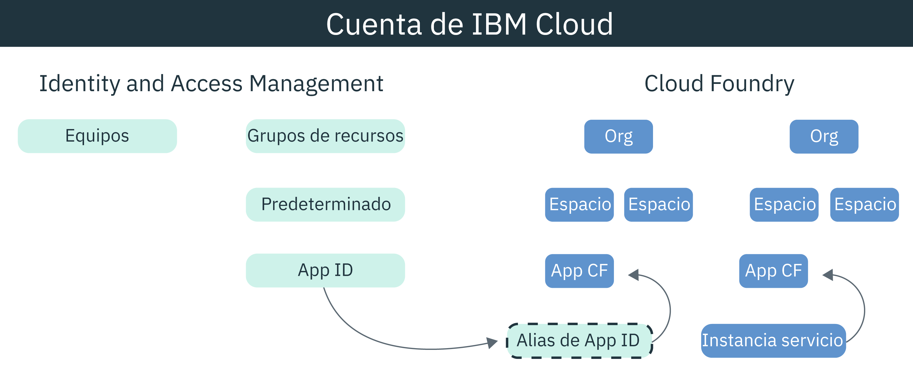

---

copyright:
  years: 2017, 2019
lastupdated: "2019-05-09"

keywords: authentication, authorization, identity, app security, secure, development, cloud foundry, access management, iam, java, node.js

subcollection: appid

---

{:new_window: target="_blank"}
{:shortdesc: .shortdesc}
{:screen: .screen}
{:pre: .pre}
{:table: .aria-labeledby="caption"}
{:codeblock: .codeblock}
{:tip: .tip}
{:note: .note}
{:important: .important}
{:deprecated: .deprecated}
{:download: .download}


# Guía de aprendizaje: Configuración de Cloud Foundry para utilizar {{site.data.keyword.appid_short_notm}}
{: #cloud-foundry}

Con {{site.data.keyword.cloud_notm}}, puede proteger sus apps con dos tipos de gestión de acceso diferentes, Identity and Access Management (IAM) y Cloud Foundry. De forma predeterminada, todas las nuevas instancias de {{site.data.keyword.appid_short_notm}} utilizan los grupos de recursos de IAM para gestionar el acceso. Si está utilizando Cloud Foundry para gestionar la aplicación, puede unir los modelos de gestión creando un alias de servicio y enlazando el servicio a la app.
{: shortdesc}


## Visión general de Cloud Foundry
{: #cf-understand}

Un alias crea una conexión entre el servicio gestionado por IAM como, por ejemplo, {{site.data.keyword.appid_short_notm}} y la aplicación Cloud Foundry. Cuando enlaza una aplicación, las credenciales de servicio se crean y se pasan automáticamente a la app. Aunque el enlace es un paso necesario en la configuración, tiene las ventajas siguientes:

* Automatización: con las credenciales de servicio almacenadas en la variable de entorno VCAP_SERVICES, ya no tendrá que copiarlas manualmente en la app. Todo se hace entre bastidores, en su nombre, con los SDK de {{site.data.keyword.appid_short_notm}}.
* Seguridad: la configuración está a prueba de errores porque el proceso es automático.
* Seguridad: nada de lo relacionado con el acceso está codificado en la aplicación ya que las credenciales de servicio existen sólo en las variables de entorno.

¿Su app Cloud Foundry se aloja en otra plataforma? Ningún problema. Puede definir las credenciales de aplicación en la app para enlazarla con el servicio. Puede encontrar las credenciales de la aplicación a través del panel de control de {{site.data.keyword.appid_short_notm}}, o realizando una solicitud al punto final [/applications](https://us-south.appid.cloud.ibm.com/swagger-ui/#!/Applications/registerApplication).
{: tip}

Vea cómo encajan entre sí los distintos modelos en el siguiente diagrama:



## Antes de empezar
{: #cf-before}

Antes de empezar, asegúrese de cumplir los siguientes requisitos previos:

* Una cuenta de {{site.data.keyword.cloud_notm}}
* Una instancia de {{site.data.keyword.appid_short_notm}}
* La [CLI de {{site.data.keyword.cloud_notm}}](/docs/cli/reference/ibmcloud?topic=cloud-cli-ibmcloud-cli#ibmcloud-cli) instalada localmente

## Despliegue de una app Node.js
{: #cf-node}


1. Vaya a la instancia de {{site.data.keyword.appid_short_notm}}.

2. Pulse **Descargar ejemplo** en el separador **Visión general** del panel de control del servicio.

3. Pulse **Node.js**. Descargue y extraiga la app de ejemplo.

4. Verifique que cumple todos los requisitos previos de Node.js.

5. Abra el terminal y cambie a la carpeta de ejemplo.

6. Inicie sesión en la CLI de {{site.data.keyword.cloud_notm}}. La CLI le solicita que seleccione una cuenta y una región si no especifica ninguna.

  ```
  ibmcloud login -a cloud.ibm.com -r <region>
  ```
  {: codeblock}

  <table>
    <tr>
      <th>Región</th>
      <th>Punto final</th>
    </tr>
    <tr>
      <td>Dallas</td>
      <td><code>us-south</code></td>
    </tr>
    <tr>
      <td>Frankfurt</td>
      <td><code>eu-de</code></td>
    </tr>
    <tr>
      <td>Sídney</td>
      <td><code>au-syd</code></td>
    </tr>
    <tr>
      <td>Londres</td>
      <td><code>eu-gb</code></td>
    </tr>
    <tr>
      <td>Tokio</td>
      <td><code>jp-tok</code></td>
    </tr>
  </table>

7. Establezca como destino la organización de Cloud Foundry y el espacio en el que desea trabajar y siga las solicitudes para ello.

  ```
  ibmcloud target --cf
  ```
  {: codeblock}

8. Cree un alias de la instancia de servicio de {{site.data.keyword.appid_short_notm}}.

  ```
  ibmcloud resource service-alias-create {ALIAS_NAME} --instance-name {SERVICE_INSTANCE_NAME}
  ```
  {: codeblock}

9. Añada el alias que ha creado a los servicios del archivo `manifest.yml`.

10. Enlace los servicios que se listan en el archivo `manifest.yml` desplegando la app de ejemplo.

  ```
  ibmcloud app push
  ```
  {: codeblock}

## Despliegue de una app Java
{: #java}

1. Vaya a la instancia de {{site.data.keyword.appid_short_notm}}.

2. Pulse **Descargar ejemplo** en el separador **Visión general** del panel de control del servicio.

3. Pulse **Java**. Descargue y extraiga la app de ejemplo.

4. Verifique que cumple todos los requisitos previos de Java.

5. Abra el terminal y cambie a la carpeta de ejemplo.

6. Genere el archivo `war` y cárguelo.

  ```
  mvn clean install
  ```
  {: codeblock}

7. Cambie a la carpeta de Liberty.

8. Inicie sesión en la CLI de {{site.data.keyword.cloud_notm}}. La CLI le solicita que seleccione una cuenta y una región si no especifica ninguna.

  ```
  ibmcloud login -a cloud.ibm.com -r <region>
  ```
  {: codeblock}

8. Establezca como destino la organización de Cloud Foundry y el espacio en el que desea trabajar y siga las solicitudes para ello.

  ```
  ibmcloud target --cf
  ```
  {: codeblock}

10. Cree un alias de la instancia de servicio de {{site.data.keyword.appid_short_notm}}.

  ```
  ibmcloud resource service-alias-create {ALIAS_NAME} --instance-name {SERVICE_INSTANCE_NAME}
  ```
  {: codeblock}

11. Añada el alias que ha creado a los servicios del archivo `manifest.yml`.

  Ejemplo:
  ```
    applications:
  - name: ApplicationName
    memory: 512M
    services:
    - AppID-alias
  ```
  {: screen}

13. Enlace los servicios que se listan en el archivo `manifest.yml` desplegando la app de ejemplo.

  ```
  ibmcloud app push
  ```
  {: codeblock}

