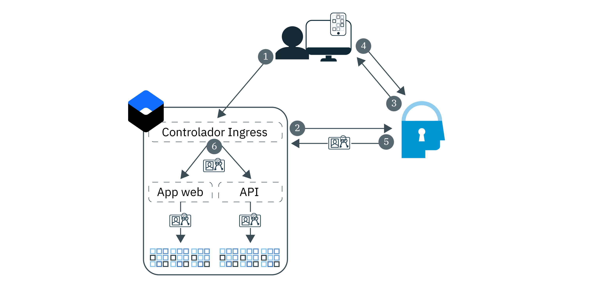

---

copyright:
  years: 2017, 2019
lastupdated: "2019-03-21"

keywords: authentication, authorization, identity, app security, secure, development, ingress, policy, networking, containers, kubernetes

subcollection: appid

---

{:new_window: target="_blank"}
{:shortdesc: .shortdesc}
{:screen: .screen}
{:pre: .pre}
{:table: .aria-labeledby="caption"}
{:codeblock: .codeblock}
{:tip: .tip}
{:note: .note}
{:important: .important}
{:deprecated: .deprecated}
{:download: .download}


# Guía de aprendizaje: Configuración de Ingress para utilizar {{site.data.keyword.appid_short_notm}}
{: #kube-auth}

Puede aplicar la seguridad basada en políticas de forma coherente utilizando la función de redes de Ingress en {{site.data.keyword.containerlong}}. Con este enfoque, puede habilitar la autorización y la autenticación para todas las aplicaciones de su clúster al mismo tiempo, sin tener que cambiar el código de la app. Esta guía paso a paso le enseñará a configurar el controlador Ingress para utilizar {{site.data.keyword.appid_short_notm}}.
{: shortdesc}

Consulte el siguiente diagrama para ver el flujo de autenticación:



1. Un usuario abre la aplicación y desencadena una solicitud a la app web o API.
2. Para el flujo de API, el controlador Ingress intenta validar las señales proporcionadas. Si se utiliza el flujo de web, se inicia un proceso de autenticación de OIDC de tres etapas.
3. {{site.data.keyword.appid_short_notm}} inicia el proceso de autenticación mostrando el widget de inicio de sesión.
4. El usuario proporciona un nombre de usuario o un correo electrónico y una contraseña.
5. El controlador Ingress obtiene las señales de acceso y de identidad de {{site.data.keyword.appid_short_notm}} para la autorización.
6. Cada solicitud que el controlador Ingress valida y reenvía a las apps tiene una cabecera de autorización que contiene las señales.

La integración del controlador Ingress con {{site.data.keyword.appid_short_notm}} actualmente no da soporte a las señales de renovación. Cuando caduquen las señales de acceso e identidad, el usuario debe volver a autenticarse.
{: note}


## Antes de empezar
{: #kube-prereqs}

Antes de empezar, asegúrese de cumplir los siguientes requisitos previos.
{: shortdesc}

Por razones de seguridad, la autenticación de {{site.data.keyword.appid_short_notm}} solo da soporte a los programas de fondo con TLS/SSL habilitado.
{: note}

* Una app o una app de ejemplo.
* Un clúster de Kubernetes estándar con al menos dos nodos de trabajador por zona. Si utiliza Ingress en clústeres multizona, revise los requisitos previos adicionales en la [Documentación del servicio de Kubernetes](/docs/containers?topic=containers-ingress#config_prereqs).
* Una instancia de {{site.data.keyword.appid_short_notm}} en la misma región en la que se despliega el clúster. Asegúrese de que el nombre de servicio no contenga ningún espacio.

* Los siguientes [roles de {{site.data.keyword.cloud_notm}} IAM](/docs/containers?topic=containers-access_reference#access_reference):
  * Clúster: rol de plataforma de administrador
  * Espacios de nombres de Kubernetes: rol de servicio de gestor

* Las siguientes CLI:

  * [{{site.data.keyword.cloud_notm}}](/docs/cli/reference/ibmcloud/cloud-cli-install_use?topic=cloud-cli-ibmcloud-cli#ibmcloud-cli)
  * [Kubernetes](https://kubernetes.io/docs/tasks/tools/install-kubectl/)
  * [Docker](https://www.docker.com/products/docker-engine#/download)

* Los siguientes [plugins de la CLI de {{site.data.keyword.cloud_notm}}](/docs/cli/reference/ibmcloud?topic=cloud-cli-plug-ins#plug-ins):

  * Servicio de Kubernetes
  * Container Registry

Para obtener ayuda para descargar las CLI y los plugins y configurar el entorno del servicio de Kubernetes, consulte la guía de aprendizaje [Creación de clústeres de Kubernetes](/docs/containers?topic=containers-cs_cluster_tutorial#cs_cluster_tutorial_lesson1).
{: tip}

¡Empecemos!

## Paso 1: Vincular {{site.data.keyword.appid_short_notm}} con el clúster
{: #kube-create-appid}

Puede vincular la instancia de {{site.data.keyword.appid_short_notm}} con el clúster para permitir que se utilicen todas las instancias de la app que se despliegan en el clúster. Al vincular la instancia de servicio con el clúster, los metadatos y credenciales de {{site.data.keyword.appid_short_notm}} estarán disponibles al iniciar la aplicación como secretos de Kubernetes.
{: shortdesc}


1. Inicie sesión en la CLI de {{site.data.keyword.cloud_notm}}. Siga las indicaciones de la CLI para completar el inicio de sesión.

  ```
  ibmcloud login -a cloud.ibm.com -r <region>
  ```
  {: codeblock}

  <table>
    <tr>
      <th>Región</th>
      <th>Punto final</th>
    </tr>
    <tr>
      <td>Dallas</td>
      <td><code>us-south</code></td>
    </tr>
    <tr>
      <td>Frankfurt</td>
      <td><code>eu-de</code></td>
    </tr>
    <tr>
      <td>Sídney</td>
      <td><code>au-syd</code></td>
    </tr>
    <tr>
      <td>Londres</td>
      <td><code>eu-gb</code></td>
    </tr>
    <tr>
      <td>Tokio</td>
      <td><code>jp-tok</code></td>
    </tr>
  </table>

2. Establezca el contexto para el clúster.

  1. Obtenga el mandato para establecer la variable de entorno y descargar los archivos de configuración de Kubernetes.

    ```
    ibmcloud ks cluster-config <cluster_name_or_ID>
    ```
    {: codeblock}

  2. Copie la salida que empieza por `export` y péguela en el terminal para establecer la variable de entorno `KUBECONFIG`.

3. Compruebe si ya tiene un controlador Ingress en el espacio de nombres predeterminado. IBM Cloud Kubernetes Service da soporte a un Ingress por espacio de nombres. Si ya tiene uno, puede actualizar la configuración de Ingress existente o bien utilizar otro espacio de nombres.

  ```
  kubectl get ingress
  ```
  {: pre}

4. Enlace la instancia de {{site.data.keyword.appid_short_notm}}. El enlace crea una clave de servicio para la instancia de servicio. Puede especificar una clave de servicio existente utilizando el distintivo `-key`.

  ```
  ibmcloud ks cluster-service-bind --cluster <cluster_name_or_ID> --namespace <namespace> --service <App-ID_instance_name> [--key <service_instance_key>]
  ```
  {: pre}

  Si no especifica un espacio de nombres, el secreto se crea en el espacio de nombres `default`.
  {: tip}

  Salida de ejemplo:

  ```
  ibmcloud ks cluster-service-bind --cluster mycluster --namespace default --service appid1
  Binding service instance to namespace...
  OK
  Namespace:    default
  Secret name:  binding-appid1
  ```
  {: screen}

¡Buen trabajo!

## Paso 2: Enviar la app a Container Registry
{: #kube-registry}

Para que la aplicación se ejecute en Kubernetes, debe alojarla en un registro.
{: shortdesc}


1. Inicie sesión en el plugin de la CLI de Container Registry.

  ```
  ibmcloud cr login
  ```
  {: pre}

2. Cree un espacio de nombres de Container Registry.

  ```
  ibmcloud cr namespace-add <my_namespace>
  ```
  {: pre}

3. Cree, etiquete y envíe la app como una imagen a su espacio de nombres en Container Registry. Asegúrese de incluir un punto (.) al final del mandato.

  ```
  ibmcloud cr build -t registry.<region>.bluemix.net/<namespace>/<app-name>:<tag> .
  ```
  {: pre}

¡Bien! Ya casi está listo para el despliegue.

## Paso 3: Configurar Ingress
{: kube-ingress}

Durante la creación del clúster, se crean un ALB Ingress privado y uno público. Para desplegar la aplicación y poder utilizar el controlador Ingress, debe crear un script de despliegue.
{: shortdesc}

1. Obtenga el secreto que se creó en el espacio de nombres del clúster cuando enlazó {{site.data.keyword.appid_short_notm}} con el clúster. Nota: esto **no** es el espacio de nombres de Container Registry.

  ```
  kubectl get secrets --namespace=<namespace>
  ```
  {: pre}

  Salida de ejemplo:

  ```
  NAME                       TYPE                                  DATA      AGE
  binding-appid1             Opaque                                1         1m
  bluemix-default-secret     kubernetes.io/dockercfg               1         1h
  default-token-kf97z        kubernetes.io/service-account-token   3         1h
  ```
  {: screen}

2. Utilice el siguiente archivo `yaml` de ejemplo para crear la configuración de Ingress. Para obtener ayuda para definir el resto de su despliegue, consulte [Despliegue de apps con la CLI](/docs/containers?topic=containers-app#app_cli).

  ```
  apiVersion: extensions/v1beta1
  kind: Ingress
  metadata:
    name: myingress
    annotations:
      ingress.bluemix.net/appid-auth: "bindSecret=<bind_secret> namespace=<namespace> requestType=<request_type> serviceName=<myservice> [idToken=false]"
  spec:
    tls:
    - hosts:
      - mydomain
      secretName: mytlssecret
    rules:
    - host: mydomain
      http:
        paths:
        - path: /
          backend:
            serviceName: myservice
            servicePort: 8080
  ```
  {: screen}

  <table>
    <tr>
      <th>Variable</th>
      <th>Descripción</th>
    </tr>
    <tr>
      <td><code>bindSecret</code></td>
      <td>El secreto de Kubernetes que se creó al vincular la instancia de servicio de {{site.data.keyword.appid_short_notm}} con el clúster.</td>
    </tr>
    <tr>
      <td><code>namespace</code></td>
      <td>El espacio de nombres en el que se ha creado <code>bindSecret</code>. Si no ha especificado un espacio de nombres, se utiliza el espacio de nombres <code>default</code>.</td>
    </tr>
    <tr>
      <td><code>requestType</code></td>
      <td><p>El tipo de solicitud que desea enviar a {{site.data.keyword.appid_short_notm}}. Las opciones incluyen: <code>web</code> y <code>api</code>. Si establece el tipo de solicitud en <code>web</code>, se valida una solicitud web que contiene una señal de acceso de {{site.data.keyword.appid_short_notm}}. Si la validación de señal falla, la solicitud web es rechazada. Si la solicitud no contiene ninguna señal de acceso, la solicitud se redirige a la página de inicio de sesión de {{site.data.keyword.appid_short_notm}}. Para que funcione la autenticación web de {{site.data.keyword.appid_short_notm}}, las cookies deben estar habilitadas en el navegador del usuario.</p><p>Si establece el tipo de solicitud en <code>api</code>, se valida una solicitud de API que contiene una señal de acceso de {{site.data.keyword.appid_short_notm}}. Si la solicitud no contiene ninguna señal de acceso, el usuario recibe un mensaje de error <code>401: Unauthorized</code>.</p></td>
    </tr>
    <tr>
      <td><code>serviceName</code></td>
      <td><p>Obligatorio: El nombre del servicio Kubernetes que ha creado para la app. Si no se incluye un nombre de servicio, la anotación se habilita para todos los servicios.</p> <p>Para utilizar varios tipos de solicitud en el mismo clúster, configure una instancia de {{site.data.keyword.appid_short_notm}} para que utilice <code>web</code> y otra para que utilice <code>api</code>.</p></td>
    </tr>
    <tr>
      <td><code>idToken</code></td>
      <td>Opcional: el cliente OIDC de Liberty no puede analizar el acceso y la señal de identidad al mismo tiempo. Cuando trabaje con Liberty, establezca este valor en <code>false</code> para que la señal de identidad no se envíe al servidor de Liberty.</td>
    </tr>
    <tr>
      <td><code>secretName</code></td>
      <td>El secreto de TLS asociado a su certificado TLS. Si su certificado se aloja en IBM Cloud Certificate Manager, puede ejecutar <code>ibmcloud ks alb-cert-deploy --secret-name < secret_name> --cluster < cluster_name_or_ID> --cert-crn < certificate_crn></code> para desplegarlo en el clúster. Si no dispone de un certificado, complete el paso 3 de [Exposición de apps con Ingress](/docs/containers?topic=containers-ingress#ingress_expose_public).</td>
    </tr>
  </table>

3. Ejecute el archivo de configuración.

  ```
  kubectl apply -f <file-name>.yaml
  ```
  {: pre}

¡Buen trabajo!


## Paso 4: Añadir los URL de redirección
{: #kube-add-redirect}

Un URL de redirección es el URL del sitio al que desea que {{site.data.keyword.appid_short_notm}} envíe a los usuarios después de autenticarse correctamente.
{: shortdesc}

1. Vaya a la GUI de {{site.data.keyword.cloud_notm}} y abra el panel de control de {{site.data.keyword.appid_short_notm}}.

2. En **Proveedores de identidad > Gestionar**, establezca los proveedores que desea utilizar en **Activados**. Si un proveedor no está habilitado, se envía a los usuarios una señal de acceso que proporciona acceso anónimo a la app.

3. Pulse **Valores de autenticación**.

4. Pulse el símbolo **+** en el recuadro **Añadir URL de redirección web**.

  * Dominio personalizado:

    Un URL que está registrado con un dominio personalizado puede tener el siguiente aspecto: `http://mydomain.net/myapp2path/appid_callback`. Si las apps que desea exponer están dentro del mismo clúster pero en diferentes espacios de nombres, puede utilizar un comodín para especificar todas las apps en el clúster a la vez. Esto resulta útil durante el desarrollo, pero deberá tener cuidado si utiliza comodines en la producción. Por ejemplo: `https://custom_domain.net/*`

  * Subdominio de Ingress:

    Si la app está registrada con un subdominio de IBM Ingress, el URL de devolución de llamada podría tener el aspecto siguiente: `https://mycluster.us-south.containers.appdomain.cloud/myapp1path/appid_callback`

{{site.data.keyword.appid_short_notm}} ofrece una función de cierre de sesión: si `/logout` existe en la vía de acceso de {{site.data.keyword.appid_short_notm}}, las cookies se eliminan y se vuelve a enviar al usuario a la página de inicio de sesión. Para utilizar esta función, añada `/appid_logout` a su dominio con el formato `https://mycluster.us-south.containers.appdomain.cloud/myapp1path/appid_logout` e inclúyalo en los URL de redirección.
{: note}


¡Buen trabajo! Ahora, puede verificar que el despliegue se ha realizado correctamente navegando hasta el subdominio de Ingress o el dominio personalizado para probarlo.


## Pasos siguientes
{: #kube-next}

Ahora que la aplicación se está ejecutando en un clúster de Kubernetes e Ingress está configurado, puede intentar:

* Utilizar atributos personalizados para [definir los roles](/docs/services/appid?topic=appid-tutorial-roles)
* Configurar la [autenticación de multifactores](/docs/services/appid?topic=appid-cd-mfa)
* Personalizar el [widget de inicio de sesión](/docs/services/appid?topic=appid-login-widget)


