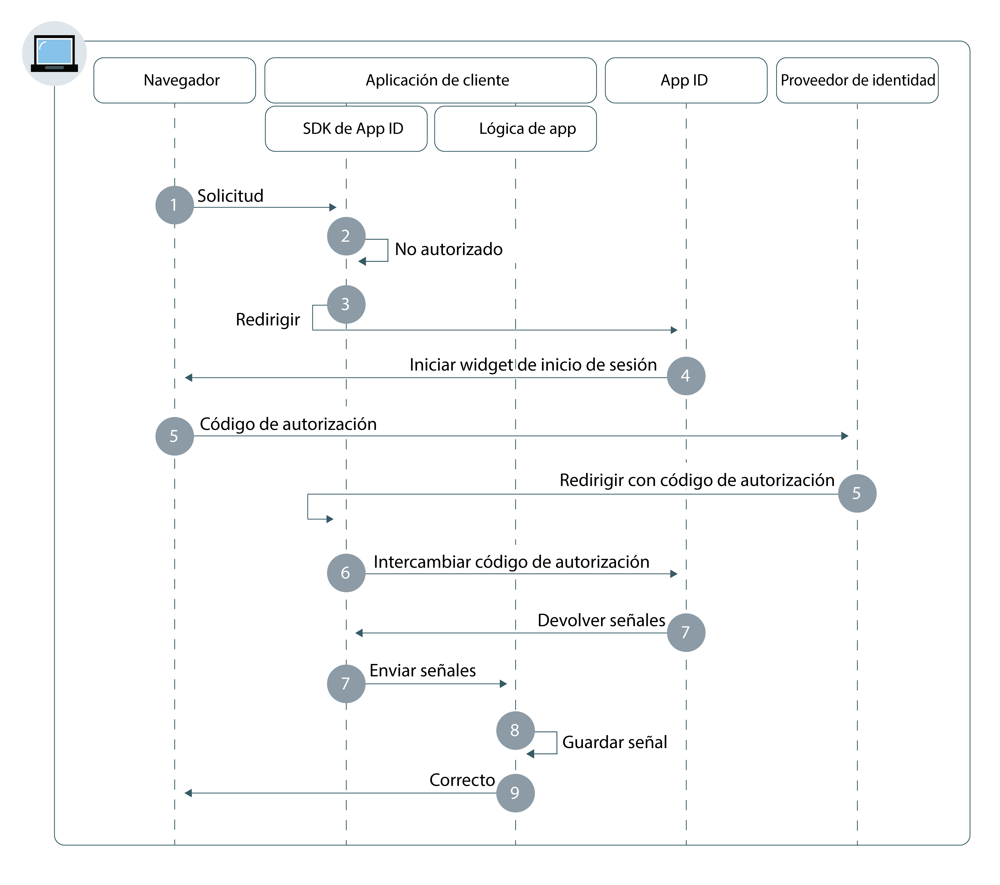

---

copyright:
  years: 2017, 2019
lastupdated: "2019-04-04"

keywords: authentication, authorization, identity, app security, secure, web apps, client, server

subcollection: appid

---

{:new_window: target="_blank"}
{:shortdesc: .shortdesc}
{:screen: .screen}
{:pre: .pre}
{:table: .aria-labeledby="caption"}
{:codeblock: .codeblock}
{:tip: .tip}
{:note: .note}
{:important: .important}
{:deprecated: .deprecated}
{:download: .download}


# Apps web
{: #web-apps}

Con {{site.data.keyword.appid_full}}, puede construir rápidamente una capa de autenticación para las aplicaciones web.
{: shortdesc}

## Comprensión del flujo
{: #web-understanding}

**¿Cuándo será útil este flujo?**

Cuando desarrolla una aplicación web, puede utilizar el flujo web de {{site.data.keyword.appid_short_notm}} para autenticar usuarios de forma segura. Los usuarios podrán acceder al contenido protegido del lado del servidor en sus apps web.

**¿Cuál es la base técnica del flujo?**

Las apps web a menudo requieren que los usuarios se autentiquen para poder acceder a contenido protegido. {{site.data.keyword.appid_short_notm}} utiliza el flujo del código de autorización OIDC para autenticar usuarios de forma segura. Con este flujo, cuando el usuario se ha autenticado, la app recibe un código de autorización. El código se cambia por una señal de acceso, identidad y renovación. En el paso de intercambio del código las señales siempre se envían a través de un canal de fondo seguro entre la app y el servidor OIDC. Esto proporciona una capa adicional de seguridad, ya que el atacante no puede interceptar las señales. Las señales se pueden enviar directamente a la aplicación de alojamiento del servidor web para la autenticación de usuario.

**¿Cómo funciona este flujo?**



1. Un usuario inicia el flujo de autorización enviando una solicitud al punto final `/authorization` mediante la API o SDK de {{site.data.keyword.appid_short_notm}}.

2. Si el usuario no está autorizado, el flujo de autenticación se inicia con una redirección a {{site.data.keyword.appid_short_notm}}.

3. En función de la configuración del proveedor de identidad o los parámetros de solicitud `/authorization` del usuario, inicia el Widget de inicio de sesión con el navegador de usuarios.

4. El usuario selecciona un proveedor de identidad con el que autenticarse y completa el proceso de inicio de sesión.

5. El proveedor de identidad redirecciona a la app de cliente con el código de autorización.

6. El SDK de {{site.data.keyword.appid_short_notm}} intercambia el código de autorización por señales de identidad, acceso y señales de renovación opcionales desde el servicio {{site.data.keyword.appid_short_notm}}.

7. Las señales se guardan mediante el SDK de {{site.data.keyword.appid_short_notm}} y se produce una redirección a la aplicación de cliente.

8. Se otorga acceso al usuario a la app.


## Configuración del SDK de Node.js
{: #web-configuring-nodejs}

Puede configurar {{site.data.keyword.appid_short_notm}} para que trabaje con sus aplicaciones web de Node.js.
{: shortdesc}

**Antes de empezar**

Debe tener los siguientes requisitos previos:

* Una instancia del servicio de {{site.data.keyword.appid_short_notm}}
* Un conjunto de credenciales de servicio
* NPM versión 4 o superior
* Node versión 6 o superior
* El URI de redirección establecido en el panel de control del servicio {{site.data.keyword.appid_short_notm}}


### Instalación del SDK de Node.js
{: #web-nodejs-install}

1. Utilizando la línea de mandatos, vaya al directorio que contiene la app Node.js.

2. Instale el servicio {{site.data.keyword.appid_short_notm}}.

  ```bash
  npm install --save ibmcloud-appid
  ```
  {: pre}

### Inicialización del SDK de Node.js
{: #web-nodejs-initialize}

1. Añada las siguientes definiciones de `require` al archivo `server.js`.

  ```javascript
  const express = require('express');
    const session = require('express-session')
    const passport = require('passport');
    const WebAppStrategy = require("ibmcloud-appid").WebAppStrategy;
    const CALLBACK_URL = "/ibm/cloud/appid/callback";
  ```
  {: pre}

2. Configurar la app express para utilizar el middleware de sesión express.

  ```javascript
  const app = express();
    app.use(session({
        secret: "123456",
        resave: true,
        saveUninitialized: true
        }));
    app.use(passport.initialize());
    app.use(passport.session());
  ```
  {: pre}

  Debe configurar el middleware con el almacenamiento de sesión adecuado para entornos de producción. Para obtener más información, consulte la <a href="https://github.com/expressjs/session" target="_blank">documentación de express.js </a>.
  {: note}

3. Obtenga las credenciales de una de las formas siguientes.

  * Vaya al separador **Aplicaciones** del panel de control de {{site.data.keyword.appid_short_notm}}. Si no tiene ninguna aplicación listada, puede pulsar **Añadir aplicación** para crear una aplicación nueva.

  * Realice una solicitud POST en el punto final [`/management/v4/{tenantId}/applications`](https://us-south.appid.cloud.ibm.com/swagger-ui/#/Management%20API%20-%20Applications/mgmt.registerApplication).

    Formato de la solicitud:
    ```
    curl -X POST \  https://us-south.appid.cloud.ibm.com/management/v4/39a37f57-a227-4bfe-a044-93b6e6060b61/applications/ \
    -H 'Content-Type: application/json' \
    -H 'Authorization: Bearer IAM_TOKEN' \
    -d '{"name": "ApplicationName"}'
    ```
    {: pre}

    Ejemplo de respuesta:
    ```
    {
    "clientId": "111c22c3-38ea-4de8-b5d4-338744d83b0f",
    "tenantId": "39a37f57-a227-4bfe-a044-93b6e6060b61",
    "secret": "ZmE5ZDQ5ODctMmA1ZS00OGRiLWExZDMtZTA1MjkyZTc4MDB4",
    "name": "ApplicationName",
    "oAuthServerUrl": "https://us-south.appid.cloud.ibm.com/oauth/v4/39a37f57-a227-4bfe-a044-93b6e6060b61"
    }
    ```
    {: screen}

4. Opcional: decida el formato del URI de redirección. La redirección puede tener dos formatos diferentes.

  * Manual, en un nuevo `WebAppStrategy({redirectUri: "...."})`
  * Como una variable de entorno denominada `redirectUri`

  Si no se proporciona ninguna de estas opciones, el SDK de {{site.data.keyword.appid_short_notm}} intenta recuperar `application_uri` de la app que se ejecuta en {{site.data.keyword.cloud_notm}} y añade un sufijo predeterminado `/ibm/cloud/appid/callback`.

5. Con la información obtenida en los pasos anteriores, inicialice el SDK.

  ```javascript
    passport.use(new WebAppStrategy({
    	  tenantId: "{tenant-id}",
   	    clientId: "{client-id}",
      	secret: "{secret}",
      	oauthServerUrl: "{oauth-server-url}",
      	redirectUri: "{app-url}" + CALLBACK_URL
      }));
  ```
  {: pre}

6. Configurar passport con serialización y deserialización. Este paso de configuración es necesario para la persistencia de la sesión autenticada en las solicitudes HTTP. Para obtener más información, consulte la <a href="http://passportjs.org/docs" target="_blank">documentación de passport </a>.

  ```javascript
  passport.serializeUser(function(user, cb) {
    cb(null, user);
    });

  passport.deserializeUser(function(obj, cb) {
    cb(null, obj);
    });
  ```
  {: pre}

5. Añada el código siguiente al archivo `server.js` para emitir las redirecciones de servicio.

   ```javascript
   app.get(CALLBACK_URL, passport.authenticate(WebAppStrategy.STRATEGY_NAME));
   ```
   {: pre}

6. Registre el punto final protegido.

   ```javascript
   app.get(‘/protected’, passport.authenticate(WebAppStrategy.STRATEGY_NAME), function(req, res) {res.json(req.user); });
   ```
   {: pre}

Para obtener más información, consulte el <a href="https://github.com/ibm-cloud-security/appid-serversdk-nodejs" target="_blank">Repositorio GitHub de Node.js de {{site.data.keyword.appid_short_notm}} </a>.


## Configuración del SDK de Liberty for Java
{: #web-configuring-liberty}

Puede configurar {{site.data.keyword.appid_short_notm}} para trabajar con sus aplicaciones web de Liberty for Java.
{:shortdesc}

**Antes de empezar**

Debe tener los siguientes requisitos previos:
* Una instancia del servicio de {{site.data.keyword.appid_short_notm}}
* Un conjunto de credenciales de servicio
* Apache Maven 3.5 o superior
* Java 1.8
* Una aplicación web de Liberty for Java

### Instalación del SDK de Liberty for Java
{: #web-liberty-install}

1. Añada una característica OpenID Connect en `server.xml`.

  ```xml
  <featureManager>
      <feature>ssl-1.0</feature>
      <feature>appSecurity-2.0</feature>
      <feature>openidConnectClient-1.0</feature>
  </featureManager>
  ```
  {: pre}

2. Obtenga las credenciales de una de estas dos maneras.

  * Vaya al separador **Aplicaciones** del panel de control de {{site.data.keyword.appid_short_notm}}. Si aún no dispone de una, puede pulsar **Añadir aplicación** para crear una nueva.

  * Realice una solicitud POST en el punto final [`/management/v4/{tenantId}/applications`](https://us-south.appid.cloud.ibm.com/swagger-ui/#!/Applications/registerApplication).

    Formato de la solicitud:
    ```
    curl -X POST \  https://us-south.appid.cloud.ibm.com/management/v4/39a37f57-a227-4bfe-a044-93b6e6060b61/applications/ \
    -H 'Content-Type: application/json' \
    -H 'Authorization: Bearer IAM_TOKEN' \
    -d '{"name": "ApplicationName"}'
    ```
    {: pre}

    Ejemplo de respuesta:
    ```
    {
    "clientId": "111c22c3-38ea-4de8-b5d4-338744d83b0f",
    "tenantId": "39a37f57-a227-4bfe-a044-93b6e6060b61",
    "secret": "ZmE5ZDQ5ODctMmA1ZS00OGRiLWExZDMtZTA1MjkyZTc4MDB4",
    "name": "ApplicationName",
    "oAuthServerUrl": "https://us-south.appid.cloud.ibm.com/oauth/v4/39a37f57-a227-4bfe-a044-93b6e6060b61"
    }
    ```
    {: screen}

3. Cree una característica de Open ID Connect Client y defina los siguientes marcadores de posición. Utilice las credenciales de servicio para rellenar los marcadores.

  ```xml
  <openidConnectClient
    clientId='{{site.data.keyword.appid_short_notm}} client_ID'
    clientSecret='{{site.data.keyword.appid_short_notm}} Secret'
    authorizationEndpointUrl='oauthServerUrl/authorization'
    tokenEndpointUrl='oauthServerUrl/token'
    jwkEndpointUrl='oauthServerUrl/publickeys'
    issuerIdentifier='Changed according to the region'
    tokenEndpointAuthMethod="basic"
    signatureAlgorithm="RS256"
    authFilterid="myAuthFilter"
    trustAliasName="ibm.com"
  />
  ```
  {: pre}

  <table>
  <caption>Tabla. Variables del elemento de OIDC para las apps de Liberty for Java</caption>
    <tr>
      <th> Componente </th>
      <th> Descripción </th>
    </tr>
    <tr>
    <td><code>clientID</code> </br> <code>secret</code> </br> <code>oauth-server-url</code> </br></td>
    <td>Complete el paso dos para obtener las credenciales de servicio.</td>
    </tr>
    <tr>
      <td><code> authorizationEndpointURL </code></td>
      <td> Añada <code>/authorization</code> al final de <code>oauthServerURL</code>.</td>
    </tr>
    <tr>
      <td><code> tokenEndpointUrl </code></td>
      <td>Añada <code>/token</code> al final de <code>oauthServerURL</code>.</td>
    </tr>
    <tr>
      <td><code> jwkEndpointUrl </code></td>
      <td>Añada <code>/publickeys</code> al final de <code>oauthServerURL</code>.</td>
    </tr>
    <tr>
      <td><code> issuerIdentifier </code></td>
      <td>El identificador de emisor tiene el siguiente formato: <code>&lt;region>&gt;.cloud.ibm.com</code>. Las opciones de región incluyen: <code>au-syd</code>, <code>eu-de</code>, <code>eu-gb</code>, <code>jp-tok</code> y <code>us-south</code>.</td>
    </tr>
    <tr>
      <td><code> tokenEndpointAuthMethod </code></td>
      <td>Especificado como "basic".</td>
    </tr>
    <tr>
      <td><code> signatureAlgorithm </code></td>
      <td>Especificado como "RS256".</td>
    </tr>
    <tr>
      <td><code> authFilterid </code></td>
      <td>La lista de recursos para proteger.</td>
    </tr>
    <tr>
      <td><code> trustAliasName </code></td>
      <td>El nombre del certificado dentro del almacén de confianza.</td>
    </tr>
  </table>

### Inicialización del SDK de Liberty for Java
{: #web-liberty-initialize}

1. En el archivo `server.xml`, defina un filtro de autorización para especificar recursos protegidos. Si no se <a href="https://www.ibm.com/support/knowledgecenter/en/SSD28V_8.5.5/com.ibm.websphere.wlp.core.doc/ae/rwlp_auth_filter.html" target="_blank">define </a> un filtro, el servicio protege todos los recursos.

  ```xml
  <authFilter id="myAuthFilter">
             <requestUrl id="myRequestUrl" urlPattern="/protected" matchType="contains"/>
    </authFilter>
  ```
  {: pre}

2. Defina el tipo de sujeto especial como `ALL_AUTHENTICATED_USERS`.

  ```xml
  <application type="war" id="ProtectedServlet" context-root="/appidSample"
  location="${server.config.dir}/apps/libertySample-1.0.0.war">
    <application-bnd>
        <security-role name="myrole">
        <special-subject type="ALL_AUTHENTICATED_USERS"/>
        </security-role>
            </application-bnd>
        </application>
  ```
  {: pre}

3. Descargue el archivo `libertySample-1.0.0.war` de <a href="https://github.com/ibm-cloud-security/appid-sample-code-snippets/tree/master/liberty-for-java" target="_blank">GitHub </a> y añádalo a la carpeta de apps del servidor. Por ejemplo, si el servidor se denomina `defaultServer`, el archivo war debería ubicarse en `target/liberty/wlp/usr/servers/defaultServer/apps/`.

4. Configure SSL añadiendo lo siguiente al archivo `server.xml`. También tiene que crear un almacén de confianza.

  ```xml
    <keyStore id="defaultKeyStore" password="myPassword"/>
  <keyStore id="appidtruststore" password="Liberty" location="${server.config.dir}/mytruststore.jks"/>
  <ssl id="defaultSSLConfig" keyStoreRef="defaultKeyStore" trustStoreRef="appidtruststore"/>
  ```
  {: pre}

De forma predeterminada, la configuración SSL requiere que el almacén de confianza esté configurado para OpenID Connect. Obtenga más información sobre cómo <a href="https://www.ibm.com/support/knowledgecenter/en/SSEQTP_liberty/com.ibm.websphere.wlp.doc/ae/twlp_config_oidc_rp.html" target="_blank">configurar un cliente de OpenID Connect en Liberty </a>
{: tip}


## Configuración del SDK de Spring Boot for Java
{: #web-configuring-spring-boot}

Puede configurar {{site.data.keyword.appid_short_notm}} para que funcione con aplicaciones de Spring Boot.
{:shortdesc}

**Antes de empezar**

Debe tener los siguientes requisitos previos:

* Una instancia del servicio de {{site.data.keyword.appid_short_notm}}
* Un conjunto de credenciales de servicio
* Un proyecto Java + Maven
* Apache Maven 3.5 o superior
* Java 1.8
* Spring Boot 2.0 y Security OAuth 2.0 o superior


### Inicialización de la infraestructura de Spring Boot
{: #web-spring-boot-initialize}

1. Añada lo siguiente entre las etiquetas `<project> </project>` en el archivo `pom.xml` de Maven.

  ```xml
  <parent>
      <groupId>org.springframework.boot</groupId>
      <artifactId>spring-boot-starter-parent</artifactId>
      <version>2.0.2.RELEASE</version>
      <relativePath/>
  </parent>
  ```
  {: pre}

2. Añada las dependencias siguientes al archivo `pom.xml` de Maven.

  ```xml
  <dependencies>
      <dependency>
          <groupId>org.springframework.boot</groupId>
          <artifactId>spring-boot-starter-web</artifactId>
      </dependency>
      <dependency>
          <groupId>org.springframework.boot</groupId>
          <artifactId>spring-boot-starter-security</artifactId>
      </dependency>
      <dependency>
          <groupId>org.springframework.security.oauth.boot</groupId>
          <artifactId>spring-security-oauth2-autoconfigure</artifactId>
          <version>2.0.0.RELEASE</version>
      </dependency>
  </dependencies>
  ```
  {: pre}

3. En el mismo archivo, incluya el plugin de Maven.

  ```xml
  <plugin>
      <groupId>org.springframework.boot</groupId>
      <artifactId>spring-boot-maven-plugin</artifactId>
  </plugin>
  ```
  {: pre}

### Inicialización de OAuth2
{: #web-oauth-initialize}

1. Añada las anotaciones siguientes al archivo Java.

  ```java
  @SpringBootApplication
  @EnableOAuth2Sso
  ```
  {: pre}

2. Amplíe la clase con `WebSecurityConfigurerAdapter`.
3. Altere temporalmente cualquier configuración de seguridad y registre el punto final protegido.

  ```java
    @Override
    protected void configure(HttpSecurity http) throws Exception {
        http.authorizeRequests()
                .antMatchers("/protectedResource").authenticated()
                .and().logout().logoutSuccessUrl("/").permitAll();
    }
  ```
  {: pre}


### Adición de credenciales
{: #web-spring-boot-credentials}

1. Obtenga las credenciales de una de las formas siguientes.

  * Vaya al separador **Aplicaciones** del panel de control de {{site.data.keyword.appid_short_notm}}. Si aún no dispone de una, puede pulsar **Añadir aplicación** para crear una nueva.

  * Realice una solicitud POST en el punto final [`/management/v4/{tenantId}/applications`](https://us-south.appid.cloud.ibm.com/swagger-ui/#!/Applications/registerApplication).

    Formato de la solicitud:
    ```
    curl -X POST \  https://us-south.appid.cloud.ibm.com/management/v4/39a37f57-a227-4bfe-a044-93b6e6060b61/applications/ \
    -H 'Content-Type: application/json' \
    -H 'Authorization: Bearer IAM_TOKEN' \
    -d '{"name": "ApplicationName"}'
    ```
    {: pre}

    Ejemplo de respuesta:
    ```
    {
    "clientId": "111c22c3-38ea-4de8-b5d4-338744d83b0f",
    "tenantId": "39a37f57-a227-4bfe-a044-93b6e6060b61",
    "secret": "ZmE5ZDQ5ODctMmA1ZS00OGRiLWExZDMtZTA1MjkyZTc4MDB4",
    "name": "ApplicationName",
    "oAuthServerUrl": "https://us-south.appid.cloud.ibm.com/oauth/v4/39a37f57-a227-4bfe-a044-93b6e6060b61"
    }
    ```
    {: screen}

2. Añada un archivo de configuración `application.yml` al directorio `/springbootsample/src/main/resources/`. Puede completar la configuración con la información de las credenciales de servicio.

  ```
  security:
  oauth2:
    client:
      clientId: {client ID}
      clientSecret: {client Secret}
      accessTokenUri: {oauthServerUrl}/token
      userAuthorizationUri: {oauthServerUrl}/authorization
    resource:
      userInfoUri: {oauthServerUrl}/userinfo
  ```
  {: pre}

Para obtener un ejemplo paso a paso, consulte <a href="https://www.ibm.com/blogs/bluemix/2018/06/creating-spring-boot-applications-app-id/" target="_blank">este blog</a>.


## Utilización de {{site.data.keyword.appid_short_notm}} con otros idiomas
{: #web-other-languages}

Con un SDK de cliente compatible con OIDC, puede utilizar {{site.data.keyword.appid_short_notm}} con otros lenguajes. Consulte la lista de <a href="https://openid.net/developers/certified/">bibliotecas certificadas</a> para obtener más información.

## Pasos siguientes
{: #web-next}

Con {{site.data.keyword.appid_short_notm}} instalado en la aplicación, casi está listo para iniciar la autenticación de usuarios. A continuación, intente realizar una de las siguientes actividades:

* Configure los [proveedores de identidad](/docs/services/appid?topic=appid-social)
* Personalice y configure el [widget de inicio de sesión](/docs/services/appid?topic=appid-login-widget)
* Obtenga más información sobre el <a href="https://github.com/ibm-cloud-security/appid-serversdk-nodejs" target="_blank">SDK de Node.js </a>
