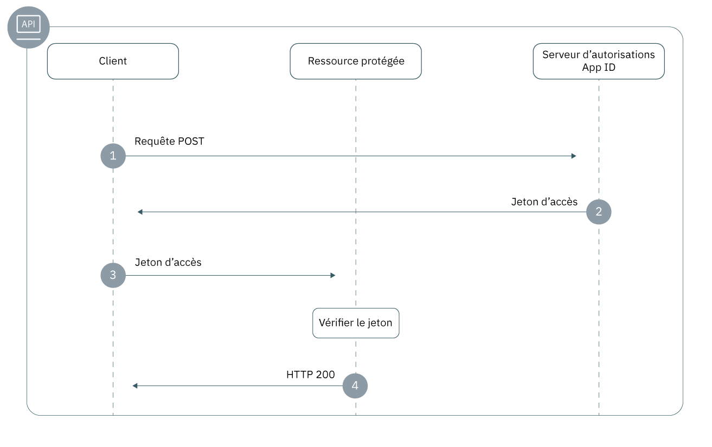

---

copyright:
  years: 2017, 2019
lastupdated: "2019-05-09"

keywords: authentication, authorization, identity, app security, secure, backend, back-end, oauth, 

subcollection: appid

---

{:new_window: target="_blank"}
{:shortdesc: .shortdesc}
{:screen: .screen}
{:pre: .pre}
{:table: .aria-labeledby="caption"}
{:codeblock: .codeblock}
{:tip: .tip}
{:note: .note}
{:important: .important}
{:deprecated: .deprecated}
{:download: .download}
{:java: .ph data-hd-programlang='java'}
{:javascript: .ph data-hd-programlang='javascript'}
{:swift: .ph data-hd-programlang='swift'}
{:curl: .ph data-hd-programlang='curl'}

# Applications de back end
{: #backend}

Vous pouvez utiliser les logiciels SDK et les API {{site.data.keyword.appid_full}} pour protéger les noeuds finaux et les API de vos applications de back end.
{: shortdesc}


## Comprendre le flux
{: #backend-understanding}

Le développement d'applications de back end consiste notamment à vérifier que vos API sont protégées contre les accès non autorisés. Les SDK {{site.data.keyword.appid_short_notm}} facilitent la protection de vos noeuds finaux d'API et garantissent la sécurité de votre application.


### Quelle est la base technique du flux ?
{: #backend-technical-flow}

{{site.data.keyword.appid_short_notm}} implémente [OAuth 2.0](https://tools.ietf.org/html/rfc6749) et la spécification OIDC, qui utilise des jetons bearer pour l'authentification et l'autorisation. Ces jetons sont formatés comme des [jetons Web JSON](https://tools.ietf.org/html/rfc7519), signés numériquement et contenant des réclamations qui décrivent le sujet en cours d'authentification et le fournisseur d'identité. Les API de votre application sont protégées par des jetons d'accès et d'identité. Les clients qui doivent accéder à vos API peuvent s'authentifier auprès du fournisseur d'identité via {{site.data.keyword.appid_short_notm}} en échange de ces jetons. Les réclamations contenues dans les jetons doivent être validées pour qu'un accès aux API protégées soit accordé.

Pour plus d'informations sur l'utilisation des jetons dans {{site.data.keyword.appid_short_notm}}, voir [Connaissance des jetons](/docs/services/appid?topic=appid-tokens#tokens).
{: tip}


### A quoi ressemble ce flux ?
{: #backend-flow}

Flux de back end 

1. Un client effectue une requête POST sur le serveur d'autorisations {{site.data.keyword.appid_short_notm}} afin d'obtenir un jeton d'accès. Une requête POST est généralement au format suivant :

  ```
  POST/oauth/v4/{tenantId}/token HTTP/1.1
  Content_type: application/x-www-form-urlencoded
  Authorization header = "Basic" + base64encode({clientId}:{secret})
  FormData = {grant_type}
  ```
  {: screen}

2. Si le client remplit les conditions requises, le serveur d'autorisations renvoie un jeton d'accès.

3. Le client envoie une demande à la ressource protégée. Les demandes peuvent être envoyées de plusieurs manières, selon la bibliothèque client HTTP utilisée, mais elles se présentent généralement sous la forme suivante :

  ```
  curl -H 'Authorization: Bearer {access_token}' {https://my-protected-resource.com}
  ```
  {: screen}

4. La ressource protégée ou l'API valide le jeton. Si le jeton est valide, l'accès à la ressource est accordé au client. Si le jeton ne peut pas être validé, l'accès est refusé.


## Protection des ressources à l'aide d'un logiciel SDK
{: #backend-secure}

Vous pouvez utiliser les logiciels SDK {{site.data.keyword.appid_short_notm}} pour imposer l'authentification et l'autorisation à vos applications côté serveur. `ApiStrategy` sécurise vos ressources de back end en exigeant que les jetons d'accès et d'identité soient validés dans le cadre de la demande.
{: shortdesc}

Le logiciel SDK Node.js d'{{site.data.keyword.appid_short_notm}} fonctionne conjointement avec l'[infrastructure Passport](http://www.passportjs.org/).
{: ph data-hd-programlang='javascript'}

Le logiciel SDK Swift côté serveur d'{{site.data.keyword.appid_short_notm}} fournit un plug-in de middleware de protection d'API qui permet de protéger vos applications de back end. En associant vos API au middleware, vous pouvez protéger votre application contre les accès non autorisés. Une fois l'API protégée, le middleware s'assure que les jetons générés par {{site.data.keyword.appid_short_notm}} sont validés. Vous pouvez alors modifier le comportement de l'API en fonction des résultats de la validation.
{: ph data-hd-programlang='swift'}

Voir le fragment de code suivant pour un exemple de protection de l'API `/protectedendpoint`.
{: ph data-hd-programlang='swift'}

```Swift
import Foundation
import Kitura              // server
import Credentials         // middleware
import IBMCloudAppID       // SDK

// setup routes
let router = Router()

// mandatory option to be passed in if app not deployed on IBM Cloud
let options = [
    "oauthServerUrl": "https://us-south.appid.cloud.ibm.com/oauth/v4/d8438de6-c325-4956-ad34-abd49194affd",
]
let apiCreds = Credentials()

// Minimum macOS version required
if #available(OSX 10.12, *) {

    // setup API protection
    let apiKituraCredentialsPlugin = APIKituraCredentialsPlugin(options: options)
    apiCreds.register(plugin: apiKituraCredentialsPlugin)

    // associate route with API protection
    router.all(middleware: apiCreds)

    // create protected API
    router.get("/protectedendpoint") { request, response, next in

        response.headers["Content-Type"] = "text/html; charset=utf-8"
        do {
            if let userProfile = request.userProfile  {
                try response.status(.OK).send(
                    "<!DOCTYPE html><html><body>" +
                        "Welcome " + userProfile.displayName  +
                        "! You are logged in with " + userProfile.provider + "." +
                    "</body></html>\n\n").end()
                next()
                return
            }
            try response.status(.unauthorized).send(
                "<!DOCTYPE html><html><body>” + “You are not authorized!" +
                "</body></html>\n\n").end()
        }
        catch {}
        next()
    }

    // Start server
    Kitura.addHTTPServer(onPort: 8090, with: router)

    Kitura.run()  
}
```
{: codeblock}
{: ph data-hd-programlang='swift'}

Visionnez la vidéo suivante pour en savoir plus sur la protection des applications Node de back end avec {{site.data.keyword.appid_short_notm}}. Ensuite, faites vous-même un essai à l'aide d'un [exemple d'application Node simple](https://github.com/ibm-cloud-security/appid-video-tutorials/tree/master/02b-simple-node-backend-app).
{: ph data-hd-programlang='javascript'}

<iframe class="embed-responsive-item" id="appid-backend-nodejs" title="A propos de {{site.data.keyword.appid_short_notm}}" type="text/html" width="640" height="390" src="//www.youtube.com/embed/jJLSgkHpZwA?rel=0" frameborder="0" webkitallowfullscreen mozallowfullscreen allowfullscreen></iframe>
{: ph data-hd-programlang='javascript'}


Visionnez la vidéo suivante pour en savoir plus sur la protection des applications Liberty for Java de back end avec {{site.data.keyword.appid_short_notm}}. Ensuite, faites vous-même un essai à l'aide d'un [exemple d'application Liberty for Java simple](https://github.com/ibm-cloud-security/appid-video-tutorials/tree/master/02d-simple-liberty-backend-app).
{: ph data-hd-programlang='java'}

<iframe class="embed-responsive-item" id="appid-backend-liberty" title="A propos de {{site.data.keyword.appid_short_notm}}" type="text/html" width="640" height="390" src="//www.youtube.com/embed/QA6DY2qqLaw?rel=0" frameborder="0" webkitallowfullscreen mozallowfullscreen allowfullscreen></iframe>
{: ph data-hd-programlang='java'}


### Avant de commencer
{: #backend-secure-before}
{: ph data-hd-programlang='javascript'}

Avant de commencer, assurez-vous de disposer des prérequis suivants :
{: ph data-hd-programlang='javascript'}
  * Une instance d'{{site.data.keyword.appid_short_notm}}
  * NPM version 4 ou ultérieure
  * Noeud version 6 ou ultérieure
  {: ph data-hd-programlang='javascript'}

### Installation du logiciel SDK
{: #backend-secure-install}
{: ph data-hd-programlang='javascript'}

1. Ajoutez le logiciel SDK Node.js {{site.data.keyword.appid_short_notm}} au fichier `package.json` de votre application.
{: ph data-hd-programlang='javascript'}
  ```
  "dependencies": {
      "ibmcloud-appid": "^6.0.0"
  }
  ```
  {: codeblock}
  {: ph data-hd-programlang='javascript'}

2. Exécutez la commande suivante.
{: ph data-hd-programlang='javascript'}

  ```
  npm install
  ```
  {: codeblock}
  {: ph data-hd-programlang='javascript'}

### Initialisation du logiciel SDK
{: #backend-secure-initialize}
{: ph data-hd-programlang='javascript'}

1. Obtenez votre `oauth server url`.
  1. Accédez à l'onglet **Données d'identification pour le service** du tableau de bord {{site.data.keyword.appid_short_notm}}.
  2. Si vous ne disposez pas encore d'un ensemble de données d'identification, cliquez sur **Nouvelles données d'identification** puis sur **Ajouter** pour créer un nouvel ensemble. Dans le cas contraire, ignorez cette étape.
  3. Cliquez sur le bouton **Afficher les données d'identification** pour afficher vos informations.
  4. Copiez votre URL `oauth server url` à utiliser à l'étape suivante.
  {: ph data-hd-programlang='javascript'}

2. Initialisez la stratégie Passport {{site.data.keyword.appid_short_notm}}, comme indiqué dans l'exemple suivant.
{: ph data-hd-programlang='javascript'}
  ```javascript
  var express = require('express'); 
  var passport = require('passport');
  var APIStrategy = require('ibmcloud-appid').APIStrategy; 
  passport.use(new APIStrategy({ oauthServerUrl: "{oauth-server-url}" })); 
  var app = express();
  app.use(passport.initialize());
  ```
  {: codeblock}
  {: ph data-hd-programlang='javascript'}


Si votre application Node.js s'exécute sur {{site.data.keyword.cloud_notm}} et est liée à votre instance d'{{site.data.keyword.appid_short_notm}}, il n'est pas nécessaire de fournir la configuration de la stratégie d'API. La configuration d'{{site.data.keyword.appid_short_notm}} obtient les informations à l'aide de la variable d'environnement VCAP_SERVICES.
{: tip}
{: ph data-hd-programlang='javascript'}


### Sécurisation de l'API
{: #backend-secure-api-strategy}
{: ph data-hd-programlang='javascript'}

Le fragment suivant montre comment utiliser `ApiStrategy` dans une application Express pour protéger l'API GET `/protected`.
{: ph data-hd-programlang='javascript'}

  ```javascript
   app.get('/protected', passport.authenticate('APIStrategy.STRATEGY_NAME', { session: false }), function(request, response){
      console.log("Security context", request.appIdAuthorizationContext);
      response.send(200, "Success!");
      }
   );
   ```
  {: codeblock}
  {: ph data-hd-programlang='javascript'}

Lorsque les jetons sont valides, le middleware suivant de la chaîne de demande est appelé et la propriété `appIdAuthorizationContext` est ajoutée à l'objet de la demande. La propriété contient les jetons d'accès et d'identité d'origine ainsi que les informations de contenu décodées des jetons.
{: ph data-hd-programlang='javascript'}


## Protection manuelle des ressources
{: #backend-secure-api}

Pour sécuriser vos ressources protégées et vos applications de back end, vous devez valider un jeton. Lorsqu'un client envoie une demande à votre ressource vous pouvez vérifier que le jeton répond aux spécifications définies. Le jeton peut inclure des informations d'identification, une portée ou toute autre configuration en place. Vous pouvez valider des jetons d'accès et d'identité {{site.data.keyword.appid_short_notm}} de plusieurs manières. Pour obtenir de l'aide, voir [Validation des jetons](/docs/services/appid?topic=appid-token-validation#token-validation).


## Etapes suivantes
{: #backend-next}

{{site.data.keyword.appid_short_notm}} est installé dans votre application ? Vous êtes pratiquement prêt à commencer l'authentification des utilisateurs ! Essayez d'effectuer l'une des activités suivantes :

* Configurer vos [fournisseurs d'identité](/docs/services/appid?topic=appid-social)
* Personnaliser et configurer [le widget de connexion](/docs/services/appid?topic=appid-login-widget)
* En savoir plus sur le <a href="https://github.com/ibm-cloud-security/appid-serversdk-nodejs" target="_blank">logiciel SDK Node.js</a>
* En savoir plus sur le <a href="https://github.com/ibm-cloud-security/appid-serversdk-swift" target="_blank">logiciel SDK Swift</a>
