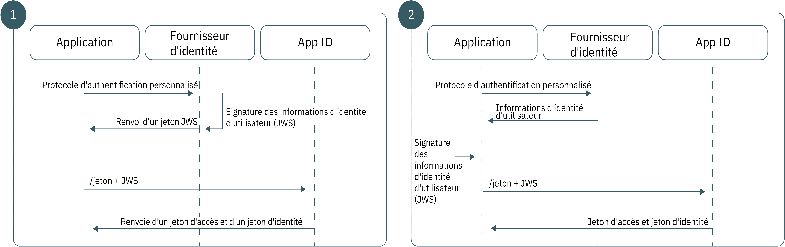

---

copyright:
  years: 2017, 2018
lastupdated: "2018-11-19"

---

{:new_window: target="_blank"}
{:shortdesc: .shortdesc}
{:pre: .pre}
{:tip: .tip}
{:screen: .screen}
{:codeblock: .codeblock}

# Utilisation de l'identité personnalisée dans votre application
{: #custom-identity}

Vous pouvez utiliser votre propre fournisseur d'identité personnalisé lors de l'authentification. Votre fournisseur d'identité peut se conformer à tout mécanisme d'authentification autre que ceux pris en charge par {{site.data.keyword.appid_full}}, y compris aux mécanismes propriétaires ou existants.
{: shortdesc}

## Présentation
{: #overview}

L'utilisation de votre propre fournisseur d'identité vous permet de créer un flux d'authentification personnalisé qui utilise vos propres protocoles. Vous disposez ainsi d'un plus grand contrôle, par exemple sur les informations que vous souhaitez partager ou les informations qui sont stockées.
{: shortdesc}

Veillez à [configurer votre fournisseur personnalisé](/docs/services/appid/custom.html) avant de l'ajouter à votre application.
{: tip}

</br>

**Quand utiliser ce flux ?**

Lorsqu'{{site.data.keyword.appid_short_notm}} ne propose pas de prise en charge directe pour un fournisseur d'identité particulier, vous pouvez utiliser le flux d'identité personnalisé pour relier le protocole d'authentification au flux d'authentification existant d'{{site.data.keyword.appid_short_notm}}. Par exemple, vous pouvez utiliser GitHub ou LinkedIn pour autoriser vos utilisateurs à se connecter. Vous pouvez utiliser le logiciel SDK existant du fournisseur d'identité pour faciliter les informations d'authentification de l'utilisateur avant de les conditionner et de les échanger avec {{site.data.keyword.appid_short_notm}}.

Il existe de nombreux scénarios dans lesquels un flux d'authentification différent est nécessaire :

 - Fournisseurs d'identité propriétaires internes
 - Fournisseurs d'identité tiers
 - Flux d'authentification complexes pouvant inclure des mécanismes propriétaires multi-facteurs 

Occasionnellement, un fournisseur existant peut utiliser son propre protocole d'authentification personnalisé. Comme le flux d'identité personnalisé dissocie complètement l'authentification de l'autorisation, vous pouvez adopter n'importe quel mécanisme d'authentification de votre choix, puis fournir les informations d'authentification obtenues à {{site.data.keyword.appid_short_notm}}. Tout cela, sans exposer les données d'identification de l'utilisateur.

</br>

**Quel est le support technique pour ce flux ?**

Le flux d'identité personnalisé est basé sur le type d'octroi d'extension JWT-Bearer défini dans Assertion Framework for OAuth 2.0 Authorization Grants [[RFC7521]](https://tools.ietf.org/html/rfc7523#section-2.1). Pour échanger des informations utilisateur contre des jetons {{site.data.keyword.appid_short_notm}}, votre architecture d'authentification crée une relation de confiance avec {{site.data.keyword.appid_short_notm}} à l'aide d'une paire de clés asymétriques RSA. Une fois la relation de confiance établie, vous pouvez utiliser le type d'octroi JWT-Bearer pour échanger des informations utilisateur vérifiées dans un jeton JWT signé pour des jetons {{site.data.keyword.appid_short_notm}}.

</br>

**A quoi ressemble le flux ?**

Comme pour tous les flux d'authentification, l'identité personnalisée nécessite que l'application soit en mesure d'établir un degré de confiance avec {{site.data.keyword.appid_short_notm}} afin de garantir l'intégrité des informations utilisateur du fournisseur d'identité. L'identité personnalisée utilise une paire de clés publiques et privées RSA asymétriques pour établir sa relation de confiance. Selon vos exigences architecturales, l'identité personnalisée prend en charge deux modèles de confiance qui diffèrent uniquement par l'emplacement de stockage et l'utilisation de la clé privée.



Figure. Flux de demande pour l'authentification personnalisée

<dl>
  <dt>1. Fournisseur d'identité signé</dt>
    <dd>Comme avec les flux OAuth 2.0 traditionnels, le modèle de confiance le plus sécurisé crée une relation entre votre fournisseur d'identité et le serveur d'autorisation, dans ce cas {{site.data.keyword.appid_short_notm}} directement. Sous ce modèle, votre fournisseur d'identité est responsable du stockage de la clé privée et de la signature des assertions JWT. Lorsqu'elles sont transmises à {{site.data.keyword.appid_short_notm}}, ces assertions sont validées avec la clé publique correspondante, garantissant ainsi que les informations utilisateur de votre fournisseur d'identité n'ont pas été modifiées de manière malveillante lors du transport.</dd>
  <dt>2. Application signée</dt>
    <dd>Vous pouvez également baser votre modèle de confiance sur la relation entre votre application et {{site.data.keyword.appid_short_notm}}. Dans ce flux, votre clé privée est stockée dans votre application côté serveur. Après une authentification réussie, votre application est chargée de convertir la réponse du fournisseur d'identité en jeton JWT et de signer ce dernier avec sa clé privée avant que l'application ne l'envoie à {{site.data.keyword.appid_short_notm}}. Comme ce fournisseur d'identité n'a pas de relation avec {{site.data.keyword.appid_short_notm}}, cette architecture crée un modèle de confiance plus faible. Bien que {{site.data.keyword.appid_short_notm}} puisse faire confiance aux informations envoyées par l'application côté serveur, il ne peut pas être certain que les données sont les données originales envoyées par le fournisseur d'identité.</dd>
</dl>

</br>

## Génération d'un jeton Web JSON
{: #creating-jwts}

Vous pouvez convertir vos données utilisateur vérifiées en jeton JWT d'identité personnalisé en générant un <a href="https://tools.ietf.org/html/rfc7515" target="blank">jeton Web JSON </a>. Le jeton doit être signé avec la clé privée qui correspond à votre clé publique préconfigurée. Pour obtenir la liste des bibliothèques de signatures de jeton, consultez <a href="https://jwt.io/" target="blank">jwt.io </a>.
{: shortdesc}

### Exemple de format JWT

En-tête du jeton :
  ```
  {
  "alg": "RS256",
  "typ": "JOSE"
  }
  ```
  {: screen}

Contenu du jeton :
  ```
  {
    // Required
    iss: String, // Should reference your identity provider
    aud: String, // Must be the OAuth server host name
    exp: Int,    // Should be a value with a short lifespan
    sub: String, // Must be the unique user ID provided by your identity provider

    // Normalized claims (optional)
    name: String
    email: String
    locale: String
    picture: String
    gender: String

    // Custom Scopes to add to access token (optional)
    scope="custom_scope1 custom_scope2"

    // Other custom claims (optional)
    role="admin"
  }
  ```
  {: screen}

  <table>
  <thead>
    <th colspan=2> Zones du jeton JWS</th>
  </thead>
  <tbody>
    <tr>
      <td><code>iss</code></td>
      <td>Doit contenir une référence à votre fournisseur d'identité.</td>
    </tr>
    <tr>
      <td><code>aud</code></td>
      <td>Hôte du serveur OAuth.</td>
    </tr>
    <tr>
      <td><code>exp</code></td>
      <td>Durée de validité du jeton. Pour des raisons de sécurité, sa durée de vie doit être courte et il doit être spécifique.</td>
    </tr>
    <tr>
      <td><code>sub</code></td>
      <td>ID utilisateur unique fourni par le fournisseur d'identité.</td>
    </tr>
    <tr>
      <td>Réclamations normalisées</td>
      <td>Toutes les [réclamations normalisées](/docs/services/appid/authorization.html#tokens) sont fournies dans le jeton d'identité renvoyé en réponse à cette demande. D'autres réclamations personnalisées sont disponibles en utilisant le [noeud final d'informations utilisateur](/docs/services/appid/custom-attributes.html).</td>
    </tr>
    <tr>
      <td>Champ d'application</td>
      <td>Par défaut, tous les jetons {{site.data.keyword.appid_short_notm}} contiennent un groupe de champs d'application prédéfinis. Vous pouvez demander des champs d'application supplémentaires en procédant de l'une des manières suivantes :<ul><li> Spécifiez le champ d'application dans la zone de champ d'application de votre jeton JWS.</li> <li>Spécifiez le champ d'application via le paramètre de champs d'applications url-form de la demande `/token`.</li></ul></td>
    </tr>
  </tbody>
  </table>

## Extraction de jetons {{site.data.keyword.appid_short_notm}}
{: #exchanging-jwts}

Vous devez disposer de jetons {{site.data.keyword.appid_short_notm}} pour pouvoir créer le pont entre votre fournisseur personnalisé et {{site.data.keyword.appid_short_notm}}. Pour obtenir des jetons de service, échangez vos informations utilisateur vérifiées à l'aide du noeud final [`/token`](https://appid-oauth.ng.bluemix.net/swagger-ui/#!/Authorization_Server_V3/token).
{: shortdesc}

  ```
  Post /token
  Content-Type: application/x-www-from-urlencoded
  grant_type=urn:ietf:params:oauth:grant-type:jwt-bearer
  assertion=<payload>
  scope="<space separated scope array>"
  ```
  {: codeblock}
  <table>
    <thead>
      <th colspan=2> Construction d'une demande</th>
    </thead>
    <tbody>
      <tr>
        <td>Type de contenu</td>
        <td><code>applications/x-www-from-urlencoded</code></td>
      </tr>
      <tr>
        <td>Type d'octroi</td>
        <td><code>urn:ietf:params:oauth:grant-type:jwt-bearer</code></td>
      </tr>
      <tr>
        <td>Assertion</td>
        <td>Chaîne de contenu JWS.</td>
      </tr>
      <tr>
        <td>Portée</td>
        <td>Liste de vos champs d'application personnalisés séparés par des blancs.</td>
      </tr>
    </tbody>
  </table>
