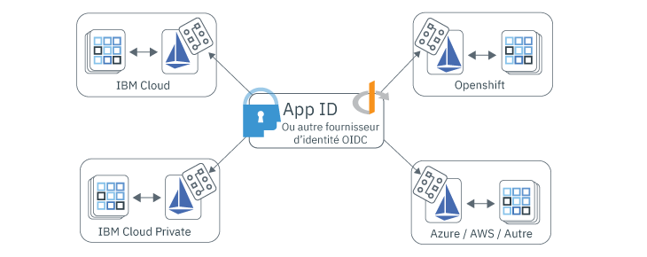

---

copyright:
  years: 2017, 2019
lastupdated: "2019-07-11"

keywords: Authentication, authorization, identity, app security, access, secure, development, any kube, kubernetes, icp, openshift, iks

subcollection: appid

---

{:external: target="_blank" .external}
{:shortdesc: .shortdesc}
{:screen: .screen}
{:pre: .pre}
{:table: .aria-labeledby="caption"}
{:codeblock: .codeblock}
{:tip: .tip}
{:note: .note}
{:important: .important}
{:deprecated: .deprecated}
{:download: .download}

# Sécurisation d'applications multi-cloud avec Istio
{: #istio-adapter}

En utilisant l'adaptateur App Identity and Access, vous pouvez centraliser toute la gestion des identités au même endroit. Comme les entreprises utilisent des clouds de plusieurs fournisseurs ou une combinaison de solutions sur site et hors site, des modèles de déploiement hétérogènes peuvent vous aider à conserver l'infrastructure existante et éviter toute dépendance vis à vis du fournisseur. L'adaptateur peut être configuré pour utiliser un fournisseur d'identité compatible OIDC, tel qu'{{site.data.keyword.appid_short_notm}}, ce qui lui permet de contrôler les règles d'authentification et d'autorisation dans tous les environnements, y compris les applications de front end et de back end. De plus, **tout ceci s'effectue sans modifier votre code et sans avoir besoin de redéployer votre application**.
{: shortdesc}


## Architecture multi-cloud
{: #istio-multicloud}

Un environnement de calcul multi-cloud combine plusieurs environnements de cloud et/ou de calcul privé en une seule architecture de réseau. En répartissant les charges de travail sur plusieurs environnements, vous pouvez constater des améliorations en termes de résilience et de flexibilité, ainsi qu'une rentabilité accrue. Pour tirer parti de ces avantages, il est courant d'utiliser une application reposant sur un conteneur avec une couche d'orchestration, comme par exemple Kubernetes.


Figure. Déploiement multi-cloud - obtenu avec l'adaptateur App Identity and Access.


## Description d'Istio et de l'adaptateur
{: #istio-architecure}

[Istio](https://istio.io) est un maillage de services open source qui s'ajoute en toute transparence sur les applications distribuées existantes pouvant s'intégrer à Kubernetes. Pour réduire la complexité des déploiements, Istio fournit des informations sur le comportement et un contrôle opérationnel sur le maillage de services dans son ensemble. Lorsque le service App ID est combiné avec Istio, vous obtenez une solution d'identité adaptable et intégrée pour des architectures multi-cloud qui n'a pas besoin de modification de code d'application personnalisé. Pour plus d'informations, consultez ["Qu'est-ce qu'Istio?"](https://www.ibm.com/cloud/learn/istio?cm_mmc=OSocial_Youtube-_-Hybrid+Cloud_Cloud+Platform+Digital-_-WW_WW-_-IstioYTDescription&cm_mmca1=000023UA&cm_mmca2=10010608){: external}.

Istio utilise un proxy sidecar Envoy pour assurer tout le trafic entrant et sortant pour tous les services du maillage de services. A l'aide de ce proxy, Istio extrait les informations sur le trafic (que l'on appelle aussi télémétrie) qui sont envoyées au composant Istio nommé Mixer pour appliquer les décisions en termes de politique. L'adaptateur App Identity and Access étend les fonctionnalités du composant Mixer en analysant la télémétrie (attributs) par rapport à des règles personnalisées pour contrôler la gestion des entités et des accès vers et à l'intérieur du maillage de services. Les règles de gestion d'accès sont liées à des services Kubernetes particuliers et peuvent être ajustées sur des noeuds finaux de service spécifiques. Pour plus d'informations sur les règles et la télémétrie, voir la [documentation Istio](https://istio.io/docs/concepts/observability/){: external}. 

En raison d'une limitation d'Istio, l'adaptateur App Identity and Access stocke actuellement les informations de session utilisateur en interne et *ne conserve pas* les informations sur les répliques ou sur les configurations de reprise après incident. Lorsque vous utilisez l'adaptateur, limitez vos charges de travail à une seule réplique tant que cette limitation n'est pas résolue.
{: note}

### Protection des applications de front end
{: #istio-frontend}

Si vous utilisez une application reposant sur un navigateur, vous pouvez utiliser le flux [Open ID Connect (OIDC)](https://openid.net/specs/openid-connect-core-1_0.html){: external} / OAuth 2.0 `authorization_grant` pour l'authentification de vos utilisateurs. Lorsqu'un utilisateur non authentifié est détecté, il est automatiquement redirigé vers la page d'authentification. Lorsque l'authentification aboutit, le navigateur est redirigé sur un noeud final `/oidc/callback` implicite où l'adaptateur intercepte la demande. A ce stade, l'adaptateur obtient des jetons du fournisseur d'identité, puis redirige l'utilisateur sur l'URL que celui-ci demandait au départ.

Pour afficher les informations de session utilisateur, notamment les jetons de session, vous pouvez regarder dans l'en-tête `Authorization`.

```
Authorization: Bearer <access_token> <id_token>
```
{: screen}

Vous pouvez également déconnecter des utilisateurs authentifiés. Lorsqu'un utilisateur authentifié accède à un noeud final protégé avec `oidc/logout` ajouté comme illustré dans l'exemple suivant, il est déconnecté.

```
https://myhost/path/oidc/logout
```
{: screen}

Si nécessaire, un jeton d'actualisation peut être utilisé pour obtenir automatiquement de nouveaux jetons d'accès et d'identité sans que l'utilisateur ait besoin de s'authentifier à nouveau. Si le fournisseur d'identité configuré renvoie un jeton d'actualisation, ce jeton est conservé dans la session et utilisé pour récupérer de nouveaux jetons lorsque le jeton d'identité arrive à expiration.


### Protection des applications de back end
{: #istio-backend}

L'adaptateur peut être utilisé en collaboration avec le [flux JWT Bearer](https://tools.ietf.org/html/rfc6750){: external} OAuth 2.0 pour protéger les API de service en validant les jetons JWT Bearer. Le flux d'autorisation Bearer s'attend à ce qu'une demande contienne un en-tête Authorization avec un jeton d'accès valide et un jeton d'identité facultatif. La structure de l'en-tête attendue se présente comme suit : `Authorization=Bearer {access_token} [{id_token}]`. Un statut de réponse HTTP 401 est renvoyé aux clients non authentifiés avec la liste des portées qui leur sont nécessaires pour obtenir l'autorisation. Si les jetons ne sont pas valides ou ont expiré, la stratégie de l'API renvoie une réponse HTTP 401 avec un composant d'erreur facultatif indiquant `Www-Authenticate=Bearer scope="{scope}" error="{error}"`.


Pour plus d'informations sur les jetons et leur mode d'utilisation, voir [Connaissance des jetons](/docs/services/appid?topic=appid-tokens).


## Avant de commencer
{: #istio-before}

Avant de commencer, assurez-vous que les prérequis suivants sont installés.

- [Cluster Kubernetes](https://kubernetes.io/){: external}
- [Helm](https://helm.sh/){: external}
- [Istio v1.1+](https://istio.io/docs/setup/kubernetes/install/){: external}
  
  Vous pouvez également utiliser [IBM Cloud Kubernetes Service Managed Istio](/docs/containers?topic=containers-istio).
  {: note}


## Installation de l'adaptateur
{: #istio-install-adapter}

Pour installer la charte, initialisez Helm dans votre cluster, définissez les options que vous souhaitez utiliser et exécutez ensuite la commande d'installation.

1. Si vous utilisez le service IBM Cloud Kubernetes, veillez à vous connecter et à définir le contexte de votre cluster.

2. Installez Helm dans votre cluster.

    ```bash
    helm init
    ```
    {: codeblock}

    Vous envisagerez peut-être de configurer Helm pour utiliser le mode `--tls`. Pour obtenir de l'aide sur l'activation de TLS, consultez le [référentiel Helm](https://github.com/helm/helm/blob/master/docs/tiller_ssl.md){: external}. Si vous activez TLS, n'oubliez pas d'ajouter `--tls` à chaque commande Helm que vous exécutez. Pour plus d'informations sur l'utilisation de Helm avec IBM Cloud Kubernetes Service, voir [Ajout de services à l'aide de chartes Helm](/docs/containers?topic=containers-helm#public_helm_install).
    {: tip}

3. Installez la charte.

    ```bash
    helm install ./helm/appidentityandaccessadapter --name appidentityandaccessadapter
    ```
    {: codeblock}

## Application d'une règle d'autorisation et d'authentification
{: #istio-apply-policy}

Une règle d'authentification et d'autorisation est un ensemble de conditions à remplir avant qu'une demande accède à une ressource. En définissant la configuration de service d'un fournisseur d'identité et une règle qui stipule à quel moment utiliser un flux particulier, vous pouvez contrôler l'accès à n'importe quelle ressource dans votre maillage de services. Pour consulter des exemples de définitions de ressource personnalisées (CRD), consultez le [répertoire samples](https://github.com/ibm-cloud-security/app-identity-and-access-adapter/tree/master/samples/crds){: external}.

Pour créer une règle :

1. Définissez une configuration.
2. Enregistrez le noeud final.

### Définition d'une configuration
{: #istio-apply-define}

En fonction de la protection que vous envisagez sur les applications de front end ou de back end, créez une configuration de règle avec l'une des options suivantes.

* Pour les applications de front end : des applications reposant sur un navigateur qui nécessitent l'authentification des utilisateurs peuvent être configurées pour utiliser le flux d'authentification OIDC / OAuth 2.0. Pour créer une définition CRD `OidcConfig` contenant le client utilisé pour faciliter le flux d'authentification avec le fournisseur d'identité, servez-vous de l'exemple suivant pour vous guider.

    ```yaml
    apiVersion: "security.cloud.ibm.com/v1"
    kind: OidcConfig
    metadata:
        name:      oidc-provider-config
        namespace: sample-namespace
    spec:
        discoveryUrl: https://us-south.appid.cloud.ibm.com/oauth/v4/<tenant-ID>/oidc-discovery/.well-known
        clientId:     <client-ID>
        clientSecret: <randomlyGeneratedClientSecret>
        clientSecretRef:
            name: <name-of-my-kube-secret>
            key: <key-in-my-kube-secret>
    ```
    {: screen}

    <table>
        <thead>
        <tr>
            <th>Zone</th>
            <th style="text-align:center">Type</th>
            <th style="text-align:center">Obligatoire</th>
            <th style="text-align:center">Description</th>
        </tr>
        </thead>
        <tbody>
        <tr>
            <td><code>discoveryUrl</code></td>
            <td style="text-align:center">chaîne</td>
            <td style="text-align:center">Oui</td>
            <td style="text-align:center">Noeud final courant qui fournit un document JSON contenant les informations de configuration pour OIDC/OAuth 2.0.</td>
        </tr>
        <tr>
            <td><code>clientId</code></td>
            <td style="text-align:center">chaîne</td>
            <td style="text-align:center">Oui</td>
            <td style="text-align:center">Identificateur du client utilisé pour l'authentification.</td>
        </tr>
        <tr>
            <td><code>clientSecret</code></td>
            <td style="text-align:center">chaîne</td>
            <td style="text-align:center">*Non</td>
            <td style="text-align:center">Valeur confidentielle (secret) en texte brut utilisée pour authentifier le client. Si elle n'est pas fournie, il doit exister une référence <code>clientSecretRef</code>.</td>
        </tr>
        <tr>
            <td><code>clientSecretRef</code></td>
            <td style="text-align:center">objet</td>
            <td style="text-align:center">Non</td>
            <td style="text-align:center">Valeur confidentielle (secret) de référence utilisée pour authentifier le client. Cette référence peut être utilisée à la place de <code>clientSecret</code>.</td>
        </tr>
        <tr>
            <td><code>clientSecretRef.name</code></td>
            <td style="text-align:center">chaîne</td>
            <td style="text-align:center">Oui</td>
            <td style="text-align:center">Nom de la valeur confidentielle (secret) Kubernetes contenant la valeur de <code>clientSecret</code>.</td>
        </tr>
        <tr>
            <td><code>clientSecretRef.key</code></td>
            <td style="text-align:center">chaîne</td>
            <td style="text-align:center">Oui</td>
            <td style="text-align:center">Zone au sein de la valeur confidentielle (secret) Kubernetes renfermant la valeur de <code>clientSecret</code>.</td>
        </tr>
        </tbody>
    </table>

* Pour les applications de back end : la spécification de jeton Bearer OAuth 2.0 définit un modèle pour protéger les API à l'aide de [jetons Web JSON (JWT)](https://tools.ietf.org/html/rfc7519.html){: external}. En utilisant la configuration suivante à titre d'exemple, créez une définition CRD `JwtConfig` contenant la ressource de la clé publique, qui est utilisée pour valider les signatures de jeton.

    ```yaml
    apiVersion: "security.cloud.ibm.com/v1"
    kind: JwtConfig
    metadata:
      name:      jwt-config
      namespace: sample-app
    spec:
        jwksUrl: https://us-south.appid.cloud.ibm.com/oauth/v4/<tenant-ID>/publickeys
    ```
    {: screen}

### Enregistrements des noeuds finaux d'application
{: #istio-register-endpoints}

Enregistrez les noeuds finaux d'application au sein d'une définition CRD `Policy` pour valider les demandes entrantes et appliquer des règles d'authentification. Chaque règle (`Policy`) s'applique exclusivement à l'espace de nom Kubernetes dans lequel réside l'objet et peut spécifier les services, les chemins et les méthodes que vous souhaitez protéger.

```yaml
apiVersion: "security.cloud.ibm.com/v1"
kind: Policy
metadata:
  name:      samplepolicy
  namespace: sample-app
spec:
  targets:
    -
      serviceName: <svc-sample-app>
      paths:
        - exact: /web/home
          method: ALL
          policies:
            - policyType: oidc
              config: <oidc-provider-config>
              rules:
                - claim: scope
                  match: ALL
                  source: access_token
                  values:
                    - appid_default
                    - openid
                - claim: amr
                  match: ANY
                  source: id_token
                  values:
                    - cloud_directory
                    - google

        - exact: /web/user
          method: GET
          policies:
            - policyType: oidc
              config: <oidc-provider-config>
              redirectUri: https://github.com/ibm-cloud-security/app-identity-and-access-adapter
        - prefix: /
          method: ALL
          policies:
            -
              policyType: jwt
              config: <jwt-config>
```
{: screen}


| Objet de service | Type | Obligatoire | Description   |
|:----------------:|:----:|:--------:| :-----------: |
| `service` | `string` | Oui | Nom du service Kubernetes dans l'espace de nom Policy que vous souhaitez protéger. |
| `paths` | `array[Path Object]` | Oui | Liste d'objets de chemin qui définissent les noeuds finaux que vous souhaitez protéger. Si cette zone est vide, tous les chemins sont protégés. |
{: class="simple-tab-table"}
{: caption="Tableau 1. Description des composants d'objet de service" caption-side="top"}
{: #service-object}
{: tab-title="Service object"}
{: tab-group="objects"}

| Objet de chemin (path)    | Type | Obligatoire | Description   |
|:----------------:|:----:|:--------:|:-----------:|
| `exact ou prefix` | `string` | Oui | Chemin sur lequel vous souhaitez appliquer les règles. Options possibles : `exact` et `prefix`. `exact` établit une correspondance exacte des noeuds finaux avec la dernière barre oblique (`/`) tronquée. `prefix` établit une correspondance pour les noeuds finaux commençant par le préfixe de route que vous fournissez. |
| `method` | `enum` | Non | Méthode HTTP protégée. Options valides : ALL, GET, PUT, POST, DELETE, PATCH (valeur par défaut : ALL).  |
| `policies` | `array[Policy]` | Non | Règles OIDC/JWT que vous souhaitez appliquer.  |
{: class="simple-tab-table"}
{: caption="Tableau 2. Description des composants d'objet de chemin (path)" caption-side="top"}
{: #path-object}
{: tab-title="Path object"}
{: tab-group="objects"}

| Objet de règle (policy)  | Type | Obligatoire | Description   |
|:----------------:|:----:|:--------:| :-----------: |
| `policyType` | `enum` | Oui | Type de règle OIDC. Options possibles : `jwt` ou `oidc`. |
| `config` | `string` | Oui | Nom de la configuration de fournisseur que vous souhaitez utiliser. |
| `redirectUri` | `string` | Non | URL vers laquelle vous souhaitez que l'utilisateur soit redirigé après une authentification réussie. Par défaut, il s'agit de l'URL de la demande d'origine. |
| `rules` | `array[Rule]` | Non | Ensemble de règles que vous souhaitez utiliser pour la validation des jetons. |
{: class="simple-tab-table"}
{: caption="Tableau 3. Description des composants d'objet de règle (policy)" caption-side="top"}
{: #policy-object}
{: tab-title="Policy object"}
{: tab-group="objects"}

| Objet de règle (rule)  | Type | Obligatoire | Description   |
|:----------------:|:----:|:--------:| :-----------: |
| `claim` | `string` | Oui | Réclamation que vous souhaitez valider. |
| `match` | `enum` | Non | Critères requis pour valider la réclamation. Options possibles : `ALL`, `ANY` ou `NOT`. La valeur par défaut est `ALL`. |
| `source` | `enum` | Non | Jeton dans lequel vous souhaitez appliquer la règle. Options possibles : `access_token` ou `id_token`. La valeur par défaut est `access_token`. |
| `values` | `array[string]` | Oui | Ensemble de valeurs requises pour la validation. |
{: class="simple-tab-table"}
{: caption="Tableau 4. Description des composants d'objet de règle (rule)" caption-side="top"}
{: #rule-object}
{: tab-title="Rule object"}
{: tab-group="objects"}


## Suppression de l'adaptateur
{: #istio-remove}

Pour retirer un adaptateur et toutes les définitions CRD associées, vous devez supprimer la charte Helm et les clés de signature et de chiffrement associées.

```bash
helm delete --purge appidentityandaccessadapter
kubectl delete secret appidentityandaccessadapter-keys -n istio-system
```
{: codeblock}


## Foire aux questions et traitement des incidents
{: #istio-faq}

Si vous rencontrez un problème avec l'adaptateur App Identity and Access, consultez les informations techniques contenues dans la foire aux questions et le traitement des incidents ci-après. Pour obtenir de l'aide supplémentaire, vous pouvez poser des questions sur un forum ou ouvrir un ticket de demande de service. Lorsque vous utilisez les forums pour poser une question, prenez soin d'étiqueter cette dernière de façon à ce qu'elle soit vue par l'équipe de développement {{site.data.keyword.appid_short_notm}}.

  * Posez toute question d'ordre technique sur {{site.data.keyword.appid_short_notm}} sur le forum <a href="https://stackoverflow.com/" target="_blank">Stack Overflow </a> en indiquant la balise "ibm-appid".
  * Posez toute question relative au service et aux instructions de mise en route sur le forum <a href="https://developer.ibm.com/" target="_blank">dW Answers </a>. Incluez la balise `appid`.

Pour plus d'informations sur l'obtention de support, voir [Comment obtenir le support dont j'ai besoin ?](/docs/get-support?topic=get-support-getting-customer-support#getting-customer-support).


### Traitement des incidents : journalisation
{: #istio-logging}

Par défaut, les journaux sont de style JSON avec un niveau de visibilité `info` pour faciliter leur intégration avec des systèmes de journalisation externes. Pour mettre à jour la configuration de journalisation, vous pouvez utiliser la charte Helm. Les niveaux de journalisation pris en charge sont compris dans la plage [-1, 7] comme indiqué dans Zap core. Pour plus d'informations sur les différents niveaux, voir la [documentation Zap core](https://godoc.org/go.uber.org/zap/zapcore#Level).

Lorsque vous affichez les journaux JSON manuellement, vous souhaiterez éventuellement afficher leur dernières lignes ou les formater et les indenter ("pretty print") en utilisant [`jq`](https://brewinstall.org/install-jq-on-mac-with-brew/).
{: note}

**Adaptateur**

Pour voir les journaux de l'adaptateur, vous pouvez utiliser `kubectl` ou accéder au pod à partir du pod `appidentityandaccessadapter` dans la console Kubernetes.

```bash
$ alias adapter_logs="kubectl -n istio-system logs -f $(kubectl -n istio-system get pods -lapp=appidentityandaccessadapter -o jsonpath='{.items[0].metadata.name}')"
$ adapter_logs | jq
```
{: codeblock}

**Mixer**

Si l'adaptateur ne semble pas recevoir les demandes, consultez les journaux de Mixer pour voir s'il est connecté correctement à l'adaptateur.

```bash
$ alias mixer_logs="kubectl -n istio-system logs -f $(kubectl -n istio-system get pods -lapp=telemetry -o jsonpath='{.items[0].metadata.name}') -c mixer"
$ mixer_logs | jq
```
{: codeblock}

