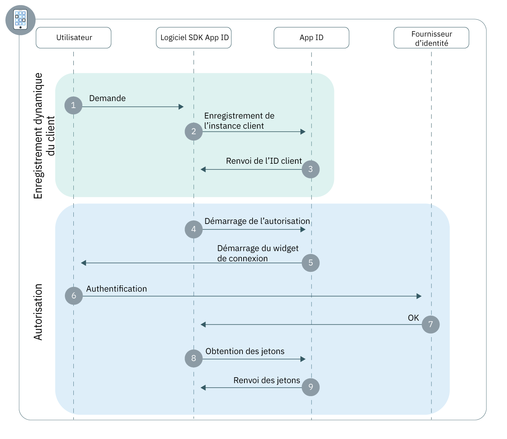

---

copyright:
  years: 2017, 2018
lastupdated: "2018-11-14"

---

{:new_window: target="_blank"}
{:shortdesc: .shortdesc}
{:pre: .pre}
{:tip: .tip}
{:screen: .screen}

# Applications mobiles
{: #adding-mobile}

Avec {{site.data.keyword.appid_full}}, vous pouvez rapidement construire une couche d'authentification pour votre application mobile native ou hybride.
{: shortdesc}

## Comprendre le flux
{: #understanding}

**Dans quelles circonstances ce flux est-il utile ?**

Un flux mobile est utile lorsque vous développez une application qui doit être installée sur le périphérique d'un utilisateur (application native). L'utilisation de ce flux vous permet d'authentifier en toute sécurité les utilisateurs de votre application et de fournir des expériences utilisateur personnalisées sur tous les périphériques.

**Quelle est la base technique du flux ?**

Les applications natives étant installées directement sur le périphérique d'un utilisateur, les informations personnelles de l'utilisateur et les droits d'accès de l'application peuvent être extraits par des tiers avec une relative facilité. Par défaut, ces types d'applications sont appelés clients non approuvés, car ils ne peuvent pas stocker de données d'identification globales ou de jetons d'actualisation des utilisateurs. C'est pourquoi les clients non approuvés exigent des utilisateurs qu'ils entrent leurs données d'identification chaque fois que leurs jetons d'accès expirent.

Pour convertir votre application en client de confiance, {{site.data.keyword.appid_short}} optimise l'[Enregistrement dynamique des clients](https://tools.ietf.org/html/rfc7591). Avant qu'une instance d'application puisse commencer à authentifier des utilisateurs, elle doit tout d'abord s'enregistrer en tant que client OAuth2 auprès d'{{site.data.keyword.appid_short}}. Suite à son enregistrement en tant que client, votre application reçoit un identificateur de client spécifique à l'installation qui peut être signé numériquement et utilisé pour autoriser des demandes auprès d'{{site.data.keyword.appid_short}}. Comme {{site.data.keyword.appid_short}} enregistre la clé publique correspondant à votre application, il peut valider la signature de votre demande qui permet à votre application d'être affichée en tant que client confidentiel. Ce processus réduit le risque d'exposer indéfiniment les données d'identification de votre application et améliore considérablement l'expérience utilisateur en permettant l'actualisation automatique du jeton.

Après l'enregistrement, vos utilisateurs s'authentifient à l'aide des flux [d'octroi d'autorisation](https://tools.ietf.org/html/rfc6749#section-1.3) OAuth2 `authorization code` ou `resource owner password`.

**A quoi ressemble ce flux ?**

Flux d'application à application 

**Enregistrement dynamique du client**

1. Un utilisateur exécute une action qui déclenche une demande de l'application client au logiciel SDK {{site.data.keyword.appid_short}}.
2. Si votre application n'est pas encore enregistrée en tant que client mobile, le logiciel SDK lance un flux d'enregistrement dynamique.
3. Lorsque l'enregistrement a abouti, {{site.data.keyword.appid_short}} renvoie un IC client spécifique à votre installation.

**Flux d'autorisation**

1. Le logiciel SDK {{site.data.keyword.appid_short}} lance le processus d'autorisation à l'aide du noeud final {{site.data.keyword.appid_short_notm}} `/authorization`.
2. Le widget de connexion est affiché pour l'utilisateur.
3. L'utilisateur s'authentifie à l'aide de l'un des fournisseurs d'identité configurés.
4. {{site.data.keyword.appid_short}} renvoie un octroi d'autorisation.
5. L'octroi d'autorisation est échangé contre des jetons d'accès, d'identité et d'actualisation à partir du noeud final {{site.data.keyword.appid_short_notm}} `/token`.


## Configuration de votre application mobile avec les logiciels SDK {{site.data.keyword.appid_short}}
{: #configuring}

Initiation à {{site.data.keyword.appid_short}} avec nos logiciels SDK.
{: shortdesc}

**Avant de commencer**

Vous devez disposer des éléments suivants :

* Une instance {{site.data.keyword.appid_short_notm}}

* L'ID titulaire de votre instance. Il est disponible dans l'onglet **Données d'identification pour le service** de votre tableau de bord du service.

* La région {{site.data.keyword.Bluemix}} de déploiement de votre instance. Consultez la console pour connaître votre région.

  <table><caption> Tableau 1. Régions {{site.data.keyword.Bluemix_notm}} et valeurs de logiciel SDK correspondantes</caption>
  <tr>
    <th>Région {{site.data.keyword.Bluemix}}</th>
    <th>Valeur de logiciel SDK</th>
  </tr>
  <tr>
    <td>Sud des Etats-Unis</td>
    <td><code>AppID.REGION_US_SOUTH</code> </td>
  </tr>
  <tr>
    <td>Sydney</td>
    <td><code>AppID.REGION_SYDNEY </code></td>
  </tr>
  <tr>
    <td>Royaume-Uni</td>
    <td><code>AppID.REGION_UK </code></td>
  </tr>
  <tr>
    <td>Allemagne</td>
    <td><code>AppID.REGION_GERMANY</code></td>
  </tr>
</table>

## Authentification avec le logiciel SDK Android
{: #android-setup}

**Avant de commencer**

Vous devez disposer des prérequis suivants avant de commencer :

  * API version 27 ou ultérieure
  * Java 8.x
  * Android SDK Tools 26.1.1+
  * Android SDK Platform Tools 27.0.1+
  * Android Build Tools version 27.0.0+

</br>

**Installation du logiciel SDK**

1. Créez un projet Android Studio ou ouvrez un projet existant.

2. Ajoutez le référentiel JitPack à votre fichier racine `build.gradle`.

  ```gradle
    allprojects {
	    repositories {
		    ...
		    maven { url 'https://jitpack.io' }
	    }
    }
  ```
  {: codeblock}

3. Recherchez le fichier `build.gradle` de votre application. **Remarque** : assurez-vous d'ouvrir le fichier correspondant à votre application et non pas le fichier `build.gradle` du projet.

  1. Ajoutez le logiciel SDK client {{site.data.keyword.appid_short_notm}} à la section des dépendances.

    ```gradle
    dependencies {
       compile group: 'com.github.ibm-cloud-security:appid-clientsdk-android:4.+'
   }
    ```
    {: codeblock}

  2. Dans la section `defaultConfig`, configurez le schéma de redirection.

    ```gradle
    defaultConfig {
      ...
      manifestPlaceholders = ['appIdRedirectScheme': android.defaultConfig.applicationId]
  }
    ```
    {: codeblock}

6. Synchronisez votre projet avec Gradle. Cliquez sur **Tools > Android > Sync Project with Gradle Files**.

</br>

**Initialisation du logiciel SDK **


1. Transmettez les paramètres de contexte, d'ID titulaire et de région à la méthode initialize pour configurer le logiciel SDK.

    Bien que ce ne soit pas obligatoire, le code d'initialisation est souvent placé dans la méthode onCreate de l'activité principale dans votre application Android.
    {: tip}

    ```java
    AppID.getInstance().initialize(getApplicationContext(), <tenantId>, <region>);
    ```
    {: codeblock}

</br>
</br>

## Authentification avec le logiciel SDK Swift iOS
{: #ios-setup}

Protégez vos applications mobiles à l'aide du logiciel SDK client {{site.data.keyword.appid_short}}.
{:shortdesc}

</br>
**Avant de commencer**

Vous devez disposer des prérequis suivants avant de commencer :

  * Xcode version 9.0 ou ultérieure
  * CocoaPods version 1.1.0 ou ultérieure
  * iOS 10.0 ou version ultérieure

</br>

**Installation du logiciel SDK**

Le logiciel SDK client d'{{site.data.keyword.appid_short_notm}} est distribué avec CocoaPods, un gestionnaire de dépendances pour les projets Swift et Cocoa Objective-C . CocoaPods télécharge des artefacts et les rend disponibles dans votre projet.

1. Créez un projet Xcode ou ouvrez un projet existant.

2. Créez un fichier `Podfile` ou ouvrez-en un existant dans le répertoire de projet.

3. Ajoutez le pod `IBMCloudAppID` et la commande `use_frameworks!` aux dépendances de votre cible.

  ```swift
  target '<yourTarget>' do
     use_frameworks!
     pod 'IBMCloudAppID'
  end
  ```
  {: codeblock}

4. Installez vos dépendances à partir de la ligne de commande dans le répertoire de votre projet.

  ```swift
  $ pod install --repo-update
  ```
  {: codeblock}

5. Après l'installation, ouvrez le fichier `<your app>.xcworkspace` contenant votre projet Xcode et vos dépendances liées.

6. Activez le partage de la chaîne de certificats dans votre projet Xcode. Accédez à **Paramètres du projet > Capacités > Partage de chaîne de certificats** et sélectionnez l'option d'**activation du partage de chaîne de certificats**.

7. Ouvrez **Paramètres du projet > Information > Types d'URL** et ajoutez un **Type d'URL**. Indiquez la valeur suivante dans les zones de texte **Identificateur** et **Schéma d'URL** :

  ```
  $(PRODUCT_BUNDLE_IDENTIFIER)
  ```
  {: codeblock}

</br>

**Initialisation du logiciel SDK **

1. Initialisez le logiciel SDK client en transmettant les paramètres d'ID titulaire et de région à sa méthode initialize.

  ```swift
    AppID.sharedInstance.initialize(tenantId: <tenantId>, region: <region>)
  ```
  {: codeblock}

  Bien que ce ne soit pas obligatoire, le code d'initialisation est souvent placé dans la méthode `application:didFinishLaunchingWithOptions` du fichier AppDelegate de votre application Swift.
  {: tip}

2. Importez le logiciel SDK {{site.data.keyword.appid_short}} dans votre fichier `AppDelegate`.

  ```swift
  import IBMCloudAppID
  ```
  {: codeblock}

3. Configurez votre application pour traiter les redirections via {{site.data.keyword.appid_short}}.

  ```swift
  func application( application: UIApplication, open url: URL, options :[UIApplicationOpenURLOptionsKey : Any]) -> Bool {
      return AppID.sharedInstance.application(application, open: url, options: options)
      }
  ```
  {: codeblock}

</br>
</br>

## Accès aux API protégées
{: #accessing-protected-apis}

Lorsque le flux de connexion a abouti, vous pouvez utiliser vos jetons d'accès et d'identité pour appeler des ressources d'arrière-plan protégées qui utilisent le logiciel SDK ou une bibliothèque réseau de votre choix.

</br>

### Accès aux API protégées avec le logiciel SDK Swift

1.  Ajoutez les importations suivantes au fichier dans lequel vous souhaitez appeler une demande de ressource protégée :

  ```swift
  import BMSCore
  import IBMCloudAppID
  ```
  {: codeblock}

2. Appelez votre ressource protégée.

   ```swift
  BMSClient.sharedInstance.initialize(region: <region>)
  BMSClient.sharedInstance.authorizationManager = AppIDAuthorizationManager(appid: AppID.sharedInstance)

  let request =  Request(url: "<your protected resource url>")

  request.send { (response: Response?, error: Error?) in

      guard let response = response, error == null else {
          print("An error occurred invoking a protected resources", error?.localizedDescription ?? "No response was received")
          return;
      }
      // use your response object
  })
     ```
  {: codeblock}

</br>

### Accès aux API protégées avec le logiciel SDK Android

1. Ajoutez les importations suivantes au fichier dans lequel vous souhaitez appeler une demande de ressource protégée :

  ```java
  import com.ibm.mobilefirstplatform.clientsdk.android.core.api.BMSClient;
  import com.ibm.cloud.appid.android.api.AppIDAuthorizationManager;
  ```

2. Appelez votre ressource protégée.

   ```java
   BMSClient bmsClient = BMSClient.getInstance();
   bmsClient.initialize(getApplicationContext(), <region>);

   AppIDAuthorizationManager appIdAuthMgr = new AppIDAuthorizationManager(AppID.getInstance())
  bmsClient.setAuthorizationManager(appIdAuthMgr);

  Request request = new Request("<your protected resource url>", Request.GET);
  request.send(this, new ResponseListener() {

   @Override
		public void onSuccess (Response response) {
       Log.d("My app", "onSuccess :: " + response.getResponseText());
   }

   @Override
		public void onFailure (Response response, Throwable t, JSONObject extendedInfo) {
        if (null != t) {
           Log.d("My app", "onFailure :: " + t.getMessage());
       } else if (null != extendedInfo) {
           Log.d("My app", "onFailure :: " + extendedInfo.toString());
       } else {
           Log.d("My app", "onFailure :: " + response.getResponseText());
           }
       }
       });
       ```
  {: codeblock}

</br>

### Accès aux API protégées avec un logiciel SDK

Avec la bibliothèque de votre choix, configurez votre en-tête de demande `Authorization` pour utiliser le schéma d'authentification `Bearer` pour transmettre le jeton d'accès.

Exemple de format de demande :

  ```
  GET /resource HTTP/1.1
  Host: server.example.com
  Authorization: Bearer <access token> <optional identity token>
  ```
  {: screen}

</br>
</br>

## Etapes suivantes
{: #next}

{{site.data.keyword.appid_short}} est installé dans votre application ? Vous êtes pratiquement prêt à commencer l'authentification des utilisateurs ! Essayez d'effectuer l'une des activités suivantes :

* Configurer vos [fournisseurs d'identité](/docs/services/appid/identity-providers.html)
* Personnaliser et configurer [le widget de connexion](/docs/services/appid/login-widget.html)
* En savoir plus sur le <a href="https://github.com/ibm-cloud-security/appid-clientsdk-android" target="_blank">logiciel SDK Android</a>
* En savoir plus sur le <a href="https://github.com/ibm-cloud-security/appid-clientsdk-swift" target="_blank">logiciel SDK iOS</a>
