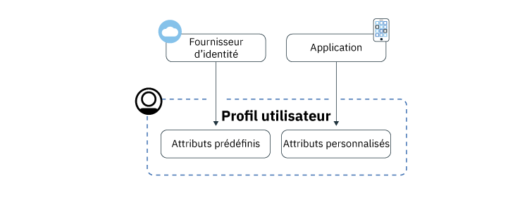
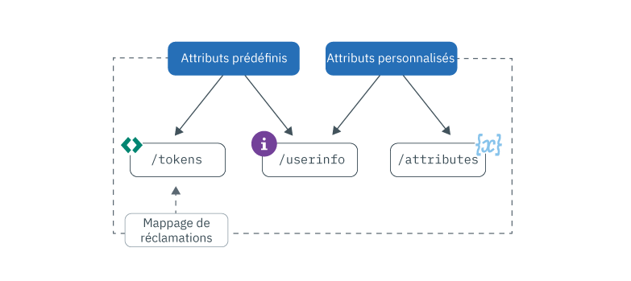

---

copyright:
  years: 2017, 2019
lastupdated: "2019-06-06"

keywords: Authentication, authorization, identity, app security, secure, attributes, user information, storing, accessing

subcollection: appid

---

{:new_window: target="_blank"}
{:shortdesc: .shortdesc}
{:screen: .screen}
{:pre: .pre}
{:table: .aria-labeledby="caption"}
{:codeblock: .codeblock}
{:tip: .tip}
{:note: .note}
{:important: .important}
{:deprecated: .deprecated}
{:download: .download}
{:java: .ph data-hd-programlang='java'}
{:javascript: .ph data-hd-programlang='javascript'}
{:swift: .ph data-hd-programlang='swift'}
{:curl: .ph data-hd-programlang='curl'}


# Stockage et accès aux profils
{: #profiles}

Un profil d'utilisateur est l'ensemble des informations connues sur un utilisateur spécifique compilées dans un objet et stockées par {{site.data.keyword.appid_full}}. Les informations peuvent être prédéfinies, assignées ou obtenues de vos utilisateurs, lorsqu'ils interagissent avec votre application. La fonctionnalité des profils vous permet de créer des applications personnalisées pour chaque utilisateur.
{: shortdesc}


Vous recherchez des informations sur vos utilisateurs Cloud Directory ? Consultez la section [Gestion des utilisateurs](/docs/services/appid?topic=appid-cd-users).
{: tip}

Deux types d'informations peuvent être obtenues et stockées par App ID : les attributs prédéfinis et les attributs personnalisés. Les attributs prédéfinis sont spécifiques à l'identité de vos utilisateurs et sont retournés par un fournisseur d'identité lorsque votre utilisateur se connecte à votre application ; ils peuvent inclure des informations telles que son nom ou son âge. Les attributs personnalisés sont utilisés pour stocker des informations supplémentaires sur vos utilisateurs. Ils peuvent être définis par vous ou appris sur l'utilisateur au fur et à mesure qu'ils interagissent avec votre application. Les attributs personnalisés peuvent inclure un rôle assigné, une préférence alimentaire ou un siège d'allée préféré dans un avion.



Figure. Flux d'informations d'un profil utilisateur


Vous pouvez stocker jusqu'à 100 Ko d'informations par utilisateur.
{: note}


## Accès aux profils d'utilisateur 
{: #profile-access}

Il existe différentes façons d'accéder aux attributs. Après une authentification utilisateur réussie, votre application reçoit les jetons d'accès et d'identité d'{{site.data.keyword.appid_short_notm}}. Les informations de l'utilisateur et les attributs personnalisés sont protégés par un jeton d'accès généré par {{site.data.keyword.appid_short_notm}} à la fin du processus d'authentification. Le jeton d'identité contient un sous-ensemble normalisé d'attributs utilisateur (informations) qui est renvoyé par un fournisseur d'identité. Vous pouvez obtenir la liste complète des attributs utilisateur via le noeud final OIDC [`/userinfo`](https://us-south.appid.cloud.ibm.com/swagger-ui/#/Authorization_Server_V4/userInfo). 
{: shortdesc}


Pour plus d'informations sur les jetons d'identité et d'accès, voir [Connaissance des jetons](/docs/services/appid?topic=appid-tokens#tokens) et [Validation des jetons](/docs/services/appid?topic=appid-token-validation).


Passez en revue l'image suivante pour voir les différentes façons dont vous pouvez obtenir des informations utilisateur.


Figure. Accès aux options des profils d'utilisateurs


App ID injecte automatiquement un sous-ensemble d'attributs dans vos jetons d'accès et d'identité. Vous pouvez tirer parti du mappage des réclamations personnalisées et mapper d'autres réclamations prédéfinies et personnalisées dans vos jetons. Pour en savoir plus sur la méthode recommandée pour accéder aux informations utilisateur, voir [Personnalisation des jetons](/docs/services/appid?topic=appid-customizing-tokens).
{: note}


### Accès au noeud final /userinfo avec un SDK
{: #profile-predefined-access}

Pour afficher les informations sur vos utilisateurs fournies par vos fournisseurs d'identité configurés, vous pouvez accéder à vos attributs prédéfinis.
{: shortdesc}

**iOS Swift**
{: ph data-hd-programlang='swift'}

Si de nouveaux jetons ne sont pas transmis explicitement au logiciel SDK, {{site.data.keyword.appid_short_notm}} utilise les derniers jetons reçus pour extraire et valider la réponse. Par exemple, vous pouvez exécuter le code suivant une fois que l'authentification a réussi pour que le logiciel SDK extraie des informations supplémentaires sur l'utilisateur :
{: ph data-hd-programlang='swift'}

```
AppID.sharedInstance.userProfileManager.getUserInfo { (error: Error?, userInfo: [String: Any]?) in
	guard let userInfo = userInfo, err == nil {
		return // an error has occurred
	}
	// retrieved user info successfully
}
```
{: codeblock}
{: ph data-hd-programlang='swift'}

Vous pouvez aussi transmettre explicitement des jetons d'accès et d'identité. Le jeton d'identité est facultatif mais lorsqu'il est transmis, il est utilisé pour valider la réponse relative aux informations utilisateur.
{: ph data-hd-programlang='swift'}

```
AppID.sharedInstance.userProfileManager.getUserInfo(accessToken: String, identityToken: String?) { (error: Error?, userInfo: [String: Any]?) in
	guard let userInfo = userInfo, err == nil {
		return // an error has occurred
	}
	// retrieved user info successfully
}
```
{: codeblock}
{: ph data-hd-programlang='swift'}

**Java**
{: ph data-hd-programlang='java'}

Si de nouveaux jetons ne sont pas transmis explicitement au logiciel SDK, {{site.data.keyword.appid_short_notm}} utilise les derniers jetons reçus pour extraire et valider la réponse. Par exemple, vous pouvez exécuter le code suivant une fois que l'authentification a réussi pour que le logiciel SDK extraie des informations supplémentaires sur l'utilisateur :
{: ph data-hd-programlang='java'}

```
AppID appId = AppID.getInstance();

appId.getUserProfileManager().getUserInfo(new UserProfileResponseListener() {
	@Override
	public void onSuccess(JSONObject userInfo) {
		// retrieved user info successfully
	}

	@Override
	public void onFailure(UserInfoException e) {
		// exception occurred
	}
});
```
{: codeblock}
{: ph data-hd-programlang='java'}

Vous pouvez aussi transmettre explicitement des jetons d'accès et d'identité. Le jeton d'identité est facultatif. Cependant, une fois transmis, il est utilisé pour valider la réponse.
{: ph data-hd-programlang='java'}

```
AppID appId = AppID.getInstance();

appId.getUserProfileManager().getUserInfo(accessToken, identityToken, new UserProfileResponseListener() {
	@Override
	public void onSuccess(JSONObject userInfo) {
		// retrieved attribute "name" successfully
	}

	@Override
	public void onFailure(UserInfoException e) {
		// exception occurred
	}
});
```
{: codeblock}
{: ph data-hd-programlang='java'}

**Node.js**
{: ph data-hd-programlang='javascript'}

Si vous utilisez un logiciel SDK côté serveur, vous pouvez extraire des informations supplémentaires sur vos utilisateurs. Vous pouvez appeler la méthode ci-après en utilisant les jetons d'accès et d'identité stockés, ou transmettre explicitement les jetons. Le jeton d'identité est facultatif mais lorsqu'il est transmis, il est utilisé pour valider la réponse relative aux informations utilisateur.
{: ph data-hd-programlang='javascript'}

```javascript
let userProfileManager = UserProfileManager(options: options)

let accessToken = req.session[WebAppStrategy.AUTH_CONTEXT].accessToken;
let identityToken = req.session[WebAppStrategy.AUTH_CONTEXT].identityToken;


// Retrieve user info and validate against the given identity token
userProfileManager.getUserInfo(accessToken, identityToken).then(function (profile) {
	// retrieved user info successfully
});

// Retrieve user info without validation
userProfileManager.getUserInfo(accessToken).then(function (profile) {
	// retrieved user info successfully
});
```
{: codeblock}
{: ph data-hd-programlang='javascript'}


**Swift côté serveur**
{: ph data-hd-programlang='swift'}

Si vous utilisez un logiciel SDK côté serveur, vous pouvez extraire des informations supplémentaires sur vos utilisateurs. Vous pouvez appeler la méthode ci-après en utilisant les jetons d'accès et d'identité stockés, ou transmettre explicitement les jetons. Le jeton d'identité est facultatif mais lorsqu'il est transmis, il est utilisé pour valider la réponse relative aux informations utilisateur.
{: ph data-hd-programlang='swift'}


```swift
let userProfileManager = UserProfileManager(options: options)

let accessToken = "<access token>"
let identityToken = "<identity token>"

// If identity token is provided (recommended approach), response is validated against the identity token
userProfileManager.getUserInfo(accessToken: accessToken, identityToken: identityToken) { (err, userInfo) in
	guard let userInfo = userInfo, err == nil {
		return // an error has occurred
	}
	// retrieved user info successfully
}

// Retrieve the UserInfo without any validation
userProfileManager.getUserInfo(accessToken: accessToken) { (err, userInfo) in
	guard let userInfo = userInfo, err == nil {
		return // an error has occurred
	}
	// retrieved user info successfully
}
```
{: codeblock}
{: ph data-hd-programlang='swift'}


### Accès au noeud final /userinfo avec l'API
{: #profile-predefined-api}


Vous pouvez afficher des informations supplémentaires via le noeud final `/userinfo`.

1. Assurez-vous de disposer d'un jeton d'accès valide dont la portée est `openid`. Vous pouvez vérifier que votre jeton est valide à l'aide du noeud final `/introspect`.

2. Envoyez une demande au noeud final [`/userinfo`](https://us-south.appid.cloud.ibm.com/swagger-ui/#/Authorization_Server_V4/userInfo).
  ```
  GET [POST] https://{oauth-server-endpoint}/userinfo
  Authorization: 'Bearer {ACCESS_TOKEN}'
  ```
  {: codeblock}

  Exemple de sortie :
  ```
  "sub": "cad9f1d4-e23b-3683-b81b-d1c4c4fd7d4c",
  "name": "John Doe",
  "email": "john.doe@gmail.com",
  "picture": "https://lh3.googleusercontent.com/-XdUIqdbhg/AAAAAAAAI/AAAAAAA/42rbcbv5M/photo.jpg",
  "gender": "male",
  "locale": "en",
  "identities": [
      {
          "provider": "google",
          "id": "104560903311317789798",
          "profile": {
              "id": "104560903311317789798",
              "email": "john.doe@gmail.com",
              "verified_email": true,
              "name": "John Doe",
              "given_name": "John",
              "family_name": "Doe",
              "link": "https://plus.google.com/104560903311317789798",
              "picture": "https://lh3.googleusercontent.com/-XdUIqdbhg/AAAAAAAAI/AAAAAAA/42rbcbv5M/photo.jpg",
              "gender": "male",
              "locale": "en",
              "idpType": "google"
          }
      }
  ]
  ```
  {: screen}

3. Vérifiez que la réclamation `sub` correspond exactement
à la
réclamation `sub` qui existe dans le jeton d'identité. Si les demandes ne correspondent pas, n'utilisez pas les informations renvoyées. Pour en savoir plus sur la substitution de jeton, voir la <a href="https://openid.net/specs/openid-connect-core-1_0.html#TokenSubstitution" target="__blank">spécification OIDC </a>.

Si des modifications sont apportées par un fournisseur d'identité externe, vous pouvez obtenir les informations mises à jour lorsque vos utilisateurs se reconnectent. Vos nouveaux jetons extraient les informations les plus à jour.
{: tip}


### Accès au noeud final `/attributes`
{: #profile-attributes-access}

Selon votre configuration, les attributs sont chiffrés et enregistrés dans le cadre d'un profil utilisateur lorsqu'un utilisateur interagit avec votre application. L'interaction peut être un utilisateur qui se connecte ou définit une préférence dans votre application. Pour accéder aux attributs, transmettez un jeton d'accès via une méthode d'API.
{: shortdesc}

**iOS Swift**
{: ph data-hd-programlang='swift'}

  ```
  func setAttribute(key: String, value: String, completionHandler: @escaping(Error?, [String:Any]?) -> Void)
  func setAttribute(key: String, value: String, accessTokenString: String, completionHandler: @escaping(Error?, [String:Any]?) -> Void)

  func getAttribute(key: String, completionHandler: @escaping(Error?, [String:Any]?) -> Void)
  func getAttribute(key: String, accessTokenString: String, completionHandler: @escaping(Error?, [String:Any]?) -> Void)

  func getAttributes(completionHandler: @escaping(Error?, [String:Any]?) -> Void)
  func getAttributes(accessTokenString: String, completionHandler: @escaping(Error?, [String:Any]?) -> Void)

  func deleteAttribute(key: String, completionHandler: @escaping(Error?, [String:Any]?) -> Void)
  func deleteAttribute(key: String, accessTokenString: String, completionHandler: @escaping(Error?, [String:Any]?) -> Void)
  ```
  {: codeblock}
  {: ph data-hd-programlang='swift'}

  **Java**
  {: ph data-hd-programlang='java'}

  ```
  void setAttribute(@NonNull String name, @NonNull String value, UserAttributeResponseListener listener);
  void setAttribute(@NonNull String name, @NonNull String value, @NonNull AccessToken accessToken, UserAttributeResponseListener listener);

  void getAttribute(@NonNull String name, UserAttributeResponseListener listener);
  void getAttribute(@NonNull String name, @NonNull AccessToken accessToken, UserAttributeResponseListener listener);

  void deleteAttribute(@NonNull String name, UserAttributeResponseListener listener);
  void deleteAttribute(@NonNull String name, @NonNull AccessToken accessToken, UserAttributeResponseListener listener);

  void getAllAttributes(@NonNull UserAttributeResponseListener listener);
  void getAllAttributes(@NonNull AccessToken accessToken, @NonNull UserAttributeResponseListener listener);
  ```
  {: codeblock}
  {: ph data-hd-programlang='java'}

  **Node.js**
  {: ph data-hd-programlang='javascript'}

  ```
  function getAllAttributes(accessTokenString) {}
	function getAttribute(accessTokenString, key) {}
	function setAttribute(accessTokenString, key, value) {}
	function deleteAttribute(accessTokenString, name) {}
  ```
  {: codeblock}
  {: ph data-hd-programlang='javascript'}

  **Swift côté serveur**
  {: ph data-hd-programlang='swift'}

  ```
  func getAllAttributes(accessToken: String, completionHandler: (Swift.Error?, [String: Any]?) -> Void)
  func getAttribute(accessToken: String, attributeName: String, completionHandler: (Swift.Error?, [String: Any]?) -> Void)
  func setAttribute(accessToken: String, attributeName: String, attributeValue : "abc", completionHandler: (Swift.Error?, [String: Any]?) -> Void)
  func deleteAllAttributes(accessToken: String, completionHandler: (Swift.Error?, [String: Any]?) -> Void)
  ```
  {: codeblock}
  {: ph data-hd-programlang='swift'}


## Définition d'attributs personnalisés
{: #profile-set-custom}

Vous pouvez ajouter des informations sur vos utilisateurs dans leur profil, comme un rôle ou une préférence, en définissant un attribut personnalisé.
{: shortdesc}

Par défaut, les attributs personnalisés sont modifiables et peuvent être mis à jour à l'aide d'un jeton d'accès App ID à partir d'une application client. Cela signifie que sans précautions appropriées, l'utilisateur ou l'application peut mettre à jour des attributs personnalisés immédiatement après la première connexion de l'utilisateur, à condition qu'il ait accès à un jeton d'accès. Cela peut potentiellement avoir des conséquences inattendues. Par exemple, un utilisateur peut changer son rôle d'utilisateur en administrateur, ce qui peut procurer des privilèges d'administration à des utilisateurs malveillants.
{: important}

1. Accédez à l'onglet **Profils** du tableau de bord App ID et faites basculer les attributs personnalisés sur **activé**.
2. [Obtenez un jeton d'accès](/docs/services/appid?topic=appid-obtain-tokens). Toutes les demandes entrantes vers votre application ont un en-tête d'autorisation, avec `access_token`.
3. Faites une demande aux [API des attributs](https://us-south.appid.cloud.ibm.com/swagger-ui/#/Attributes) ou ajoutez l'un des fragments suivants à votre code pour utiliser l'un des SDK fournis.

  **iOS Swift**
  {: ph data-hd-programlang='swift'}

  ```
	AppID.sharedInstance.userProfileManager?.setAttribute("key", "value") { (error, result) in
		guard let result = result, error == nil else {
	  		return // an error has occurred
		}
		// attributes received as a Dictionary
	})
  ```
  {: codeblock}
  {: ph data-hd-programlang='swift'}

  **Java**
  {: ph data-hd-programlang='java'}

  ```
  appId.getUserProfileManager().setAttribute(name, value, useThisToken, new UserProfileResponseListener() {
  	@Override
		public void onSuccess(JSONObject attributes) {
  		//attributes received in JSON format on successful response 		}

  	@Override 		public
void onFailure(UserAttributesException e) {
  		// exception occurred
	}
  });
  ```
  {: codeblock}
  {: ph data-hd-programlang='java'}

  **Node.js**
  {: ph data-hd-programlang='javascript'}

  ```
	const userProfileManager = require("ibmcloud-appid").UserProfileManager;
	userProfileManager.init();

	var accessToken = req.session[WebAppStrategy.AUTH_CONTEXT].accessToken;

	userProfileManager.setAttribute(accessToken, name, value).then(function (attributes) {
		// attributes returned as dictionary
	});
  ```
  {: codeblock}
  {: ph data-hd-programlang='javascript'}

**Swift côté serveur**
{: ph data-hd-programlang='swift'}

  ```
  let userProfileManager = UserProfileManager(options: options)
	let accesstoken = "access token"

  userProfileManager.setAttribute(accessToken: accessToken, attributeName: "name", attributeValue : "abc") { (error, response) in
		guard let response = response, error == error else {
      return // an error has occurred
		}
    // attributes received as a Dictionary
  }
  ```
  {: codeblock}
  {: ph data-hd-programlang='swift'}


## Etapes suivantes
{: #next-custom-attributes}

Pour plus d'informations sur l'utilisation d'un logiciel SDK dans un langage spécifique, voir les référentiels GitHub suivants :

* <a href="https://github.com/ibm-cloud-security/appid-clientsdk-android" target="_blank">Logiciel SDK Android</a>
* <a href="https://github.com/ibm-cloud-security/appid-clientsdk-swift" target="_blank">Logiciel SDK iOS Swift</a>
* <a href="https://github.com/ibm-cloud-security/appid-serversdk-nodejs" target="_blank">Logiciel SDK Node.js</a>
* <a href="https://github.com/ibm-cloud-security/appid-serversdk-swift" target="_blank">Logiciel SDK Server Swift</a>

